# 비구획분석의 이론

\Large\hfill
한승훈
\normalsize

## 서론

비구획분석(Non-Compartmental Analysis)은 약동학 자료를 요약하고, 활용 가능한 정보로 만들어내는 가장 기초적인 방법이다. \index{약동학}
매우 직관적인 방법이며 분석 과정에서 최소한의 가정만을 허용하기 때문에, 누가 분석을 수행했는가와 관계 없이 결과의 변동성이 적으며 이에 따라 규제적 측면에서 가장 선호되는 방법이기도 하다. 
그러나, 자료 분석 시 다른 가정을 하지 않는다는 것은 그러한 결과(시간에 따른 농도 변화)가 어떠한 생리학적인 이유로 발생하게 되었는가에 대한 고려가 부족하다는 뜻이기도 하다. \index{약동학}
따라서, 비구획분석만으로는 해당 의약품의 약동학에 대한 충분한 지식을 얻을 수 없다는 한계 역시 존재한다. \index{약동학}
비구획분석의 방법론을 이해하고 그로부터 산출 또는 추정되는 약동학 파라미터의 의미를 정확히 파악하여, 비구획분석 결과의 올바르게 해석하고 활용할 수 있어야 하겠다.\index{약동학}

## 비구획분석의 기본 개념과 관심사

```{r pkprofile, fig.cap = "(ref:pkprofile)", out.width="80%"}
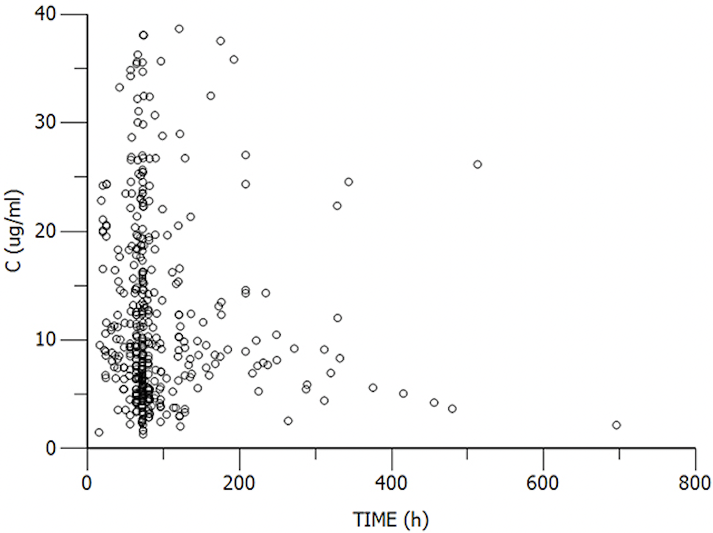
```

(ref:pkprofile) 약동학 연구에서 얻을 수 있는 시간 농도 산점도 \index{약동학}

일반적으로 약동학 연구(단회 투여 연구의 경우)를 수행하면 그림 \@ref(fig:pkprofile)과 같이 약물 투여 후 시간에 따른 농도 변화 자료를 얻을 수 있다. \index{약동학}
이는 단순히 x축을 시간으로 하고 y축을 약물농도로 한 산점도(scatterplot)로써, 각 개인의 값만을 모아서 보는 것도 어렵고, 변화의 양상을 표현하기도 어렵다. \index{산점도}
따라서, 분석자가 보고자 하는 정보에 따라 별도의 특수한 그림을 그려 확인하는 경우도 많다.

이러한 자료를 한 분석자가 본인의 특수한 목적을 위해 확인하는 것이라면 이처럼 다양한 그림을 그릴 수 있겠지만, 다른 사람과 문서 등을 이용해서 소통하고자 한다면 어떻게 해야 할까? 
(약동학 연구에 참여한 대상자 수가 N명이라면, 각 사람의 결과를 보기 위해서는 시간-농도 플롯을 N개나 그려야 한다!) \index{약동학}
또한, 이러한 농도 분석 결과를 어떻게 정보화하여야 이를 보다 가치 있게(제형 간 비교, 약동학에 영향을 미치는 환자 요인 분석 등) 활용할 수 있을까? \index{약동학}
이를 위해 기초적으로 요구되는 작업은 수치화이다.

가장 단순한 수치화 방법은 관찰한 농도값을 의약품을 투여한 후 경과 시각에 따라 기술통계학(descriptive statistics)적으로 요약하는 것이다. 
생리학적인 가정이 없는 상황에서 의약품 투여 후 경과 시간은 농도 변화를 기술할 수 있는 유일한 독립변인이므로, 이러한 방법은 꽤나 타당한 것이다. 
그림 \@ref(fig:pk-table)은 이러한 방식으로 나타낸 시간대 별 약물농도표이다.

```{r pk-table, fig.cap = "(ref:pk-table)", out.width="130%"}
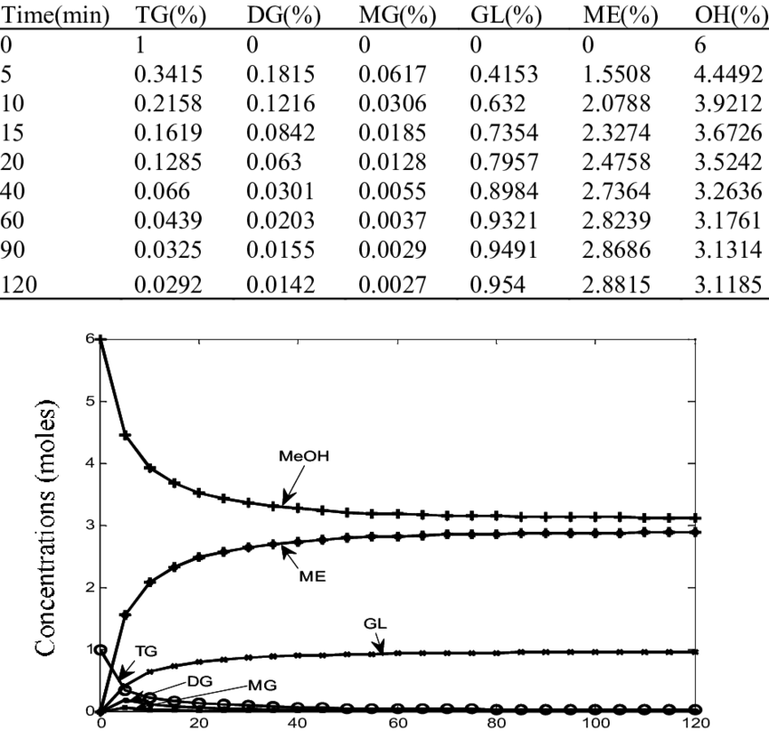
```

(ref:pk-table) 의약품 투여 후 시간대 별 약물농도표와 그래프

이처럼 단순한 수치화 작업만으로도 우리는 집단의 평균 수준에서 시간의 흐름에 따라 약물의 농도가 어떻게 변한다고 할 수 있는지에 대한 보다 나은 의사소통 수단을 확보할 수 있다. 
평균 값 이외에 표준편차 등을 함께 나타낸다면 연구 대상 집단 내에서 약물농도의 변이 정도에 대한 추가적인 정보도 확보할 수 있을 것이다. 
그러나, 우리가 약동학 연구를 하는 중요한 목적 중 하나는 생체에서의 약동학적 특성(인체가 약을 어떻게 흡수, 분포, 제거하는가)을 알고자 하는 것다. 
체내에서 발생하는 시간에 따른 약물농도의 변화는 사실 약물 처리와 관련된 생리학적 작용(=약동학적 작용)의 결과이기 때문이다. 
따라서, 이러한 방식의 수치화를 통해서는 우리가 원하는 정보를 얻을 수 없을 가능성이 크다. \index{약동학}
결과를 단순하게 기술통계학적으로 요약하는 것보다는 어떠한 방법으로든 약동학적 특성 자체를 요약해서 보여주는 것이 더욱 큰 의미를 가진다고 하겠다. \index{약동학}
이에 가장 간단한 통계학적 방법을 접목하여 약동학적인 의미를 찾아내고자 한 방법이 바로 비구획분석이다.\index{약동학}

비구획분석의 명칭은 매우 흥미롭다. 
앞서 언급한 방법과 같이 이 방법은 가급적 분석결과에 영향을 미칠 수 있는 여러 가지 가정들을 제외하고자 한다. 
이 방법은 오래 전부터 활용되었던 방법이며, 어떤 면에서는 컴퓨터의 도움 없이 약동학에 관한 다양한 가정들을 분석에 반영할 수 없었기 때문에 그러한 특성을 가지게 되었을 가능성이 크다. 
약동학 분석에서 가장 큰 가정은 인간 등 생체의 생리학적 특성에 대한 것이다. \index{약동학}
약동학이라는 학문 자체가 약(藥)의 이동(動)에 대한 것이며, 이렇게 약을 이동시키는 것은 생물이다. \index{약동학}
생물이 약을 흡수, 분포, 대사, 배설하기 때문에 약이 생체를 거쳐 이동(보관되어 있던 장소에서 배설한 장소로)하는데, 이 경로 상에 생체가 놓여 있기 때문에 약물의 노출이 만들어진다. 
그렇기 때문에 이러한 약동학을 정확하게 해석하기 위해서는 생체의 구조 및 기능에 대한 가정이 핵심적이다. \index{약동학}
생체는 약이 잠시 머물다가 떠나는 장소의 역할을 하는데, 이는 워낙 복잡하기 때문에 이를 그저 하나의 큰 물통(구획, compartment)으로 단순화해서는 다양한 약동학적 자료들이 보여주는 결과를 적절히 해석하는 데에 한계가 있다. \index{약동학}
보다 복잡한 구조로 가정하려면 이를 구현하기 위해 사람이 일일이 수학적으로 해석할 수 없는 복잡한 미분방정식과 같은 도구가 필요한 데 이 가정이 늘 맞다는 확신도 없는 상황에서 이를 도입하기도 쉽지 않은 노릇이었을 것이다. 
그렇기에 아예 생체의 구조나 기능에 대한 가정은 제외하고 약물 농도 변화에 대한 아주 기본적인 지식만을 가지고 약동학적 분석을 수행하고자 하는 일반화된 방식이 필요했으며, 생체를 구획으로 보는 가정을 제외한 방법이라는 뜻에서 비구획분석이라는 이름을 사용하고 있다. \index{약동학}
당연히 이와 반대되는 개념은 생체의 구조와 기능을 구획과 구획 간의 약물이동으로 가정하여 보다 구체적인 약동학적 지식을 얻고자 하는 구획분석(compartmental analysis) 방법이다.
이 때 생체의 구조와 기능에 대한 가정을 수학적으로 표현한 것을 모델이라 하므로 다른 말로는 약동학적 모델링(pharmacokinetic modeling)이라고도 한다.\index{약동학}\index{모델링}

그렇다면 이러한 가정 없이 우리는 대체 무엇을 얻을 수 있다는 말인가? 
이 질문에 대한 답은 앞서 약동학적 분석의 목적이 `생체, 특히 각 개체의 약동학적 특성을 알고자 하는 것'이라고 한 바에서 찾을 수 있다. \index{약동학}
약의 궁극적인 목적은 생체에서의 효능 발현이며, 아쉽게도 모든 약은 필연적으로 부작용 또는 독성작용을 가진다. 
효능과 독성이라고 하면 조금 극단적으로 받아들여지는 경우가 많아, 우리가 약을 쓸 때 의도한 생체 반응은 효능, 의도하지 않은 생체 반응은 부작용 또는 독성이라고 표현한다는 점을 명확히 하고자 한다.
그리고 의도한 것이듯 의도하지 않은 것이든 이러한 생체 반응의 정도는 각 개인 내에서 생성된 약물의 노출 정도와 일정한 상관성을 가지리라는 것은 누구나 쉽게 생각해 볼 수 있다.

(ref:fig2-3) 약물에 대한 노출과 생체 반응의 필연적 관련성 

```{r fig2-3, fig.cap = "(ref:fig2-3)", out.width="100%"}
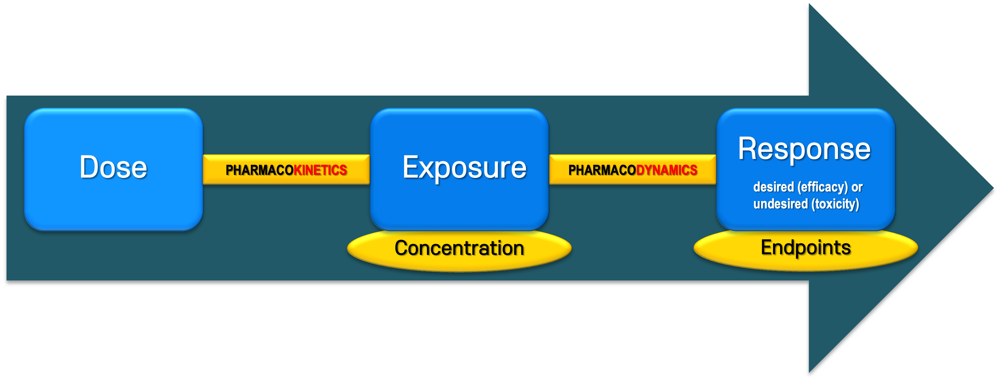
```

특히 인체약동학 분야에서, 지금처럼 사람에서의 약물농도 측정에 관한 방법론이 일반화되지 않았던 과거에는 이러한 인체 반응을 투여된 용량과의 관계로 해석할 수밖에 없었지만, 이제는 같은 용량을 투여하였을 때에도 사람에 따라 다르게 형성되는 노출의 크기와 관련 짓는 것이 더욱 과학적이다. 
그리고 `약물에 대한 노출'의 지표가 바로 약물 농도이다. 
약물 농도는 시간에 따라 변하는 값으로 모든 값들을 일일이 사용하자면 이를 인체 반응의 정도와 연결시키기가 어렵다. 
따라서, 비구획분석에서 인체 반응의 크기와 관련 지을 수 있는, 반응의 원인으로서 약물 노출의 지표값을 구하고자 하는 것이 1차적인 관심사가 된다.

약물에 대한 생체반응의 원인이 되는 지표로써 가장 대표적인 것은 약물 투여 후 발생한 최대혈장농도(the maximum plasma concentration, C~max~)와 곡선하면적(Area under the time-plasma concentration curve, AUC)이다. 
그리고, 약물 효과의 시작(onset) 등과 관련하여 최대혈장농도도달시간(Time to attainment of the maximum plasma concentration, T~max~) 등을 확인하기도 한다. 
이는 투여 시각과 C~max~가 관찰된 시각 사이의 시간 차이를 의미한다. 
이러한 지표들을 총칭하여 `파라미터'라 하며, 파라미터들은 단회 또는 반복 투여의 상황에서 적절하게 응용하여 사용한다. 
비구획분석에서 파라미터들을 어떻게 얻는가의 방법론을 아는 것은 이 방법으로 구한 지표값의 의미와 한계를 아는 데에 매우 중요하므로 지금부터는 단회 투여 상황을 기준으로 하여 각 파라미터의 획득 방법에 대해 이야기하고자 한다.

다시 한 번 강조하고자 하는 것은, 비구획분석에서는 가정을 최소화한다는 것이다. 
따라서, C~max~는 각 개체에서 관찰된 혈장농도 중 최대치를 그대로 쓴다. 
그러기에 이 값은 언제나 실제로 발생한 최대 농도보다 같거나 작을 수밖에 없으며, 우연히 특정한 채혈 시점에 실제 최대 농도가 발생할 확률은 매우 작으므로, 이 값은 언제나 음의 편차를 갖는(negatively biased) 특성이 있다. 
이러한 편차를 최소화하기 위해서는 예상되는 T~max~ 부근에서 채혈 간격을 좁혀 촘촘한 농도값을 얻으면 되지만, 인체 약동학연구에서는 과도하게 많은 채혈 시 환자가 부당한 위험을 감수해야만 한다는 문제가 있어 적절한 균형이 필요하다. 
또한, C~max~와 관련하여 시간-농도 그래프를 부드럽게 꺾이는 그래프로 그리는 경우 실제 관측값보다 그래프가 위로 올라가는 상황이 생길 수 있어 오해의 원인이 된다. 
따라서, 비구획분석이 시간-농도 그래프를 그린다면, 단순히 점과 점을 잇는 형태가 더 나을 수 있다.

더 어려운 것은 AUC인데, 이는 곡선하면적이라 설명한 바 있다. 
그러나, 일반적인 약동학 연구에서는 각 시점 별 농도값을 측정할 뿐이므로 연속된 점의 형태로 결과를 얻을 수 있을 뿐 실제로 곡선 형태를 관찰할 수는 없다. \index{약동학}
이에 AUC를 산출하기 위한 특별한 방법이 도입되는데 이를 사다리꼴 공식(trapezoidal rule)이라 한다. 
이에 대해서는 다음 문단에서 구체적으로 설명하기로 하고, 여기서는 우선 `면적'이라는 특성에 대해 먼저 생각해 보자. 
모든 면적은 특정한 길이의 곱으로 산출되므로, 길이를 어떻게 정의하는가에 따라 면적은 달라질 수밖에 없다. 
우리의 관심사는 x축이 시간, y축이 농도인 사분면(x와 y값이 모두 양의 값을 가진다.)에서 곡선하면적을 구하는 것인데, 농도 값은 우리가 임의로 조정할 수 있는 것이 아니라 관찰하는 것이다. 
반면, x값에 해당하는 수치는 분석자가 임의로 지정할 수 있기 때문에, 곡선하면적을 구할 때에는 어느 시간까지를 구할 것인가를 먼저 지정해야 한다. 
다시 말해, 같은 시간까지를 기준으로 하여 구한 곡선하면적이 아니라면, 이를 서로 비교하거나 요약하는 등의 행위는 무의미한 것이다. 
이러한 고민은, 투여한 약물이 만들어낸 곡선하면적 전체(총 AUC)를 구하는 것이 가장 정보의 품질이 높은 결과이겠으나, 현실에서는 그렇게 할 수 없다는 데에서 기인한다. 
따라서, 많은 경우에는 최종 측정 시점까지의 곡선하면적을 산출하여, 이를 AUC~last~라는 파라미터로 활용한다. 
필연적으로 이는 총 AUC의 부분 AUC(partial AUC)이며, 충분한 시간(보통 반감기의 4-5배) 동안 측정이 이루어지지 않았거나, 각 대상자 별로 최종 측정 시점이 다른 경우 총 AUC와의 관련성이 떨어져 그 가치가 낮아지는 문제가 있다. \index{반감기}
이러한 문제를 보완하기 위해 대부분의 비구획분석에서 AUC~last~와 함께 산출하는 값이 AUC~inf~이다. 
이에 대해서는 AUC~last~의 산출 방법에 이어 설명하도록 하겠다.\index{반감기}\index{반감기}

## 비구획분석의 파라미터의 산출

지금부터는 각 파라미터 값을 어떻게 얻는 지에 대해 구체적으로 설명하고자 한다. 
우선, C~max~와 T~max~는 앞서 설명했듯이 실측값을 그대로 쓰기 때문에 별도의 산출 과정이 필요하지 않다. AUC와 관련된 파라미터들은 사다리꼴 공식을 기반으로 산출한다. 가장 많이 활용되는 사다리꼴 공식은 선형사다리꼴공식(linear trapezoidal rule)로, 그림 \@ref(fig:image4)에 보는 바와 같이 인접한 두 개의 측정값을 직선으로 연결하고 각 관찰값으로부터 x축에 수선을 그어 얻어지는 사다리꼴의 면적을 합산하는 방식이다.

```{r image4, fig.cap = "AUC를 구하기 위한 선형사다리꼴 공식"}
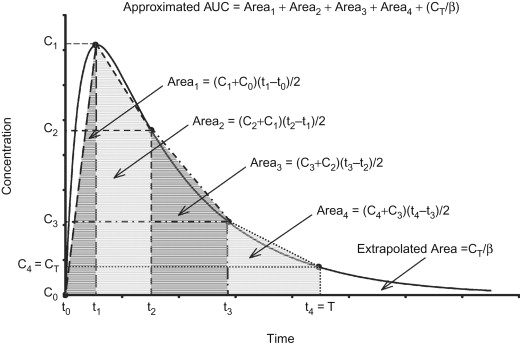
```

따라서, AUC~last~를 산출하고자 한다면, 최종 관찰 시점까지 이 작업을 수행하면 된다. 다만, 실제 농도의 변화는 1차 속도론을 따르기 때문에 각 측정치 간의 농도 변화가 실제로 직선으로 일어나지 않는다는 문제가 있다. 그러기에 이 방법을 사용하면, 농도 증가 구간에서는 실제 곡선하면적보다 작은 값이 산출되고, 농도 감소 구간에서는 실제보다 큰 값이 산출된다는 문제가 발생한다. 
이를 해결하기 위한 가장 좋은 방법은 관찰 간격을 좁게 하여 곡선과 직선 간의 편차가 작아지게 하는 것이다. (그림 \@ref(fig:image5))


```{r image5, fig.cap = "간헐적 관측으로 인한 사다리꼴 공식의 한게. 음영 처리된 영역 곡선하면적 산출 시, 농도가 상승하는 구간에서는 과소평가되고 농도가 하강하는 구간에서 과대평가됨을 알 수 있다. 관찰 간격을 줄임으로서 음영 처리된 영역을 줄일 수 있다."}
#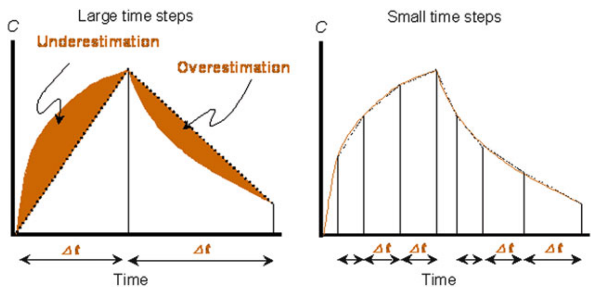
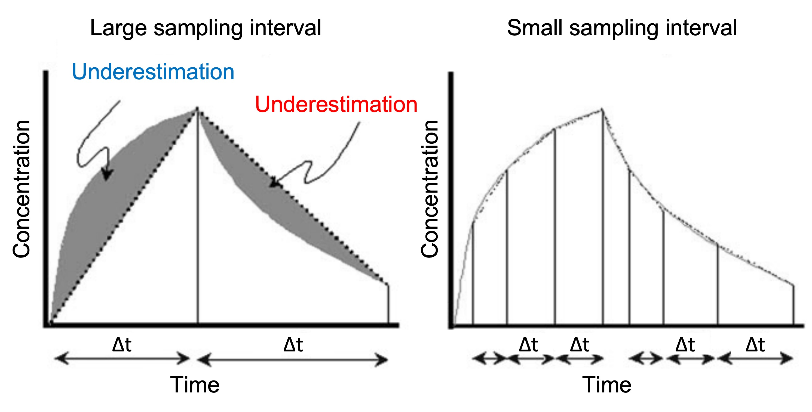
```

<!--  -->

그러나, 실제 임상 약동학 연구에서 채혈 횟수는 제한될 수밖에 없으며, 동일한 간격으로 5 반감기 이상의 기간 동안 약동학 채혈을 수행하는 것은 불가능에 가깝다. 따라서, 농도의 변화가 큰 구간(비교적 투약 시점에 가까운 구간)에서는 가급적 관찰 간격을 좁게 하고, 농도의 변화가 작은 구간(비교적 투약 시점에서 먼 구간)에서는 관찰 간격을 넓혀서 이 문제를 해결한다. 농도의 변화가 작을수록 곡선과 직선 간의 오차가 적어지기 때문이다.\index{반감기}\index{약동학}\index{반감기}

환자 대상 연구 등 불가피하게 충분한 횟수의 약동학 채혈이 어려운 경우에는 농도 감소 구간에서 선형사다리꼴공식을 쓰면 실제 곡선하면적과 산출값 간의 차이가 너무 커진다. 이러한 경우에는 산술적으로 그러한 오차를 보완할 수 있는데, 이러한 목적으로 사용하는 것이 로그-선형사다리꼴공식(log-linear trapezoidal rule)이다. 이 방법은 각 관찰값을 직선이 아닌 로그함수의 형태로 이어 그 밑면적을 구한다. (그림 \@ref(fig:image6))\index{약동학}


```{r image6, fig.cap = "선형사다리꼴공식(왼쪽)과 로그-선형사다리꼴공식(오른쪽)의 차이. 선형사다리꼴공식을 사용할 때 실제 곡선하면적과 산출값 간의 오차(음영 부분)를 로그-선형사다리꼴공식을 사용하여 줄일 수 있음."}
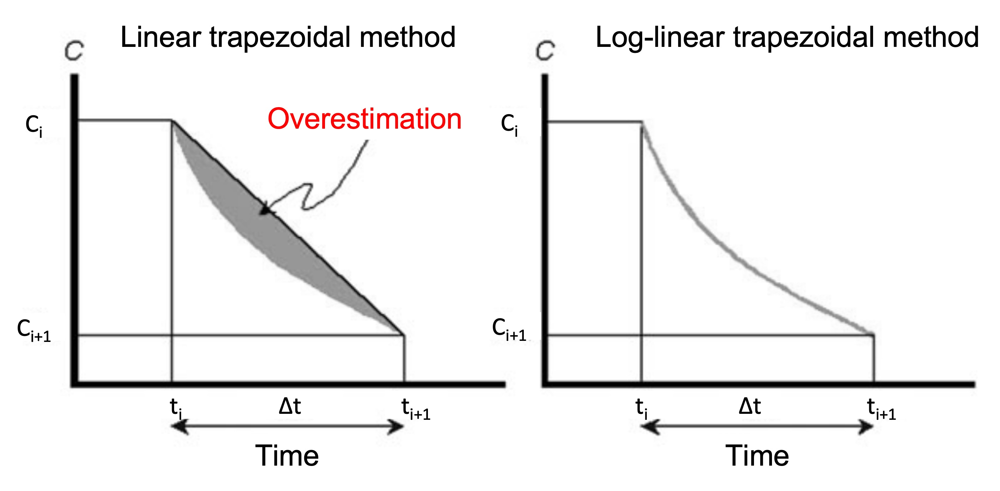
```

<!--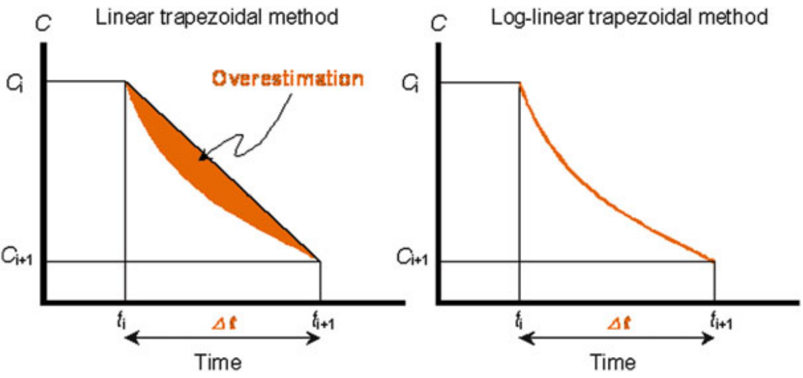-->

이는 오차를 줄인다는 측면에서 강점은 있지만, 관찰값 간의 농도 변화가 실제로 그렇게 일어났다는 근거 없이 형태적 근사에 기반하기 때문에 생물학적동등성 입증 등 약동학 파라미터가 제품 허가 등의 유일한 근거가 되는 규제적 사안에는 인정되지 않는다. 하지만, 학술적인 목적 등 이외의 상황에서는 널리 활용되고 있다. 또한, 이러한 방법을 사용할 때라도 농도 증가 구간에 대해서는 선형사다리꼴공식을 적용하는 것이 일반적이다. (그림 \@ref(fig:image7))\index{약동학}

```{r image7, fig.cap = "농도 증가/감소 구간에서 선형사다리꼴공식/로그-선형사다리꼴을 각각 사용하는 예"}
include_graphics("media-02/lin-log.jpg")
```

<!--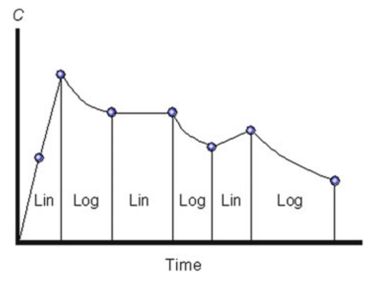-->

AUC~inf~ 역시 산출해야 하는 파라미터이다. AUC~inf~는 앞서 구한 AUC~last~에 최종 측정 시각 이후의 면적을 더하는 방식으로 산출하는데, 최종 측정 시각 이후에는 실측한 관찰값이 없으므로, 이 면적을 구할 때에는 당연히 가정이 포함될 수밖에 없다. 첫 번째 가정은, `약물의 제거가 1차 속도론적으로 일어났다(선형약동학을 따른다)'는 것이다. 이와 같은 상황에서는 다음의 관계식을 적용할 수 있다.\index{약동학}

특정 시점에서 체내에 잔존하는 약물의 양 = 청소율 × 해당 시점 이후의 곡선하면적\index{청소율}

그리고 이 식의 양변을 분포용적으로 나누어 주면,\index{분포용적}

특정 시점에서 관찰된 약물농도 = 제거속도상수 × 해당 시점 이후의 곡선하면적  
∴ 해당 시점 이후의 곡선하면적 = 특정 시점에서 관찰된 약물농도 / 제거속도상수

의 식을 얻을 수 있으며, 이 식의 시점을 최종 관찰 시점으로 하면 궁극적으로 다음의 식 \@ref(eq:eq1)을 얻을 수 있다.

\begin{equation}
최종\ 측정\ 시점\ 이후의\ AUC \left(AUC_{t_{last}}^{\infty} \right) = \ \frac{최종\ 관찰된\ 약물농도\ {(C}_{last})\ }{최종제거속도상수(\lambda_{z})}
(\#eq:eq1)
\end{equation}

C~last~ 값은 알고 있으므로 알아내야 하는 값은 λ~z~이며, 여기서 두 번째 가정이 필요하다. 약물 흡수와 분포에 의한 혈장-조직 간 평형 등은 투약으로부터 가까운 시점에 완료되므로 가장 늦은 시점의 관찰값들이 약물의 제거를 대변한다는 것이다. 이에 시기적으로 가장 늦은 관찰값들을 로그변환하면 그러한 값들은 직선적인 관계를 가져야 하고(첫 번째 가정에 의해), 이 직선의 기울기가 바로 λ~z~가 된다. 그리고 이 기울기는 아래 그림 \@ref(fig:image8)과 같이 3개 이상의 로그변환한 농도 관찰값들에 대한 선형회귀(linear regression)로 얻을 수 있다.

```{r image8, fig.cap = "(ref:terminal)", out.width = "70%"}
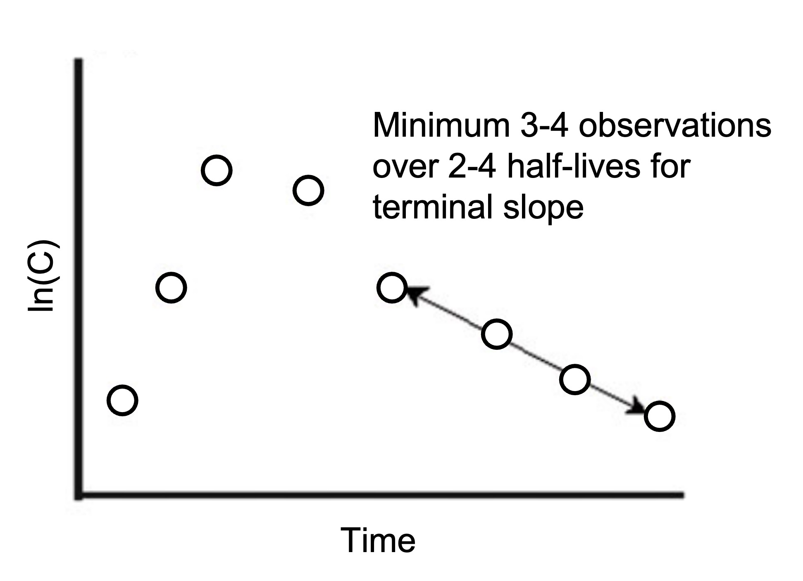
```

(ref:terminal) λ~z~를 구하기 위한 선형회귀

<!-- 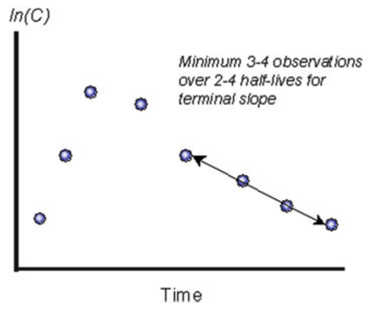 -->

이러한 방법으로 ${AUC}_{t_{{last}}}^{\infty}$를 구하면, 이를 AUC~last~에 더해 AUC~inf~ 값을 얻을 수 있다. 그러나 이 값은 어디까지나 회귀라는 방법에 의존하기 때문에 최소 3개 이상의 관찰값이 실제 최종적 제거를 반영하는 구간에서 확보되었을 때 그 정확성을 담보할 수 있다. 만일 그러지 않은 경우라면, 분포의 영향이 남아 있는 구간의 관찰값들이 회귀에 포함되어, 산출되는 $\lambda_{z}$ 값이 부정확하게 커지는 결과를 초래할 것이다. 이와 더불어, 규제적인 사유 등으로 비교적 정확한 AUC~inf~를 얻고자 하는 경우에는, 그 구성요소 중 불확실성이 큰 ${AUC}_{t_{{last}}}^{\infty}$의 비율이 충분히 낮은가(예를 들어, AUC~inf~ 값의 20% 미만)도 생각해 보아야 할 것이다. 이는 분석 방법으로는 해결할 수 없는 문제이며, 사전에 충분한 시점까지 관찰값이 확보되어야 하는 것이므로 AUC~inf~를 주된 파라미터로 평가하는 경우에는 특히 유의하여야 한다.

잊지 말아야 할 것은 이 산출 과정에 있어 몇 가지 변형이 가능하다는 것이다. 
첫 번째로 $\lambda_{z}$를 구함에 있어, 선형회귀를 어떻게 적용할 것인가가 달라질 수 있다. 
많은 경우에는 최종 관찰값으로부터 시작해 3개 이상(3개, 4개, 5개...)의 관찰값에 대한 회귀 결과 중 가장 결정계수(r^2^, R-Squared) 값이 큰 경우를 선택해 그 기울기를 구한다. 
따라서, 각 개체 별로 선형회귀에 포함된 관찰값의 개수가 다를 수 있다. 
그러나 분석자가 모든 개체에 대해 반드시 최종 3개의 관찰값만을 이용하도록 지정할 수도 있다. 
당연히 어떤 조건으로 분석을 수행하는가에 따라, 결과값이 달라진다. 
두 번째는 정량분석 방법이나 연구 상황 등에 따라 C~last~ 값이 인접한 다른 측정값들에서 얻는 직선적 경향을 벗어나는 결과를 얻을 때도 있다(C~last~ 값이 이전 시점 농도에 비해 높은 경우 등). 
이 경우에는 그러한 값이 오히려 타당하지 않은 ${AUC}_{t_{{last}}}^{\infty}$ 값을 만들어 낼 수 있기 때문에 $C_{{last}}$를 대신해 ${\widehat{C}}_{{last}}$ (회귀직선으로부터 최종 측정 시점에서 예상되는 농도값)을 사용하기도 한다. (그림 \@ref(fig:image9))

```{r image9, fig.cap = "(ref:chat)"}
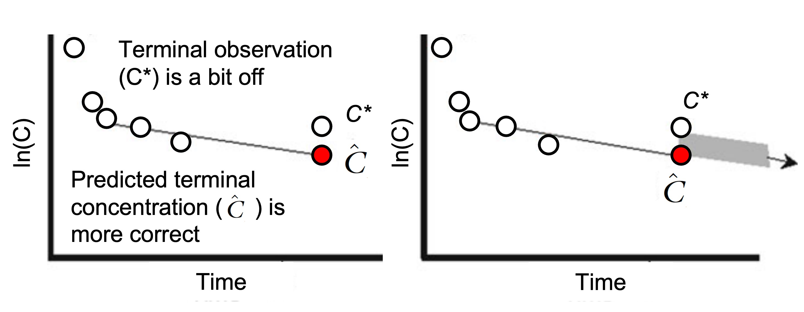
```

(ref:chat) C~last~(C*) 값이 인접한 다른 측정값들에서 얻는 직선적 경향을 벗어나는 결과를 얻을 때.  C~last~를 대신해 ${\widehat{C}}_{{last}}$ (회귀직선으로부터 최종 측정 시점에서 예상되는 농도값)을 사용하기도 한다. 과대예측(overestimation)된 음영부분을 최소화할 수 있다.

이상의 산출 과정으로부터 우리는 비구획분석을 수행하거나 결과를 해석할 때에 반드시 다음의 사항을 고려해야 한다는 것을 알 수 있다.

-   모든 개체에서 최종 관찰 시점을 포함한 전반적인 약동학 채혈 시점이 같은가?\index{약동학}
-   충분히 긴 시간까지 관찰이 이루어지고, 최소 3개 이상의 관찰값이 선형 제거를 반영하는가?
-   정량한계미만 데이터 등으로 인해 개체 별로 인정 가능한 최종 관찰 시점이 달라지는가?
-   어떤 방식과 가정을 통해 λ~z~에 대한 회귀와 ${AUC}_{t_{{last}}}^{\infty}$의 산출을 수행하였는가?

일반적으로 비구획분석 결과는 전임상에서 종간 비교나 생물학적동등성시험 시 한 개체 내에서 교차시험의 결과를 비교하는 용도로 많이 활용되는데, 위의 사항에 대한 고려를 간과하고 결과값만을 비교하여 잘못된 결론을 도출하는 경우가 빈번하다. 따라서, 숙련된 약동학 전문가라면 이러한 사항들을 충분히 사전에 파악하여 결과 해석에 반영하여야 할 것이다.\index{약동학}

## 비구획분석에서 추정하는 파라미터

앞서 비구획분석은 인체 반응의 크기와 관련 지을 수 있는, 반응의 원인으로서 약물 노출에 대한 지표값을 구하고자 하는 것이 1차적인 관심사라 언급한 바 있다. 
이에 따라, 지금까지는 이러한 지표로써 사용할 수 있는 C~max~, AUC~last~, AUC~inf~ 등의 파라미터를 산출하고 요약하는 방법에 대해 살펴 보았다. 
그런데 이러한 파라미터를 얻었다고 해서 약동학 연구의 결과 분석이 끝났다고 할 수 있을까? 
만일, 하나의 연구에서 약동학적 측정값과 약력학적 측정값이 모두 확보된다면, 이 파라미터들은 각 개체의 반응 정도를 나타내는 데에 있어 용량 값의 한계를 보완할 수 있는 훌륭한 가교로 작용할 수 있다. 
그러나, 신약 개발 등 다양한 상황에서 약동학 연구에서 얻은 정보 또는 지식은 다른 여러 연구 결과와 통합적으로 해석되는 경우가 많다. 
앞서 산출한 파라미터들은 특정 연구에서 발생한 관찰의 결과를 정보로써 요약(경험적)한 것에 불과하기 때문에 이를 다른 연구 결과와 엮어 해석할 수 있는 지식(연역적)이라고 보기에는 어려움이 있다.\index{약동학}\index{약력학}

약동학적 지식이라 함은 각 개체에서 그러한 약동학적 결과를 초래한 생리학적 원인이 무엇인가를 알고 그 작용을 정량적으로 표현하는 것을 의미한다. 대상 집단에서 약물의 흡수, 분포, 제거가 어떻게 일어나는가를 아는 것은 궁극적으로 용량용법 등을 결정하는 데에 매우 중요하다. 그러기에 비구획분석에서도 단순히 관찰 결과의 요약을 넘어 그러한 생리학적 요인에 대한 추정치를 확보하고자 한다. 다만, 이는 실측된 결과를 바탕으로 우리가 정확히 알 수 없는 복잡한 인체 작용을 추정하는 것이기에 추가적인 가정을 필요로 하며, 이 가정은 오래된 약동학적 원리에 기반한다. 지금부터는 반복투여 상황에서 항정상태 도달 특성 등과 관련하여, 일반적으로 더 중요하게 생각되는 분포, 제거와 관련된 약동학적 지식들을 얻기 위해 비구획분석에서 어떻게 접근하는 지에 대해 설명한다.\index{항정상태}\index{항정상태}\index{약동학}\index{항정상태}

관심의 대상이 되는 첫 번째 지식은 청소율(CL)의 값이다.\index{청소율}
청소율은 생체가 가진 고유의 약물 제거능력을 대변하는 값이다.\index{청소율}
비구획분석에서는 다음의 과정을 통해 이를 추정하고자 한다. 
우선, 한 개체의 체내에서 시간에 따른 약물량의 변화는 다음 식 \@ref(eq:eq2)과 같다.

\begin{equation}
\frac{dA}{dt} = -CL \cdot C
(\#eq:eq2)
\end{equation}

약물의 투여 및 제거는 혈장을 기준으로 이루어진다는 것을 상기하는 것이 좋다. 
분포 등 다양한 과정이 이루어질 수 있지만, 일단 투여된 약물은 혈장에 도달해야 체내에 흡수되었다고 생각하며, 제거 역시 혈장으로부터 간이나 신장을 통해 이루어진다. 
그러기에 식 \@ref(eq:eq2)을 약물 투여 시점으로부터 무한대 시간까지 적분하면, 식 \@ref(eq:eq3)의 관계를 얻을 수 있다.

\begin{equation}
Total\ amount\ administered\ to\ plasma = CL\  \cdot total\ AUC
(\#eq:eq3)
\end{equation}

그리고 비구획분석에서는 total AUC에 대한 지표로써 AUC~inf~를 확보할 수 있다. 
그런데 문제는 좌변의 `Total amount administered to plasma'이다. 
만일, 약물을 혈관 내(ex\> 정맥내주사 등)로 투여했다면, 투여한 모든 양이 혈장에 도달한다고 가정할 수 있다. 
따라서, 이 때는 청소율을 식 \@ref(eq:eq4)와 같이 추정할 수 있다.\index{청소율}

\begin{equation}
CL = \frac{{Dose}}{{AUC}_{\inf}}
(\#eq:eq4)
\end{equation}

그러나 경구 투여 등 혈관 외의 위치에 약물을 투여했다면, 투여한 양 중 혈장에 도달한 양의 비율이 얼마인지 알 수 없다. 
물론, 혈관 내 및 혈관 외 투여 결과가 모두 있다면 청소율이 같다는 가정 하에 두 경우에 구한 AUC~inf~ 값의 비 등으로 이 값을 산출할 수 있다. 
그러나 혈관 외로 투여하는 제형을 가진 약물을 대상으로 하는 약동학 연구에서는 꼭 필요한 경우가 아니라면, 활성성분을 혈관 내 투여하는 대조군을 설정하지 않는다. 
이 경우에는 투여한 양 중 혈장에 도달한 양의 비율을 나타내는 생체이용률(Bioavailability, F)라는 파라미터를 도입하여 식 \@ref(eq:eq5)와 같이 문제를 해결한다.\index{약동학}\index{청소율}

\begin{equation}
\begin{split}
Total\ amount\ administered\ to\ plasma &= F \cdot Dose = CL\  \cdot total\ AUC\ \\
\frac{{CL}}{F} &= \frac{{Dose}}{{AUC}_{\inf}}
\end{split}
(\#eq:eq5)
\end{equation}

즉, 혈관 외 투여 시 투여 용량을 AUC~inf~ 값으로 나누어 산출하는 값은 청소율을 생체이용률로 나눈 값에 대한 추정값이며, 반드시 CL/F라 표기해야 한다. 그리고 생체이용률은 언제나 1보다 작기 때문에 이 값은 언제나 청소율 자체보다 큰 값을 가진다. 가장 빈번하게 이용되는 혈관 외 투여 경로는 경구로서, 이 경우 CL/F 값을 별도로 경구청소율(oral clearance)이라 한다.\index{청소율}

두 번째 관심 대상은 분포용적(V~d~)의 크기이다. 
이는 그 이름 자체만으로도 비구획분석에서도 마치 생체 전체를 하나의 구획으로 가정하는 것과 같은 오해를 유발한다. 
사실 이는 독립변인(질량으로써의 약물 용량)과 종속변인(약물 농도) 간의 관계를 정의하기 위한 scaling factor에 가까운 값이다. 
특정 용량을 투여했을 때, 투여 후 관찰된 농도값이 있다면 둘은 분명 어느 정도의 비례관계를 가질 것인데 이 둘을 어떤 파라미터로 연결해야 할까? 이 고민에 대한 대안이 바로 분포용적인 것이다. 그리고 일반적 관계에서 질량은 (농도×부피)이므로, scaling factor가 마치 가상의 부피와 같은 역할을 하는 것으로 이해하는 것이 좋다. 이는 체내에서 약물의 분포특성과 어느 정도 관련을 가지지만, 실제 분포 특성에 대해서는 매우 대략적인 정보만을 제공한다. 그나마 의미를 부여해 보자면, `생체 전체를 혈장으로 가정했을 때 그 부피' 정도로 해석해 볼 수는 있겠으나, 그 역시 정확한 해석은 아니다.\index{분포용적}

실제 비구획분석에서는 이 값을 추정할 때, 식 \@ref(eq:nca-estimation)의 관계를 이용한다.

\begin{equation}
\begin{split}
\frac{{dA}}{{dt}} &= - k \cdot A = - CL \cdot C \\
- k \cdot V_{d} \cdot C &= - CL \cdot C \\
V_{d} &= \frac{CL}{k}
\end{split}
(\#eq:nca-estimation)
\end{equation}

청소율은 앞서 추정하는 방식을 제시하였으며, 비구획분석에서 k(elimination rate constant)에 가장 가까운 지표는 λ~z~이다. 따라서, 이 방식에 의하면 이 두 값을 구한 후에 분포용적 값을 추정할 수 있다. 분포용적은 투여된 용량을 어떠한 농도값과 관련지을 것인가에 따라 다양한 방법으로 추정할 수 있는데, 여기에서는 최종제거 구간의 농도들과 연결을 지어 λ~z~로부터 이 값을 추정한 것이다. 이렇게 구한 분포용적은 λ~z~로부터 추정했다 하여 V~z~로 표현한다. 한 가지 추가적으로 언급할 것은 우변의 CL와 관련한 것이다. 앞서 대부분의 약동학 연구에서는 CL/F를 구한다 하였으므로, 이를 통해 추정한 분포용적의 값은 엄밀히 V~z~/F가 되며, 그렇게 표기하는 것이 옳다. 또한, 청소율과 마찬가지로 경구분포용적(oral volume of distribution)이라는 용어를 사용한다.\index{분포용적}\index{약동학}\index{청소율}

마지막으로 언급할 것은 반감기(half-life)이다. 
특정 약물이 선형약동학 특성을 보일 때, 의약품의 혈장농도가 어느 기준 시점의 값으로부터 반이 되는데 걸리는 시간을 의미한다. 
체내 제거에 필요한 시간이나 항정상태 도달 시간 등을 결정하는 요인으로서, 약동학 전문가뿐만 아니라 대부분의 전임상/임상 전문가들이 그 의미에 대해 이해하고 있는 파라미터이다. 
따라서, 관련된 의사 소통에 매우 자주 사용하며 상호 간의 이해의 수준이 높다. 
그리고 반감기와 관련된 사항을 수학적으로 나타내면 그림 \@ref(fig:half-life-formula)과 같다.
\index{항정상태}\index{항정상태}\index{반감기}\index{약동학}\index{반감기}\index{항정상태}

```{r half-life-formula, fig.cap="(ref:half-life-formula)"}
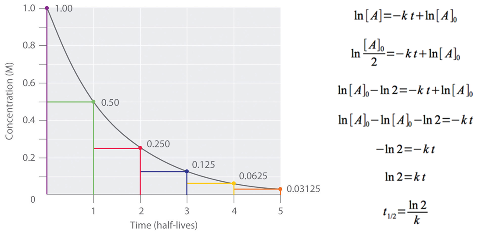
```

(ref:half-life-formula) 반감기와 관련된 수식

반복하지만, 비구획분석에서 k에 가장 가까운 지표는 λ~z~이다. 따라서, 비구획분석에서는 다음의 식 \@ref(eq:halflife)을 통해 반감기 값을 제시한다.\index{반감기}\index{반감기}

\begin{equation}
t_{1/2} = \frac{ln 2}{\lambda_{z}}
(\#eq:halflife)
\end{equation}

이상은 비구획분석에서 산출한 파라미터를 통해 추가적인 의미를 찾고자 하는 시도에 대한 설명이었으며, 이를 보다 분명히 하고자 산출이라는 용어보다는 미지의 값에 대한 `추정'이라는 용어를 사용하였다(통계학적인 추정과는 다른 의미이다). 
그러나, 이상의 과정으로부터 알 수 있듯이 이러한 값들은 계산에 사용되는 파라미터의 값에 크게 의존한다. 
정확히는 약동학적 원리를 이용해 그러한 파라미터들의 형태를 변경한 것에 불과하다. 
따라서, 계산에 사용되는 파라미터의 신뢰성이 보장되지 않는 상황에서 이러한 추정값들을 참값(true value)라고 착각해서는 안 되며, 분석 방법이나 추정 공식이 달라지면 그 값 역시 달라진다는 점을 인지하여야 한다.

실제 생리학적으로는 각 개인의 청소율과 분포용적에 해당하는 기능이 고유의\index{분포용적}\index{청소율}
참값으로 존재하며, 그러한 기능들 간의 상호작용을 통해 반감기 등이\index{반감기}\index{반감기}
정해지는 것이다. 즉, 비구획분석에서 추정하는 것이 원인이 되는 생리학적
작용이며, 형성된 농도 및 그에 따른 산출 파라미터 값이 결과이다. 우리는
결과를 통해 원인을 들여다 보고자 하는 것이다.

## 비구획분석의 개념 확장 -- 항정상태에 대한 추정\index{항정상태}\index{항정상태}\index{항정상태}

앞서 비구획분석에서 산출 또는 추정하는 파라미터들은 다양한 한계를 가짐을 설명하였다. 
이 절에서는 또다른 차원에 대한 설명을 추가하고자 한다.
비구획분석은 기본적으로 1회의 약물 투여 후 충분한 시간 동안 관찰한 약물 농도를 기반으로 분석을 수행한다. 
그렇기에 단회 투여 약동학 연구에서 대상\index{약동학}
인구집단에서의 기초적 약동학 특성을 확인하고자 할 때 많이 사용된다.\index{약동학}
그런데, 대부분의 약물은 반복투여 기반의 용량용법을 설정하는 경우가 많으므로, 이러한 단회투여 연구 결과를 기반으로 항정상태 등에 대한 예측\index{항정상태}\index{항정상태}\index{항정상태}
정보를 얻고자 한다.

\index{항정상태}
이제 항정상태의 정의를 생각해 보자. 항정상태는 단위시간 동안에 체내로 들어온 약물량과 제거된 약물량이 같아져서, 일정한 범위 내에서 약물의 농도가 유지되는 상태를 의미한다. 
일반적으로 단위시간은 투여 간격을 의미하는데, 동일한 약물 사용 시 이 간격이 작아질수록 제거될 수 있는 약물량이 적어지므로 투여 간격 중 발생할 수 있는 변동(최대농도와 최소농도 간의 차이, fluctuation)의 크기가 작아지며, 투여 간격이 거의 0에 가까워지는 지속정맥주입 시에는 변동 없이 일정한 농도를 유지하게 된다. 우리가 관심이 있는 것은, 특정한 용량용법 유지 시, 항정상태에서의 평균농도(C~ss,avg~)가 어느 수준일 것인가이다. 
희망하는 투여간격과 목표 C~ss,avg~를 정하고 이를 만족시킬 수 있는 용량을 찾는 것이 가장 기본적인 요구이다. 
단회 투여 시 비구획분석과 마찬가지로, 이 역시 용량과 농도 간의 관계이므로 일종의 scaling factor가 필요할 것이다.

그런데, 그림 \@ref(fig:image11)와 같은 약동학적 특성을 가지는 약물 A를 가정해 보자.\index{약동학}

```{r image11, fig.cap="(ref:image11)"}
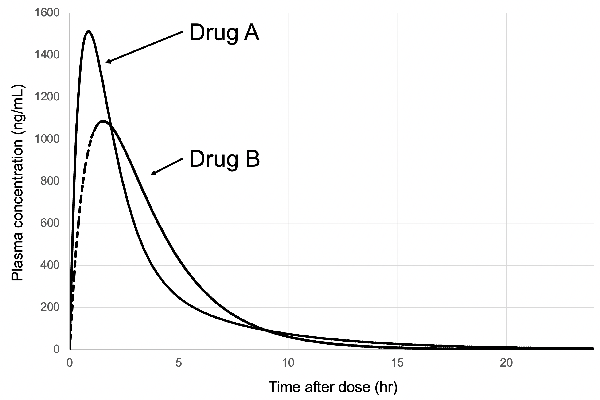
```

(ref:image11) 2구획 약동학 모델. C~p(t)~: 시간 t에서 혈장 약물 농도.\index{약동학}

<!-- 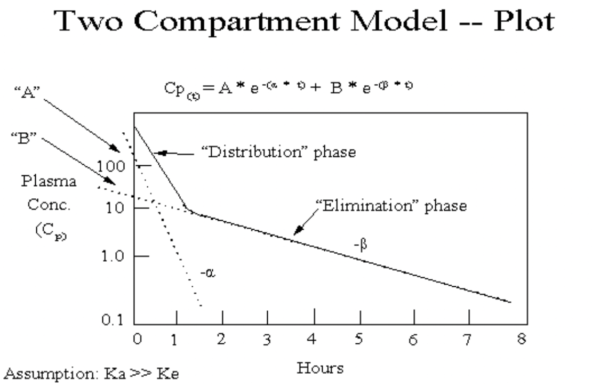{width="5.222718722659668in" height="3.0757666229221345in"} -->

그리고 동일 용량으로 투여된 다른 약물 B가 A와 같은 AUC~inf~값을 갖지만, 투여 직후부터 최종측정시점까지 λ~z~의 기울기만으로 제거되었다고 가정하자. 
이 경우, 두 약물에서 추정되는 V~z~의 값은 같다.
과연 두 약물의 항정상태는 같게 형성될 것인가? \index{항정상태}
약동학을 어느 정도 공부한 사람이라면 이 질문에 대한 답이 "아니오"라는 것은 쉽게 
추론할 수 있다.\index{약동학}
즉, 같은 V~z~가 같은 C~ss,avg~를 보장하지 않는다. 
그래서, 비구획분석에서는 항정상태분포용적(volume of distribution at steady state, V~ss~)를 별도로 구하여 이 문제를 해결하고자 한다.\index{항정상태}

\index{분포용적}

V~ss~를 구하기 위해서는 우선 곡선의 형태 차이를 확인하여야 한다.
그리고 이러한 형태의 차이를 정량화하기 위해 모멘트(moment)라는 개념을
도입한다. 이는 물리학적 개념인데, 여기에서는 특정 시점의 농도값과 그것이
유지된 시간의 곱으로 정의한다. 이렇게 되면, 투여 직후에는 약물 A에서
B보다 그 값이 크고, 시간이 지남에 따라 B보다 A가 그 값이 커지는 등
시간에 따른 곡선 형태의 변화를 반영할 수 있게 된다. 이에 덧붙여,
이론적으로 모멘트 값을 투여 시각으로부터 무한대까지 적분(area under the
moment curve, AUMC)하고, 이 값을 total AUC로 나누면 시간에 해당하는
값이 하나 남게 되는데, 이는 각 농도가 평균적으로 유지된 시간이라는
개념이 된다. 실제 비구획분석에서는 이를 다음의 식 \@ref(eq:mrteq)으로 구한다.

\begin{equation}
\begin{split}
  AUMC(t_i-t_{i+1}) &= \frac{t_i \cdot C(t_i) + t_{i+1} \cdot C(t_{i+1})}{2} \cdot (t_{i+1}-t_i)) \\
  AUMC_{\inf} &= AUMC_{last} + \frac{C(t_{last}) \cdot t_{last}}{\lambda_z} + \frac{t_{last}}{\lambda_z^2} \\
  MRT &= \frac{AUMC_{\inf}}{AUC_{\inf}}
\end{split}
(\#eq:mrteq)
\end{equation}

위는 인접한 채혈 시각 간의 AUMC를 구하는 방법이며, AUMC~last~, AUMC~inf~는 대응하는 AUC의 기간과 같은 의미이다. 
각 농도가 평균적으로 유지된 시간이라는 개념을 평균잔류시간(Mean residence time, MRT)이라 하는데, 조금 더 생각해 보면 적분 개념에서 각각의 농도는 약물 분자 하나하나의 합으로 이루어질 것이며, 그것이 평균적으로 유지된 시간이라는 것은 개별 분자 하나하나가 체내에 머무른 시간과 같다는 것을 알 수 있다.
따라서, 이 둘은 같은 의미로 사용된다. 
다만, 위는 정맥주사 이후 제거만이 존재할 때의 MRT를 산출하는 방법이며, 정맥내주입(식 \@ref(eq:mrt1)) 또는 경구투여(식 \@ref(eq:mrt2)) 등 다른 투여 방법을 이용할 때에는 다소 변형이 필요하다(약물농도의 변화에 영향을 주는 것이 제거만이 아니기 때문임).

\begin{equation}
MRT = \frac{AUMC_{0}^{\infty}}{AUC_{0}^{\infty}} - \frac{T_{inf}}{2}
(\#eq:mrt1)
\end{equation}

\begin{equation}
MRT = \frac{AUMC_{0}^{\infty}}{AUC_{0}^{\infty}} - \frac{1}{k_a}
(\#eq:mrt2)
\end{equation}

<!--
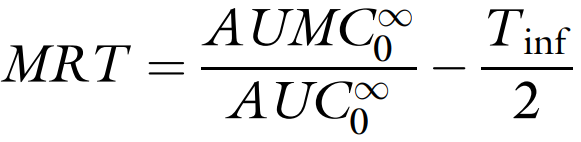
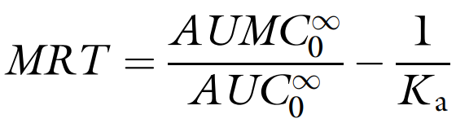
-->

MRT를 구했다면, 이를 이용하여 V~ss~를 구할 수 있다. 다시 항정상태의 특성을 상기해 보면투여 간격 중 투여량과 제거량은 같아야 하며, 이는 식 \@ref(eq:mrtvss)의 유도 과정을 거친다.\index{항정상태}
\index{항정상태}\index{항정상태}

\normalsize
\begin{equation}
\begin{split}
  Administered\ amount\ during\ a\ dosing\ interval &= Dose = C_{ss,avg} \cdot V_{{ss}} \\
  Eliminated\ amount\ during\ a\ dosing\ interval &= Dose = CL \cdot total\ AUC \\
  \ \  &= CL \cdot AUC_{\tau} \\
  C_{ss,avg} \cdot V_{{ss}} &= CL \cdot AUC_{\tau} \\
  V_{{ss}} &= CL \cdot MRT
\end{split}
(\#eq:mrtvss)
\end{equation}
\normalsize

AUC~τ~는 1회의 투여 간격 동안의 시간-농도곡선하면적을 의미하는데, 이 시기의 평균 농도는 C~ss,avg~이므로 AUC~τ~를 C~ss,avg~로 나눠주면 AUC와 AUMC와의 관계와 마찬가지로 MRT가 되기 때문이다. 
위 식 \@ref(eq:mrtvss)을 다시 정리해 보자면, 식 \@ref(eq:vss)을 통해서도 V~ss~를 구할 수 있다.

\begin{equation}
\begin{split}
  V_{ss} = \frac{Dose \cdot AUMC_{inf}}{{{(AUC}_{inf})}^2}
\end{split}
(\#eq:vss)
\end{equation}

따라서, 이 역시 산출된 파라미터의 정확성에 좌우된다는 한계를 가진다.

## 비구획분석 결과의 요약

비구획분석은 기본적으로 각 개인에서 관찰된 농도값으로부터 파라미터를 확보하고, 그러한 파라미터를 집단 수준에서 요약 정리하여 결과를 제시한다. 이 때, 기술통계학(descriptive statistics)적 분석 방법이 사용되는데 C~max~, AUC~last~, AUC~inf~ 및 그로부터 추정되는 파라미터들은 연속변수이므로 평균 ± 표준편차(mean ± standard deviation)를 제시한다. 엄밀히 말하자면, 이러한 파라미터가 로그정규분포(log-normal distribution)를 따르는 것으로 알려져 있어, 각 개인에서 산출된 값을 로그변환한 후 그 평균과 표준편차를 구하고 이를 다시 지수변환하여 제시하는 것이 정확하겠다. T~max~는 정해진 측정 시각들 중 최대 관찰값을 보인 시각이므로 연속변수가 아니다. 단순히 시간에 대한 변수로 생각해서 이를 연속변수로 취급해서는 안 된다. 오히려 이는 명목시각(nominal time)에 가까운 개념이며, 단지 수치적인 형태를 띄고 있을 뿐이다. 그러기에 요약 시에는 다른 파라미터와 달리 중앙값(median)을 사용하고, 범위(range)를 제시한다.

## 맺음말

이상으로 비구획분석의 이론적 부분에 대해 알아보았다. 
비구획분석은 약동학 자료를 분석하는 가장 기본적이고 간단한 방법이라는 장점이 있지만, 앞서 언급한 바와 같이 다양한 한계를 지니는 방법이다. \index{약동학}
따라서, 이 방법을 사용하거나 해당 방법으로 분석된 자료를 해석할 때에 이 장에 설명된 각 파라미터의 특성과 산출/추정 방식 등이 무엇인지를 충분히 숙지하여야 불필요한 오류의 발생을 최소화할 수 있을 것이다.

