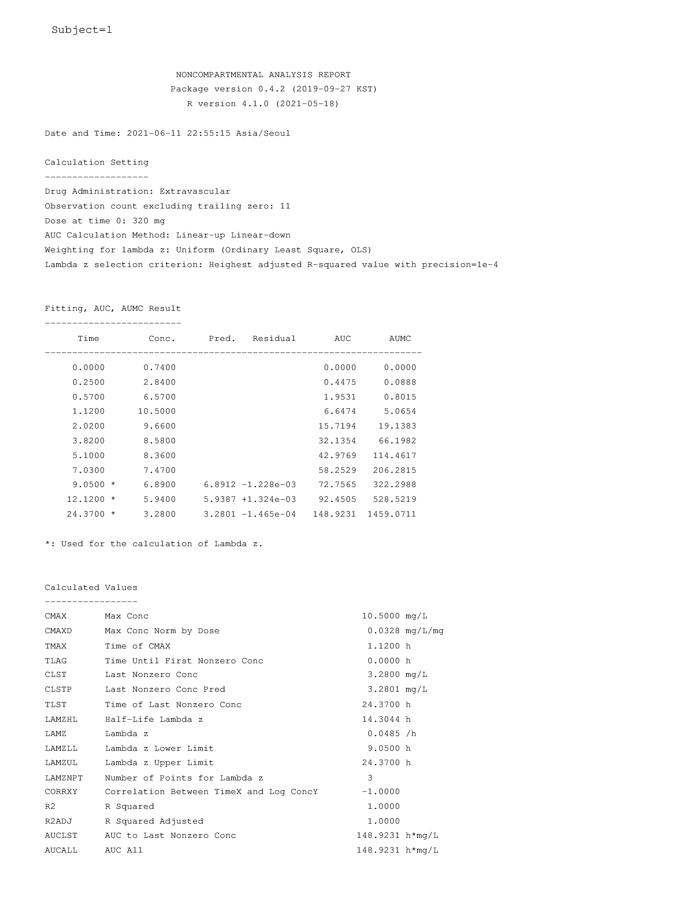
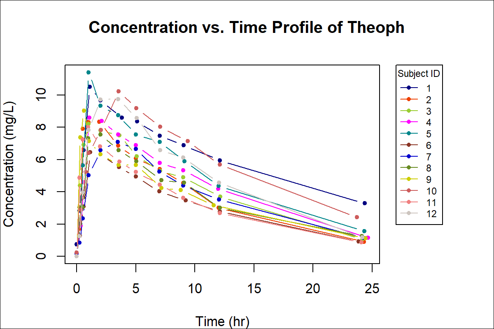
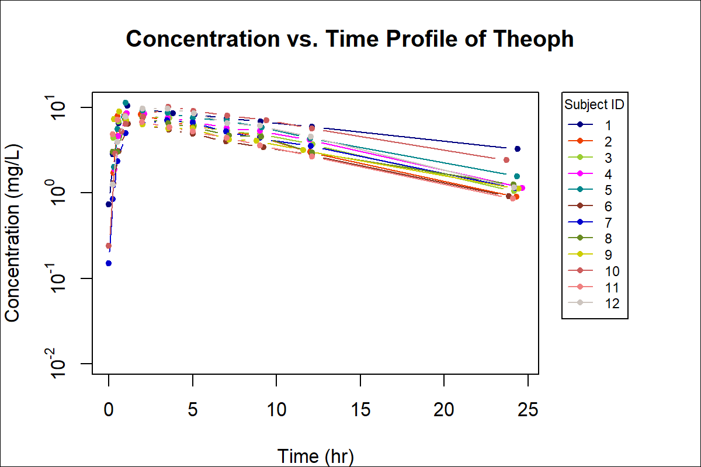
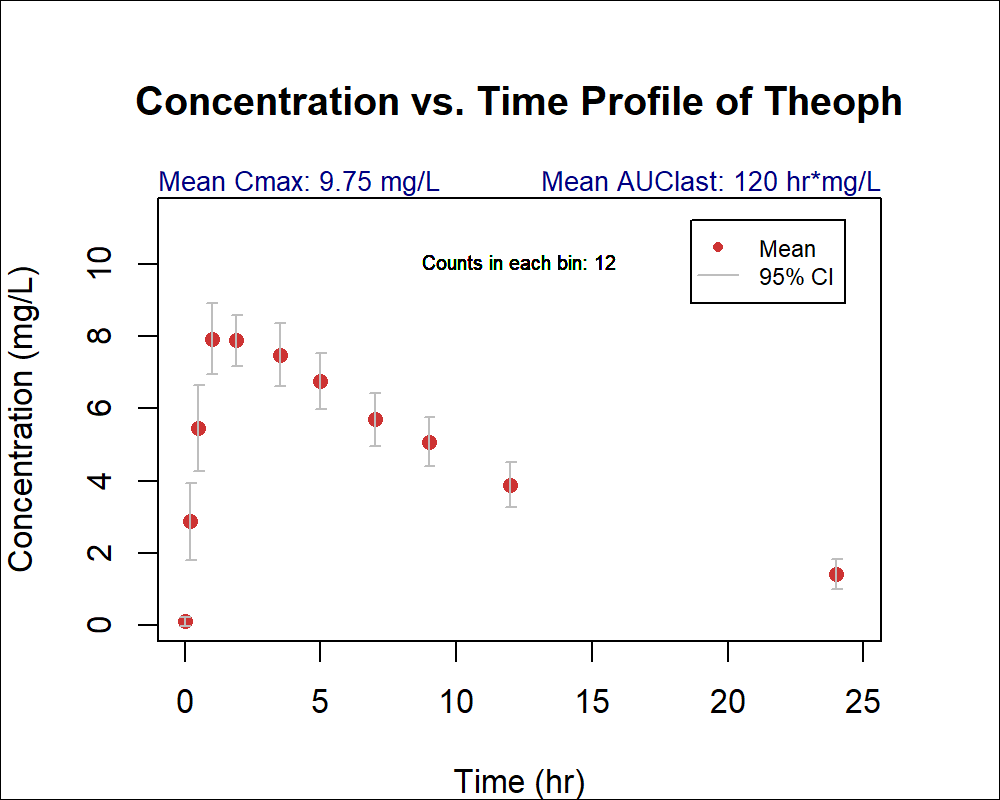
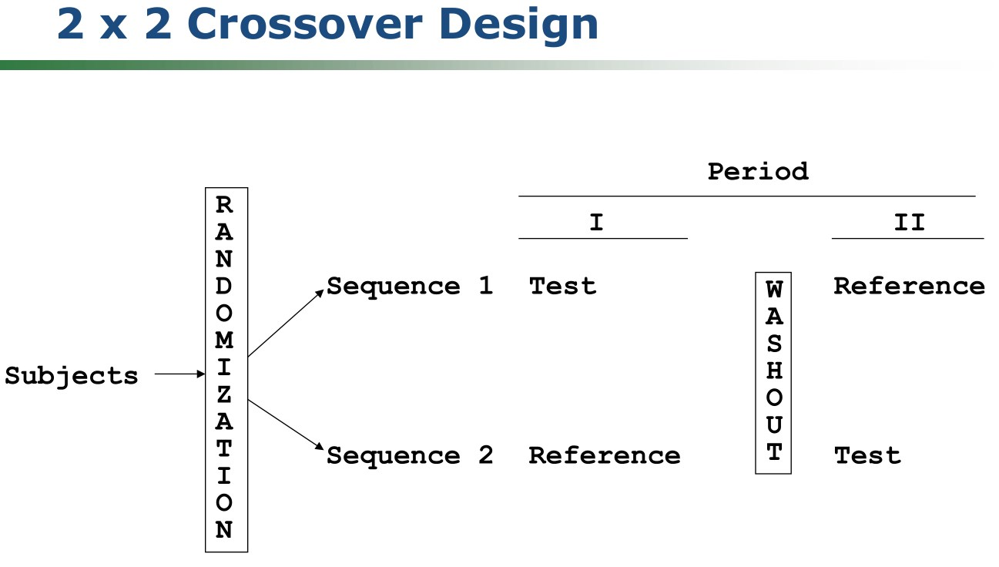
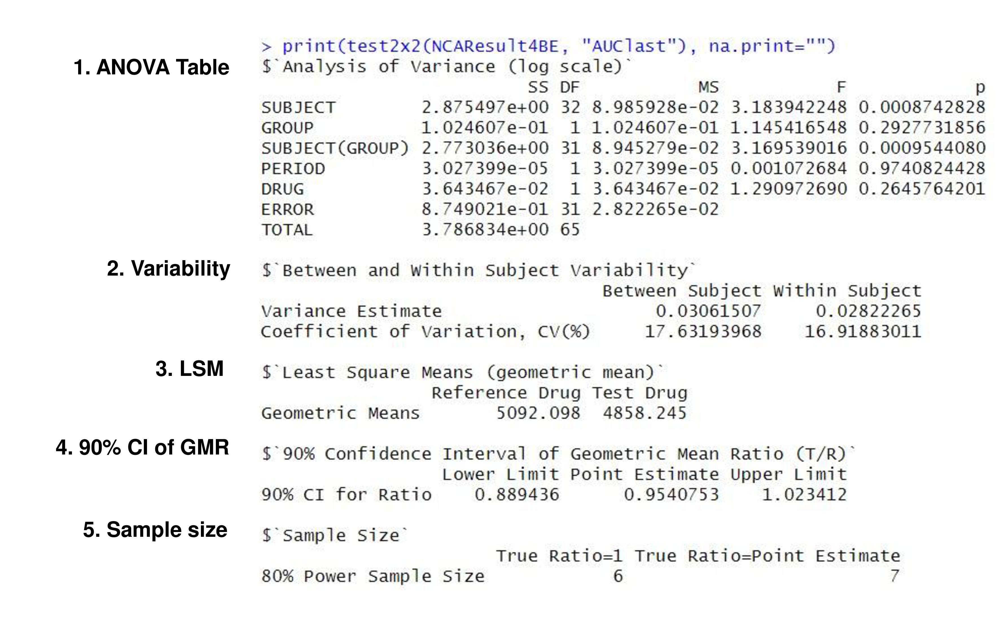

---
output:
  pdf_document: default
  html_document: default
---

# 비구획분석의 자료해석 {#nca-analysis}

\Large\hfill
한성필
\normalsize

```{r include=FALSE}
library(knitr)
library(tidyverse)
opts_chunk$set(echo=TRUE)
```

## 서론 

약동학(PK) 데이터에 대한 자료해석 시 가장 간단하고도 객관적이며 널리 쓰이는 방법은 비구획분석(Non-compartmental analysis, NCA)이고 이는 약물의 임상 개발에 매우 중요하다.
NCA 결과는 약물 개발 중 수행 된 많은 임상 약리학 연구(예 : 음식 효과, 약물 상호 작용 및 생물학적 동등성 연구 등)에 대해 중요한 평가기준이 되는 변수를 제공하게 된다.\index{생물학적 동등성}
약물 개발 과정에서 개발된 구획 PK 모델을 평가하거나 결정하는데에도 도움을 주게 된다.
이러한 중요성 때문에 약동학을 공부하고 이를 신약개발에 활용하고자 하는 사람들은 NCA가 제공하게 되는 파라미터의 의미와 그 방법론적 한계에 대해 높은 수준의 이해가 필요하다. 
따라서 NCA는 능숙하고 정확하게 수행되어야 하며 이에 대한 해석을 통해 약물에 대한 지식과 통찰력을 올바르게 축적해 나갈 수 있다. [@noe2020parameter]

이 장에서는 PK 자료에 대해 NCA를 수행하는 방법에 대해 자세히 기술하여 능숙하고 정확한 분석을 돕고자 한다. R 소프트웨어를 사용한 프로그래밍이 필요한 부분이 있어 NCA를 수행하기 위해 꼭 알아야 하는 이론은 기술하였으나, 자세한 기술적인 사항은 별도의 교재를 통해 습득해야 할 것이다.    

## NCA를 위한 자료의 처리 

### 채혈 시간

예정된 채혈시간을 사용할 경우 농도 자료를 빠르게 분석할 수 있다는 장점이 있으나, 최종 NCA 파라미터의 산출에는 실제 샘플링 시간을 사용해야 한다. 간혹 예정된 채혈시간과 실제 채혈시간의 차이가 극히 드문 경우, 이를 생략하기도 하지만 규제기관에 제출되는 자료에는 이러한 방식의 분석은 지양되어야 한다. 

실제 채혈시간으로 구성된 자료를 만들기 위해 약동학자는 R 소프트웨어를 주로 사용하게 된다. 방대한 채혈 데이터를 마이크로소프트 엑셀 등을 사용해 다루는 경우 오류의 개입이 될 확률이 커지기 때문이다.  이러한 작업을 도와주는 R 패키지 중 자료를 몇가지 간단한 함수로 빠르게 추출하고 재생성하는 작업에 특화된 dplyr [@R-dplyr], 자료의 형태를 변형하는 tidyr [@R-tidyr], 시간 자료를 쉽게 처리할 수 있는 [@R-lubridate] 등이 있다. 

계획된 채혈 시간은 기술통계량을 구하여 표를 만들거나 농도-시간 곡선 등의 그림을 그리는데 사용될 수 있으므로 실제 채혈시간과 병기하여 하나의 최종 자료에 포함되어 있어야 한다. 

### 정량한계를 벗어나거나 누락된 자료의 처리

농도 분석 결과가 정량한계를 벗어나는 경우 실험실에서 "<LLOQ" 혹은 ">ULOQ"라는 보고를 하게 되며 각각 정량하한과 정량상한을 벗어나 신뢰성 있는 농도를 제공하지 못한다는 의미이다. 기본적으로 ">ULOQ" 자료는 희석을 통해 재분석을 해야 하며 "<LLOQ" 자료는 재분석을 통해 얻어지기 힘든 경우가 많으므로 그대로 보고하게 된다. 다만 실험실에서 농도분석을 세팅할 때 LLOQ를 과도하게 높게 설정하는 경우 과도하게 많은 "<LLOQ" 값이 보고되는 상황이 발생할 수 있으므로 임상시험 혹은 비임상연구에서 예측되는 LLOQ 값을 어느정도 반영할 수 있어야 하는 것이 바람직하다. 구체적으로 약물의 최종 반감기($t_{1/2\beta}$)를 계산하는데 필요한 소실기의 농도 관찰값보다 LLOQ는 3배 이상 낮아야 하고, 과거에는 이러한 정밀도로 농도 측정이 불가능한 상황이 많았으나 현대 분석 기술에서는 이러한 제한이 많이 개선 되었다.\index{반감기}

정량한계 미만의 값은 문자로 보고되는 경우가 많으므로 R에서 `as.numeric()` 함수를 사용하면 숫자처럼 보이는 문자(`"10.1"`)는 숫자(`10.1`)로 변환되고, 문자(`"<LLOQ"`)는 `NA`값으로 경고와 함께 변환된다. 이후 T~max~ 값 이전의 NA값은 0으로 변환하고, 이후의 값은 dplyr의 `filter()` 함수를 사용하여 자료에서 제거(`filter(!is.na(DV))`와 같은 명령어를 사용)하는 것이 NCA용 자료를 구성하는 일반적인 방법이다. 

다양한 이유로 누락된 자료가 생길 수 있고, 누락된 자료는 NA로 간주하여 윗 문장과 같이 필터링 아웃 처리하여 제거되게 되나, 이러한 누락 자료가 NCA 파라미터에 어떤 영향을 미치는지 파악할 필요가 있다. 이를테면 C~max~(최고혈중농도)를 제공하는 채혈이 누락된 경우 AUC를 비롯한 이와 연관된 모든 파라미터에 큰 영향을 미치게 되나, 배설 단계 후반의  낮은 농도 값이 누락된 경우 미미한 영향을 미치게 된다. 

### 자료의 제외

분석 오류 혹은 시료 취급 중 오류 등으로 자료를 제외해야 하는 경우가 적지않은 빈도로 생길 수 있다. 약물의 배설 과정 중 예측되는 농도 범위를 크게 벗어나거나, 서로 다른 두 대상자(혹은 동물 개체) 간의 농도가 뒤바뀌는 등의 상황이 있을 수 있다. 자료가 제외되는 예외적인 상황에서는 임상연구보고서의 약동학 분석 장에서 자료가 제외되는 이유에 대해 근거와 함께 상세히 기록해야 한다. 특히 생물학적 동등성 시험에서 이러한 이슈는 민감할 수 있어, NCA 수행자는 어떤 자료를 무슨 근거로 제외했는지, 그 때 사용한 코드를 처리 방법의 상세한 기술과 함께 보관하고 있어야 한다. \index{생물학적 동등성}

## 상용 소프트웨어를 이용한 NCA

상용 소프트웨어 중 가장 많이 사용되는 것이 Certara 사의 Phoenix WinNonLin이다. 오랜 시간 많은 연구자들이 사용하여 익숙한 GUI 인터페이스를 제공하고 있고, 혈액, 소변 자료의 NCA 등을 제공하고 간단한 설계의 생물학적 동등성 판정 등 통계 분석도 지원하여 비교적 진입장벽이 낮은 자료 분석 도구라 할 수 있다. \index{생물학적 동등성}

그러나 소규모 제약사나 학교에서 사용하기에 비싼 사용료를 지불해야 한다. 
제약사와 규제기관 등에 더 높은 비용을 요구하고 있는 상황이라, NCA를 빈번하게 사용하지 않는 산업계 종사자들에게 
분석 초보자의 경우 유료 강의를 통한 학습을 필요하거나, CDISC 표준 용어로 파라미터를 제공하지 않아 그 의미를 따로 파악해야 하는 등의 제한점이 있을 수 있고, 비교적 경험이 쌓인 분석자의 경우 자료 분석 워크플로우를 자동화하는게 어려우며, 윈도우 환경에서만 실행 가능하다는 것도 제한점이 될 수 있다. 

식약처, 미국 FDA (Food and Drug Administration)를 비롯한 대부분의 규제기관에서는 NCA하는 소프트웨어를 규정하고 있지 않아, 상용 소프트웨어를 사용하지 않고 약동학적 지표를 구하는 것을 허용하고 있다.

## NCA에 활용할 수 있는 R package 소개

무료로 누구나 사용할 수 있는 R 패키지를 사용하여 NCA를 통한 약동학적 주요 지표를 구할 수 있다. 비용을 떠나 NCA를 R로 수행하는 가장 중요한 이유는 오류를 줄일 수 있고, 한번 설정한 것을 반복해서 적용하는 것이 쉽기 때문이다. 더 나아가 계량약리학 분석 전후 과정 중에 NCA를 같은 작업환경에서 빠르게 수행할 수 있다는 장점도 있다.

이 책에서 주로 다루게 될 `NonCompart` [@R-NonCompart],  `ncar` [@R-ncar], `pkr` [@R-pkr] 은 NCA를 R을 통해 쉽고 빠르게 행할 수 있는 R 패키지이다.

`NonCompart`의 패키지 제목은 `r packageDescription("NonCompart")$Title`, 
`ncar`의 패키지 제목은 `r packageDescription("ncar")$Title`,
`pkr`의 패키지 제목은 `r packageDescription("pkr")$Title` 이다.

이들의 기저에 있는 계산 방식은 모두 동일하고 앞서 설명한 상용소프트웨어와 완전히 일치하는 결과를 낼 수 있다. `NonCompart`의 `DESCRIPTION` 파일을 보면 다음과 같이 설명하고 있다. CDISC SDTM 용어를 사용하기 때문에 표준을 준수한다는 장점도 있다.

> `r packageDescription('NonCompart')$Description`

이를 사용하기 위해 아래의 순서로 R과 Rstudio를 설치해야 한다.

### R 4.x.x의 설치 (윈도우 환경^[윈도의 외의 환경에 대한 것은 별도의 공간 https://github.com/pipetcpt/pharmapk/discussions 에 정리되어 있다.])

1. https://cran.r-project.org 사이트에 접속하여, `Download R for Windows` 링크를 선택한다.
2. `Subdirectories` 유형에서 `base - install R for the first time’을 선택한다.
3. `Download R for Windows` 링크를 선택하여 R-4.0.x-win.exe 설치파일을 다운로드한다.
4. 설치파일을 실행한 후, ’이 앱이 디바이스를 변경할 수 있도록 허용하시겠어요?‘라는 사용자 계정 컨트롤 창이 나타나면 ’예‘ 버튼을 클릭한다.
5. 설치 언어는 ’한국어’로 선택하고 ’확인‘ 버튼을 클릭한다.
6. R 4.0.0 설치 정보 내용을 확인하고, ’다음‘ 버튼을 클릭한다.
7. R 4.0.0 프로그램의 설치 경로를 지정하여 ’다음‘ 버튼을 클릭한다.
8. R.4.0.0 구성요소 설치는 32bit files를 제외하고 나머지 구성요소들만 체크한 후 다음 버튼을 클릭한다.
9. 스타트 옵션을 조정하는 화면이 나타나면, ’No‘를 선택하고 ’다음‘ 버튼을 클릭한다.

### Rstudio 설치 (윈도우 환경)
1. <https://rstudio.com/products/rstudio/download/> 사이트에 접속하여` Rstudio Desktop free download` 버튼을 클릭한다.
2. [2. Download Rstudio Desktop]의 ‘DOWNLOAD RSTUDIO FOR WINDOWS(64bit)’ 파란색 버튼을 클릭하고, RStudio-1.x.x.exe 파일을 다운받는다.
3. RStudio-1.x.x.exe 파일을 실행하면 ’이 앱이 디바이스를 변경할 수 있도록 허용하시겠어요?‘라는 사용자 계정 컨트롤 창이 나타나면 ’예‘ 버튼을 클릭한다.
4. Rstudio 설치 시작 창이 나타나면 ’다음‘ 버튼을 클릭한다.
5. Rstudio를 설치할 경로를 지정하고 ’다음‘ 버튼을 클릭한다.
6. Rstudio 바로가기 아이콘이 생성될 시작메뉴 폴더 안에 ‘Rstudio’를 입력하고 ‘설치’ 버튼을 클릭한다.
7. Rstudio 설치가 완료되면 ‘마침’버튼을 클릭한다.

Rstudio를 실행한 후, 콘솔 창에서 NCA를 위한 패키지를 설치하는 방법은 다음과 같다. 홑따옴표 등의 인용 부호에 주의해야 한다.

```{r, eval = FALSE}
install.packages('NonCompart')
install.packages('ncar')
install.packages('pkr')
```

설치는 한번만 하면 되지만, NCA를 위해서는 매 세션마다 패키지를 `library()` 함수를 사용하여 불러오기해야 한다.

```{r eval = FALSE}
library(NonCompart)
library(ncar)
library(pkr)
```

R을 사용하다가 도움이 필요할때는 맨 앞에 물음표를 붙여서 콘솔창에 입력하거나 `help()` 함수를 사용할 수 있다.

```{r, eval = FALSE}
?NonCompart
help(tblNCA)
```

## NCA를 위한 데이터셋의 작성

자료의 첫 10개 (표 \@ref(tab:head)) 혹은 마지막 10개 관찰값만 보고 싶으면 다음을 입력한다.
대상자 번호가 첫 열에 나와있고 시간 순서대로 혈장에서 측정한 테오필린의 농도가 나와있다. 
이러한 모습과 흡사하게 자료를 만들어야 하며 이는 앞선 3.2절의 내용을 참고할 수 있다. 

```r
head(Theoph, n=10)
tail(Theoph, n=10)
```

```{r head, echo = FALSE}
kable(head(Theoph, n=10), caption = 'Theoph 자료의 첫 10개 관찰값',
      row.names = FALSE, booktabs = TRUE)
```

`ggplot2` 패키지[@R-ggplot2]로 그림을 그려서 대략적인 자료의 모습을 파악할 수 있다. (그림 \@ref(fig:ggtheoph)) ggplot2에 대한 설명은 본서의 범위를 벗어나므로 별도의 교재를 통해 학습할 수 있다.

```{r ggtheoph, fig.cap = 'Concentration-time curves of oral administration of Theoph (N = 12)', fig.width = 6, fig.height = 3.5}
ggplot(Theoph, aes(Time, conc, group = Subject, color = Subject)) +
  geom_point(size = 4) + 
  geom_line(size = 1) +
  theme_bw() +
  labs(title = 'Oral Administration of Theoph (320 mg)',
       x = 'Time (hour)', y = 'Concentration (ng/mL)')
```

## 자료 불러오기 {#loading}

가장 단순한 형태의 자료는 CSV파일로 쉼표로 구분된 문서로 메모장 등 텍스트 편집기로 파일을 열었을 때에도 자료를 확인 가능한 형태이다. 
이러한 파일은 `read.csv()` 혹은 `readr`패키지의 `read_csv()` 함수를 사용해서 자료를 불러 온다.
엑셀 파일을 사용하는 경우 `readxl` 패키지를 설치한 후에 `read_excel()` 함수를 사용해서 불러올 수 있다. 

다만 `read_csv(), read_excel()`을 사용하는 경우 `tibble` 형태로 자료가 변형되고 이러한 형태의 자료는 `tblNCA()` 사용시 오류를 일으키기 때문에 사전에 `as.data.frame()`을 사용해서 데이타프레임으로 변형해주어야 한다.

## NonCompart R 패키지를 이용한 NCA 

### tblNCA(): 전체 대상자 NCA {#tblNCA}

```{r include=FALSE}
library(NonCompart)
```

가장 많이 쓰는 함수이다.
NonCompart 패키지의 핵심적인 기능이다.
아래의 코드를 R의 콘솔창에 넣어 테오필린 경구 투여시의 NCA를 빠르게 수행할 수 있다. 

```{r}
Theoph_tblNCA <- tblNCA(Theoph, "Subject", "Time", "conc", 
                        dose=320, concUnit="mg/L")
```

위 코드에서 dose=320으로 되었다는 것은 아미노필린 400mg 투여시 테오필린 320mg이 경구로 투여되었음을 의미한다.

결과는 문자(character)로 구성된 matrix로 구성된 결과물과 단위 정보가 담긴 attribute를 포함하고 있다.
본문에 결과를 싣기에 지면이 부족하여 [별첨 A](#Theoph_tblNCA)에 수록하였고, 여기에서는 dplyr의 `select()` 함수를 사용하여 핵심적인 일부 파라미터 (C~max~, T~max~, AUC~last~, $t_{1/2\beta}$)만 표시하였다.

```{r}
Theoph_tblNCA_selected <- Theoph_tblNCA %>% 
  dplyr::select(Subject, CMAX, TMAX, AUCLST, LAMZHL)
Theoph_tblNCA_selected
```

위의 예에서 가장 간단한 형태의 NCA를 실행하였지만, 보다 정밀한 분석은 tblNCA() 함수의 인자를 살펴봄으로서 알 수 있다. ?tblNCA() 혹은 `args(tblNCA)` 명령어를 통해 아래 결과를 얻을 수 있다.

```r
tblNCA(concData, key = "Subject", colTime = "Time", colConc = "conc", dose = 0, 
       adm = "Extravascular", dur = 0, doseUnit = "mg", timeUnit = "h", 
       concUnit = "ug/L", down = "Linear", R2ADJ = 0.9, MW = 0, iAUC="")
```
R에서는 함수이름(tblNCA) 뒤의 괄호 안에 쉼표로 구별되는 인자(argument)를 통해 구체적인 자료의 성격을 입력해야 한다. 
`concData`는 데이터셋 이름을 넣어주고, `key`는 subject ID의 컬럼명 혹은 treatment code의 컬럼명 (교차시험 등에서)을 벡터 형태(`c('subject', 'period', 'treatment')`)로 지정할 수 있다. 여기서 key로 들어간 컬럼은 모두 결과 표의 초반에 그대로 출력되게 된다.
`colTime`은 time의 컬럼명, `colConc`는 농도(concentration)의 컬럼명 등을 함수 인자로 갖는다. 그 외 인자들에 대해서 살펴보자면 다음과 같다. 

1. `down`
    - AUC와 AUMC를 구하는 trapezoidal method 설정이며, 기본값은 `Linear`이다.
    - `Linear`와 `Log` 중 선택 가능하며 각각 linear trapezoidal method와 linear-up and log-down method를 의미한다.
1. `dose`
    - 투여량에 대한 설정이다. 단위에 주의해야 한다.  벡터값을 줌으로서 각 대상자별 용량을 다르게 할 수 있다.
1. `adm`
    - 투여경로에 대한 설정, 기본값은 "Extravascular"으로 경구 투여 등을 의미한다.
    - Bolus, Infusion, Extravascular 중에서 선택 가능하다.
1. `dur`
    - 주입하는 기간(infusion duration)을 설정한다. 기본값은 0이다.
1. `R2ADJ`
    - `R2ADJ` 값이 설정값 이하인 경우, `DetSlope()` 함수에 의해 최종 기울기(terminal slope)를 상용소프트웨어와 유사하게 수동으로 고를 수 있게 된다.


인도메타신 정맥 투여시의 NCA이다. 함수인자 `adm`을 infusion으로 바꾼 것을 볼 수 있고 `dur`가 추가된 것을 볼 수 있다.

```{r}
Indometh_tblNCA <- tblNCA(Indometh, key="Subject", 
                          colTime="time", colConc="conc", dose=25, 
                          adm="Infusion", dur=0.5, 
                          concUnit="mg/L", R2ADJ = 0.8)
```

역시 핵심적인 일부 파라미터 (C~max~, T~max~, AUC~last~, $t_{1/2\beta}$)만 표시할 수 있다.

```{r}
Indometh_tblNCA_selected <- Indometh_tblNCA %>% 
  select(Subject, CMAX, TMAX, AUCLST, LAMZHL) %>% 
  print()
```

### sNCA()

많이 쓰이지 않는 기능이지만, 한명의 대상자(혹은 개체)에 대해 NCA를 시행한다. 

```{r}
# For one subject
x <- Theoph[Theoph$Subject=="1","Time"]
y <- Theoph[Theoph$Subject=="1","conc"]

sNCA(x, y, dose=320, doseUnit="mg", concUnit="mg/L", timeUnit="h")
```

이때의 그림은 다음과 같다.  (그림 \@ref(fig:ggtheophindi))

```{r ggtheophindi, fig.cap = 'Individual concentration-time curves of oral administration of Theoph (Subject 1)', fig.width = 6, fig.height = 3.5}
ggplot(Theoph %>% dplyr::filter(Subject == 1), 
       aes(Time, conc, group = Subject, color = Subject)) +
  geom_point(size = 4) + geom_line(size = 1) +
  theme_minimal() +
  labs(title = 'Oral Administration of Theoph (320 mg) (Subject 1)',
       x = 'Time (hour)', y = 'Concentration (ng/mL)')
```

## NCA 보고서

NCA 후 완전한 형태의 자료의 전달을 위해 분석 환경을 상세히 기술한 보고서는 필수적으로 요구된다. 
상용소프트웨어에서 이러한 보고서 작성 기능이 잘 갖추어져 있는데, 무료 NCA 소프트웨어에는 드물게 지원하는 기능이다.
ncar은 상용소프트웨어의 보고서의 모든 정보를 포함하는 보고서를 만드는 R 패키지이다. 현재 설정된 작업 디렉토리(working directory) 혹은 지정된 위치에 결과 파일이 생성된다.

```{r include = FALSE}
library(ncar)
```

### txtNCA()

txtNCA()를 통해서 다음 결과를 얻을 수 있다. 

```{r eval=FALSE}
txtNCA(Theoph[Theoph$Subject=="1","Time"],
       Theoph[Theoph$Subject=="1","conc"], 
       dose=320, doseUnit="mg", concUnit="mg/L", timeUnit="h")
```

파일로 저장하려면 다음을 입력한다. 

```{r}
writeLines(txtNCA(Theoph[Theoph$Subject=="1","Time"],
                  Theoph[Theoph$Subject=="1","conc"], 
                  dose=320, doseUnit="mg", concUnit="mg/L",
                  timeUnit="h"), 
           'Output-ncar/txtNCA-Theoph.txt')
```

```{bash, code = readLines('Output-ncar/txtNCA-Theoph.txt'), eval = FALSE}
```

### pdfNCA()

pdfNCA()로 pdf로 결과를 볼 수 있다. (그림 \@ref(fig:pdfncaoutput)) 이렇게 생성된 파일은 임상시험보고서(CSR)의 별첨으로 첨부하게 된다.

```{r pdfNCA, eval=FALSE}
ncar::pdfNCA(fileName="Output-ncar/pdfNCA-Theoph.pdf", Theoph, key="Subject", 
             colTime="Time",  colConc="conc", dose=320, doseUnit="mg", 
             timeUnit="h", concUnit="mg/L")
```

```{r include = FALSE}
system("magick -density 150 Output-ncar/pdfNCA-Theoph.pdf Output-ncar/pdfNCA-Theoph-%02d.png")
system("magick montage Output-ncar/pdfNCA-Theoph-01.png Output-ncar/pdfNCA-Theoph-02.png Output-ncar/montage.png")
```

```{r pdfncaoutput, fig.cap = 'pdfNCA() 출력 결과', echo = FALSE}

```

### rtfNCA()

마이크로소프트 워드에서 편집가능한 rtf파일을 만들 수 있다. 이렇게 생성된 파일은 위 PDF파일과 마찬가지로 임상시험보고서(CSR)의 별첨으로 첨부하게 된다.

```{r eval = FALSE}
ncar::rtfNCA(fileName="rtfNCA-Theoph.rtf", Theoph, key="Subject", 
             colTime="Time", colConc="conc", dose=320, doseUnit="mg", 
             timeUnit="h", concUnit="mg/L")
```

## NCA의 시각화 plotPK()

NCA에 대한 다양한 시각화는 여러 유용한 정보를 제공해 줄 수 있으나, R으로 분석을 시작하는 사람은 다소 어려움을 겪을 수 있다.
이를 비교적 쉽게 가능하게 해 주는 `pkr` 패키지[@R-pkr]가 있다.
`Theoph` 자료의 시각화를 아래의 명령어를 통해 수행할 수 있다. 

```{r eval = TRUE}
library(pkr)
pkr::plotPK(Theoph, "Subject", "Time", "conc", 
            unitTime = "hr", unitConc = "mg/L", dose = 320)
```

조금 기다린 후 `Output` 폴더를 확인해 보면 세개의 그림 파일과 두개의 PDF 파일이 생성된 것을 볼 수 있다. (그림 \@ref(fig:pkr1), \@ref(fig:pkr2), \@ref(fig:pkr3))
평균 약동학 파라미터와 그룹 농도-시간 그림 및 개별 대상자의 약동학 파라미터와 개별 농도-시간 그림이 생성된다.

```{r pkr1, echo = FALSE, fig.cap = '평균 약동학 파라미터와 그룹 농도-시간 그림 (선형)', out.width='95%'}

```

```{r pkr2, echo = FALSE, fig.cap = '평균 약동학 파라미터와 그룹 농도-시간 그림 (로그)', out.width='95%'}

```

```{r pkr3, echo = FALSE, fig.cap = '평균 약동학 파라미터와 그룹 평균 농도-시간 그림 (로그)', out.width='95%'}

```

## 파라미터의 의미 {#parameters}

NCA 시 여러 파라미터가 나오며 약어로 표현하는 경우가 많다. 또한 소프트웨어마다 약어가 상이하기 때문에 자주 그 의미를 찾아볼 필요가 있다. 콘솔창에 다음을 입력하여 의미를 파악할 수 있다.

```{r eval = FALSE}
?ncar::txtNCA()
ncar::RptCfg
```

ncar::RptCfg의 일부를 첨부한다. (표 \@ref(tab:rptcfg)) `PPTESTCD`는 NonCompart 패키지에서 출력하는 파라미터 이름이며, CDISC SDTM PPTESTCD (Parameter Short Name)^[다음과 같이 CDISC note에 표시되어 있다. 'Short name of the pharmacokinetic parameter. PPTESTCD cannot contain characters other than letters, numbers, or underscores. Examples: "AUCALL", "TMAX", "CMAX".']와 같은 값이다. `WNL` 열은 Certara Phoenix WinNonLin에서 구한 파라미터 이름이다.

```{r rptcfg, echo = FALSE}
param_table <- ncar::RptCfg %>% 
  select(PPTESTCD, SYNONYM, WNL) %>%
  mutate(`Description (WNL)` = sprintf('%s (%s)', SYNONYM, WNL)) %>%
  select(1, 4)

kable(param_table, 
      caption = 'Description of NonCompart parameters',booktabs=TRUE, longtable = TRUE)
```

각 파라미터의 의미를 아래에 국문으로 풀이하였다.

**Cmax (CMAX)**

최대 농도. Cmax는 피크 (최대) 농도이다. 이 농도에서 시간은 T~max라고 지칭한다. 채혈 일정(샘플링 시간 간격)에 따라 실제 체내에서의 최대 농도와 차이가 클수도 크지 않을 수 있으며, 가급적 차이를 줄일 수 있도록 C~max~ 부근에서의 채혈은 촘촘히 이뤄져야 한다.

**Cmax_D (CMAXD)**

투여 용량으로 보정된  C~max~이다. 이는 C~max를 복용량으로 나눈 값이다. 복용량은 총량이어야 하며, 체중당 투여량의 경우 피험자에게 주어진 투여량으로 환산하게 입력해야 한다. (즉, mg / kg이 아닌 mg).

**Tmax (TMAX)**

Tmax는 제거율이 흡수율과 같은 시점이며 이때의 농도는 최대(Cmax)로 관찰된다. 만일 주어진 데이터에 여러 피크 농도가있는 경우 첫 번째 시점이 선택된다.

**Tlag (TLAG)**

0이 아닌 첫 번째 농도까지의 시간이다. 지연 시간은 약물 투여와 흡수 시작 사이의 시간 지연을 나타낸다. 빠른 약물 작용이 필요할 때, Tlag는 그 목적을 위한 후보 약물의 선정에 대해 정보를 줄 수 있다. 혈관 외 투여의 경우 첫 번째 관찰 가능한 농도 측정 이전의 마지막으로 관찰시점을 말한다.

**Clast (CLST)**

농도 측정이 가능한 마지막 시점을 의미한다. AUC~inf~의 외삽을 위해 사용되는 중요한 정보이다.

**Tlast (TLST)**

마지막 농도 측정이 된 시간을 의미한다. (Clast에서의 시간).

**Rsq (R2)**

Rsq는 NCA에 사용 된 선형 회귀에서 상관 계수 (r)의 제곱이다. 즉, 로그 변환 된 관측 농도 대 시간 데이터가 적합 회귀선에 얼마나 가까운지를 알려주는 통계적 적합도 측정값이다. 그러나 R-제곱은 치우침을 결정할 수 없으므로 잔차(residual) 그림도 확인해야할 필요가 있다. 

**Rsq_adjusted (R2ADJ)**

최적 모델을 검색하는 동안 데이터 포인트가 추가되면 적합도를 개선하지 않고 Rsq가 증가 할 수 있다. 조정 R-제곱은 예측 변수의 수(여기서는 데이터 포인트)에 대해 변형된 R- 제곱으로 모집단 R-제곱의 편향되지 않은 추정치로 사용할 수 있다. 일반적으로 Rsq 보다 작다. 가장 적은 수의 데이터 포인트로 조정 R-제곱을 최대화하는 기울기 및 절편이 탐색되고, 가장 적합한 모델로 선택된다. 공식은 아래와 같다.

$$R_{adj}^{2} = 1 - (1 - R^{2})\frac{n - 1}{n - 2}$$

**Corr_XY (CORRXY)**

람다 z 추정에 사용된 포인트에 대한 시간(X)과 로그 농도(Y) 간의 상관 관계이며, 일반적으로 음수값이다. 상관 관계가 높을수록 불규칙한 농도가 줄어들고 더 잘 맞는다고 생각할 수 있다. 

**b0 (b0)**

로그 농도 대 시간의 회귀선의 절편이다. CLSTP 계산에 사용되지만 정맥 볼루스 주사의 경우 외삽된 C0 (시간 0에서의 농도)에는 사용되지 않는다.

**Lambda_z (LAMZ)**

양의 값으로서 시간에 대한 자연로그 농도 회귀선의 마지막 기울기를 의미한다. 0 값의 로그 변환은 음의 무한대를 생성하고 회귀를 불가능하게하므로 회귀 전에 모든 0 값을 일시적으로 제거해야 한다. 최종 기울기(마지막 관찰 시점부터 최소 3 개 지점까지)가 자동으로 결정되는 경우 최적 기울기는 최대 R2ADJ에서 허용 한계 (기본값은 1e-4) 내에서 가장 긴 기울기로 결정된다. 

**No_points_Lambda_z (LAMZNPT)**

LAMZ 계산에 사용되는 관찰 농도의 개수이다.

**Lambda_z\_lower (LAMZLL)**

Lambda z의 계산에 포함되는 값의 시간 하한이다. LAMZ (터미널 기울기) 계산에 사용 된 가장 빠른 시점이다.

**Lambda_z\_upper (LAMZUL)**

Lambda z 계산에 포함되는 값의 시간 상한이다. LAMZ (터미널 기울기) 계산에 사용 된 마지막 시점이다.

**HL_Lambda_z (LAMZHL)**

최종 반감기. Lambda Z (LAMZ)는 로그 농도-시간 곡선의 최종 부분에 대한 1 차 속도 상수이며, 최종 반감기는 ln (2) / LAMZ로 계산된다.\index{반감기}

**Clast_pred (CLSTP)**

선형 회귀는 약동학 분석에서 제거율 상수를 계산하는 데 사용되며 적합도에 대한 기울기, 절편 및 R-제곱을 추정한다. 계산은 가중치가없는 선형 회귀에 의해 수행되며, CLSTP는 회귀에 의해 Tlast에서 예측 된 농도이다. CLSTP은 AUCIFP, AUCPEP, AUMCIFP, AUMCPEP, MRTIVIFP, MRTEVIFP, VZP, VZFP, CLP, CLFP 및 VSSP (P로 끝나는 파라미터) 계산에 사용되며, 이 값을 얻는 공식은 다음과 같다.

$$ C_ {last, pred} = exp(\beta_{0}-\lambda\cdot T_{last}) $$

**C0 (C0)**

초기 농도. 시간 0에서의 농도, 초기 농도. 처음 두 농도가 양수이고 첫 번째 농도가 두 번째 농도보다 크면 다음과 같이 C0를 계산할 수 있다. 그렇지 않으면 C0는 첫 번째 양수 농도가 된다. 

$$ C_ {0} = exp (log (c_ {1})-t_ {1} \frac {log (c_ {2})-log (c_ {1})} {t_ {2}-t_ {1} }) $$

**AUClast (AUCLST)**

투약 후 마지막 양수의 농도까지의 시간-농도 곡선 아래 영역을 의미한다. NCA에서 가장 널리 사용되는 계산 방법은 선형 사다리꼴 규칙 ( 'linear-up, linear-down ') 또는 로그 선형 사다리꼴 규칙('linear-up, log-down'). 선형 사다리꼴 방법의 경우 아래의 공식을 사용한다.

$$AUC_{last} = \sum_{i = 2}^{}\frac{(t_{i} - t_{i - 1}) \times (c_{i} - c_{i - 1})}{2}$$

간헐적으로 나오는 0 농도는 AUCLST 및 AUCALL 모두에 포함되지만 AUCLST에서는 후행하는 0 값이 제거되는 반면, AUCALL에서는 제거되지 않는다는 큰 차이가 있다.

**AUCall (AUCALL)**

마지막 농도가 측정 가능한지 여부에 관계없이 투여 시점부터 마지막 관찰 시점까지의 곡선하 면적을 의미한다. 따라서 AUCALL은 모든 0 값 관찰을 계산에 사용한다. 

**AUCinf_obs (AUCIFO)**

마지막으로 관찰 된 농도를 기준으로 투여 시간으로부터 무한대로 외삽된 곡선 아래 관찰된 면적(AUC)이며 공식은 아래와 같다.

$$AUC_{inf,obs} = AUC_{last} + \frac{C_{last}}{\lambda_{z}}$$

**AUC\_%Extrap_obs (AUCPEO)**

Tlast에서 무한대까지 관찰 된 무한대로 외삽된 곡선 아래 영역 (AUC)의 백분율이다. AUCIFO에서 외삽된 부분이 과도하게 크다면 약물의 배설 과정에 대한 정보가 일부 누락되었다고 생각할 수 있다.

$$AUC_{\% Extrap,obs} = (1 - \frac{AUC_{last}}{AUC_{inf,obs}}) \times 100$$

**AUCinf_D\_obs (AUCIFOD)**

무한대로 외삽된 관찰 된 곡선하 면적 (AUC)을 투여 용량으로 나눈 값이다.

$$AUC_{dose,inf,obs} = \frac{AUC_{inf,obs}}{Dose}$$

**AUCinf_pred (AUCIFP)**

예측 된 마지막 농도를 기반으로 투여 시간에서 무한대로 외삽된 곡선하 면적 (AUC).
$$AUC_{inf,pred} = AUC_{last} + \frac{C_{last,pred}}{\lambda_{z}}$$


## 기술통계 (Descriptive statistics)

\index{기술통계}

R에서는 필요에 따라서 자신만의 함수를 만들 수도 있다. 
아래를 실행하면 `desc_tblNCA()` 함수를 사용하여 기술통계량을 쉽게 구할 수 있다. (표 \@ref(tab:theodesc) and \@ref(tab:indodesc))

```{r}
desc_tblNCA <- function(tblNCA){
  psych::describe(tblNCA) %>%
    select(n, mean, sd, median, min, max)
}
```

```{r eval = FALSE}
desc_tblNCA(Theoph_tblNCA_selected)
desc_tblNCA(Indometh_tblNCA_selected)
```

```{r theodesc, echo = FALSE}
desc_tblNCA(Theoph_tblNCA_selected) %>% 
  kable(booktabs = TRUE, 
        caption = 'Descriptive statistics of selected PK parameters of Theoph oral administration')
```

```{r indodesc, echo = FALSE}
desc_tblNCA(Indometh_tblNCA_selected) %>% 
  kable(booktabs = TRUE, 
        caption = 'Descriptive statistics of selected PK parameters of Indometh IV infusion')
```

## NCA 후 생물학적 동등성 판별 {#bioequivalence}

### 이론

생물학적동등성시험(bioequivalence test)는 기존 의약품의 특허가 만료된 후, 해당 의약품을 동일하게 개발하여 판매하고자 할 때 수행하는 임상시험이다.
기존 오리지날 의약품(Reference)과 새로 개발한 의약품 즉 시험약(Test)을 교차연구(crossover study)의 형태로 투여한 뒤, 혈중 농도로부터 구한 약동학적 파라미터(pharmacokinetic parameter) 를 비교하여 평가하게 된다. 

2x2 cross-over design이 가장 기본적인 디자인(통상 RT / TR)으로 사용된다. 피험자를 무작위로 두 군으로 나누어 각 군별로 동일 성분의 대조약과 시험약을 각각 투여(제1기 투약)하고 피험자별로 투약 전후 정해진 시간마다 채혈하고 농도 측정한다.  이전에 투여한 약이 모두 배설될 정도로 충분한 기간 경과 (보통 반감기의 5배 이상) 후 각 군별로 대조약과 시험약을 바꾸어 각각 투여하고(제2기 투약) 동일하게 혈액 채취 및 혈중농도 측정하게 된다.\index{반감기}

시나리오로 시뮬레이션을 통해 얻어진 약동학 파라미터를 사용해 자료가 구성되고, NCA에 사용될 자료의 형태는 아래의 표와 같다. SEQ (sequence), TRT (treatment), SUBJ (subject), and PRD (period, 기)의 자료가 열 형태로 제시되어야 하며 이는 NonCompart에서 key로 사용되기 때문에(`key=c('SUBJ', 'GRP', 'PRD', 'TRT')`) 유사한 형태로 자료를 만들어야 한다. 

SUBJ | GRP | PRD | TRT | nTIME | TIME | CONC
--- | --- | --- | --- | --- | --- | ---
1 | RT | 1 | R | 0 | 0 | 0
1 | RT | 1 | R | 0.25 | 0.26 | 511.3
1 | RT | 1 | R | 0.5 | 0.46 | 678.79
1 | RT | 1 | R | ... | ... | ...
1 | RT | 2 | T | 0 | 0 | 0
1 | RT | 2 | T | 0.25 | 0.25 | 487.62
1 | RT | 2 | T | 0.5 | 0.48 | 769.6
... | ... | ... | ... | ... | ... | ...
5 | TR | 1 | T | 0 | 0 | 0
5 | TR | 1 | T | 0.25 | 0.23 | 382.79
5 | TR | 1 | T | 0.5 | 0.45 | 477.03
5 | TR | 1 | T | ... | ... | ...
5 | TR | 2 | R | 0 | 0 | 0
5 | TR | 2 | R | 0.25 | 0.28 | 596.98
5 | TR | 2 | R | 0.5 | 0.47 | 832.76
5 | TR | 2 | R | ... | ... | ...
... | ... | ... | ... | ... | ... | ...

비교평가항목은 검체가 혈액인 경우, 1회 투약 시 AUCt, Cmax, 반복투약 시 AUCτ, Css,max를 주로 사용한다. 다만, 니트로글리세린 설하정과 같이 빠른 약효를 나타내는 제제 등은 Tmax를 비교평가항목으로 추가하기도 한다. 약동학 파라미터는 로그정규분포(log-normal distribution)을 따르고, 대조약과 시험약의 산출된 곡선하 면적(AUC)과 최대 농도 Cmax의 geometric mean ratio가 0.8 ~ 1.25 이내일 때, 약동학적으로 동등하다고 평가하게 된다.
생물학적 동등성을 위한 수학 식은 다음과 같다. \@ref(eq:bioequiv)\index{생물학적 동등성}

\begin{equation}
\begin{split}
  0.8 < & 90\%\ CI\ of\ \frac{GM(AUC_{last, test})}{GM(AUC_{last, ref})} < 1.25 \\
  0.8 < & 90\%\ CI\ of\ \frac{GM(AUC_{last, test})}{GM(AUC_{last, ref})} < 1.25 
\end{split}
(\#eq:bioequiv)
\end{equation}

$$
Y_{ijk} = \mu + S_{ik} + P_{j} + F_{j,k} + C_{(j-1,k)} + \varepsilon_{ijk}
$$

이때에 μ; 전체 평균, Sik; k 번째 sequence에서 i 번째 subject의 효과(랜덤), Pj : j번째 period 의 효과(고정), Fj, k; k 번째 sequence에서 j 번째 period의 제제의 효과(고정), C(j-1,k): k 번째 sequence에서(j-1) 번째 period의 잔류효과(고정), εijk : 오차항으로 정의한다. 이 모델에서 사용하는 가정은 1) Sik ∼ N(0,σs²), 2) εijk ∼ N(0,σe²), 3) Sik 와 εijk가 독립이라는 세가지 이다. 이때 (μT - μR)에 대한 (1-2α)×100% 신뢰구간이 ln(0.8), ln(1.25) 안에 들어가면 두제제가 생물학적으로 동등하다 결론을 내릴 수 있다. 

생물학적 동등성을 평가하는데 통계학은 핵심적인 역할을 수행하고 있고, 통계적 분석을 위해서는 컴퓨터 소프트웨어가 필요하다. SAS는 통계 패키지중에서는 가장 방대하고 다양한 분석을 제공하고 전 세계적으로 생물학적동등성의 판단을 위해 표준으로 사용되고 있다. 아래의 SAS 코드로 ANOVA 표와 신뢰구간을 구할 수 있다.\index{생물학적 동등성}

```sas
PROC GLM DATA=BE OUTSTAT=STATRES; /* GLM use only complete subjects. */
CLASS SEQ PRD TRT SUBJ;
MODEL LNAUCL = SEQ SUBJ(SEQ) PRD TRT;
RANDOM SUBJ(SEQ)/TEST;
LSMEANS TRT /PDIFF=CONTROL('R') CL ALPHA=0.1 COV OUT=LSOUT;

PROC MIXED DATA=BE; /* MIXED uses all data. */
CLASS SEQ TRT SUBJ PRD;
MODEL LNAUCL = SEQ PRD TRT;
RANDOM SUBJ(SEQ);
ESTIMATE 'T VS R' TRT -1 1 /CL ALPHA=0.1;
ODS OUTPUT ESTIMATES=ESTIM COVPARMS=COVPAR;
```

그러나 SAS를 사용하는데 몇가지 어려움이 있다. SAS 설치하고 입력자료를 불러오는 작업이 다소 어렵고, 과정이 복잡하며 큰 유지 비용이 든다. 특히 약동학 분석 초보자나 통계학 비전공자가 사용하기 어려웠다. 

### BE R 패키지를 사용한 생물학적 동등성 판정\index{생물학적 동등성}

2x2의 생물학적 동등성을 판정하기 위한 가장 간단하고 손쉬운 방법은 Chow와 Liu의 책의 내용[@chow2009design]을 충실히 반영한 BE 패키지[@R-BE]를 사용하는 것이다. 위에서 NCA 관련 패키지를 설치하였듯 BE 패키지를 아래 명령어를 사용하여 설치 및 불러오기 할 수 있다.  \index{생물학적 동등성}

```r
install.packages("BE")
```

```{r, message = FALSE}
library(BE)
```

BE 패키지 중 핵심이 되는 함수는 `be2x2()` 이다. 현재로서는 2x2 디자인의 간단한 임상시험 디자인만을 지원하고 있으며 이외의 디자인은 sasLM 패키지[@R-sasLM]를 사용하여 분석해야 한다. (그림 \@ref(fig:twobytwo)) 

```{r twobytwo, fig.cap = '전형적인 2x2 설계', echo=FALSE}

```

BE 패키지에 내장되어 있는 자료인 `NCAResult4BE`를 사용하여 예제를 구성하였다. (표 \@ref(tab:beconcdata)) 33명의 대상자에 대해 2x2 교차설계 임상시험의 약동학 파라미터 AUC~last~, C~max~, T~max~ 자료가 정리되어 있다. 33명의 대상자의 개인별 농도-시간 그래프는 그림 \@ref(fig:conc-time-curve)에 나타내었다.

```{r beconcdata, echo = FALSE}
knitr::kable(head(BE::NCAResult4BE), caption = 'A example dataset for the bioequivalence test.')
```

```{r conc-time-curve, fig.cap="Concentration-time curves of raw data (N=33)", echo=FALSE}
knitr::include_graphics("images/figure-conc-time-curve.png")
```

약동학 파라미터가 입력 자료가 되어 edisonBE 앱을 통해 처리되고 생물학적동등성 판단을 위한 ANOVA 표, 변이 (variability), Least square mean (LSM), geometric mean ratio (GMR)의 90% 신뢰구간, 샘플 수의 계산이 수행된다. (Figure 2) 본 자료로 계산한 AUClast는 생물학적 동등성 기준을 만족하고 있음을 알 수 있다.\index{생물학적 동등성}

```{r eval = FALSE}
be2x2(NCAResult4BE, c("AUClast", "Cmax", "Tmax"))
```

```{r output-format, fig.cap = "(ref:output-format)", echo=FALSE}

```

(ref:output-format) BE R 패키지에 의해 수행된 생물학적 동등성 통계분석 결과.\index{생물학적 동등성}

위 과정으로 얻어진 계산값은 가장 정확하게 생물학적 동등성을 평가하고 있어 표준으로 사용되는 SAS 소프트웨어 결과값과 완전히 동일하였다. \index{생물학적 동등성}

**AUCinf**

Analysis | Lower Limit | Point Estimate | Upper Limit
--- | --- | --- | --- 
EDISON Science App | 0.88944 | 0.95408 | 1.02341
SAS: PROC GLM | 0.88944 | 0.95408 | 1.02341
SAS: PROC MIXED | 0.88944 | 0.95408 | 1.02341

**Cmax**

Analysis | Lower Limit | Point Estimate | Upper Limit
--- | --- | --- | --- 
EDISON Science App | 0.90136 | 0.97984 | 1.06515
SAS: PROC GLM | 0.90136 | 0.97984 | 1.06515
SAS: PROC MIXED | 0.90136 | 0.97984 | 1.06515

## 웹브라우저를 통한 NCA 및 생물학적동등성 판정

웹브라우저를 통해 간단히 NCA를 할 수 있는 앱이 웹 기반으로 개발되어 R을 설치할 필요없이 사용할 수 있다. (그림 \@ref(fig:pkrshiny)) <https://www.pipetapps.com/project/pkrshiny/> `shiny-be`는 NCA 및 생물학적동등성 분석을 웹브라우저에서 할 수 있는 응용 소프트웨어로  <https://www.pipetapps.com/project/shiny-be/>에서 서비스 하고 있다. (그림 \@ref(fig:shiny-be))

```{r pkrshiny, fig.cap = "(ref:pkrshiny)", echo=FALSE}
knitr::include_graphics("images/pkrshiny.png")
```

(ref:pkrshiny) NCA용 앱, `pkrshiny` 접속 화면


```{r shiny-be, fig.cap = "(ref:shiny-be)", echo=FALSE}
knitr::include_graphics("images/figure-shiny-be.png")
```

(ref:shiny-be) NCA 및 BE용 앱, `shiny-be` 접속 화면

