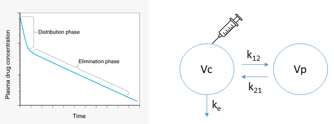
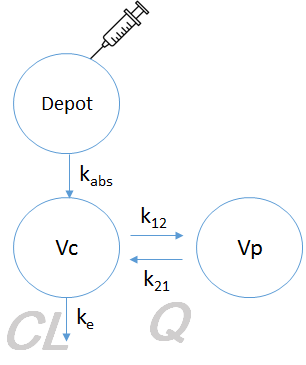
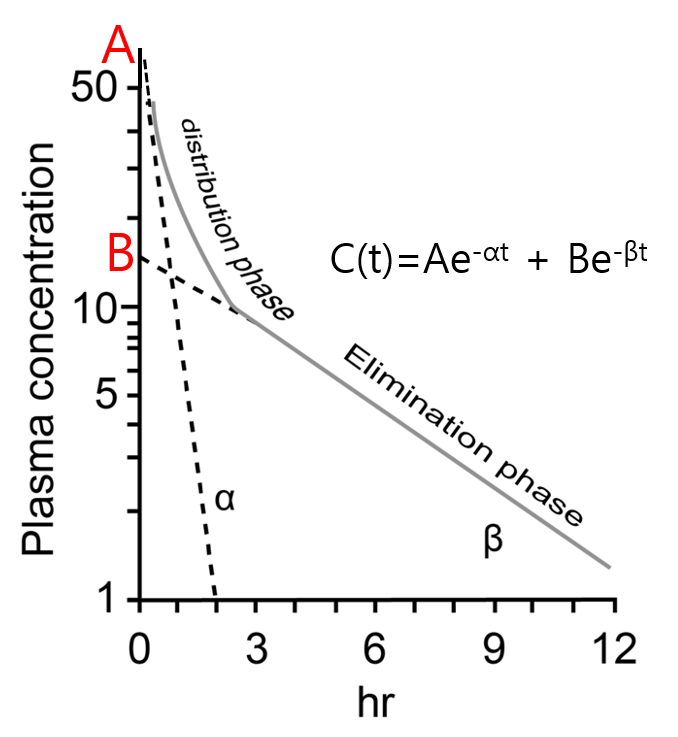

4\. 구획분석(compartmental analysis)의 이론

4.1. 구획분석의 개념

앞에서 소개된 NCA는 간단하게 약동학적 프로파일을 파악할 수 있는
방법이지만, 좀 더 약동학적 파라미터들을 이용한 다양한
예측(시뮬레이션)에는 비구획분석만으로는 많은 한계가 있다. 그래서 쓰이게
된 것이 구획분석이다.

NCA에서는 AUC로부터 다른 모든 파라미터들을 산출하지만, 그림 4.1과 같이
약물이 정맥주입된 후 중심구획에서 말초구획으로 확산되면서 두 개의
기울기를 나타내는 양상을 NCA에서 얻어진 파라미터들만으로 재현하는 것은
불가능하다. 그러나 이는 그림 4.1의 오른쪽과 같이 두 개의 분포구획(V~c~와
V~p~)를 가지는 모델을 상정하고 약물이 중심구획과 말초구획을 k~12~,
k~21~의 1차속도상수에 따라 확산되는 것으로 가정하면 잘 설명할 수 있다.
NCA에 비해 찾아야 할 파라미터들이 많고 거기에 따르는 가정들도 복잡하기
때문에 구획분석을 실제로 수행한다는 것은 각종 입력값들(용량, 투여경로,
채혈시간, 혈장약물농도)을 넣어 준 후 컴퓨터 프로그램으로 하여금 그
입력값을 만족시키는 최적의 파라미터 값들(V~c~, V~p~, CL, Q 등)을
찾아내도록 하는 과정을 의미한다.

{width="5.441666666666666in" height="2.025in"}

그림 4.1 2구획모델의 예

구획 간의 확산속도상수인 k~12~, k~21~은 제거속도상수인 k(k~e~)와
마찬가지로 시간의 역수(h^-1^) 단위를 가지며 두 구획 사이에 약물이
이동하는 속도는 두 구획의 약물농도가 같아지는 순간(분포의 평형이
이루어졌을 때)에 동일하다. 이를 수식으로 나타내면 식 4.1과 같다.

$A_{c} \bullet k_{12} = A_{p} \bullet k_{21}$ 식 4.1

아래첨자 c와 p는 각기 중심구획과 말초구획을 의미하며 A는 각 구획에
존재하는 약물의 양(amount)를 의미한다.

이를 변형하면 식 4.1와 같다.

$C_{\text{plasma}} \bullet V_{c} \bullet k_{12} = C_{\text{peripheral}} \bullet V_{p} \bullet k_{21}$
식 4.2

혈장은 중심구획이므로 중심구획의 농도는 혈장농도로 대신하였다. 농도와
분포용적을 곱한 것은 식 4.1의 A와 같은데, 평형이 이루어졌을 때
중심구획과 말초구획의 농도는 같다고 가정하므로, 결국 식 4.2에서
V~c~∙k~12~ = V~p~∙k~21~의 관계가 성립된다. 이들은 부피/시간의 단위를
가지므로 intercompartmental clearance라고도 부르며 Q라는 약어로
표기하기도 한다. 그러므로 식 4.2는 식 4.3과 같이 표기하기도 한다.

$C_{\text{plasma}} \bullet Q = C_{\text{peripheral}} \bullet Q$ 식 4.3

세 식 4.1\~4.3 모두 분포의 평형상태에서만 등식이 성립하는 것이며, 분포가
일어나는 초기에는 식의 왼쪽 값이 더 커서 중심에서 말초구획으로의
약물분포가 일어나고, 평형에 도달한 이후에는 말초구획에 있던 약이 약물의
제거가 일어나는 중심구획 쪽으로 이동하게 된다.

혈장약물농도(중심구획의 약물농도)의 시간에 따른 변화는 중심구획의 농도를
C~1~, 말초구획의 농도를 C~2~라 표기하면 식 4.4와 같이 표현된다.

$V_{c}\frac{\text{dC}_{1}}{\text{dt}} = {- V}_{c} \bullet C_{1} \bullet k_{12} + V_{p} \bullet C_{2} \bullet k_{21}{- V}_{c} \bullet C_{1} \bullet k_{e} = - C_{1} \bullet Q + C_{2} \bullet Q - C_{1} \bullet \text{CL}$
식 4.4

식 4.4는 가장 단순한 상태인 정맥주사(bolus)에 대한 것으로 시간 0에
순식간에 중심구획으로 약이 들어오는 상황은 생략되어 있고 들어오자 마자
중심구획에 고루 퍼진다고 가정한 것이다. 만약 중심구획으로 일정시간동안
정맥주입(infusion)한다면 수식은 정맥주입이 진행되는 동안에는 시간당
일정한 양이 들어오는 속도 R이 추가되고(식 4.5), 주입이 끝난 후에는 R=0가
되어 다시 식 4.4와 동일하게 표기된다.

$V_{c}\frac{\text{dC}_{1}}{\text{dt}} = {R - V}_{c} \bullet C_{1} \bullet k_{12} + V_{p} \bullet C_{2} \bullet k_{21}{- V}_{c} \bullet C_{1} \bullet k_{e}$
식 4.5

경구투여를 하는 경우라면 그림 4.2와 같은 모델을 흔히 쓰는데 약을 삼켜서
위장관 내로 들어가는 것은 정맥주사(bolus)와 같이 일어나고, 위장관
내강에서 중심구획으로 흡수되는 속도는 위장관 내강에 남아있는 약물의 양에
흡수속도상수인 k~abs~를 곱한 값으로 정의되는 1차흡수를 따른다고 가정하는
방식이 흔히 쓰인다. 이외에 F의 추정이나 흡수의 지체시간(lag time:
국문용어확인요) 1차식 이외의 다른 흡수모델 등을 적용하기 위해 이 모델을
변형할 수 있다.

{width="1.9026957567804024in"
height="2.269555993000875in"}

그림 4.2 경구투여 약물의 2구획모델

그림 4.2에는 구획을 나타내는 동그라미가 3개 있지만, 구획모델에 숫자를
붙일 때는 분포와 관련된 구획만을 의미하므로 이 역시 2구획모델이다. 이
외에도 만약 로그 혈장농도 곡선에서 3개의 기울기가 관찰된다면 중심구획에
두 개의 말초구획들이 제각기 다른 Q값들로 연결되어 있는 3구획모델로
설명이 가능하다.

이 1차식을 따라 제거되는 현상은 중심구획에서 일어난다고 가정하는 것이
기본이다. 소분자의약품들의 경우 주로 제거되는 장기인 간과 콩팥은
혈류량이 높아서 중심구획에 속해 있다고 가정하는데 무리가 없다. 또한
말초구획에서의 약물농도를 자주 측정하는 것이 기술적으로 어렵기 때문에
대부분의 약동학 자료분석은 혈장약물농도만 측정하여 수행하는데, 만약
말초구획에서 약물의 제거가 일어난다면, 말초구획의 농도를 측정하지 않는
한 정확한 k~e~의 추정이 불가능하다. 예컨데, 단클론항체의 경우 중심구획
뿐 아니라 말초구획에서도 상당한 분율로 제거가 일어나는데, 이를
혈장약물농도 자료만 가지고 중심구획에서만 제거되는 그림 4.1과 같은
모델로 설명하려 하면, 말초분획의 부피가 과도하게 큰 값으로 추정되거나
k~21~이 k~12~에 비해 과도하게 큰 값으로 추정되는 등 왜곡된 파라미터들이
산출되기도 한다. 이 때 중심구획과 말초구획에서 모두 약이 제거되는 좀 더
사실에 부합하는 모델(예컨데 중심구획에서는 k~e1,~ 말초구획에서는
k~e2~라는 제거속도상수를 가진 모델)을 생각해 볼 수 있지만, 이 역시
혈장약물(단클론항체)농도 값만으로 신뢰할만한 파라미터를 찾는 것은
힘들다. 그로므로 단클론 항체의 약동학을 적절히 모델링하기 위해서는
단순히 혈장약물농도 이외에 그항체의 타겟이 되는 물질의 생성, 제거속도,
타겟이 어디에 존재하는지 등의 다양한 정보를 사전에 파악하여 모델에
반영해야만 하며, 경험적인 구획모델의 수준을 넘어서는 작업이 된다. 본
장에서 제시된 몇 가지 약물분포와 제거 모델은 가장 기본적인 예이며, 개별
약물군의 약동학적 특성에 따라 다양한 모델들이 쓰이고 있다.

4.2 구획모델이 필요한 이유

비교적 단순한 NCA만으로 PK 파라미터들을 다 구할 수 있는데 왜 굳이 어려운
구획모델을 써야 하는가? 라는 의문을 품을 수 있다. 이에 대해 다음과 같은
답들을 제시할 수 있다.

4.2.1 최종반감기와 관련한 이슈

1장에서 이미 나온 것처럼 최종반감기가 반드시 의미있는 것은 아니다.

그림 4.3과 같이 붉은 선은 최종반감기가 훨씬 긴(붉은선- 나중에 점선으로
바꿀것)약임에도 불구하고 항정상태에 도달하는 시간은 검은 선에 비해 훨씬
빠름을 알 수 있다. 이유는 최종반감기를 보여주는 완만한 경사가 나타나기
전에 이미 몸 안의 약이 대부분 제거되었기 때문인데, 단순한 NCA로 얻어지는
PK파라미터들만으로 이를 알아내기는 어렵다.

{width="3.2580643044619424in"
height="1.9333245844269467in"}

그림 4.3 최종반감기가 더 긴 약이 항정상태에 더 빨리 도달하는 사례

다음은, V~d~와 CL가 동일한 두 약의 최종반감기가 다른 사례이다. 두 약의
V~d~나 CL가 동일하다면 k~e~ = CL/V~d~ 역시 동일할 것이고 t~1/2~를 단순히
0.693/k~e~와 같이 정의한다면 그 역시 동일해야 하겠지만, 그림 4.4에서는
V~ss~와 CL이 동일함에도 불구하고 최종반감기가 현저히 다른 두 약의 사례가
나타나 있다. 약물의 분포는 두개 이상의 구획으로 퍼지면서 일어나고 그
구획들 간에 평형이 이루어지는데 걸리는 시간에 따라 최종 반감기가 다르게
보인다는 사실이 NCA에서는 전혀 반영되어 있지 않다는 것이 이러한 현상들의
원인이다. 또 생각해 볼 것은 동일한 V~ss~를 가짐에도 두 약의 C~max~가 두
배 이상 차이가 난다는 점이다. 그 원인은 중심구획으로 흡수된 약이
말초구획으로 신속히 퍼지는 경우(붉은 선)보다, 천천히 퍼지는 경우(검은
선)가 중심구획에서의 C~max~가 훨씬 높기 때문이다. NCA는 약이
말초구획으로 퍼지는 속도나 평형에 도달하는 시간 등에 대한 고려가 없는
분석법이므로 이 C~max~의 차이를 설명하지 못한다.

{width="2.885793963254593in"
height="1.851613079615048in"}

그림 4.4 동일한 Vss와 CL을 가져도 최종반감기와 C~max~가 차이나는 사례

4.2.2 정확한 C~max~, T~max~ 값의 추정

NCA에서는 그림 4.5에서 볼 수 있듯이 약동학적 채혈로 얻어진
농도(동그라미)들 중에서 가장 높은 관찰값을 골라서 C~max~라 하고 그
채혈시간을 T~max~라 한다. 그러나 이것은 채혈 후 관찰된 값들 중에서 가장
큰 값일 뿐이고 실제 환자의 혈장 속에서 가장 높은 농도를 나타내는 시간과
농도값은 그림 4.5의 경우 네모로 둘러싼 두 점 사이의 어떤 시간과 농도일
것으로 추론할 수 있다. 가장 정확한 방법은 관찰된 농도와 채혈시간을
부드럽게 연결한 곡선을 구해서 가장 높은 값을 나타내는 위치를 고르는
것이다. 비단 C~max~뿐 아니라 채혈시점 이외의 어떤 시점에서의 농도라도 이
방법으로 예측할 수 있다. 컴퓨터 프로그램을 이용하여 사람의
혈장약물농도가 어떤 식으로 변하는지 설명하는 몇 가지 PK 모델들을
테스트하고 이들 중 관찰된 농도에 가장 가까운 곡선을 나타내 주는 모델을
선택하여 그 모델의 파라미터 값들을 얻는 것이 이 그림의 부드러운 곡선을
구하는 방법이다.

{width="3.9870964566929135in"
height="1.7302744969378827in"}

그림 4.5 정확한 C~max~, T~max~를 얻기 위해 NCA가 아닌 구획모델 분석이
필요한 사례

3.  PK/PD와 연관된 각종 의사결정

신약의 임상개발을 진행하면서 약효의 유무와 유효용량을 따지는 단계 뿐
아니라 이후 인종, 연령, 질병, 장기기능 등에 따라 PK가 어떻게 변하는지,
그에 따른 용량을 어떻게 설정할 것인지 등을 결정하기 위해서는 PK
파라미터들(ka, Vc, Vp, CL, Q들)과 약효가 이러한 환자의 특성에 따라 어떤
양상으로 변하는지를 알아야 한다. NCA로는 이런 질문들에 답을 얻기 힘들고
없고 각종 환자의 특성의 영향을 반영한 PK, PD 모델로부터 다양한
시나리오들에 대해 수행한 시뮬레이션을 통해서만 예측이 가능하다. 이러한
작업들의 출발점이 구획모델 분석이라 할 것이다.

4.3 구획모델로 얻은 PK 파라미터와 NCA로 얻은 PK 파라미터들의 차이점\*

이 4.3절은 약동학을 처음 공부하는 독자는 이해하기 어려우므로 읽지않고
넘어가도 좋다.

NCA로부터 PK파라미터를 구하는 시초는 혈장약물농도로부터 AUC를 구하고,
마지막 농도 2\~3개를 연결하여 최종소실기의 경사(slope)인 β를 구하는
것이다. 이로부터 CL(CL=Dose/AUC)와 V~z~(V~z~ = Dose/(AUC∙β) = CL/β)를
산출한다. 최종반감기 t~1/2~ = 0.693/β로 구한다. 구획분석에서 얻는
파라미터들과의 차이는 표 4.1에 요약되어 있다.

표 4.1 NCA와 구획모델 분석으로 얻어지는 PK 파라미터 비교

+----------------+----------------+----------------+----------------+
| 파라미터의     | NCA 로 구한    | 구획분석으로   | 비고           |
| 속성           | 파라미터       | 구한 파라미터  |                |
+================+================+================+================+
| 제거능력       | CL=AUC/Dose    | CL=k~e~ x V~c~ | CL을 구하는    |
|                |                |                | 수식 자체가    |
|                |                |                | 다름           |
+----------------+----------------+----------------+----------------+
| 분포           | V~ss~ =        | V~c~           | NCA에서는      |
|                |                |                | V~c~, V~p~     |
|                | V~z~ =         | V~p~           | 따로 구하지    |
|                | Dose/(AUC∙β) = |                | 못하고         |
|                | CL/β           | V~ss~ = V~c~ + | 구획모델에서는 |
|                |                | V~p~           | V~z~ 안 나옴   |
+----------------+----------------+----------------+----------------+
| 최종소실기     | β: 최종 농도   | k~e~           | NCA에서는 ke   |
|                | 2\~3개         |                | 안나오고       |
|                | 연결하여 측정  |                | 구획모델에서는 |
|                |                |                | β 안 나옴      |
+----------------+----------------+----------------+----------------+
| 구획간 분포    | 없음           | k~12~, k~21~   |                |
| 속도           |                |                |                |
|                |                | Q = k~12~ x Vc |                |
|                |                | = k~12~ x Vp   |                |
+----------------+----------------+----------------+----------------+

구획모델에서 CL의 정의는 NCA와 달라서 같은 데이터를 두 방법으로 분석할
경우 CL 값이 약간의 차이를 보이게 된다. 어느 값이 옳고 틀린 것이 아니며
구하는 수식 자체가 다르게 정의되었기 때문이다. 수식들의 정의가 조금씩
다르다 해도 몸이 약물을 제거하는 속도를 반영하는 수식들이므로 그 차이는
크지 않다.

4.3.1 분포용적 파라미터들의 차이

분포용적의 경우 NCA에서는 최종소실기의 기울기인 β를 써서 구한 V~z~를
얻을 수 있는데 (NCA에 관한 2장에서 설명) 말초구획으로 분포가 완료되고 난
후, 중심구획에서 약물의 제거가 지속되므로 말초구획의 농도가 중심구획보다
높아서 혈장약물농도(중심구획의 농도)로 몸 안에 있는 약물의 총량을 나누어
준 값(이것은 분포용적의 정의와 같다)을 시간에 따라 비교해보면 이 때
최고치에 이르러서 더 이상 증가하지 않는다. 이것을 V~z~라 하는데
NCA에서는 AUC/(Dose∙β)로 구할 수 있다. NCA는 가장 단순한 약동학
분석방법이며 분포용적이 시간이 경과함에 따라 커진다는 개념을 반영한 모델
같은 것은 쓰지 않지만, 최종 기울기인 β를 써서 분포용적 중 제일 늦게
얻어지는, 최대치에 도달한 값은 V~z~를 구할 수 있는 것이다. V~z~는 다른
용어로 V~β~ 또는 Vd area라고도 부른다.

구획모델에서는 이미 V~c~와 V~p~가 따로 존재한다고 가정하고 구하여 그
둘을 합한 값을 V~ss~라고 정의하였기 때문에 비록 나중에는 말초구획의
농도가 중심구획보다 높아지는 상황이 일어난다 해도 V~z~라는 값을 따로
계산하여 내놓지는 않는다. (Jack 원고 부분에서 다루는지 알아보고)

V~ss~는 NCA에서는 V~ss~ = F\*Dose/AUC\*MRT 로 구하지만 구획모델에서는
V~ss~ = V~c~+V~p~로 정의된다. 두 값은 정의가 다르므로 어느 값을 쓰는 게
더 바람직한지 등으로 비교하는 것은 무의미하다.

4.3.1 β와 k~e~(k~10~)의 차이

NCA 분석에서 마지막 2\~3개의 농도를 직선으로 연결하여 구하는 최종
기울기를 β라 한다. 이는 흔히 정맥주사 후 두 개의 기울기를 관찰할 수
있어서 처음 것은 α, 두번째 것을 β라 하기 때문이다. 그림 4.6은 두개의
지수함수(biexponential)로 혈장약물농도의 변화를 모델링하는 방법인데,
구획모델보다 조금 간단한 모델링 방법이지만 지금은 잘 쓰이지 않는다.
NCA가 지수함수 모델을 이용하는 것은 아니지만, 마지막 농도들로써 β를
구하는 원리는 동일하다.

식 4.7을 보면 β는 k~e~(k~10~)와 관련되어 있지만 다른 구획모델
파라미터들(각 파라미터들의 의미는그림 4.1참조)의 영향도 있어서 동일하지
않음을 알 수 있다. 수식만 가지고는 쉽게 파악하기 힘들지만 β는
k~e~(k~10~)보다 언제나 작은 값이다. 이는 그림 4.1의 구획모델을 보고
생각해 보면 쉽게 알 수 있다. 중심구획에서 혈장 약물농도가 감소하는
속도상수를 구획모델에서 정의된 CL로 표시하면 k~e~ = CL/V~c~이다. 그러나
실제 중심구획에서 약이 제거되면서 농도가 떨어지면, 이전에 같은 농도로
말초구획에 분포되어 있던 약이 중심과 말초 간의 농도경사를 없애서 평형을
회복하기 위해 중심구획으로 흘러나오게 된다. 이로 인해 실제 시간에 따라
측정되는 로그농도를 연결한 직선의 기울기(β)는 k~e~보다는 완만할(β \<
k~e~) 수 밖에 없다. 만약 말초구획이 존재하지 않고 중심구획 하나만 있는
약이라면(mannitol과 같이 세포외액에만 분포하는 약물이나 heparin과 같이
혈관 내에만 분포하는 약물 등) 정맥투여 직후의 분포기가 따로 존재하지
않으며, 말초에서 중심으로 약이 되돌아오는 현상도 존재하지 않으므로 최종
기울기인 기울기 β도 k~e~와 같은 값을 나타낼 것이다. 이런 특수한 약물
몇가지 외에는 모두 말초구획으로 분포하는 양상을 나타내므로 언제나 β \<
k~e~가 관찰된다.

{width="3.5660673665791776in"
height="2.296773840769904in"}

그림 4.6 biexponential model로 분석한 약동학 파라미터들

$\alpha = \frac{1}{2}\left\lbrack \left( k_{12} + k_{10} + k_{21} \right) + \sqrt{\left( k_{12} + k_{10} + k_{21} \right)^{2} - 4{k_{10}k}_{21}} \right\rbrack$
식 4.6

$\beta = \frac{1}{2}\left\lbrack \left( k_{12} + k_{10} + k_{21} \right) - \sqrt{\left( k_{12} + k_{10} + k_{21} \right)^{2} - 4{k_{10}k}_{21}} \right\rbrack$
식 4.7

CL의 정의가 NCA와 구획모델 간에 다른데, 표 4.1의 수식을 참조하면 다음과
같이 해석할 수 있다. NCA의 경우 CL= Dose/AUC 로서 몸 안에서 약을
제거하는 능력을 혈장약물농도와 관련하여 표현한 것이다. 구획모델의 경우
k~e~ = CL/V~c~로서, 약을 제거하는 능력(CL)이 V~c~에 비해 얼마의
분율(fraction)으로 나타나는지를 나타내고 있다. 즉 구획모델은 몸
전체보다는 중심구획을 대상으로 표현한 것이다. NCA에서 β = CL/V~z~의
관계로부터 β는 중심구획 뿐 아니라 전신으로 약이 다 퍼져있는 상태에서의
분포용적(V~z~)이 반영되어 있고 V~c~ ≪ V~z~이므로, 비록 분수의 윗부분에
있는 CL도 두 방법간에 다르지만, β \< k~e~의 단서를 찾을 수 있다.

2.  맺음말

비교적 간단한 NCA 방법이 있음에도 불구하고 구획모델을 사용하여
약동학자료를 분석하는 이유는 이 장에서 열거한 바와 같이 NCA 결과에서
누락되는 약동학적 정보를 놓치지 않기 위해서이다. 약물의 분포기가 너무
길어서 대부분의 약물이 분포기동안 제거된다면, 제거기에 얻어지는
최종반감기는 큰 의미가 없다. NCA는 분포기와 제거기 중 어느 시기가 더
약물제거에 많이 기여하는지, 최종반감기의 기여도는 얼마나 되는지에 대해
어떤 정보도 제공하지 않는다. 이에 비해 구획모델은 분포의 속도에 관련된
파라미터(k~12~, k~21~ 또는 Q), 얼마나 많은 양이 말초구획으로
분포하는지에 관련된 파라미터(V~p~) 등을 중심구획의 부피(V~c~)와 분리하여
구해주므로 신약의 전임상, 임상 개발의 과정들에서 발생하는 많은 질문들에
대한 답을 시뮬레이션할 수 있는 근거를 얻게 해 준다. 다만 모델의
복잡성으로 인해 NCA와는 달리 반드시 전문적인 소프트웨어를 이용해야 한다.
또한 NCA와 구획모델의 두 방법으로 얻어지는 결과인 PK 파라미터들은 명칭과
구하기 위해 사용하는 수식이 조금씩 다르므로 결과를 해석할 때 혼동하지
않도록 주의해야 한다.
