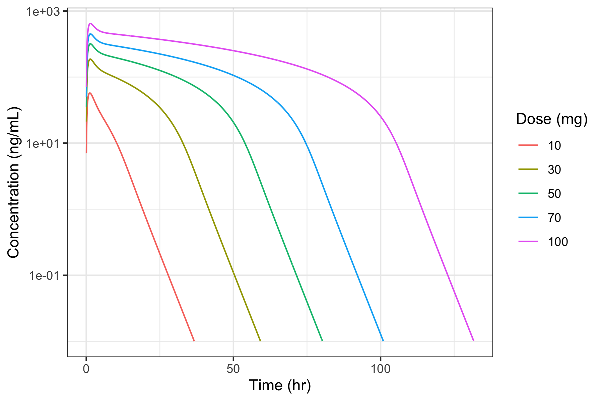

# 항체의약품{#antibody_drug}

\Large\hfill
최수인

\normalsize

```{r include=FALSE}
library(knitr)
library(tidyverse)
opts_chunk$set(echo=FALSE)
```

## 서론

지난 20년간 항체 의약품은 다양한 방면에서 활용가능성을 보여주고 있으며 특히 암 부분과 염증 질환, 혈액 질환 치료에 중요한 역할을 하고 있다. \index{항체의약품} 
지난 5년간(2016~2020년 기준) FDA에 허가된 총 228개의 의약품 중 항체의약품는 총 59개로 이는 전체의약품의 약 26%에 해당하는대 이는 10년 전(2006~2010년 기준, 18%)에 비해 50% 가까이 증가한 수치이며 계속해서 증가하는 추세이다.[@fdaapproval] \index{항체의약품} 
또한 전체 의약품 중에서도 가장 높은 매출을 가지는 약물의 대부분이 항체의약품에 속한다. 따라서 제약회사의 항체의약품 개발에 대한 관심은 나날이 높아지고 있으며 그에 발맞추어 항체의약품의 약동학의 중요성 또한 대두되고 있다. \index{항체의약품}
항체의약품은 일반의약품에 비해서 특이성이 높아 타겟 외 결합으로 인한 부작용(Off-target effect)이 적기 때문에 일반적으로 기존 치료에 비해 부작용 대비 효과가 크다는 장점을 가지고 있다. \index{항체의약품}
특히 약물의 결합이 특이적인 만큼 해당하는 타겟을 가지고 있는 집단에 대해서는 매우 효과적이기 때문에 최근에는 정밀의학의 발전과 함께 더욱 발전하고 있다. 
항체의약품은 큰 분자량과 Fc구조, 타겟수용체와의 높은 결합 친화성과 같이 일반의약품과는 다른 구조와 성질을 가지기 때문에 약리학적 기전 뿐만 아니라 약동학 측면에서도 일반적인 의약품과는 다른 모습을 보이고 이러한 차이로 인해 투여 용량, 용법, 경로에서도 일반의약품과 큰 차이를 가지게 된다. \index{항체의약품}
따라서 항체의약품의 기본적인 약동학적 특징을 일반의약품과 비교하여 이해하고 특징적으로 나타나는 약동학 프로파일을 표현한 Target-mediated drug disposision(TMDD) 모델을 이해하는 것은 항체의약품의 개발과정에 있어서 매우 중요하다. \index{항체의약품}


## 항체 및 항체의약품이란?

항체(Antibody, Ab)는 면역글로불린(Immunoglobulin, Ig)로도 지칭되며 특정 세포나 단백질과 같은 항원(Antigen)을 특이적으로 인지하여 면역반응을 유발한다. 대부분 당단백질로 구성되어 있으며 주로 체액성 면역반응에서 B 세포의 활성화를 통해 생산되어 항원을 중화(neutralization)하거나 옵소닌화(opsonization)를 통해 제거를 유도하는 역할을 한다. \index{항체} \index{항원}

항체의약품은 이와 같이 항원, 즉 타겟수용체에 특이적으로 결합하는 항체의 특성을 이용한 의약품으로 일반 의약품에 비해 타겟 외 결합에 의한 위험성이 떨어지고 적은량으로 비교적 큰 효과를 낼 수 있다. \index{항체의약품}

동물의 면역계가 생산하는 항체의 종류는 종마다 약간의 차이가 있으며 사람의 면역계는 Y unit의 개수와 heavy chain의 타입에 따라 5가지의 아형(Isotype)의 항체를 생산한다. 아형 별로 그림 \@ref(fig:antibody-isotype)과 같이 다양한 구조를 가지고 있고 이에 따라 체내 분포와 기능에 있어서 차이가 존재한다. 이 중 IgG는 인체에서 70~85%를 차지하는 가장 흔한 아형으로 150 kDa로 비교적 분자량이 작고 항원특이적이며 Fc 구조로 인해 아형 중에 반감기가 20~24일 정도로 가장 길기 때문에 항체의약품으로 가장 많이 사용되며 특히 IgG4를 가장 많이 사용한다. \index{항체의약품}

```{r antibody-isotype, fig.cap = "(ref:antibody-isotype)", echo = FALSE}
knitr::include_graphics('media-07/antibody_isotype_pic.png')
```
(ref:antibody-isotype) 5가지 항체 아형의 구조 [@2012197]


## 항체의약품의 구조 및 작용

항체의약품은 항체 아형 중 주로 IgG의 구조를 가지며 그 구조를 자세히 보면 아래와 같이 Y자 형태를 이루고 있다. 항체의 Y의 위쪽 끝은 특정한 분자를 인지하는 부분이며 Y의 아래쪽 끝은 타 세포와 연계하여 면역반응을 유발하는 부분이다. \index{항체의약품}

```{r paratope, fig.cap = "(ref:paratope)", echo = FALSE}

```

(ref:paratope) 항체의약품의 표적과의 결합의 specificity (Retrieved from https://app.biorender.com/biorender-templates)

그림 \@ref(fig:paratope)과 같이 항원을 인지하는 부분, 즉 항체의 표적 결합부위를 항원결합부위(Paratope), 항원의 항체 결합부위를 항원결정기(Epitope)라고 지칭하는 대 이 둘은 흔히 좌물쇠와 키로 비유될 정도로 특이적으로 결합한다. \index{항원} \index{항체}
항원은 대체로 단백질과 같은 큰 분자량의 입체 구조를 가지기 때문에 표면의 여러 부분을 항원결정기로 가질 수 있고 각각의 항원결정기에 따라 그에 해당하는 항원결합부위를 가진 항체가 결합할 수 있다. 따라서 하나의 항원은 생체 내에서 서로 다른 B cell lineage를 통한 다양한 항체의 생성을 유도하고 이러한 하나의 항원에 대한 다양한 항체의 혼합물을 다클론항체(Polyclonal antibodies)라고 한다. Hybridoma 기술이 발견되기 전(1975년)의 초기 항체의약품은 이러한 다클론항체 형태로 시작되었다.  \index{다클론항체}
그러나 이러한 다클론항체는 다양한 항체가 혼합되어 있어 일정한 품질로 생산하기가 매우 어렵고 생체 내에서 교차반응(Cross-reactivity)이 나타날 가능성이 크다. [@monoandpoly] \index{교차반응}
따라서 현재의 항체의약품은 hybridoma 기술을 이용하여 단일 B cell 에서만 생성된 단일클론항체(monoclonal antibody)를 주로 이용한다. [@kohler1975continuous] \index{단일클론항체}

항체의약품 구조는 그림 \@ref(fig:structure)과 같이 화학적, 분자적 및 기능적 특성에 따라 다르게 나누어 표현할 수 있다. \index{항체의약품}
특정 효소에 의해 분해되는 화학적 특성에 따라 Fab, Fc로 나누어 지칭할 수 있으며 연속되는 펩타이드 사슬을 기준으로 분자량에 따라 Light chain과 Heavy chain으로 나눌 수 있다. 또한 기능적 특성에 따라 항원에 의해 구조가 변경되는 Variable region, 구조가 변하지 않는 Constant region으로 정의할 수 있다.  

```{r structure, fig.cap = "(ref:structure)", echo = FALSE}
knitr::include_graphics('media-07/Antibody_structure.png')
```

(ref:structure) 화학적, 분자적 및 기능적 특성에 따라 구분한 항체의 구조 [@mould2007pharmacokinetics]


## 항체 의약품과 저분자의약품의 비교

항체의약품의 분자량은 대략 150kDa으로 저분자의약품의 분자량의 약 500배 정도로 매우 크고 무거우며 유기화합물로 구성된 저분자의약품과는 달리 4개의 단백질 chain으로 복잡하게 구성되어 있다. \index{항체의약품}
따라서 일반적으로 사용되는 저분자의약품과는 분자적, 생리학적으로 다른 특성을 보이고 이로 인하여 신체 내에서의 약동학적 특성도 달라지게 된다. \index{항체의약품}
항체의약품과 저분자의약품을 비교해보면 다음과 같다. 

| 항목        | 저분자의약품    | 항체의약품       |
|-----------|-----------|-------------|
| 분자적 특성    |           |             |
| 분자량       | ~ 200-500 | ≒ 150kDa    |
| 분자적 특성    | 유기화합물     | 단백질         |
| 물리화학적 특성  | 규명이 쉬움    | 복잡한 특성      |
| 정량적 측정 방법 | 잘 확립되어 있음 (LC-MS/MS) | 정량 분석 품질 낮음 (ELISA, LC-MS/MS) |
| 생리학적 특성   |           |             |
|흡수|세포막 투과 쉽고 위장관 흡수 좋음|세포막 투과 어렵고 위장관 투여 불가능|
|분포|혈관 외 조직으로의 분포가 크게 나타날 수 있음, 혈장 및 조직에서의 단백 결합에 영향을 받음. 장기 분포 ∝ 조직 친화성|혈관 외 분포가 적고 단백 결합은 고려하지 않음. 장기 분포 ∝ 혈관 투과도와 수용체 분포정도|
|대사|Phase I/II 대사로 인한 다른 물질로 변환|펩타이드/아미노산으로 분해|
|배설|담즙 또는 소변 배설. 궁극적인 제거 경로|거의 배설되지 않음|
|면역유발|흔치 않음. 과민반응 형태의 독성 작용|비교적 흔함. 항약물항체(ADA)에 의해 약물 제거될 수 있음|
|약동학적 특성|||
|투여경로|경구 투여 선호됨|정맥, 피하 또는 근육 투여|
|제형|복잡하고 다양함|단순함 (용액)|
|반감기|대부분 1일 미만|수 일 ~ 수 주|
|투여 간격|1일 미만|2주 ~ 1달|
|분포 용적|매우 다양|혈장 / ECF 부피와 유사|
|제거속도론|대부분 선형약동학|저용량에서 비선형성을 보일 수 있음(TMDD)|
|약동학적 관심사|모약물 및 대사체|항체 및 항약물항체|
|약동학과 약력학|서로 뚜렷이 구분됨|약력학이 약동학에 영향 가능|
|개발 시 규제적 고려사항|||
|약물상호작용|CYP 효소와 Transporter에 의해 나타날 수 있음|거의 나타나지 않음|
|독성 평가 범위|On-target/Off-target|주로 약리학적 작용의 과다|
|타겟|세포내 및 표면 물질|세포막 단백질 또는 체내 순환하는 수용성 단백질|
|부정맥 유발 가능성|평가 필요|평가 불필요|
|정량평가 방법 품질|주요 이슈 아님|매우 중요한 이슈|


## 항체의약품의 ADME

### 흡수
항체 의약품은 단백질로 구성되어 있어 위장관의 산성 환경과 peptidase와 protease의 높은 활성도에 의해서 분해되기 쉽다. 또한 수용성의 거대 분자이기 때문에 세포막 투과가 어려워 위장관 점막의 흡수 장벽을 통과하기 어렵다. 따라서 경구 투여에 의해 치료적 목적을 달성하기 어려워 정맥내 투여, 피하 투여, 근육 투여 등이 선호된다. \index{항체의약품}
피하 투여와 근육 투여의 경우 정맥 내 투여 보다 투여가 용이하지만 이 경우 림프관을 통해 주로 전신순환에 도달하기 때문에 림프관과 세포외액을 통과하는 과정에서 단백질 가수분해(Proteolysis)가 일어난다. 따라서 모세혈관을 통해 빠르게 흡수되는 저분자 의약품에 비해 대체로 낮은 생체이용률을 가진다. \index{가수분해}

```{r bioavailability, fig.cap = "(ref:bioavailability)", echo = FALSE}

```
(ref:bioavailability) 항체 의약품의 피하 및 근육 투여 시의 생체이용률 감소 메커니즘 [@zhou2015adme]

일반적으로 항체의약품의 피하 투여 시의 생체이용률은 20~95% 정도로 약물 마다 매우 다양하며 약물의 구조 및 림프관에서의 작용에 따라서 달라진다. [@zhao2013antibody] \index{생체이용률}
이러한 생체이용률의 감소에 대해 그림 \@ref(fig:bioavailability)과 같은 메커니즘이 제시되고 있으나 이를 정량적으로 예측하기 위한 구체적인 메커니즘은 아직 밝혀져 있지 않으며 비임상시험을 통해서 인간의 생체이용률을 예측하는 방법 역시 저분자의약품에 비해서 아직 잘 구축되어 있지 않다. 피하 및 근육 투여 시의 흡수 속도는 느린 편으로 대부분의 경우 1~8일 정도에 최고 농도에 도달한다.[@zhao2013antibody] \index{항체의약품} \index{생체이용률}

항체의약품의 또다른 특이한 점은 투여 경로에 따라 제제의 작용이 상이할 수 있는 점이다. 예를 들어, LHRH는 정맥 내 투여의 경우 LH와 FSH의 분비를 촉진하지만 근육 또는 피하 투여의 경우 LH와 FSH의 분비를 억제하게 된다. 따라서 항체의약품 개발 시에는 제제의 개발 목적에 맞는 적절한 투여 경로를 고려해야 한다. \index{항체의약품}


### 분포

항체의약품은 분자량이 크고 수용성이기 때문에 세포막 투과가 어려워 체내의 분포는 주로 혈관 내 및 세포외액에 한정되어 있다. \index{항체의약품} 따라서 분포용적은 그다지 크지 않은 편으로 이론적으로 0.1L/kg 정도의 알부민과 비슷한 정도, 혹은 혈장 부피(0.04L/kg)에서 세포외액 부피(0.23L/kg) 사이 정도의 분포용적을 가진다. \index{분포용적} 단, 항체의약품의 경우 중심구획으로부터의 1차 소실 뿐 아니라 말초구획에서 타겟과의 결합을 통해 상당량이 제거될 수 있기 때문에 비구획분석으로 구한 평형상태 분포용적(V~ss~)을 통한 실제 분포용적으로의 예측은 부정확할 수 있다. 또한, 대부분의 경우 타겟수용체의 갯수가 제한되어 있어 결합이 포화될 수 있기 때문에 항체의 농도 증가에 따라 분포 용적이 감소하는 비선형성이 나타날 수 있다. \index{중심구획} \index{분포용적} \index{비구획분석} \index{말초구획}

항체의약품은 혈관에서부터 조직의 간질액으로 확산(diffusion)과 대류(convection)를 통해 이동하며 특히 혈액의 대류에 의한 이동이 큰 비중을 차지한다. IgG의 경우 FcRN과의 결합으로 인한 통과세포외배출(FcRn-mediated transcytosis) 또한 혈관에서 조직의 간질액으로의 이동에 영향을 미칠 수 있다. \index{확산} \index{대류} \index{통과세포외배출}

```{r distribution, fig.cap = "(ref:distribution)", echo = FALSE}
knitr::include_graphics('media-07/convection.png')
```
(ref:distribution) 항체의약품의 혈관에서 조직으로의 이동 [@ryman2017pharmacokinetics]

항체의약품은 혈관으로부터 조직으로의 이동 후 조직의 간질액에서 확산, 대류, 타겟수용체와의 결합 등의 다양한 경로를 통해 제거 및 림프관으로의 이동이 이루어 진다. 따라서 항체의약품의 조직으로의 분포 정도는 이러한 다양한 요소에 의해 결정되고 조직에 따라 다르게 나타난다. 특히 조직에서 타겟수용체와의 결합이 기대되는 경우 해당 조직에서 더 큰 분포용적이 나타날 수 있다. \index{분포용적} \index{대류} \index{확산}
혈관에서 조직 내로 들어간 항체의약품은 림프관을 통해 다시 전신 순환에 도달하게 되며 이러한 조직에서 림프관으로의 이동은 혈관에서 조직으로의 이동과 마찬가지로 주로 대류에 의해서 일어난다. 그러나 이 경우에는 림프관의 구멍(pore)의 지름이 혈관보다 더 넓어 대류에 의한 이동이 더 크게 나타나기 때문에 혈관에서보다 간질액에서 항체의약품의 농도가 더 낮다. 이러한 현상은 혈관내피세포의 밀착연접(tight junction)이 발달된 경우와 같이 혈관에서의 대류의 이동이 작아지는 경우에 더 두드러지게 나타난다.  \index{대류}

따라서 항체의약품의 조직-혈장에 대한 분배계수(tissue-to-plasma partition coefficient, Kp)는 대체로 0.1~0.5 정도로 낮은 값을 가지며 뇌와 같이 혈관벽의 밀착연접(tight junction)이 더 발달된 경우 0.01 이하로 더 낮게 나타난다. [@ryman2017pharmacokinetics] 단, 항체의약품의 분포는 타겟수용체와의 결합이 영향을 미칠 수 있기 때문에 타겟수용체가 분포된 조직의 경우 분포 정도에 따라서 더 큰 값이 나타날 수도 있다. 예를 들어 일반 조직보다 타겟수용체가 과발현된 암 조직의 경우 분포 용적이 더 커질 수 있다. \index{분배계수} \index{항체의약품}


### 제거

항체의약품은 분자량이 매우 커서 사구체를 통한 여과가 거의 불가능하기 때문에 질병이 있는 경우를 제외하고는 소변으로 제거되지 않는다. 또한 대부분의 경우 담즙 배설에 의한 제거도 매우 미미한 것으로 밝혀져 있다. 따라서 항체의약품 제거는 대부분 세포 내 리소좀(lysosome)의 분해 작용을 통한 단백질 이화작용(Proteolytic catabolism) 에 의해서 나타나며 이 과정을 통해 단백질인 항체의약품은 작은 펩타이드와 아미노산으로 분해되어 제거되거나 다른 단백질 생산에 재사용 된다. \index{항체의약품}
세포내에서의 제거는 아래 그림 \@ref(fig:Elimination)과 같이 세포로의 섭취(uptake)의 형태에 따라서 세가지 형태로 구분할 수 있는대 
1) 수용체와의 결합 없이 액상내포작용(fluid-phase endocytosis)인 음세포작용(pinocytosis)를 통해서 제거되는 경우와 
2) 수용체와의 결합으로 인한 내포작용(endocytosis)을 통해서 제거되는 경우와 
3) 면역작용으로 생성된 항-약물항체와의 결합으로 인해 제거되는 경우이다. \index{음세포작용} \index{내포작용}

```{r Elimination, fig.cap = "(ref:Elimination)", echo = FALSE}

```
(ref:Elimination) 항체의약품의 다양한 제거 경로

#### 음세포작용(Pinocytosis)에 의한 제거
음세포작용(pinocytosis)은 혈관벽에 있는 혈관내피세포에 의해 일어나는 비특이적인 내포작용이다. 이 과정은 타겟수용체와의 결합으로 인한 내포작용이 아닌 액상내포작용이기 때문에 전신에서 비특이적으로 나타날 수 있으며 특히 피부, 근육 및 소화 기관 등 모세혈관이 발달되어 혈관 내피 세포가 많은 장기에서 두드러지게 나타난다. 이러한 비특이적인 제거는 내인성 IgG를 포함한 모든 IgG에서 일어나기 때문에 큰 수용력(capacity)을 가지고 있어 내인성 IgG의 농도(~10g/mL)에 비해 낮은 일반적인 항체의약품의 농도에서 포화되지 않는다. 따라서 해당 메커니즘으로 인한 청소율은 항체의약품의 용량과 무관하게 일정한 값을 갖는다. \index{음세포작용}
인체의 혈관벽은 표면적이 매우 넓기 때문에(1000m^2^) 해당 기전으로 항체의약품이 빠르게 제거될 수 있으나, IgG와 같이 Fc domain을 가진 경우 음세포작용으로 인한 섭취이후에 리소좀에 의한 분해가 일어나지 않도록 하는 보호기전([FcRn recycling](#FcRn))을 가지기 때문에 해당 작용으로 인한 제거를 많은 부분 회피할 수 있다. \index{항체의약품}

##### **FcRn에 의한 Recycling** {#FcRn}

항체의약품 중 IgG가 음세포작용에 의해 분해되지 않도록 하는 보호기전으로 신체 내에서 항체의약품의 노출을 유지 시키는 대 중요한 역할을 한다. \index{음세포작용}
메커니즘은 그림 \@ref(fig:FcRn-recycling)과 같다.

```{r FcRn-recycling, fig.cap = "(ref:FcRn-recycling)", echo = FALSE}
knitr::include_graphics('media-07/FcRn_recycling.png')
```
(ref:FcRn-recycling) FcRn에 의한 recycling 과정[@Ryman_2017]

Fc 수용체(FcRn, neonatal Fc receptor)는 주로 세포막에 존재하는 당단백질로 Fc domain과 결합하는 수용체이다. 이 수용체와 IgG의 Fc domain와의 결합친화성은 pH에 민감하기 때문에 생리적인(pH7.4)의 환경에서는 결합하지 않으나 엔도솜(endosome)내의 산성화된 환경에서는 결합친화성이 강해지면서 FcRn-IgG 복합체를 형성한다. 따라서 그림 \@ref(fig:FcRn-recycling)과 같이 IgG는 음세포작용에 의해 섭취된 후(**A**)에 산성화된 환경인 엔도솜 내에서는 FcRn과 결합하게 되고(**B**) 이러한 복합체 형성을 통해 리소좀에 의한 분해작용의 영향을 피하여(**C**) 다시 혈관 세포 표면으로 돌아오게 된다(**D**). 세포 표면에서는 다시 pH가 7.4로 상승하므로 Fc 수용체와는 해리되고 Ig 형태로 혈액 혹은 조직으로 돌아가게 되는데(**E**) 이러한 일련의 과정을 FcRn에 의한 recycling이라고 한다. 
일반적으로 IgG의 $\frac{2}{3}$정도가 FcRn에 의한 recycling으로 인해 음세포작용으로 인한 제거를 회피하는 것으로 알려져 있으며 IgG(18~21일)가 다른 형태의 항체(2~3일)들에 비해서 긴 반감기를 가지는 주요한 원인이 된다. Fc 수용체와의 결합친화력은 IgG의 아형별로 다르며 Fc 수용체와의 결합친화력이 낮은 IgG3의 경우 다른 IgG 아형들과는 다르게 7일의 반감기를 가지고 있다. 
FcRn과의 결합친화력은 IgG의 아형 뿐 아니라, 항체의약품 종류나 동물종에 따라 다르며 이는 항체의약품의 제거 속도 및 반감기에 큰 영향을 미칠 수 있다. 동물종 중에서 Cynomolgus monkey의 Fc 수용체는 인간의 Fc 수용체와 가장 비슷한 구조를 가졌기 때문에 인간에서의 항체의약품의 약동학 프로파일에 대한 예측을 위해서 Cynomolgus monkey의 약동학 결과를 가장 많이 사용한다. 

#### 수용체와의 결합을 통한 제거

항체의약품은 세포막의 표면에 있는 수용체와의 결합을 통해 내포작용이 일어난 후 리소좀에 의한 분해가 일어나 제거 될 수 있다. 이러한 제거는 크게 두가지의 경우가 있는대 1) 타겟 수용체의 항원결정기와 항체의 항원결합부위가 특이적으로 결합해서 내포작용이 일어나는 경우(TMDD)와 2) 면역 세포들에 주로 발현되어 있는 FcγR(Fc-gamma-receptor)와 항체의 Fc domain 이 결합하여 내포작용이 일어나는 경우(FcγR-mediated clearance)이다. 음세포작용과는 달리 수용체와의 결합을 통해 제거가 일어나기 때문에 전신보다는 특정 장기에서 주로 나타나며 특히 TMDD의 경우 타겟수용체의 발현정도와 항원결정기와 항원결합부위간의 결합친화도가 이러한 반응에 크게 영향을 미친다. 

##### Target-mediated clearance (TMDD, Target-mediated drug disposition)

타겟수용체의 항원결정기(epitope)와 항체의 항원결합부위(paratope)가 결합하여 내포작용이 일어나 제거되는 것을 의미하며 항체의약품이 비선형약동학을 보이는 가장 큰 이유이다. 항체의약품은 대부분 타겟과 높은 결합특이성과 결합친화력을 가지기 때문에 타겟과의 결합은 이러한 약물이 제거되는 주요 경로 중 하나이다. 이 작용은 항체의약품의 제거 뿐 아니라 조직에서의 분포에도 영향을 미치기 때문에 TMDD(Target-mediated drug disposition)라고 불린다. \index{항체의약품} \index{항원결정기} \index{항원결합부위} \index{TMDD}
대부분의 경우에서 항체의약품에 비해 타겟수용체의 양은 한정되어 있어 이와 같은 결합이 포화될 수 있기 때문에 용량이 증가함에 따라 청소율이 감소하는 특징적인 비선형 약동학 특성을 보인다. 단, 투여되는 용량이 포화가 이루어지는 용량보다 큰 경우나 항체의약품이 모든 타겟에 지속적으로 결합하여 작용을 막는 경우라면 수용체가 포화된 상태로 유지되어 해당 결합으로 인한 제거의 영향이 작아져 전체적으로는 비특이적인 제거가 우세해지고 이러한 비선형 약동학 특성이 나타나지 않을 수 있다. \index{항체의약품}
TMDD로 인해 항체의약품이 제거되는 것은 타겟 수용체의 발현 정도, 타겟 수용체와의 결합친화력, 투여 용량, 타겟-항원 결합체의 제거 속도 등에 영향 받을 수 있어 선형약동학을 보이는 일반적인 구획분석과는 다른 특징을 보이기 때문에 이것을 표현하기 위해 항체의약품의 작용메커니즘을 반영한 모델(TMDD model)을 사용하고 있다. 이 모델에 대한 자세한 부분은 아래에 제시된 [TMDD 약동학 모델 분석](#tmdd_model) 부분을 참고하길 바란다. 

##### Fcγ-receptor mediated clearance

항체의약품의 Fc domain이 세포막에 있는 Fcγ 수용체와 결합하여 내포작용이 일어나면서 리소좀에 의한 분해로 항체의약품이 제거되는 현상이다. Fcγ 수용체는 대부분 면역 세포들에서 발현이 되어 있으며 항체의 Fc domain과 결합해서 면역 세포들의 식세포작용(phagocytosis)을 유도한다. 따라서 Fc domain과 Fcγ 수용체와의 결합은 면역 반응의 주요한 기전 중 하나이다. 
이 수용체는 주로 간의 쿠퍼세포(Kupffer cell)나 그물결합조직(reticular connective tissue)의 단핵구(monocyte)나 대식세포(macrophage)에 수용체가 발현되어 있다. 이 제거 경로는 모든 IgG의 Fc domain에 결합하기 때문에 비교적 비특이적이며 수용력이 커서 포화되지 않아 선형적인 약동학을 보인다. 해당 제거경로의 자세한 메커니즘과 전체 제거에서의 영향 정도는 아직 제대로 밝혀지지 않았으나 실제로 항체의약품의 제거에서 이러한 결합으로 인한 부분이 미치는 영향은 비교적 미미할 것으로 보인다.  다만, methotrexate로 인한 Fcγ 수용체의 발현 감소로 adalimumab의 청소율이 감소된 사례와 같이 Fcγ 수용체의 발현은 다양한 약물에 의해서 증가, 감소될 수 있고 이를 통해 항체의약품의 청소율에 영향을 미칠 수 있다.

#### Immune-mediated clearance {#ADA}

모든 항체의약품은 잠재적으로 인체 내에서 면역원성(Immunegenicity)을 가지고 있으며 이는 항체의약품 개발에 있어서 주요한 고려 요소이다. \index{면역원성} 면역원성이란 항체의약품과 같은 외부 물질이 신체로 들어왔을 때 면역 반응을 유발하는 성질을 의미하며 약물의 구조, 용량-용법, 타겟 인구 집단 특성 등 여러가지 요소에 의해서 좌우 받는다. \index{면역원성} 면역원성은 면역 자극(Immunostimulation) 및 과민반응(hypersensitivity), 항-약물항체(anti-drug antibodies, ADA)의 유도와 같은 다양한 형태로 나타날 수 있는대, 특히 ADA가 발현하는 경우, 항체의약품의 청소율을 증가시켜 노출의 차이를 일으키고 이로인해 약물의 임상적 효능에 영향을 미칠 수 있다. \index{면역원성} \index{청소율} 면역원성의 메커니즘은 정확히 밝혀져 있지 않으나 다음과 같은 요소가 일반적으로 면역원성에 영향을 미치는 것으로 알려져 있다. \index{면역원성}

1) 약품의 특성에 의한 경우
   1) 인간 유래 부분의 비율 : 항체 의약품은 인간 유래 부분의 비율에 따라 Human(100%) > Humanized (90%)> Chimeric(66%) > Murine(0%) 순으로 분류하고 있으며 이 비율이 낮을 수록 외부 물질로 인식할 가능성이 크기 때문에 면역원성이 커질 수 있다.
   2) 응집인자(Aggregate)나 보조제(Adjuvant)와 같은 첨가제(Excipient)에 의해 면역원성이 커지거나 작아질 수 있다. 
   3) 항체의약품의 분자구조(Glycosylation 여부)에 따라 면역원성이 달라진다.

2) 투여 대상 집단 및 약물의 용법에 의한 경우
   1) 환자 유전 정보 및 질병 상태 : 면역에 과민한 유전 정보를 가지고 있거나 자가면역 질환과 같은 경우에 주로 면역원성이 더 크게 나타나며 면역저하자나 면역 억제제를 복용하는 대상의 경우 건강인에 비해 면역원성이 더 작게 나타날 수 있다. 
   2) 투여 경로 : 면역원성은 피하투여 > 근육투여 > 비강투여 > 정맥투여 순으로 높은 것으로 알려져 있다. 
   3) 저용량, 오랜 기간, 지속 요법으로 투여 되는 경우에 면역원성이 높을 수 있다. 

ADA는 일반적인 항체의 작용과 비슷한 방식으로 대부분의 경우 항체의약품을 중화시키며 포식작용을 유도하여 제거를 증가시킨다. \index{항체의약품}
면역원성은 종 별로 다르게 나타나기 때문에 동물 실험으로는 예측이 어렵다. 특히 인간을 대상으로 한 약물에서는 인간에서보다 동물실험에서 ADA 현상이 더 흔히 나타날 수 있기 때문에 항체의약품의 약동학적 특성을 파악하기 위해 동물에서의 약동학 결과를 해석할 때 이를 주의해서 해석해야 한다. \index{면역원성}
일정 시기 이후에 제거속도가 갑자기 증가하여 혈중 농도가 급격하게 떨어지는 경우 ADA의 발현을 의심 할 수 있으며 ADA의 발현 여부에 대한 검사 결과를 통해서 혹은 검사 결과가 없는 경우 약동학의 양상을 통해서 ADA의 발현을 예측하여 이러한 경우 ADA 검사 상 양성인 동물을 제외하거나 ADA로 인해 약동학에 영향을 주기 전까지의 데이터를 사용한다. 
ADA가 발현된 경우와 TMDD가 나타난 경우의 약동학 곡선이 비슷한 양상을 보이는 경향이 있기 때문에 이를 주의하서 판단해야 하며 이에 대한 약동학 곡선 양상에 대한 비교는 아래 [TMDD와 ADA 비교](#TMDDADA) 부분을 참고한다.

## TMDD 모델 분석^[약동학 데이터를 분석하는 업무를 하지 않는 독자들은 이 장을 읽지 않고 넘어가도 좋습니다. 그림에 제시된 약물-농도 곡선은 모두 아래 미분방정식을 이용한 시뮬레이션 결과입니다.] {#tmdd_model}

TMDD 모델이란 항체가 표적 수용체와의 결합을 통해서 제거되는 과정이 반영된 모델로 항체의약품의 약동학을 정량적으로 표현한 모델이다. 항체의약품 뿐만 아니라 항체의약품과 비슷하게 결합 친화력이 매우 높은 약물의 경우에도 (예)Warfarin) TMDD 모델을 따르기도 한다. 

```{r TMDDmodel, fig.cap = "(ref:TMDDmodel)", echo = FALSE}
knitr::include_graphics('media-07/TMDDmodels.png')
```
(ref:TMDDmodel) 다양한 TMDD 모델 [@dua2015tutorial]

다양한 항체의약품과 표적 수용체와의 결합 상황이 나타날 수 있기 때문에 그림 \@ref(fig:TMDDmodel)과 같이 다양한 TMDD 모델이 사용되고 있다. 본 교재에서는 이 중 혈장에서 표적 수용체와 결합되는 1구획 모델을 분석하고 이러한 모델의 특징을 알아보고자 한다.

혈장에서 표적 수용체와 결합하는 1구획 모델은 가장 단순한 형태의 TMDD 모델로 기본적인 구조는 그림 \@ref(fig:TMDDmodel-basic)과 같다. 모델의 구조를 간단히 살펴보면, 항체의약품(L)은 크게 두가지의 제거 메커니즘 및 그에 따른 청소율을 가진다. 한가지는 선형적인 제거 메커니즘으로 비특이적으로 음세포작용에 의해 제거되는 것(CL~1~)이며 다른 하나는 표적 수용체(R)와의 특이적인 결합을 통해 제거(CL~2~)되는 것이다. 표적 수용체는 혈장 내에서 생성속도(k~syn~)와 제거속도상수(k~deg~)로 평형을 이룬 상태로 있다가(dR/dt = 0) 항체의약품이 투여되면 결합(k~on~) 및 해리(k~off~)상수 값에 따른 새로운 평형이 이루어지게 된다. 항체의약품과 수용체와의 결합복합체(LR)는 약리학적 효과를 일으키며 내포작용으로 인한 분해(k~ec~)로 제거된다. 

```{r TMDDmodel-basic, fig.cap = "(ref:TMDDmodel-basic)", echo = FALSE}

```
(ref:TMDDmodel-basic) TMDD 모델 구조

해당 모델에 대한 기본 미분 방정식은 다음과 같다. 

\begin{equation}
\frac{dL}{dt} = -k_{el}L - k_{on}L \cdot R + k_{off}LR
(\#eq:eq7-1)
\end{equation}

\begin{equation}
\frac{dR}{dt} = k_{syn} - k_{deg}R - k_{on}L \cdot R + k_{off}LR
(\#eq:eq7-2)
\end{equation}

\begin{equation}
\frac{dLR}{dt} = k_{on}L \cdot R - k_{off}LR - k_{ec}LR
(\#eq:eq7-3)
\end{equation}


여기서 표적에 결합하지 않은 항체의약품(L)과 표적수용체에 결합한 형태(LR)의 합은 $L_{tot} = L + LR$ 이고 표적수용체의 경우 $R_{tot} = R + LR$ 이기 때문에 이를 위의 식에 대입하여 아래와 같이 전체 항체의약품과 전체 표적수용체에 대한 미분방정식은 아래와 같이 정의할 수 있다. 

\begin{equation}
\frac{dL_{tot}}{dt} = -k_{el}L - k_{ec}LR
(\#eq:eq7-4)
\end{equation}

\begin{equation}
\frac{dR_{tot}}{dt} = -k_{syn} - k_{deg}R - k_{ec}LR
(\#eq:eq7-5)
\end{equation}

여기서 Time = 0 에서는 항체가 투여되기 전이기 때문에 $L_{0} = 0, LR_{0} = 0$ 이며, 체내에서 평형을 유지하는 표적 수용체의 경우 항체가 투여되기 전에는 생성속도(k~syn~)와 제거속도(k~deg~ * R)가 체내에서 동일하기 때문에 $R_{0} = \frac{k_{syn}}{k_{deg}}$ 이다.

따라서 혈장에 존재하는 타겟수용체에 대한 1구획 TMDD의 모델의 경우 위의 식을 이용하여 그림 \@ref(fig:TMDDcurve0)과 같이 시간-농도 곡선을 그릴 수 있다. 

```{r TMDDcurve0, fig.cap = "(ref:TMDDcurve0)", echo = FALSE}

```
(ref:TMDDcurve0) TMDD 모델의 농도 곡선(semi-log)[@peletier2012dynamics]

용량에 따라서 선형성이 더 크게 나타날 수 있지만(저용량 혹은 고용량의 경우) 전형적인 TMDD 모델의 형태가 나타나는 경우 시간-농도에 대한 semi-log 곡선은 위 그림\@ref(fig:TMDDcurve0)와 같이 곡선의 양상에 따라 4가지의 Phase로 구분할 수 있다. 해당 phase에서는 우세한 반응이 서로 다르게 나타나며 이를 이해하면 TMDD 모델의 시간-농도 곡선의 특징을 이해할 수 있다. 

### Phase A (0 ≤ t ≤ T~1~)
Phase A는 투여 직후 빠르게 표적 수용체와의 결합을 통한 제거와 비특이적인 대사에 의한 제거가 동시에 나타나 빠른 농도 감소를 보이는 구간이다. 수용체가 포화되기 전까지의 구간(T~1~)으로 대부분의 경우 표적 수용체의 양은 대부분 약물에 비해 매우 제한적이기 때문에 빠르게 포화가 일어나게 되어 구간의 길이는 매우 짧고 관찰하기 어렵다. 또한 이로인해 이 구간에서는 결합한 수용체의 수에 비해 결합하지 않은 항체의 양이 많기 때문에($[L] > [L*R]$) 위의 \@ref(eq:eq7-1)~\@ref(eq:eq7-3)식에서 아래와 같이 밑줄 친 부분이 우세한 형태를 나타낸다. 

\begin{equation}
\frac{dL}{dt} = \underline {-k_{el}L - k_{on}L \cdot R} + k_{off}LR
(\#eq:eq7-6)
\end{equation}

\begin{equation}
\frac{dR}{dt} = k_{syn} - k_{deg}R - \underline{k_{on}L \cdot R} + k_{off}LR
(\#eq:eq7-7)
\end{equation}

\begin{equation}
\frac{dLR}{dt} = \underline {k_{on}L \cdot R} - k_{off}LR - k_{ec}LR
(\#eq:eq7-8)
\end{equation}

높은 용량의 항체가 투여 된 경우 그림 \@ref(fig:TMDDcurveA)과 같이 표적 수용체와의 결합 및 포화가 빠르게 일어나서 구간의 경사는 급해지나 A구간의 길이(T~1~)는 짧아진다. 따라서 A구간 동안 감소된 항체의약품의 농도는 투여 용량에 상관없이 비슷한 정도로 감소하게 된다. 
```{r TMDDcurveA, fig.cap = "(ref:TMDDcurveA)", echo = FALSE}
knitr::include_graphics('media-07/TMDD_phaseA.png')
```

(ref:TMDDcurveA) 투여용량에 따른 A구간 농도 곡선의 변화

그에 반해 그림 \@ref(fig:R0)와 같이 체내에 존재하는 표적수용체의 양(R~0~)이 포화될 수 있는 범위 내에서 많아지는 경우 결합은 빨라지지만 그만큼 포화되는 대에 시간이 더 걸리게 되기 때문에 A구간의 경사는 급해지고 길이(T~1~)도 길어져서 이 구간동안 항체의약품의 양은 더 크게 감소한다. 대부분의 경우 대사로 인한 제거는 결합에 의한 제거보다 매우 느리기 때문에 해당 구간동안 결합으로 인한 제거만 나타난다고 가정할 때 결합이 포화될 때까지(T~1~) 감소된 항체의약품의 양은 대략 타겟수용체의 양($R_{0}$)이라고 예측할 수 있다($R_{0} ≈ L_{0} - L(T_{1})$).


```{r R0, fig.cap = "(ref:R0)", echo = FALSE}
knitr::include_graphics('media-07/R0.png')
```

(ref:R0) 표적수용체의 양(R~0~)에 따른 A구간 주위의 농도 곡선의 변화

### Phase B (T~1~ ≤ t ≤ T~2~)
Phase B는 항체의약품과 표적수용체와의 결합이 포화되어 결합이 거의 일어나지 않는 구간이다. 따라서 이 구간 동안에는 표적수용체와의 결합으로 인한 제거가 거의 일어나지 않고 주로 비특이적인 대사에 의한 제거가 일어나게 된다. 
항체의약품과 표적수용체와의 결합이 포화된 경우 $LR ≒ R_{tot}, R ≒ 0, L(t) ≫ K_{d}$ 가 만족되기 때문에 이를 \@ref(eq:eq7-1)~\@ref(eq:eq7-3)식에 대입하면 다음과 같이

\begin{equation}
\frac{dL_{tot}}{dt} = -k_{el}L - k_{ec}LR = -k_{el}L - k_{ec}R_{tot}
(\#eq:eq7-9)
\end{equation}

\begin{equation}
\frac{dR_{tot}}{dt} = -k_{syn} - k_{deg}R - k_{ec}LR = k_{syn} - k_{ec}R_{tot}
(\#eq:eq7-10)
\end{equation}

\begin{equation}
\frac{d(L+R_{tot})}{dt} = -k_{el}L - k_{ec}R_{tot}
(\#eq:eq7-11)
\end{equation}

\begin{equation}
\frac{dL}{dt} = -k_{el}L - k_{syn}
(\#eq:eq7-12)
\end{equation}

로 정리될 수 있다. 식 \@ref(eq:eq7-10)과 식 \@ref(eq:eq7-11)를 통해 도출된 식 \@ref(eq:eq7-12)를 보았을 때 표적수용체가 포화된 B 구간에서는 항체의 시간에 따른 변화량(dL/dt)이 대사에 의한 제거속도 $k_{el}$와 항체 양에 비례하는 선형 형태임을 확인할 수 있다. 따라서 semi-log 그래프에서 B구간의 기울기는 대략 $k_{el}$정도로 예측할 수 있다. IgG의 경우 FcRn에 의한 recycling으로 인해 $k_{el}$가 대부분 작은 값을 보이기 때문에 다른 구간에 비해서 비교적 평평한 형태를 보이며 $k_{el}$값이 증가함에 따라 이 구간의 기울기가 급해진다.

해당 구간은 선형성을 가지기 때문에 그림 \@ref(fig:TMDDcurveB)과 같이 구간의 경사는 투여 용량에 상관없이 일정하나 표적수용체와의 결합이 불포화되는 농도(약 10K~d)까지 도달하는 대에 걸리는 시간은 투여 용량이 증가할 수록 길어지기 때문에 B구간의 길이는 길어진다. 


```{r TMDDcurveB, fig.cap = "(ref:TMDDcurveB)", echo = FALSE}
knitr::include_graphics('media-07/TMDD_phaseB.png')
```
(ref:TMDDcurveB) 투여용량에 따른 B구간 곡선의 변화


### Phase C (T~2~ ≤ t ≤ T~3~)

항체의약품의 농도의 감소 및 타겟수용체의 생성으로 인해 타겟수용체와의 결합이 포화되지 않고 일부만 결합된 상태로 존재하는 구간이다. 항체의약품의 농도가 $K_{d}$ 값에 가까워지는 시기로 (대략 $0.1K_{d}$에서 $10K_{d}$ 정도) 항체의약품이나 타겟수용체 둘 다 적당량 존재하기 때문에 대사에 의한 선형 제거와 타겟 수용체와의 결합을 통한 제거(TMDD) 두 가지가 모두 나타나 비선형성을 보이는 구간이다. 두가지의 제거 모두 나타나기 때문에 해당 구간의 기울기는 B구간에서보다 커지지만 대부분의 항체의약품은 K~d~값이 매우 낮아 해당 구간의 시작 농도가 작기 때문에 해당 구간 동안의 농도 감소 정도는 B구간에 비해 매우 작다. 

C구간은 항체의약품의 K~d~값에 영향을 받기 때문에 투여용량에 상관없이 C구간에서의 항체의약품의 농도 범위는 비슷하다. 단, 용량이 증가함에 따라 농도가 $10K_{d}$에 도달하는 시간이 오래 걸리기 때문에 그림 \@ref(fig:TMDDcurveC)과 같이 구간 C의 시작점인 T~2~가 커져 오른쪽으로 그래프가 이동한 듯한 모습을 보인다.

```{r TMDDcurveC, fig.cap = "(ref:TMDDcurveC)", echo = FALSE}
knitr::include_graphics('media-07/TMDD_phaseC.png')
```

(ref:TMDDcurveC) 투여용량에 따른 C구간 곡선의 변화


### Phase D (T~3~ ≤ t ≤ T~4~)
항체의 농도가 타겟 수용체와의 해리 상수보다 매우 낮아 타겟 수용체와의 결합을 통한 제거가 우세하고 대사에 의한 제거는 무시할 수 있는 구간이다. ($L(t) ≪ K_{d}$) 두가지의 제거 메커니즘이 모두 나타나는 C구간에 비해서 급격히 기울기가 완만해지며 다시 선형성을 가지게 되는대 이때 경사의 기울기는 대략 k~ec~정도의 일정한 값을 갖는다. 

D구간은 항체의 농도가 매우 낮은 상황으로 대부분 타겟 수용체와 결합된 형태로 존재하게 된다. 이때 해당 구간에서 항체 농도의 기울기가 대략 k~ec~인 이유는 1) k~ec~ > k~el~ 인 경우, 결합된 형태가 제거됨에 따라 항체가 제거되는 속도보다 결합하는 속도가 더 커져서 k~ec~에 의해 항체의 농도 변화가 결정되기 때문이며 2) k~ec~ < k~el~인 경우, k~el~에 의해 항체가 빠르게 제거되어도 결합된 형태에서 해리되어 항체 농도가 유지 되기 때문에 결국 항체 농도 변화는 k~ec~에 의한 결합체의 농도 변화를 따르게 되기 때문이다. 

```{r KINT, fig.cap = "(ref:KINT)", echo = FALSE}

```

(ref:KINT) k~ec~의 변화에 따른 D구간의 변화

그림 \@ref(fig:KINT)과 같이 k~ec~를 변화시킬 때 마지막 구간에서 기울기가 변화한다.

## M-M model(Michaelis-menten model)의 사용
TMDD 모델은 실제 항체의약품의 메커니즘을 반영하여 표현한 모델이지만 해당 모델의 파라미터를 정확하게 예측하기 위해서는 항체의약품 뿐만 아니라 수용체의 농도 정보가 필요하다. 그러나 실제 실험에서는 수용체의 농도 정보는 얻기 어렵기 때문에 항체의약품의 농도 정보 만으로 약동학 모델을 구축해야 하는 경우가 많다. 이러한 경우에 항체의약품의 비선형성을 표현하기 위해 M-M 모델이 사용될 수 있으며 실제로 항체의약품의 많은 약동학 모델의 구축 사례에서 이를 확인할 수 있다. M-M 모델은 생화학에서 가장 잘 알려진 효소반응속도론에 관한 모델로 아래 식 \@ref(eq:eq7-14)과 같이 기질 농도에 따른 효소의 초기 반응속도를 표현한다. 약동학에서는 이와 비슷하게 약물 농도에 따른 약물 제거속도를 표현한 식을 모델에 사용한다. 

\begin{equation}
v = \frac{V_{max} \cdot C}[S]
(\#eq:eq7-14)
\end{equation}

그림 \@ref(fig:MMmodel)에서와 같이 M-M 모델에서는 수용체의 농도가 결합하지 않은 항체의약품의 농도보다 항상 작다고 가정하기 때문에 TMDD 모델에서 수용체의 농도보다 항체의약품이 낮은 D구간이 M-M 모델에서는 표현되지 않는다. 따라서 해당 모델은 투여 용량에서 약물의 농도가 수용체의 농도보다 높아 상대적으로 수용체의 농도가 일정하다고 가정할 수 있을 때 사용하기에 더 적합하며 TMDD 모델의 파라미터 중 k~ec~가 큰 경우에도 사용하기에 적절하다. 

```{r MMmodel, fig.cap = "(ref:MMmodel)", echo = FALSE}

```

(ref:MMmodel) M-M 모델과 TMDD 모델의 비교


## TMDD와 ADA로 인한 제거의 비교 {#TMDDADA}

동물 종에서의 데이터를 분석할 때 TMDD와 ADA에 의한 제거의 구분이 어려울 때가 있기 때문에 이 부분을 유의해서 해석해야 한다. 두가지의 경우 모두 Semi-log 곡선에서 어느 시점에서 기울기가 급격히 커지는 형태를 보인다는 점에서 유사하기 때문이다. 그러나 위 [Immune-mediated clearance](#ADA) 부분에서 설명한 대로 TMDD와 ADA에 의한 제거는 기본적인 발생 메커니즘이 다르다. TMDD는 타겟수용체와의 결합에 의해서 나타나는 반면 ADA에 의한 제거는 항체의약품에 대한 면역반응으로 생성된 ADA와의 결합으로 인해 나타난다. 따라서 ADA의 검사 결과가 있는 경우 가장 정확하지만 ADA 검사 결과가 없는 경우라도 약동학 결과를 자세히 살펴보면 두 모델의 차이점을 확인하고 구분할 수 있다. TMDD로 인한 경우 그 기울기의 변화 시점이 항체의약품의 농도가 $K_d$값에 가까워지는 시점(C구간의 시작)인 대에 반해 ADA에 의한 제거의 경우 항체의약품의 농도와 $K_d$값에 상관 없이 면역반응에 필요한 일정 시간이 소요된 후에 나타난다. 따라서 아래 그림 \@ref(fig:ADAmodel)과 같이 기울기가 급격히 떨어지는 부근을 관찰하여 시간에 상관없이 비슷한 약물 농도에서 급격히 떨어지는 현상이 나타날 경우 TMDD에 의한 것으로, 약물 농도와 상관없이 비슷한 시간에 급격히 떨어지는 현상이 나타나는 경우 ADA로 인한 제거로 인한 것으로 예측하여 구분할 수 있다. 

```{r ADAmodel, fig.cap = "(ref:ADAmodel)", echo = FALSE}

```

(ref:ADAmodel) ADA를 보이는 경우(**1,2,3,4**)와 TMDD를 보이는 경우(**5,6,7,8**)의 비교


## Allometric scaling

비임상데이터의 결과를 이용하여 인간에서의 노출 정도를 예측하기 위해서는 동물 종의 무게를 이용하여 외삽하는 allometric scaling이 주로 사용된다. Allometric scaling은 청소율과 분포용적과 같은 약동학 파라미터에 대해 아래의 식과 같이

\begin{equation}
CL(V) = a \cdot BW^b
(\#eq:eq7-15)
\end{equation}

로 표현하여 a, b를 구함으로써 인간에서의 약동학 파라미터를 예측하는 방법이다. 항체의약품은 인간과 가장 비슷하다고 알려진 cynomologus monkey의 약동학 파라미터를 주로 이용하며, 청소율의 경우 일반적으로 b를 0.75로, 분포용적의 경우 b를 1로 고정하여 예측한다. 청소율의 b값의 경우 연구자에 따라 0.8 혹은 0.9가 더 낫다는 주장도 있기 때문에 적절한 근거와 수집된 데이터 혹은 비슷한 약물에서의 결과를 참고하여 b의 값을 결정할 수 있다. 
항체의약품의 경우 FcRn에 대한 결합친화력이나 제거 메커니즘이 원숭이와 사람에서 비교적 유사하여 allometric scaling이 기존의 저분자 의약품에 비해 더 정확하다고 알려져 있다. 특히 VEGF에 대한 재조합 인간화 단클론 항체의 경우 원숭이와 인간 간의 체중 의존성 allometric scacling을 통해 청소율이나 분포용적의 계산이 효과적으로 이루어 질 수 있는 것으로 보고되어 있다. 

## 맺음말

이상으로 항체의약품의 기본적인 구조와 ADME 및 TMDD 모델에 대해서 살펴보았다. \index{TMDD}
항체의약품은 고전적인 저분자 의약품과는 약동학에서 많은 차이를 보이기 때문에 이에 대한 차이를 이해하고 적용하는 것이 매우 중요하다. 모든 항체 의약품에서 TMDD 모델을 관찰 할 수 있는 것은 아니며 특히 용량이 너무 높거나 낮은 경우 구획모델과 같은 형태를 띄기도 하기 때문에 가지고 있는 데이터를 가장 잘 설명할 수 있는 모델을 사용하는 것이 적합할 것이다.
가톨릭대학교 계량약리학연구소(PIPET)^[http://pipet.or.kr]에서는 관련한 다양한 교육을 제공하고 있으므로, 관심있는 독자는 홈페이지에 접속하여 정보를 얻을 수 있다.\index{계량약리학}

