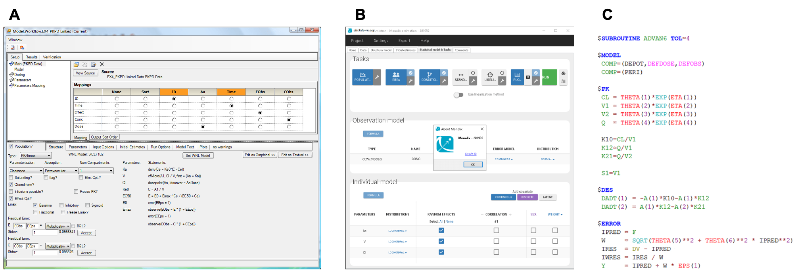

# 항체의약품 {#antibody}

\Large\hfill
최수인

\normalsize

```{r include=FALSE}
library(knitr)
library(tidyverse)
opts_chunk$set(echo=FALSE)
```

## 서론

지난 20년간 증가하는 항체 의약품은 다양한 방면에서 활용가능성을 보여주고 있으며 특히 항암 부분과 염증 질환, 혈액 질환 치료에 중요한 역할을 하고 있다. \index{항체의약품} 화학적 공정을 통해서 제조되는 기존의 의약품과는 다르게 항체의약품은 생물학적 공정을 통해 제조되기 때문에 분석의 정확도, 정밀도, 특이성 등으로 2021년 기준으로 지금까지 총 XX개의 생체의약품이 허가 되었으며 이중에 XX개가 항체의약품이며 2011년의 XX개와 비교하였을 때 %로 점점 증가하고 있다. 
항체의약품은 생체의약품 중 가장 큰 시장점유율을 가지고 있으며, 전체 의약품 중에서도 가장 높은 매출을 가지는 약물들의 대부분이 이에 속한다. 
일반의약품에 비해서 특이성이 높아 타겟 외 결합으로 인한 부작용(Off-target effect)이 적으므로 기존 치료에 비해 부작용 대비 효과가 크다는 장점이 있고 적절한 타겟을 가지고 있는 집단에 대해서는 매우 효과적이기 때문에 최근에는 정밀의학의 발전과 함께 더욱 발전하고 있는 의약품이다.
항체의약품은 큰 분자량과 Fc구조, 타겟과의 높은 결합 친화성과 같이 일반의약품과는 다른 구조와 성질을 가지기 때문에 약리학적 기전 뿐만 아니라 약동학 측면에서도 일반적인 의약품과는 다른 모습을 보이고 이러한 차이로 인해 투여 용량, 용법, 경로에서도 일반의약품과 큰 차이를 가지게 된다.
따라서 항체의약품의 기본적인 약동학적 특징을 일반의약품과 비교하여 이해하고 TMDD 모델의 특징을 이해함으로써 임상에 적합한 항체를 고르는 것은 항체의약품의 개발에 매우 중요한 부분이다.


## 항체 및 항체의약품 

```{r fig7-2, fig.cap = "(ref:act_antibody)", echo = FALSE}
knitr::include_graphics('media-07/fig5-2.png')
```
(ref:general_antibody) 항체의 작용 

항체(Antibody, Ab)는 면역글로불린(Immunoglobulin, Ig)로도 지칭되며 특정 세포나 단백질과 같은 항원에 특이적으로 인지하여 면역반응을 유발한다. 당단백질로 구성되어 있으며 주로 체액성 면역반응에서 B cell의 활성화를 통해 생산되어 항원을 중화(neutralization)하거나 제거하는 역할을 한다. 항체 의약품은 이와 같이 항원 특이적으로 결합하는 항체의 특성을 이용하여 만든 의약품이다. 항체의 이러한 항원 특이적인 결합 때문에 항체 의약품은 일반 의약품에 비해 off-target에 의한 위험성이 떨어지고 적은량으로 비교적 큰 효과를 낼 수 있다. 

동물의 면역계가 생산하는 항체의 종류는 종마다 약간의 차이가 있으며 사람의 면역계는 5가지의 아형(Isotype)의 항체를 생산한다. 아형 별로 Figure 1 과 같이 다양한 구조를 가지고 있고 이에 따라 체내 분포와 기능에 있어서 차이가 존재한다. 항체의약품으로 사용되는 형태는 대부분 IgG이며 이중에서 IgG4를 가장 많이 사용한다. IgG는 인체에서 70~85%를 차지하는 가장 흔한 아형으로 150 kDa로 비교적 분자량이 작고 아형 중에 반감기가 20~24일 정도로 가장 길다. 

```{r fig7-3, fig.cap = "(ref:isotype_antibody)", echo = FALSE}

```
(ref:isotype_antibody) 5가지 항체 아형의 구조


## 항체 의약품의 분자생리학적 특성

### 항체의 구조

항체 의약품은 주로 IgG isotype의 구조를 가지며 그 구조를 자세히 보면 아래와 같이 Y자 형태를 이루고 있다. 항체의 Y의 위쪽 끝은 특정한 분자를 인지하는 부분이며 Y의 아래쪽 끝은 타 세포와 연계하여 면역반응을 유발하는 부분이다.

아래 그림과 같이 항체의 표적 결합부위를 Paratope(lock), 항원의 항체 결합 부위를 Epitope (key)라고 지칭한다. 항원은 구조에 따라 여러 부분을 epitope로 가질 수 있고 항체는 항원의 epitope에 특이적으로 반응하기 때문에 하나의 항원은 다양한 항체와 결합할 수 있다.

```{r fig7-4, fig.cap = "(ref:paratope)", echo = FALSE}

```
(ref:paratope) 항체의약품의 표적과의 결합의 specificity

항체의 구조는 화학적, 분자적 및 기능적 특성에 따라 다르게 나누어 표현할 수 있다.
특정 효소에 의해 분해되는 화학적 특성에 따라 Fab, Fc로 나누어 지칭할 수 있으며 연속되는 펩타이드 시술을 기준으로 정의하는 분자적 특성에 따라 Light chain과 Heavy chain으로 나눌 수 있다. 또한 항원에 따라 구조가 변경되는 지 여부의 기능적 특성에 따라 항원에 의해 구조가 변경되는 Variable region, 구조가 변하지 않는 Constant region으로 정의할 수 있다.  

IgG가 항체 의약품으로 선호되는 가장 큰 이유중의 하나는 항체 의약품의 항원에 대한 특이성이다. 

## 항체 의약품과 저분자 의약품의 비교

항체의약품은 일반적으로 사용되는 저분자 의약품과는 분자적, 생리학적으로 다른 특성을 보이고 이로 인하여 신체 내에서의 약동학적 특성도 달라지게 된다. 
항체의약품과 저분자 의약품의 비교를 정리해보면 다음과 같다.

| 항목        | 저분자의약품    | 항체의약품       |
|-----------|-----------|-------------|
| 분자적 특성    |           |             |
| 분자량       | ~ 200-500 | ≒ 150kDa    |
| 분자적 특성    | 유기화합물     | 단백질         |
| 물리화학적 특성  | 규명이 쉬움    | 복잡한 특성      |
| 정량적 측정 방법 | 잘 확립되어 있음 | 정량 분석 품질 낮음 |
| 생리학적 특성   |           |             |
|흡수|세포막 투과 쉽고| 위장관 흡수 좋음|세포막 투과 어렵고| 위장관 투여 불가능|
|분포|혈관 외 분포가 뚜렷. 장기 분포 ∝ 조직 친화성|혈관 외 분포가 적음. 장기 분포 ∝ 혈관 투과도|
|대사|Phase I/II 대사로 인한 다른 물질로 변환|펩타이드/아미노산으로 분해|
|배설|담즙 또는 소변 배설. 궁극적인 제거 경로|거의 배설되지 않음|
|면역유발|흔치 않음. 과민반응 형태의 독성 작용|비교적 흔함. 항약물항체(ADA) - 약물 제거|
|약동학적 특성|||
|투여경로|경구 투여 선호됨|정맥 또는 피하 투여|
|제형|복잡하고 다양함|단순 (용액)|
|반감기|대부분 1일 미만|수 일 ~ 수 주|
|투여 간격|1일 미만|2주 ~ 1달|
|분포 용적|매우 다양|혈장 / ECF 부피와 유사|
|제거속도론|대부분 선형약동학|비선형 / TMDD|
|약동학적 관심사|모약물 및 대사체|항체 및 항약물항체|
|PK/PD|뚜렷이 구분됨|PD가 PK에 영향 가능|
|개발 시 규제적 고려사항|||
|약물상호작용|약동/약력학적 근거 필요|주로 약력학적 이슈|
|독성 평가 범위|On-target/Off-target|주로 약리학적 작용의 과다|
|부정맥 유발 가능성|평가 필요|평가 불필요|
|정량평가 방법 품질|주요 이슈 아님|매우 중요한 이슈|

### 1. 분자생리학적 특성

항체의약품의 분자량은 대략 150kDa으로 저분자 의약품의 분자량의 약 500배 정도로 매우 크고 무겁다. 
유기화합물로 구성된 저분자의약품과는 달리 4개의 단백질 chain으로 구성되어 있어 열에 변성되기 쉽고 매우 복잡한 특성을 가지고 있다. 
또한 정량적 측정을 위해 LC-MS/MS에 비해 비교적 낮은 정확성과 정밀성을 가진 ELISA를 사용하기 때문에 정량 분석의 품질이 저분자의약품에 비해서 낮다.

항체의약품은 분자량이 크기 때문에 세포막 투과가 어렵고 단백질로 구성되어 있어 위에서 모두 분해 될 수 있기 때문에 위장관으로의 투여가 일반적으로 불가능하다.
마찬가지로 세포막 투과가 어렵기 때문에 혈관 외 분포가 적어 거의 알부민과 비슷한 정도의 분포를 가지고 있으며 장기의 분포 정도는 혈관 투과도의 정도와 비례한다.


## 항체의약품의 ADME

### 1. 흡수
항체 의약품은 단백질로 구성되어 있어 위장관의 산성 환경과 peptidase와 protease의 높은 활성도에 의해서 분해되기 쉽다. 또한 수용성의 거대 분자이기 때문에 세포막 투과가 어려워 위장관 점막으로의 흡수 장벽을 통과하기 어렵다. 이러한 이유로 경구 투여에 의해 치료적 목적을 달성하기 어렵고 정맥내 투여, 피하 투여, 근육 투여 등이 선호된다. 정맥내 투여에 비해서 투여가 용이하기 때문에 피하 투여, 근육 투여가 더 선호되지만 이러한 경우 림프관을 통해 주로 systemic circulation에 도달하기 때문에 림프관과 세포외액을 통과하는 과정에서 proteolysis가 일어날 수 있어 모세혈관을 통해 빠르게 흡수되는 저분자 의약품에 비해 낮은 생체이용률을 가질 수 있다. 

```{r fig7-5, fig.cap = "(ref:bioavailability)", echo = FALSE}
knitr::include_graphics('media-07/Bioavailability.png')
```
(ref:bioavailability) 일반 의약품의 경구 투여 시와 항체 의약품의 피하 및 근육 투여 시의 생체이용률 감소 메커니즘의 비교  

일반적으로 피하 투여 시의 생체이용률은 20~95% 정도로 약물 마다 다양하며 약물의 구조 뿐만 아니라 림프관 에서의 작용에 따라도 달라질 수 있다. 그러나 정확한 메커니즘은 아직 밝혀져 있지 않으며 비임상시험을 통해서 인간의 생체이용률을 예측하는 방법은 저분자의약품에 비해서 잘 구축되어 있지 않다. 피하 및 근육 투여 시의 흡수 속도는 느린 편으로 대부분의 경우 1~8일 정도에 최고 농도에 도달한다.

항체의약품의 또다른 특이한 점은 투여 경로에 따라 제제의 작용이 상이할 수 있는 점이다. 예를 들어, LHRH의 경우 정맥 내 투여의 경우 LH와 FSH의 분비를 촉진하지만 근육 투여 혹은 피하 투여의 경우 LH와 FSH의 분피를 억제하게 된다. 따라서 항체의약품 개발 시에는 제제의 개발 목적에 맞는 적절한 투여 경로를 고려해야 한다.


### 2. 분포

항체의약품은 크기가 크고 수용성이라 세포막 투과가 어렵기 때문에 체내의 분포는 주로 혈관 내 및 세포외액에 한정되어 있으며 그로 인해 분포용적은 그다지 크지 않은 편이다. 따라서 이론적으로 0.1L/kg 정도의 알부민과 비슷한 정도의 혹은 혈장 부피(0.04L/kg)에서 세포외액 부피(0.23L/kg) 사이 정도의 분포용적를 가진다. 저분자의약품과는 다르게 혈장 단백 결합과는 무관한 특성을 보인다. 또한 정맥 주입 후 중심분포용적 (Vc)는 대략 3~8L 정도를 보이는대 이는 혈장 용적과 같거나 약간 큰 정도이다. 다만, 항체 단백질의 경우 중심구획으로부터의 1차 소실 뿐 아니라 말초 분획에서 타겟과의 결합을 통해 상당량이 제거 될 수 있기 때문에 비구획분석으로 구한 평형상태 분포용적(Vss)의 실제 분포용적 예측력은 떨어진다.

항체의약품의 혈관에서부터 조직의 간질액으로의 이동은 확산 보다는 주로 혈액의 대류(Convection)에 의해 일어난다. IgG의 경우 FcRN과의 결합으로 인한 통과세포외배출(Transcytosis)가 아래 그림과 같이 혈관과 조직 양방향으로 일어나기 때문에 혈관에서 조직의 간질액으로의 이동에 영향을 미칠 수 있다. 


```{r fig7-6, fig.cap = "(ref:distribution)", echo = FALSE}

```
(ref:distribution) 항체의약품의 혈관에서 조직으로의 이동

항체의약품은 혈관으로부터 extravasation한 후 조직의 간질액에서 확산, 대류, 타겟과의 결합 및 다양한 경로를 통한 제거가 이루어 지고 이로 인해 분포 정도가 결정된다. 따라서 조직에서 타겟과의 결합이 기대되는 항체 의약품에서 더 큰 분포용적이 나타날 수 있다. 대부분의 경우 타겟의 갯수가 한정되어 있어 포화가 이루어 질 수 있으며 이러한 경우 항정상태의 분포 용적이 항체의 농도에 증가에 따라 감소하는 비선형적인 분포가 나타날 수 있다. 
혈관에서 조직 내로 들어간 항체의약품은 림프관을 통해 다시 전신 순환에 도달하게 되며 이러한 림프관으로의 이동은 혈관에서의 이동과 마찬가지로 주로 대류에 의해서 일어난다. 림프관의 구멍(pore)의 지름이 혈관보다 더 넓어 대류에 의한 이동이 더 크게 나타나기 때문에 항체의약품의 농도는 간질액에서 혈관에서보다 더 낮은 농도를 가진다. 이러한 현상은 혈관내피세포의 밀착연접(tight junction)이 발달된 경우 더 두드러지게 나타난다. 

항체의약품의 tissue:plasma concentration ratio (Kp)는 대체로 0.1~0.5정도의 낮은 값을 가지며 뇌와 같이 혈관벽의 tight junction이 더 발달된 0.01 이하로 더 낮게 나타난다. 단, 항체의약품의 분포는 타겟과의 결합이 영향을 미칠 수 있기 때문에 타겟이 분포된 조직의 경우 더 큰 값이 나타날 수도 있다. 예를 들어 암 조직의 경우 일반 조직 보다 타겟이 과발현되어 있을 수 있고 이에 따라 분포 용적이 더 커질 수 있다. 


### 3. 제거

항체의약품은 저분자의약품과는 다르게 분자량이 매우 크기 때문에 사구체를 통한 여과가 거의 불가능하기 때문에 질병이 있는 경우를 제외하고는 소변으로 제거되지 않는다. 또한 대부분의 경우 담즙 배설에 의한 제거도 매우 미미한 것으로 밝혀져 있다. 따라서 항체 의약품 제거는 대부분 세포 내 리소좀(lysosome)의 분해 작용을 통한 단백질 이화작용(Proteolytic catabolism)에 의해서 나타나며 이 과정을 통해 작은 펩타이드와 아미노산으로 분해되고 다른 단백질 생산에 재사용 된다.
세포내에서의 제거는 uptake의 형태에 따라서 두가지 형태로 구분할 수 있는대 1) 비특이적인 fluid-phase endocytosis(pinocytosis)를 통해서 제거되는 경우와 2) Receptor와의 특이적인 결합을 통한 endocytosis를 통해서 제거되는 경우이다.

```{r fig7-7, fig.cap = "(ref:Elimination)", echo = FALSE}

```
(ref:Elimination) 항체의약품의 다양한 제거 경로

#### 3.1 Pinocytosis에 의한 제거
Pinocytosis는 혈관내피세포에 의해 일어나는 비특이적인 endocytosis이다. 혈관벽의 인체 내의 표면적이 매우 넓기 때문에(1000m^2^) 이러한 과정은 항체의약품을 빠르게 제거할 수 있다. 이 과정은 receptor binding으로 인한 endocytosis가 아닌 fluid-phase endocytosis 이기 때문에 비특이적으로 특정 장기가 아닌 아닌 전신에서 나타날 수 있으며 특히 피부, 근육 및 소화 기관 등 모세혈관이 발달되어 혈관 내 세포가 많은 장기에서 두드러지게 나타난다. 이러한 비특이적인 제거는 큰 capacity를 가져 일반적인 항체의약품의 농도에서 포화되지 않기 때문에 linear PK를 보인다. 
단, Fc domain을 가진 IgG의 경우 uptake이후에 lysosomal degradation이 되지 않도록 FcRN recycling이라는 보호기전을 가지기 때문에 혈중 농도를 비교적 오래 유지할 수 있다.

##### FcRN Recycling
항체의약품 중 IgG가 pinocytosis에 의해 분해되지 않도록 하는 보호기전으로 신체 내에서 IgG의 노출을 유지 시키는 대 중요한 역할을 한다. 

메커니즘은 아래 그림과 같다.

```{r fig7-8, fig.cap = "(ref:FcRn_recycling)", echo = FALSE}

```
(ref:FcRn_recycling) FcRn recycling process

FcRn(neonatal Fc receptor)는 neonatal Fc receptor로 주로 세포막에 존재하는 당단백질이다. IgG의 Fc domain와의 결합친화성이 pH에 민감하기 때문에 생리적인(pH7.4)의 환경에서는 결합하지 않으나 endosome내의 산성화된 환경에서는 결합친화성이 강해지면서 FcRN-IgG complex를 이루게 된다. 따라서 위의 그림과 같이 IgG가 pinocytosis에 의해 uptake된 후(**A**) FcRn과 complex를 이루게 되고(**B**) 이러한 complex형태를 이룸으로써 lysosomal degradation의 영향을 피해(**C**) 다시 세포 표면으로 돌아오게 된다(**D**). 세포 표면으로 돌아온 이후에는 다시 pH의 상승으로 FcRN와는 해리되어 원래의 Ig형태를 가지게 되며(**E**) 이 과정을 FcRn recycling이라고 한다. 
일반적으로 pinocytosis가 일어나는 IgG의 $\frac{2}{3}$정도가 FcRN recycling을 거치는 것으로 알려져 있으며 이는 IgG(18~21일)가 다른 항체(2~3일)에 비해서 긴 반감기를 가지는 주요한 원인이 된다. 참고로 IgG의 subtype 중에 FcRn과의 결합친화력이 낮은 IgG3의 경우 다른 IgG subtype들과는 다르게 7일의 반감기를 가지고 있다. 
FcRn과의 결합친화력은 IgG의 subtype 별로, 항체의약품 종류별로, 동물종 별로 다를 수 있고 이는 항체의약품의 제거 속도 및 반감기에 영향을 미칠 수 있다. 일반적으로 Cynomolgus monkey의 FcRn이 인간에서의 FcRn과 가장 비슷한 것으로 알려져 있기 때문에 인간에서의 항체의약품의 약동학 프로파일에 대한 예측을 위해서 Cynomolgus monkey를 가장 많이 사용한다. 

#### 3.2 Receptor와의 결합을 통한 제거

세포막의 표면에 있는 Receptor와의 결합을 통해 endocytosis가 일어난 후 세포 내에서 lysosome에 의한 분해가 일어나는 경우이다. 타겟 항원의 epitope와 Fab가 결합해서 endocytosis가 일어나는 경우(TMDD, Target mediated drug disposition)와 면역 세포들에 주로 발현되어 있는 FcγR(Fc-gamma-receptor)와 Fc domain이 결합하여 endocytosis가 일어나는 경우(FcγRs-mediated clearance)가 있다. Pinocytosis와 달리 특정 receptor와 결합해야 하기 때문에 특이적이며 특히 TMDD의 경우, Fab와 epitope의 간의 affinity와 specificity, reactivity가 이러한 제거 속도와 양에 영향을 미칠 수 있다.


##### TMDD

TMDD는 타겟의 epitope와 항체의 paratope가 결합하여 endocytosis가 일어나서 이로 인해 제거되는 것을 의미한다. 항체의약품이 비선형약동학을 보이는 가장 큰 이유이기도 하다. 항체의약품은 대부분 타겟과 높은 결합 특이성과 결합친화력을 가지기 때문에 TMDD는 이러한 약물의 제거의 주요 경로가 될 수 있으나 수용체의 수가 한정되어 있기 때문에 이로인해 용량비례성이 결여된 비선형 약동학 특성을 보이게 되며 이러한 비선형성은 용량이 작거나 농도가 낮을 때 더 두드러 지게 나타난다. 따라서, 항체 의약품의 목적이 모든 타겟에 결합하여 작용을 막는 경우라면 이미 치료적 용량에서 수용체가 포화된 상태로 유지되고 있을 가능성이 크기 때문에 이러한 경우에는 TMDD의 제거에 대한 영향력이 크지 않을 수 있다. TMDD로 인해 항체의약품이 제거되는 속도는 타겟 receptor의 발현 정도, 항체의약품과의 결합친화력, 용량, 타겟 세포에서의 catabolism 속도 등에 의해서 결정되고 이는 다음 파트에 제시된 TMDD 모델에서 작용 방향을 확인할 수 있다. 

TMDD는 선형약동학을 보이는 일반적인 구획분석과는 다른 양상을 보이기 때문에 이것을 표현하기 위해 항체의약품의 작용메커니즘을 반영한 TMDD 모델을 사용하고 있다. 항체의약품의 경우 아래 그림과 같이 다양한 표적 수용체와의 결합 상황이 나타날 수 있기 때문에 이에 맞는 다양한 모델이 제시되고 있다. 해당 그림 중 혈장에서 표적 수용체와 결합되는 형태의 TMDD 모델은 아래 TMDD 개론 부분의 모델을 참고하길 바란다. 


```{r fig7-9, fig.cap = "(ref:TMDDmodel)", echo = FALSE}

```
(ref:TMDDmodel) 다양한 TMDD 모델

##### Fcγ-receptor mediated clearance

항체 의약품의 Fc domain이 세포막에 있는 Fcγ 수용체와 결합하여 endocytosis가 일어나면서 lysosomal degradation에 의해 제거되는 현상이다. Fcγ 수용체는 대부분 면역 세포들에서 발현이 되어 있으며 항체의 Fc domain과 결합해서 phagocytosis를 유도한다. 따라서 Fc domain과 Fcγ 수용체와의 결합은 면역 반응의 주요한 기전 중 하나이다. 실제로 항체의약품의 제거에서 이러한 결합으로 인한 부분이 미치는 영향은 비교적 미비한 것으로 알려져 있다. 다만, MTX로 인한 Fcγ 수용체의 발현 감소로 Adalimumab의 청소율이 감소된 사례와 같이 Fcγ 수용체의 발현은 다양한 약물에 의해서 증가 혹은 감소 될 수 있고 이를 통해 항체의약품의 청소율에 영향을 미칠 수 있다.

##### Immunogenicity-mediated clearance

모든 항체의약품은 잠재적으로 인체 내에서 면역원성을 가지고 있다. 면역원성이란 항체의약품과 같은 외부 물질이 신체로 들어왔을 때 면역 반응을 유발하는 성질을 의미하며 약물의 구조, 용량-용법, 타겟 인구 집단 특성 등 여러가지 요소에 의해서 좌우 받는다. 면역원성은 면역 자극(Immunostimulation) 및 과민반응(hypersensitivity), 항-약물항체(anti-drug antibodies)의 유도와 같은 다양한 형태로 나타날 수 있으며 특히 항-항물항체가 발현하는 경우 항체의약품의 청소율을 증가시켜 노출의 차이를 일으키고 이로인해 약물의 임상적 효능에 영향을 미칠 수 있다. 
면역원성의 메커니즘은 정확히 밝혀져 있지 않으나 다음과 같은 경우 일반적으로 높아질 수 있는 것으로 알려져 있다. 
1) 약물의 관점
   1) 
면역원성은 동물 종 별로 다르게 나타나기 때문에 동물 실험으로는 예측이 어렵다. 또한 인간을 대상으로 한 약물의 경우 동물실험에서 항-약물항체 현상이 인간에서보다 흔히 나타날 수 있기 때문에 동물에서의 약동학 결과를 해석할 때 이를 주의해서 해석해야 한다. 

항체의약품은 대부분 동물 특히 마우스 유래 부위를 가지고 있기 때문에 인체 내에서 항체단백질 자체가 면역원으로 작용하여 면역 반응이 일어나고 이에 대한 항체(antidrug antibodies, ADA)가 생성될 수 있다. 면역원성이란 항체와 같은 물질이 이러한 면역 반응을 나타낼 수 있는 능력을 의미하며 이는 여러가지 요소에 의해 좌우 받는다. 동물종  이것을 ADA(Antidrug antibodies) 라고 하며 특히 반복 투여의 경우 이러한 현상이 더 나타날 수 있다.  이는 항체의약품의 효과와 안전성에 영향을 미칠 수 있다. 대부분의 경우 항체의약품을 중화시키며 phagocytosis 또는 lysosomal degradation으로 인한 제거를 증가시켜 치료 효과를 낮추고 노출을 감소시킨다. 이 현상은 다른 동물종으로부터 형성된 항체일 수록 더 나타날 수 있기 때문에 이를 극복하기 위하여 humanized의 비율을 높인 antibody를 사용할 수 있다. 또한 비임상단계에서 항체의약품의 동물로의 투여 시에도 이러한 현상이 비교적 흔히 나타날 수 있기 때문에 이를 유의해서 결과값을 해석해야 한다. 

따라서 동물 종은 이러한 면역원성을 예측력이 떨어진다. 이러한 ADA는 항체의약품의 약동학적 특성을 파악하는 대에 방해가 된다. (confound)
혈중 농도가 급격하게 떨어지게 되며 ATA 양성인 동물을 제외하거나 ATA가 나타나서 PK에 영향을 주기 전까지의 데이터를 사용한다. 


## TMDD

항체의약품은 많은 경우에서 비선형 약물 동태학을 보이고 있다. 
이러한 TMDD 현상이 나타나는 경우, 일정 농도 이하에서는 약물의 제거가 빠르게 일어나고 일정 농도 이상이여야만 선형 약물 동태학을 보인다. 

### TMDD 모델
TMDD(Target-mediated drug disposition) 모델이란 항체가 타겟과의 결합을 통해서 제거되는 과정이 반영된 모델로 항체의 약동학을 정량적으로 파악하기 위한 모델이다. 항체 의약품 뿐만 아니라 결합 친화력이 매우 높은 약물의 경우 (예)Warfarin)에도 TMDD 모델을 따르기도 한다. 
해당 모델은 1 compartment model에서 혈장에 수용성의 표적 수용체가 존재하는 경우이며 가장 단순한 형태의 TMDD 모델이다. 2 compartment 이거나 말초분획에 표적 수용체가 존재하는 경우에는 비슷한 원리로 다른 모델로 설명해야 할 것이고 그에 따른 곡선의 양상도 다를 것이다. 

```{r fig7-10, fig.cap = "(ref:TMDDmodel_basic)", echo = FALSE}

```
(ref:TMDDmodel_basic) TMDD 모델 구조


해당 모델에 대한 기본 미분 방정식은 다음과 같다. 

$
\frac{dL}{dt} = -k_{el}L - k_{on}L \cdot R + k_{off}LR
$

$
\frac{dR}{dt} = k_{syn} - k_{deg}R - k_{on}L \cdot R + k_{off}LR
$

$
\frac{dLR}{dt} = k_{on}L \cdot R - k_{off}LR - k_{ec}LR
$

여기서 항체와 타겟 각각 결합 유무에 상관없는 전체량은 $L_{tot} = L + LR$ 이고 $R_{tot} = R + LR$ 이기 때문에 이를 위의 식에 대입하여 아래와 같이 전체 항체와 전체 표적 수용체에 대한 미분방정식 또한 정의할 수 있다. 

$
\frac{dL_{tot}}{dt} = -k_{el}L - k_{ec}LR
$
$
\frac{dR_{tot}}{dt} = -k_{syn} - k_{deg}R - k_{ec}LR
$

여기서 Time = 0 에서는 항체가 투여되기 전이기 때문에 $L_{0} = 0, LR_{0} = 0$ 이며, turn-over model을 따르는 타겟의 경우 항체가 투여되기 전에는 생성속도와 제거속도가 체내에서 동일하여 평행을 이룬 상태이기 때문에 $R_{0} = \frac{k_{syn}}{k_{deg}}$ 이다.

따라서 1 compartment 모델에서 혈장에 존재하는 표적에 의한 TMDD의 경우 위의 식을 이용하여 아래 그림과 같은 농도 곡선을 그릴 수 있다. 

```{r fig7-11, fig.cap = "(ref:TMDDcurve)", echo = FALSE}

```
(ref:TMDDcurve) TMDD 모델의 농도 곡선


TMDD 농도 곡선은 위와 같이 해당 phase에서 우세한 작용에 따라 4가지의 Phase로 이를 구분할 수 있다. 

### Phase A (0 ≤ t ≤ T~1~)
첫번째는 투여 직후 빠르게 표적 수용체와의 결합을 통한 제거와 catabolism에 의한 제거가 동시에 나타나서 농도의 빠른 2차 감소를 보이는 구간이다. 수용체가 포화되기 전까지의 구간(~~T~1~)으로 대부분의 경우 항체 의약품에 비해 수용체의 수가 제한되어 있기 때문에 결합한 수용체의 수에 비해 결합하지 않은 항체의 양이 많다.([L] > [L*R]) 
따라서 위의 식 중 다음 아래 표기된 부분이 우세한 형태를 나타낸다. 

$
\frac{dL}{dt} = \underline {-k_{el}L - k_{on}L \cdot R} + k_{off}LR
$

$
\frac{dR}{dt} = k_{syn} - k_{deg}R - \underline{k_{on}L \cdot R} + k_{off}LR
$

$
\frac{dLR}{dt} = \underline {k_{on}L \cdot R} - k_{off}LR - k_{ec}LR
$

높은 농도의 항체가 투여 될수록 수용체와의 결합이 빠르게 일어나지만 표적 수용체의 수는 R~0~로 한정되어 있기 때문에 수용체와의 결합이 빠르게 포화 되어 아래 그림과 같이 A구간의 경사가 급하지고 구간의 길이는 짧아진다. 그리고 A구간 동안에 줄어든 항체의 양은 투여농도에 상관없이 비슷한 정도로 감소하게 된다. 


```{r fig7-11, fig.cap = "(ref:TMDDcurve)", echo = FALSE}

```
(ref:TMDDcurve) TMDD 모델의 농도 곡선

체내에 존재하는 표적 수용체의 수가 많아지는 경우 같은 농도의 항체가 투여 되더라도 포화되는 대에 시간이 더 걸리게 되기 때문에 아래 그림과 같이 해당 구간의 경사는 급해지나 길이는 길어진다. 또한, fig7-11과 달리 체내에 존재하는 표적 수용체가 증가할 수록 A구간 동안에 항체의 양은 더 크게 감소한다. 

```{r fig7-11, fig.cap = "(ref:TMDDcurve)", echo = FALSE}

```
(ref:TMDDcurve) TMDD 모델의 농도 곡선


### Phase B (T~1~ ≤ t ≤ T~2~)
항체와 표적수용체과의 결합이 포화되어 결합이 거의 일어나지 않는 구간이다. 따라서 이 구간 동안에는 표적수용체와의 결합으로 인한 제거가 거의 일어나지 않기 때문에 주로 catabolism에 의한 제거가 천천히 일어나게 된다. 
여기서 A구간 동안 결합으로 인한 제거만 있다고 가정하였을 때 T~1~에서의 항체의 양은 전체 투여량에서 타겟 수용체의 양을 제외한 것으로 볼 수 있으며($L(T_{1}) ≈ L_{0} - R_{0}$) 이를 통해 $R_{0}$값을 예측할 수 있다.

항체와 표적수용체와의 결합이 포화되어 $LR ≒ R_{tot}, R ≒ 0, L(t) ≫ K_{d}$ 가 만족되기 때문에 이를 기본 미분방정식에 대입하였을 때 

$
\frac{dL_{tot}}{dt} = -k_{el}L - k_{ec}LR = -k_{el}L - k_{ec}R_{tot}
$
$
\frac{dR_{tot}}{dt} = -k_{syn} - k_{deg}R - k_{ec}LR = k_{syn} - k_{ec}R_{tot}
$
$
\frac{d(L+R_{tot})}{dt} = -k_{el}L - k_{ec}R_{tot}
$
$
\frac{dL}{dt} = -k_{el}L - k_{syn}
$

로 간단히 정리될 수 있다. Eq_4를 통해 Eq_5를 도출할 수 있으며 이를 통해 표적수용체가 포화된 이 시기 동안에는 항체의 시간에 따른 변화량이 제거속도 $k_{el}$와 항체 양에 비례하는 일차 선형 형태임을 확인할 수 있고 아래 그림과 같이 $k_{el}$값이 증가함에 따라서 기울기의 경사가 급해진다. 

$
L(t) ≈ (L(T_{1}) + \frac{k_{syn}}{k_{el}})e^{-k_{el} \cdot t} - \frac{k_{syn}}{k_{el}}
$


또한 아래 그림과 같이 해당 구간은 선형성을 가지고 제거 되기 때문에 용량이 증가하였을 때 구간의 경사는 변하지 않는다. 단, 항체가 일정 농도 아래로 도달하였을 때 결합이 포화되지 않게 되어 이러한 선형성이 없어지게 되는대 이때 해당 농도에 도달하는 시간은 용량이 증가할 수록 오래걸리게 된다. 따라서 용량이 증가할 수록 구간의 길이는 길어지고 아래 그림에서 확인할 수 있다.


```{r fig7-11, fig.cap = "(ref:TMDDcurve)", echo = FALSE}

```
(ref:TMDDcurve) TMDD 모델의 농도 곡선

포화되지 않아 결합에 의한 제거가 항체의약품의 농도에 영향을 미칠 수 있기 때문에
### Phase C (T~2~ ≤ t ≤ T~3~)

항체의약품의 농도와 감소 및 새로운 타겟 수용체의 합성으로 인해 타겟 수용체와의 결합이 포화되지 않고 일부만 결합된 상태로 존재하는 구간이다. 항체의약품의 농도가 Kd 값에 가까워지는 시기로 (대략 $0.1K_{d}$에서 $10K_{d}$ 정도) 항체나 수용체 둘다 적당량 존재하기 때문에 catabolism에 의한 선형 제거와 타겟 수용체와의 결합을 통한 제거(TMDD) 두가지가 모두 나타나고 비선형성을 보이는 구간이다. 

아래 그림처럼 용량이 증가함에 따라 농도가 $10K_{d}$에 가까워지는 시간이 오래 걸리기 때문에 구간 C의 시작점인 T~2~가 커지게 되나 구간 C의 길이나 경사는 변하지 않는다. 즉, 크기는 유지한 채 오른쪽으로 이동한 듯한 모습을 보인다.

```{r fig7-11, fig.cap = "(ref:TMDDcurve)", echo = FALSE}

```

(ref:TMDDcurve) TMDD 모델의 농도 곡선


Semi-log scale로 보았을 때는 catabolism으로 인한 선형 제거와 TMDD에 의한 제거가 같이 보여 구간B 보다 기울기가 커지지만(A) 항체의약품 대부분은 K~d~값이 매우 낮아 해당 구간의 시작 농도가 또한 낮기 때문에 실제로는 농도의 감소가 Phase B보다 작게 나타난다(B). 


### Phase D (T~3~ ≤ t ≤ T~4~)

항체의 농도가 매우 낮아 타겟 수용체와의 결합을 통한 제거가 우세하여 대사에 의한 제거는 무시할 수 있는 구간이다 ($L(t) ≪ K_{d}). 구간C에 비해서 급격히 농도가 완만해지며 다시 선형성을 가지게 되며 이때 경사의 기울기는 용량에 상관없이 대략 k~ec~정도의 일정한 값을 같게 된다. 이때 해당 구간에서 항체 농도의 기울기가 대략 k~ec~인 이유는 항체의 농도가 K~d~보다 낮아진 상황에서는 대부분 타겟 수용체와 결합된 형태로 존재하게 되는대 1) k~ec~ > k~el~ 인 경우, 결합된 형태가 제거됨에 따라 항체가 제거되는 속도보다 결합하는 속도가 더 커져서 k~ec~에 의해 항체의 농도 변화가 결정된다. 2) k~ec~ < k~el~인 경우, k~el~에 의해 항체가 빠르게 제거되어도 결합된 형태에서 해리되어 항체 농도가 유지 되기 때문에 결국 항체 농도 변화는 k~ec~에 의한 결합체의 농도 변화를 따르게 된다. 

```{r fig7-11, fig.cap = "(ref:TMDDcurve)", echo = FALSE}

```

(ref:TMDDcurve) TMDD 모델의 농도 곡선

위의 그림과 같이 k~ec~를 변화시킬 때 마지막 구간에서 기울기가 변화한다.

## Quasi-equilibrium (QE), Quasi-steady-state (QSS), M-M model의 사용
TMDD를 보이는 항체의약품의 약동학을 표현하기 위해 M-M이 많이 사용되고 있다. MM model은 enzyme kinetics에서 나온 모델로 농도와 결합속도를 이용한 모델이다. MM model은 QE, QSS 모델의 모든 가정을 만족하고도 특별한 경우이다. 수용체의 농도는 결합하지 않은 항체의 농도보다 작다고 가정한다. 따라서 약물의 농도가 높아 상대적으로 수용체의 농도가 일정하며 약물이 조직으로 들어가지 않는 다고 가정할 수 있을 때 가장 잘 맞는다. 또한 실험을 통해 구한 데이터가 충분하지 앟을 때 추천된다. 충분한 timepoint가 확보되지 않거나 모든 농도가 측정되지 않을때.. 그러나 이것이 비교적 모든 용량에서 정확하려면 k~ec~가 커야 한다. 이 값이 낮다면 높은 용량에서만 해당 모델이 적절할 것으로 보인다.  


## TMDD와 ADA의 비교
동물 종에서의 데이터를 분석할 때 TMDD와 ADA의 구분이 어려울 때가 있다. semi-log 곡선에서 기울기가 더 작아지는 형태를 보이는 2compartment 과는 다르게 기울기가 더 커지는 형태를 보인 다는 점에서 비슷한 부분이 있기 때문이다. 그러나 TMDD와 ADA의 기본적인 발생 메커니즘이 다르기 때문에 둘은 다른 형태를 보이게 된다. TMDD와 ADA의 약동학 프로파일에서의 가장 큰 차이는 이 비슷한 시간대를 따라서 기울기가 급격히 떨어지는 부근의 구간을 관찰함으로써 ADA와 TMDD를 구분할 수 있다. 아래 그림과 같이 I
## Allometric scaling

비임상데이터의 결과를 이용하여 인간에서의 노출 정도를 예측하기 위해서는 동물 종의 무게를 이용하여 외삽하는 allmetric scaling방법이 사용되게 된다. 예를 들어 청소율의 경우 아래와 같이

$ CL = a \cdot BW^b$

로 표현하여 a, b를 구함으로써 혹은 인간과 가장 비슷하다고 알려진 cynomologus monkey만을 이용하여(b = 0.75를 고정) 인간에서의 약동학 파라미터를 예측하게 된다. 
항체 의약품의 경우 FcRn에 대한 결합 친화력이나 항체의약품의 제거하는 과정이 포유동물 간에 비교적 유사하고 잘 보존되어 있어 allometric scaling이 기존의 저분자 의약품에 비해 더 정확하다고 알려져 있다. 특히 VEGF에 대한 재조합 humanized 단클론 항체의 경우 동물과 인간 간의 체중 의존성 allometric scacling을 통해 청소율이나 분포용적의 계산이 효과적으로 이루어 질 수 있는 것으로 보고되어 있다. 

## 맺음말

이상으로 항체의약품의 기본적인 구조와 ADME 및 TMDD 모델에 대해서 살펴보았다. \index{TMDD}
항체의약품은 고전적인 저분자 의약품과는 약동학에서 많은 차이를 보이기 때문에 이에 대한 차이를 이해하고 적용하는 것이 매우 중요하다. 또한 TMDD 모델을 이해함으로써 수용체와의 결합이 약동학에도 영향을 줄 수 있는 메커니즘을  \index{시뮬레이션}
다만, 모든 항체 의약품에서 TMDD 모델을 관찰 할 수 있는 것은 아니며 특히 용량이 너무 높거나 낮은 경우 구획모델과 같은 형태를 띄기도 하기 때문에 가지고 있는 데이터를 가장 잘 설명할 수 있는 모델을 사용하는 것이 적합할 것이다.
가톨릭대학교 계량약리학연구소(PIPET)^[http://pipet.or.kr]에서는 관련한 다양한 교육을 제공하고 있으므로, 관심있는 독자는 홈페이지에 접속하여 정보를 얻을 수 있다.\index{계량약리학}

