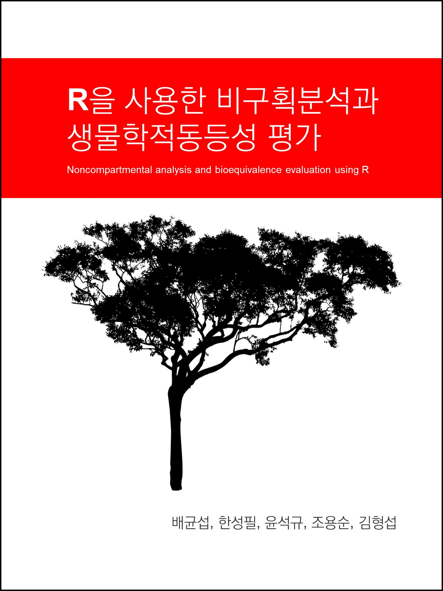

# 신약개발을 위한 실전 약동학 I (기본원리와 자료해석)

**Phamacokinetics for pharmaceutical scientists**

## 도서

신약개발에 종사하는 연구자라면 반드시 알아야 하는 약동학 이론을 습득하고 실습을 통해 실전 지식을 갖출 수 있도록 짜여져 있습니다.

## 목차

1. 약동학 이론
    - 약동학 이론
    - ADME와 약동학
    - 약물 분포 모델과 분포용적
    - 청소율의 개념과 적용
    - 다회투여 PK와 최종반감기
    - 정맥주입과 경구투여 PK의 비교
    - 비선형PK
    - 맺음말
2. 비구획 분석의 이론
    - 비구획분석의 기본 개념과 관심사
    - 비구획분석에서 산출하는 약동학 파라미터
    - 비구획분석에서 추정하는 약동학 파라미터
    - 비구획분석의 개념 확장 - 약물 분포와 반복 투여
    - 맺음말
3. 비구획 분석의 자료해석
    - 상용 소프트웨어를 이용한 비구획 분석 개론
    - 비구획분석에 활용할 수 있는 R package 소개
    - 비구획분석을 위한 데이터셋의 작성
    - R을 이용한 비구획분석 실제 1
    - R을 이용한 비구획분석 실제 2
    - Phoenix WinNonlin을 이용한 비구획분석 실제
    - 비구획분석 보고서
    - 맺음말
4. 구획 분석의 이론
    - 구획분석의 개념 
    - 구획모델이 필요한 이유
    - 구획모델 파라미터들의 의미와 주의점
    - 맺음말
5. 구획 분석의 자료해석
    - 상용 소프트웨어를 이용한 구획 분석 개론
    - 구획분석에 활용할 수 있는 R package 소개
    - 구획분석을 위한 데이터셋의 작성
    - 1구획모델을 이용한 정맥주사 후 약동학 자료 분석 1
    - 1구획모델을 이용한 정맥주사 후 약동학 자료 분석 2
    - 1구획모델을 이용한 경구투여 후 약동학 자료 분석 1
    - 1구획모델을 이용한 경구투여 후 약동학 자료 분석 2
    - 2구획모델을 이용한 약동학 자료 분석
    - 맺음말
    
## 저자 소개

임동석, MD, PhD  
가톨릭의대 약리학교실

한승훈, MD, PhD  
가톨릭의대 약리학교실

한성필, MD, PhD   
가톨릭의대 약리학교실

## PIPET

> 가톨릭계량약리학연구소, Pharmacometrics Institute for Practical Education & Training

임상약리학의 중추적 영역인 계량약리학(Pharmacometrics) 분야를 주요 연구 주제로 하는 우리나라 최초의 연구소로 2014년 개소하였습니다.
가톨릭의대 약리학교실 소속의 임상약리학 분야 교수진은 이전에도 다수의 계량약리학 관련 연구 및 산학연계 프로젝트 등을 수행하고 있지만, 국내 신약 개발 산업 확대, 임상 상황에서 개인별 약물요법의 중요성 증대 등 급증하는 계량약리학 수요에 부응하고자, 보다 선진적인 서비스 제공 및 신뢰성 있는 전문가 양성이라는 목적으로 PIPET을 설립하게 되었습니다.

현재 PIPET은 계량약리학 연구 방법론 개선, 선진 계량약리학 기법 도입, 사용자 친화적 계량약리학 소프트웨어 개발, 신약 개발 및 임상 상황에서 약물 요법에 대한 정량적 근거 마련 등의 업무를 수행하고 있으며, 학위 과정, 제약사 인력 교육 프로그램, 주기적 계량약리학 워크샵 개최 등을 통해 전문가를 적극 양성하고 있습니다.

또한, 서울성모병원 임상약리과와 함께 데이터 확보와 해석이 동시에 이루어질 수 있는 효율적인 연구 체계를 구축하고 있으며, 이를 기반으로 국내 신약 연구 및 약물요법 개선을 위해 노력하고 있습니다.

## Author Guidelines

### 편집 관련

1. Rmarkdown (`*.Rmd`) 형식으로 원고를 작성합니다. `01.Rmd`, `02.Rmd`, `03.Rmd` 등으로 파일 이름을 작성합니다.
    - 마이크로소프트 워드를 사용할 수도 있으나 pandoc을 사용하여 변환하는 과정을 거쳐야 하므로 피치 못할 경우에 사용한다.
2. 그림 파일은 파워포인트로 작업하여 pdf 형태로 저장하는 것을 우선시 합니다.
    - 폰트는 Arial, 나눔고딕을 선호합니다.
3. 표 파일은 엑셀로 작업하여 csv 형태로 저장하는 것을 우선시 합니다.
    - 복잡한 표 형태에 대해서는 `kableExtra` 패키지를 사용해야 합니다.
    - 예: 표에서 Footnote 사용: 03.Rmd

### Adobe Acrobat Pro DC를 통한 부크크 전달 파일 생성

- LaTeX krantz.cls를 통해 제작된 pdf 파일의 크기는 A4입니다. 
- Trim Mark 등을 제거하고, A5 (`148 x 210 mm`, 148/210 = 0.705) 와 같은 비율을 얻어야 합니다.
- 이를 위해 `177 x 252 mm`, 177/252=0.702의 Adobe Acrobat DC (접속정보: cmccpt@catholic.ac.kr / P****7***!)을 사용합니다.
- Crop margin - final : 14 31 13 20mm (홀) 14 31 20 13mm (짝) 각각 전체 페이지에 적용합니다.
- (부크크용 PDF 제작시에만 적용) 이후 A5 용지로 PDF 프린트 하며, 80% 비율로 프린트 한다.

## Cover 제작용 비율 

```r
(back <- 9.525) # 150 페이지
(width <- 3+100+148+back+148+100+3)
(height <- 3+210+3)

(width <- 3+100+148+back+148+100+3)
# [1] 518.235
(height <- 3+210+3)
# [1] 216
width/height
# [1] 2.399236
```

