**Edison을 통한 비선형 약동학 회귀분석과 simulation.**

abstract: 약동/약력학 분석을 위해서 약 30년 전부터 비선형
회귀분석(Nonlinear regression analysis)이 오래전부터 사용되어 왔다. 주로
NONMEM^®^ 이라고 하는 소프트웨어를 통해 활용되었으나, 이번 경진대회를
통해 비선형 회귀분석(Nonlinear regression analysis)방법을 Edison
system에 적용하여 여러 약동학 상황에서의 데이터에 대한 분석을
실시하였다. 각각의 데이터에 대해 Edison 엡 내에서, 비선형
회귀분석(Nonlinear regression analysis)을 사용할 수 있음을 확인하였다.
이번에 분석한 약동학 모형 이외에 다양한 약동학적 모형에 대한 비선형
회귀분석(Nonlinear regression analysis)을 통한 모델링을 Edison system
안에서 구현하고 활용할 수 있을 것으로 기대된다.

**Introduction**

약동/약력학 분석을 위해서 약 30년 전부터 비선형 회귀분석(Nonlinear
regression analysis)이 사용 되어 왔고 현재 이 방식은 집당 약동/약력학
분석에서 가장 필수적인 플랫폼으로 자리 잡은 상태이다. 이 때 Phoenix
WNL^®^과 같은 여러가지 소프트웨어들이 사용되고 있지만, 현재 이 비선형
회귀분석(Nonlinear regression analysis)을 적용시키기 위한 가장
널리쓰이는 도구는 NONMEM^®^이라고 하는 소프트웨어이다. 이것은 FORTRAN
코드로 프로그램 되었으며 현재 버전 7.4까지 지속적으로 업데이트 되고 있는
소프트웨어로, 현재 계량약리학 분야에서 가장 표준적인 도구로 생각되고
있다. 하지만 NONMEM^®^ software는 정기적으로 사용하기 위해 상당부분의
비용을 지불하여야 하며, 일반인들에게 접근이 쉽지 않았다는 단점을 가지고
있다. 따라서 아산병원 임상약리학과는 여러 패키지들을 R^®^이라는 무료
배포 소프트 웨어(R^®^은 통계 및 수학적 계산에 적합한 소프트 웨어 이며
간단하지만 견고한 시스템을 가지고 있다. 이때 다양한 패키지를 추가하여
특정 문제나 상황에 적합한 계산을 수행할 수 있으며, 이러한 R^®^의 표준
기능은 모두 R^®^ 언어로 코딩되어 있기 때문에, 그들의 알고리즘의 흐름을
쉽게 따라갈 수 있도록 한다.)에 등록하였으며, 이를 통해 비선형 회귀 분석
방법(Nonlinear regression)을 사용하여 다양한 약동/약력학 분석을 진행 할
수 있게 되었다. 이번 논문에서는 생성한 Package의 원리를 설명하며 이
package를 통해 시행한 다양한 약동학 모델을 실제 에디슨을 통해 시행
결과를 보여주려고 한다.

**NONMEM^®^ software의 비선형 회귀 분석**

NONMEM**^®^**의 경우 비선형 회귀분석(Nonlinear regression analysis)을
시행하기 위해서 최대 우도 추정법(Maximum likelihood estimation)을
활용하게 된다. 이 최대 우도 추정법은 sample데이터에서 Y가 현재 측정된
값, E(Y)는 model에 의해 각각의 관측 지점에서의 예상되는 값 그리고 V(Y)를
그 모델의 분산이라고 표현하면 모델에 주어진 관측값에 대한 likelihood는
다음과 같이 표현될 수있다.

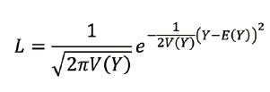

이때 이 일련의 관찰 값에 대한 우도는 개개인 관찰값의 확률을 통해 나오게
된다. 따라서 n개의 관찰값이 있으면 그 종합된 우도는 n개의 개개인별
확률이 되고 subject에 대한 우도는 다음과 같이 계산된다.

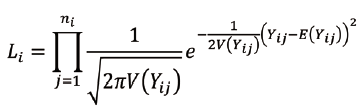{width="2.8703707349081364in"
height="0.8981485126859142in"}

이것은 -2 로그 우도로(-2 log likelihood) 전환 될 수 있으며, 이것은
다음과 같이 표현된다.

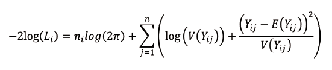{width="3.0185181539807524in"
height="0.9629625984251968in"}

결국 NONMEM은 이 -2 로그 우도의 값을 최소화 하는 방식으로 표현된다. 이
때, 우측 수식에서 앞에있는 n~i~log(2π)는 상수이기 때문에 실제 I번째
대상에서의 objection function은 다음과 같이 나타난다.

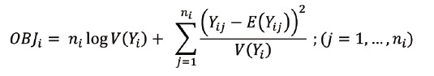{width="2.9907403762029747in"
height="0.7841469816272966in"}

실제 여기에서 derivation 을 정규 분포에만 적용한 것이 최대 우도 측정법
(maximum likelihood estimation method)라면, 정규 분포라는 가정 없이도
적용한 것이 NONMEM 소프트 웨어 이며 이 방식을 '확장된 최소
제곱법'(extended least square method)이라고 한다. 이번 Edison
system에서는 NONMEM^®^ 의 확장된 최소 제곱법을 적용한 'nlr' function을
사용하였다.

지금까지는 Edison에 NONMEM의 비선형 회귀분석(Nonlinear regression
analysis)을 설명하기 위한 이론적 배경이었으며, 이제 각각의 예제들을 통해
실제 계산결과가 Edison을 통해 어떻게 도출되는지를 확인해 보도록 하겠다.

**Method**

이번 Edison 과제를 통해 NONMEM을 Edison에 적용하기 위해서 두가지
package를 적용하였는데 이 중 하나는 'deSolve' 이며 이것은 Karline
Soetaert, Thomas Petzoldt, R. Woodrow Setzer가 만든 여러 종류의 미분
방적식을 구하기 위한 package이다. Edison에 적용한 미분 방적식은
lsoda라는 function으로 편미분 기호가 들어간 ordinary differential
equation을 사용할 수 있도록 도와주는 기능이다. 이는 실제 NONMEM에서
advan13을 적용하는 것과 같다. 또 다른 하나는 \'Pharmacokinetic and
Pharmacodynamic Data Analysis - Concepts and Applications\'의 다양한
식들에 대해서 NONMEM과 같이 minimization을 실행하기 위해 만든
'wnl'이라는 package이다. 우리가 NONMEM을 통해서 rout finding으로 근을
찾는 것이 중요한 역할이다.

그 역할로 OFV minimization을 해주는 것이 바로 wnl에서 'nlr' function혹은
최소 제곱법(least square method)을 활용하게 되는 'wnl' function이다.
(최대 우도 측정법 (maximum likelihood estimation method)은 점 추정치를
찾는데까지는 오래 걸리나, 표준 오차(standard error of estimates)를
구하는게 유리하며, 실제로도 최근에는 최소 제곱법(Least square method)
보다 널리 쓰이고 있다.)

Fig1.은 실제 package ('deSolve','wnl')를 우리가 원하는 모델에 사용하기
위해 script를 입력한 것이다. 여기서 THETA\[1\], THETA\[2\], THETA\[3\]는
각각 파라미터 중 K(제거 속도 상수), K~a~(흡수 속도 상수), V(부피)를
의미한다. 또한 실제우리가 구하고자 하는 구조모형(예시로 든 모델은
One-compartment oral dosing을 계산하기 위한 equation으로 이미 prediction
안에 식이 내장되어 있다.)을 기본적으로 내장되 있지 않을경우 입력해 주게
된다. 입력된 equation을 대입해, 다시 농도값을 계산해 주며, 이를 통해
각각의 prediction이 진행되는 것이다.

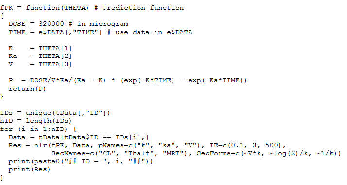{width="2.975in"
height="1.5833333333333333in"}**Fig1. 약동학 분석을 위해 입력된
스크립트의 예시.**

Subject군이 여러명일 경우 각각의 대상자의 값을 모두 구하기 위해서 for
loop라는 function을 다음과 같이 사용하게 된다.

각각의 nonlinear regression을 위해서 theta에 대한 initial value를
넣어주고. minimization이 된 후 위에서 언급된 파라미터 이외에 다른
파라미터에 대해서도 값을 구하기 위해서 다음과 같이 (CL(제거 속도),
T~half~(반감기), MRT(평균 체류 시간)) 추가적으로 넣어준 후, 입력한
파라미터값들을 구하기 위한 수식을 뒤쪽 부분'SecForms'란에 입력하게 된다.
이런 방법을 통하여 우리가 원하는 파라미터들의 점추정치와(point
estimate), 그리고 표준 오차(standard error of estimates)를 모두 구해 줄
수있다.

각 모델에 맞는 적합한 모델에 따라 다음과 같은 script 형태로 입력해 주게
되며, 그에 대한 표준 오차(standard error of estimates), 공분산
행렬(covariance matrix of estimates), run test results on residuals,
AIC, AICc, SBC를 내부 계산을 통하여 도출하게 된다.

이때 run test란 residual들이 random하게 분포하는지를 보기 위해서 각각의
residual에서 최대 양수와 음수가 연속구간의 길이가 얼마나 되는지를 보는
방법이다. 이 때 계산된 p vaue를 통해서 실제로 residual이 random하게
분포하는지, 편향되게 분포하는지를 고려해 볼 수 있다.

AIC, AICc, SBC는 Akaike information criterion, Akaike information
criterion corrected, Schwarz criterion을 의미하며 각각의 통계적 모델에서
구조가 적합한지를 확인할수 있도록 도와주는 지표이다.

이번 프로그램을 통해, 실제 minimization을 실시할 뿐만 아니라, 실제로
모델이 적합한지에 대해서 모두 확인해 볼 수 있게 구현하였다. 다음부터는
각각의 3개의 모델에 대해서 실제로 Edison system을 보고자 한다.

**Example1.One compartment oral dosing**

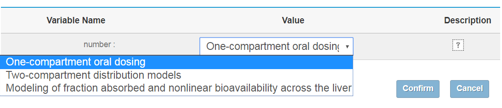{width="2.6333333333333333in"
height="1.4833333333333334in"}

**Fig2. Edison을 통한 'One-compartment oral dosing' Simulation생성.**

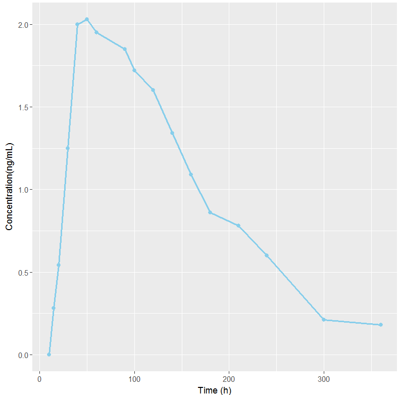{width="2.8044564741907263in"
height="2.7685181539807524in"}

**Fig3. 'One-compartment oral dosing analysis'에 사용된 데이터의
time-concontration profile.**

경구 복용시 1차 지수로 감소하는 약물에서의 약동학 모형이다. 이 경우에는
'wnl'패키지안에 기본적 equation이 정의되어 있으므로 추가적인 equation을
입력하지 않고 각각의 파라미터의 값에 해당하는 theta에 대해서만
입력하였다. (값을 구하기 위해 필요한 theta는 K(제거 속도 상수),
K~a~(흡수 속도 상수), V(부피), t~lag~(흡수가 지연되는 시간)이다.) 또한
추가적으로 F(생체 이용률) 값을 구하기 위해 다음과 같이 식으로
표시하였으며, 이중에서 지연 시간(Lag time)이 있는지 없는지를 각각
가정하여 Fig5, Fig6와 같이 function을 정의 하였다.

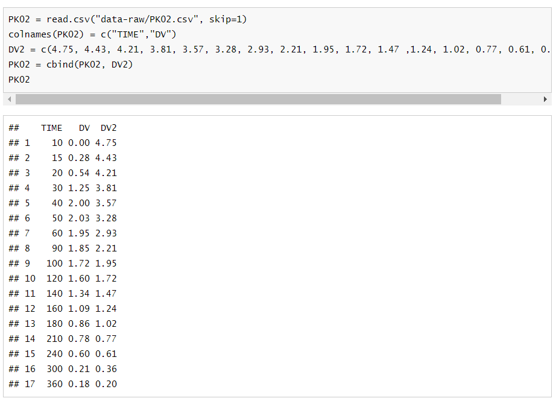{width="3.175353237095363in" height="2.2916666666666665in"}

**Fig4. 'One-compartment oral dosing analysis' 를 적용하기 위해 사용된
데이터.**

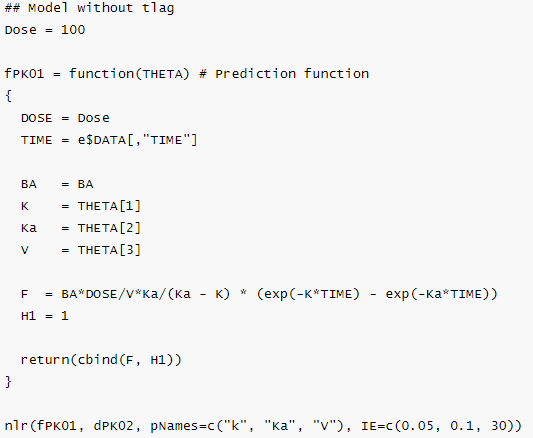{width="2.98125in"height="2.453472222222222in"}

**Fig5 'One-compartment oral dosing analysis'를 계산하기 위한
스크립트.(without lag time)**

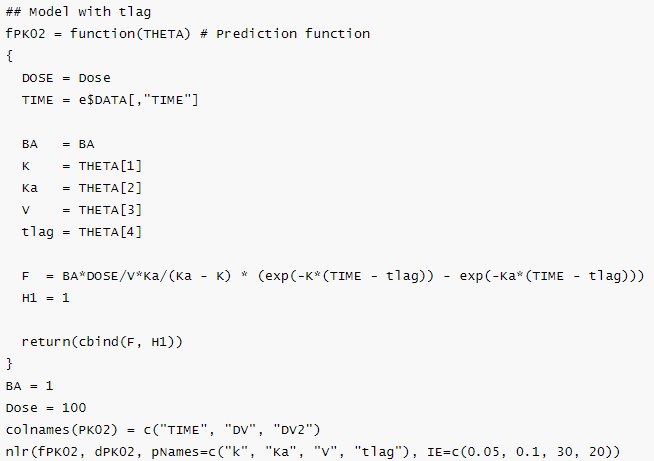{width="2.98125in"
height="2.1020833333333333in"}

**Fig6. 'One-compartment oral dosing analysis'를 계산하기 위한 스크립트.
(with lag time)**

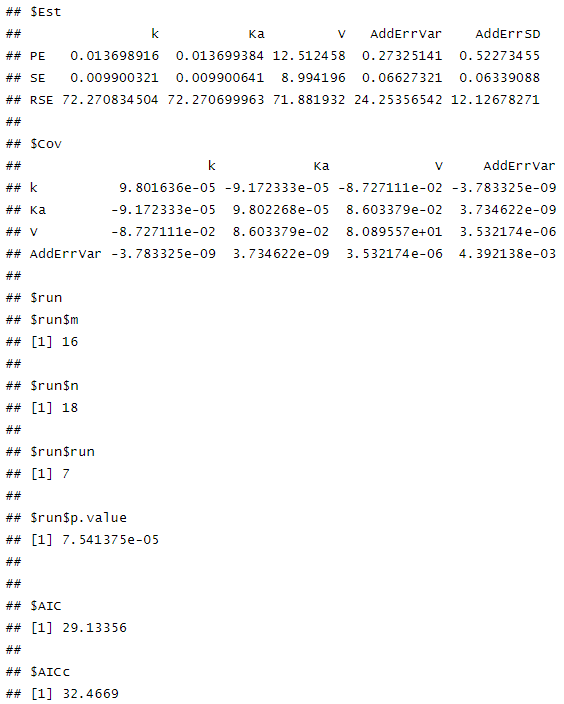{width="2.98125in"
height="3.7222222222222223in"}

**Fig7. Lag time이 없는 'One-compartment orad dosing model'을 'nlr'
function을 통해 계산했을시의 결과 값.**

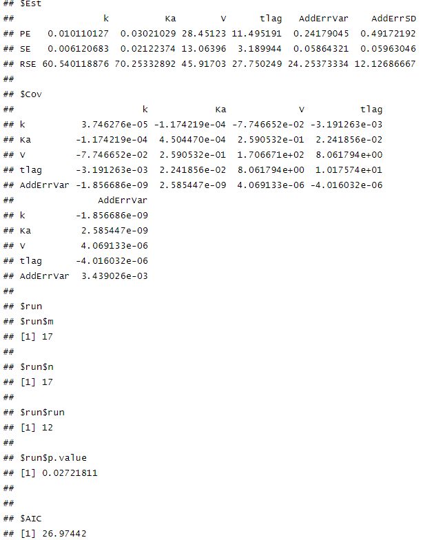{width="2.98125in"
height="3.8055555555555554in"}

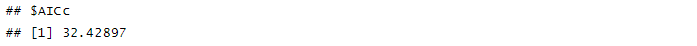{width="3.043307086614173in"
height="0.2008497375328084in"}

**Fig8. Lag time이 있는 'One-compartment orad dosing model'을 'nlr'
function을 통해 계산했을시의 결과 값**

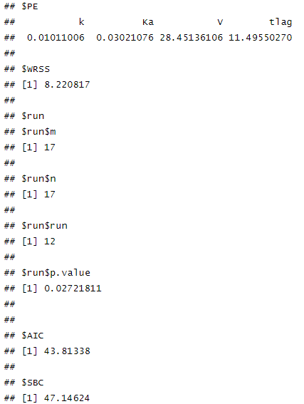{width="2.98125in"
height="3.9631944444444445in"}

**Fig9. Lag time이 있는 'One-compartment orad dosing model'을 'wnl'
function을 통해 계산했을시의 결과 값.**

값을 계산할시 다음과 같이(Fig7, Fig8, Fig9) 각각 파라미터 값들이(K,
K~a~, V, t~Lag~) 출력되는 것을 확인해 볼 수 있었으며, 이때
run\$p.value와 AIC를 통해서 실제 적절한 모델인지를 확인해 볼 수 있었다.
이번 example에서는 run test를 통해 구한 p.value가 0.05이하(0.027)로
계산되어, residual들이 치우쳐 있으며 모델의 개선이 필요하다는 것을
확인할 수 있었다. 또한 'wnl' function과 'nlr' function의 차이에서 보이듯
최대 우도 측정법(maximum likelihood method) 에서는 표준 오차(standard
error of estimates)가 출력되는 것을 확인해 볼 수있었지만, 최소
제곱법(least square method)에서는 표준 오차(standard error of
estimates)가 표시되지 않는 것을 볼 수 있었다.

**Example2. Two-compartment distribution models**

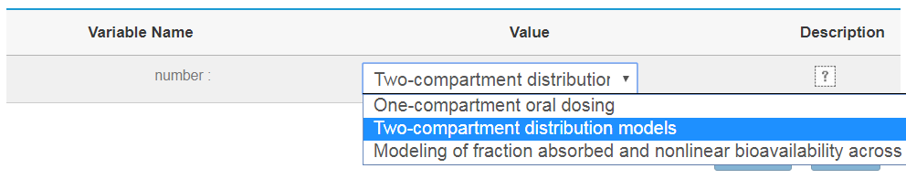{width="3.043307086614173in"
height="0.602995406824147in"}

**Fig10. Edison을 통한 'Two-compartment distribution models'
simulation을 생성.**

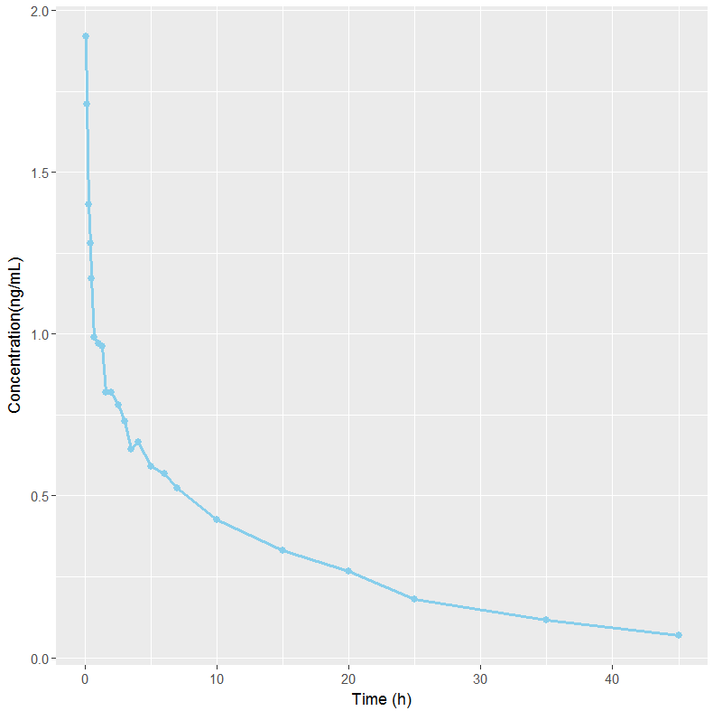{width="2.9805555555555556in"
height="2.9743055555555555in"}

**Fig11. 'Two-compartment distribution analysis'에 사용된 데이터의
time-concontration profile.**

2차 지수로 감소하는 약물에서의 약동학 모형이여,이때의 농도 값(C~p~)을
구하기 위한 공식은 다음과 같이 정해진다.

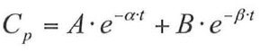{width="2.410416666666667in"
height="0.48055555555555557in"}

따라서 다음과 같이 Script에 'Cp = A\*exp(-alpha\*TIME) +
B\*exp(-beta\*TIME)' 식을 표시하였으며, 이 식을 구하기 위해 각각의
'A','alpha','B,'beta'에 해당하는 값을 입력하였다. (Fig13)

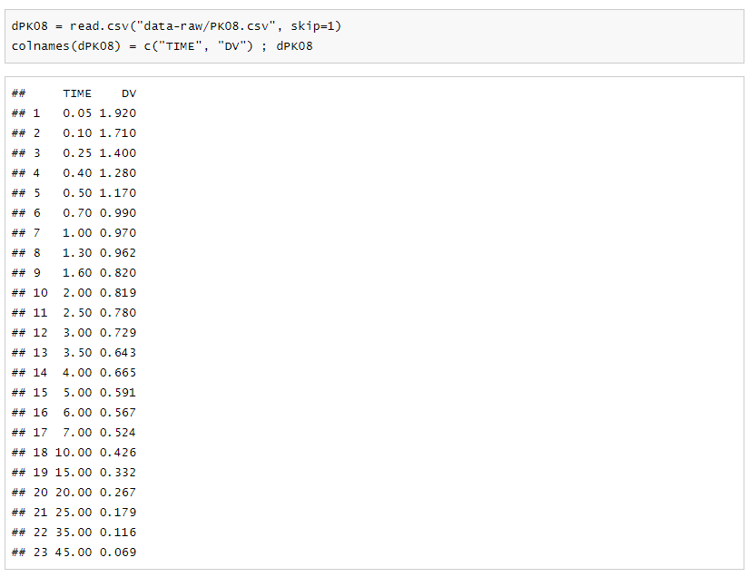{width="3.043307086614173in"
height="2.3431846019247593in"}

**Fig12. 'Two-compartment distribution analysis'를 적용하기 위해 사용된
데이터.**

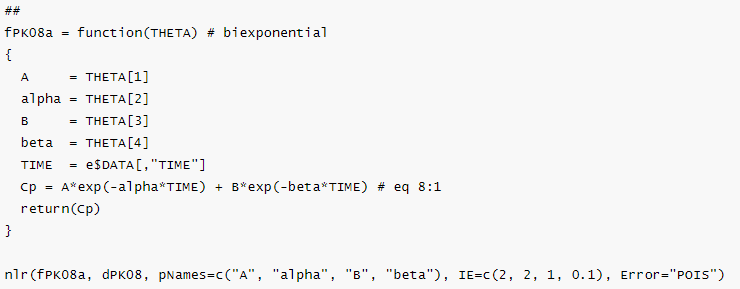{width="3.043307086614173in"
height="1.1885345581802276in"}

**Fig13. 'Two-compartment distribution analysis'를 계산하기 위한
스크립트.**

값을 계산할시 다음과 같이(Fig14, Fig15) 값이 출력되는 것을 확인해 볼 수
있었으며, run test의 p-value가 0.05이하로(0.017), residual들이
유의미하게 편향되어 있고, 모델의 개선이 좀 더 필요함을 확인해 볼 수
있었다. Example 1과 마찬가지로 보이듯 최대 우도 측정법(maximum
likelihood method) 에서는 표준 오차(standard error of estimates)가
출력되는 것을 확인해 볼 수있었지만, 최소 제곱법(least square
method)에서는 표준 오차(standard error of estimates)가 표시되지 않는
것을 볼 수 있었다.

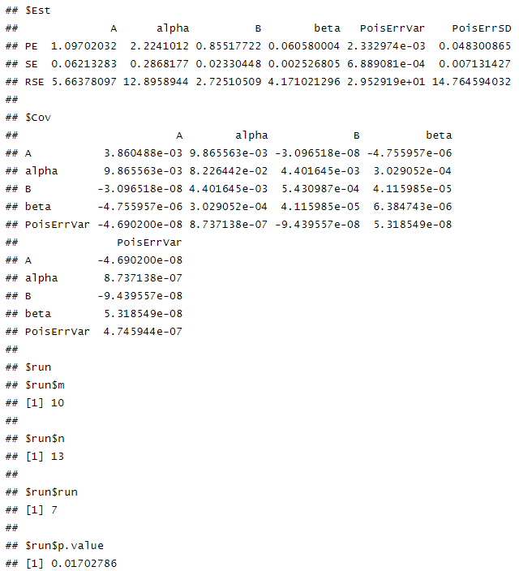{width="3.043307086614173in"
height="3.3476377952755905in"}

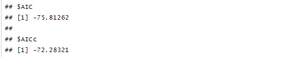{width="3.043307086614173in"
height="0.5953182414698163in"}

**Fig14. 'Two-compartment distribution model'을 nlr function을 통해
계산했을시의 결과 값.**

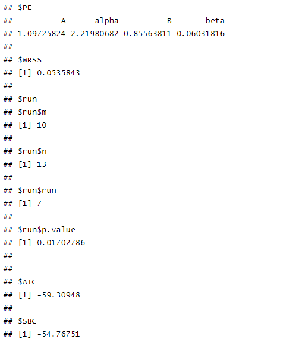{width="3.043307086614173in"
height="3.5556692913385826in"}

**Fig15. 'Two-compartment distribution model'을 wnl function을 통해
계산했을시의 결과 값.**

**\
Example 3 'fraction absorbed and nonlinear bioavailability across the
liver' model**

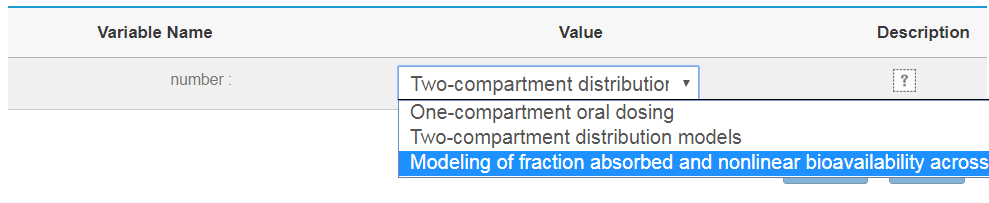{width="3.043307086614173in"
height="0.6232305336832896in"}

**Fig16. Edison을 통한 'fraction absorbed and nonlinear bioavailability
across the liver' simulation을 생성.**

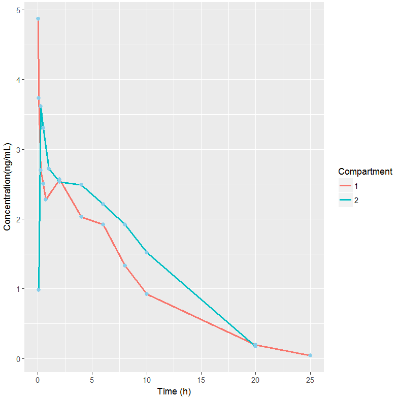{width="2.9805555555555556in"
height="2.9743055555555555in"}

**Fig17. 'fraction absorbed and nonlinear bioavailability across the
liver analysis'에 사용된 데이터의 time-concontration profile.**

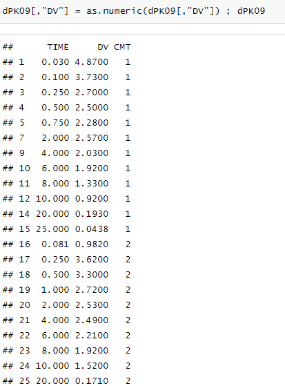{width="3.043307086614173in"
height="4.119149168853894in"}

**Fig18. 'fraction absorbed and nonlinear bioavailability across the
liver analysis'를 적용하기 위해 사용된 데이터**

간을 통해 대사되는 비선형적 특성을 띄는 약물에서의 약동학 모형이여, 이
때에는 좀 더 복잡한 equation들을 다수 활용하기 위하여 function을 통해서
각각 compartment에서의 농도를 구하기 위한equation을 정의해 주었다. 이를
통하여, 'absorption compartment', 'central compartment', 'gut
compartment, 'hepatic compartment'에서의 각각 equation을 입력하였으며,
Fig19. 와 같이 표현되었다.

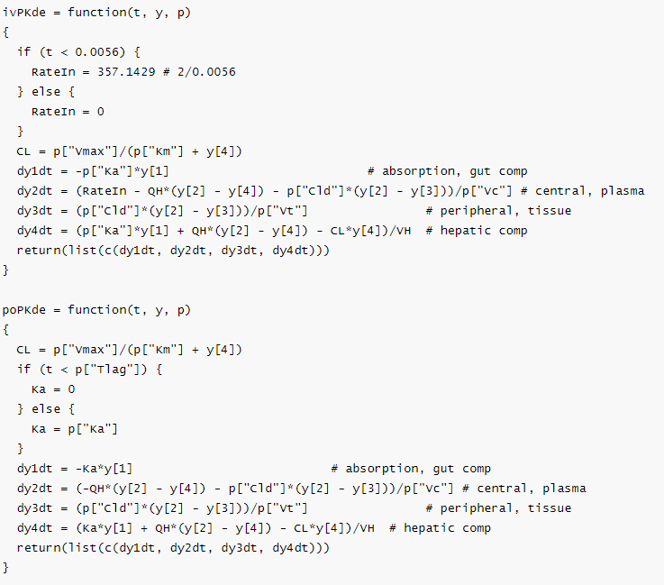{width="3.047244094488189in"
height="2.68339457567804in"}

**Fig19. 'fraction absorbed and nonlinear bioavailability across the
liver model'을 계산하기 위한 스크립트1.**

위의 식을 활용해 'wnl'package의 'nlr' funcion을 활용하여 equation에
필요한 theta값들(K~a~(흡수 속도 상수),V~c~(중심 구획의 부피),
V~t~(조직에서의 부피), V~max~(최대 대사 속도), Cl~d~(구획 간 분포))을
정의해 주고 지정한 후, 관련된 초기 추정값을(IE) 입력하였다.

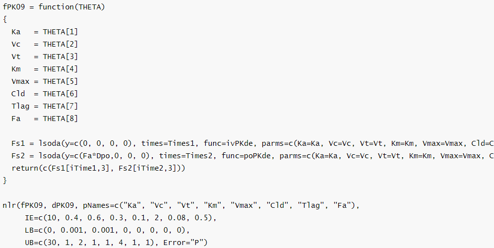{width="2.9833333333333334in"
height="1.4916666666666667in"}

**Fig20. 'fraction absorbed and nonlinear bioavailability across the
liver model'을 계산하기 위한 스크립트2.**

다음과 같이(Fig21, Fig22) 파라미터의 값과 표준 오차(standard error of
estimates)가 출력되는 되는 것을 확인하였다. 이 때 run test의 residual
error가 한쪽으로 유의미하게 치우쳐 있지 않음을 확인해 볼 수 있었다.

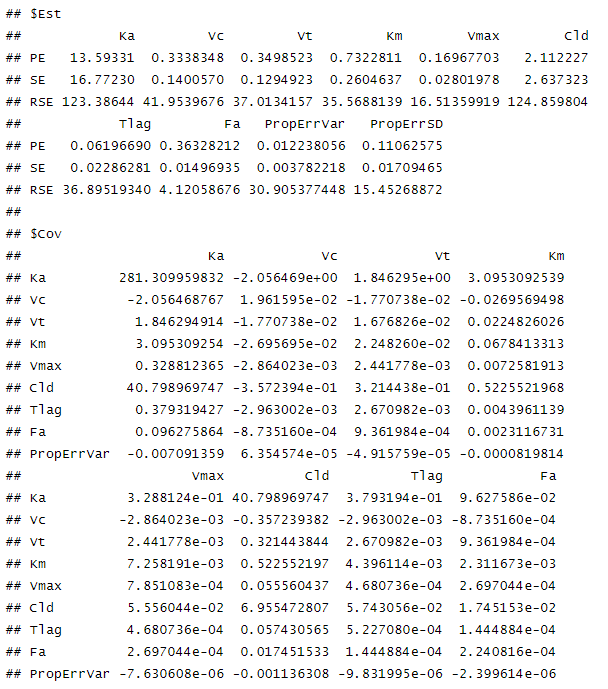{width="3.047244094488189in"
height="3.4532086614173227in"}

**Fig21. 'fraction absorbed and nonlinear bioavailability across the
liver model'을 nlr function을 통해 계산했을시의 결과 값.**

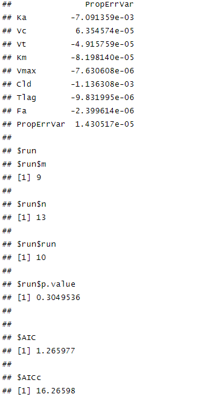{width="2.643011811023622in"
height="5.1987182852143485in"}

**Fig22. 'fraction absorbed and nonlinear bioavailability across the
liver model'을 wnl function을 통해 계산했을시의 결과 값**

**Conclusion.**

비선형 회귀분석(Nonlinear regression analysis)은 대상자의 인구
집단에서의 측정되는 데이터를 설명하는데 사용하며, 실제 약물을 분석하는데
가장 중요한 방법 중 하나로 생각되고 있다. 이중 NONMEM^®^이라는
software는 다양한 산업과 학문에서 가장 많이 사용되는 표준으로 생각되고
있다. 하지만 실제 NONMEM^®^ software는 다루는데 있어서 어려운 부분들이
있을뿐만 아니라, 일반 사람들이 적용하기에는 어렵다는 단점을 가지고 있다.
위와같이 다양한 약동학 모델들을 통해, NONMEM^®^ software의 기능을
Edison에 적용시킬 수 있다는 것을 확인하였다. 아직까지는 좀 더 복잡한
모델들을 적용시키지는 못했다는 한계가 있으나, 이러한 비선형
회귀분석(Nonlinear regression analysis)을 Eddsion에 적용할 수 있다는
점만으로도 상당히 의미 있는 결과라고 생각된다. 남은 Edison 기간 동안
현재 약물 농도를 분석하기 위한 다양한 약동/약력학 모델을 update할 수
있을 것으로 보이며, 이를 통해 좀 더 다양한 데이터들에 대해 Edison을
적용하고 이를 통해, 더 많은 사람들이 이러한 비선형 회귀분석(Nonlinear
regression analysis)에 대해서 이해할 수 있을 것이라 기대한다.

**감사의 글**

본 논문은 2017년도 정부(미래창조과학부)의 재원으로 한국연구재단 첨단
사이언스·교육 허브 개발 사업의 지원을 받아 수행된
연구임(NRF-2011-0020576)

**[참고문헌]{.smallcaps}**

\[1\] R-based reproduction of the estimation process hidden behind
NONMEM® Part 1: first-order approximation method, Min-Gul Kim1,
Dong-Seok Yim2 and Kyun-Seop Bae3,4\*, 2015;23(1):01-07

# \[2\] [Hadley Wickham](https://www.amazon.com/Hadley-Wickham/e/B002BOA9GI/ref=dp_byline_cont_book_1), Advanced R (Chapman & Hall/CRC The R Series) 1st Ed ,25 sep 2014

\[3\] Gabrielsson J and Weiner D. Pharmacokinetic and Pharmacodynamic
Data Analysis - Concepts and Applications. 5th ed. 2016.
(ISBN:9198299107).

\[4\] http://www.edison.re.kr. EDISON 웹사이트.
