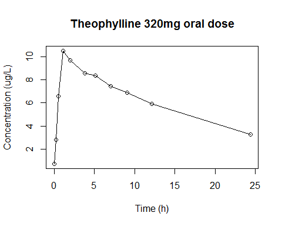

## Introduction

First, we may need to understand why noncompartmental analysis matters
in drug development. Considering physiological responses of the body to
an exogenously administered drug, such as transfers or chemical
conversions, compartment models have been developed and proven to be
useful in many applications. Thus, compartmental analysis requires
assumptions for transfers (absorption, distribution or excretion) or
chemical conversions (metabolism) to describe compartments, e.g.,
complete absorption or instantaneous distribution for intravenous bolus
administration, etc. Compartment is a hypothetical space in which a drug
is assumed to be distributed instantaneously and homogenously. Such
assumptions can be unrealistic sometimes and results from compartmental
analysis could vary from analyst to analyst depending on what
assumptions are made Therefore, sometimes the objectiveness or validity
is suspected. Whereas, noncompartmental analysis does not require
assumptions for specific compartmental model for either drug or
metabolite and thus is relatively independent of subjective decisions of
an analyst. Therefore, this is used for regulatory purposes where
determination of the degree of exposure following administration of a
drug is the primary concern, while compartmental analysis is preferred
in educational settings either in industry or academia.

A comprehensive list for the outputs of a noncompartmental analysis is
summarized in table 1. The methods how to calculate those output
variables will be explained in each designated section below. All of the
concentrations are supposed to be positive real values.

CDISC code values are used in the PP domain PPTESTCD column which is
restricted to be equal or less than eight characters long.

## Individual NCA parameters

### Preparation

This is just for the prepartion of data for the subsequent R scripts.

    Adm = c("BOLUS", "INFUSION", "EXTRAVASCULAR")[3] # Drug Administration Method
    Dose = 320 # mg
    x = x0 = Theoph[Theoph$Subject==1, "Time"] # h
    y = y0 = Theoph[Theoph$Subject==1, "conc"] # ug/L

    # For the calculation of AUClast
    iLastNonZero = max(which(y > 0)) # index of last non-zero concentration
    x1 = x0[1:iLastNonZero]
    y1 = y0[1:iLastNonZero]

    # For the log-concentration vs. time regression
    x2 = x0[y0 > 0]
    y2 = y0[y0 > 0]

    # Print data
    cbind(Time=x0, Conc=y0)
    ##        Time  Conc
    ##  [1,]  0.00  0.74
    ##  [2,]  0.25  2.84
    ##  [3,]  0.57  6.57
    ##  [4,]  1.12 10.50
    ##  [5,]  2.02  9.66
    ##  [6,]  3.82  8.58
    ##  [7,]  5.10  8.36
    ##  [8,]  7.03  7.47
    ##  [9,]  9.05  6.89
    ## [10,] 12.12  5.94
    ## [11,] 24.37  3.28

### Plot of raw data

{width="5.0526312335958in"
height="4.0421052055993in"}

### Cmax (CMAX)

Maximum Concentration. Cmax is the peak (maximum) concentration
following administration of a drug, presumably occurring at Tmax.
Depending on the blood sampling schedule (sampling time interval), this
may or may not reflect close enough to the true maximum concentration.

    CMAX = max(y)
    CMAX
    ## [1] 10.5

### Cmax_D (CMAXD)

Dose normalized Cmax. Cmax divided by the dose. Dose should be the total
dose amount given to the subject, not the dose per body weight (i. e.,
mg not mg/kg).

    CMAXD = NA
    if (Dose > 0) CMAXD = CMAX/Dose
    CMAXD
    ## [1] 0.0328125

### Tmax (TMAX)

Tmax. Tmax is a time when the rate of rate of elimination equals the
rate of absorption; the concentration is at is maximum (Cmax). If there
are multiple peak concentrations in the given data, the first time point
is chosen.

    TMAX = NA
    if (CMAX > 0) TMAX = x[which.max(y)]
    TMAX
    ## [1] 1.12

### Tlag (TLAG)

Time Until First Nonzero Concentration. Lag time tells the time delay
between drug administration and the beginning of absorption. When a
rapid onset is desirable, Tlag can tell us about candidacy of the drug
for the purpose. Generally, it is the last observed time point prior to
the first positive concentration measurement following extravascular
administration.

    TLAG = NA
    if (CMAX > 0) TLAG = x[max(1, min(which(y > 0)) - 1)]
    TLAG
    ## [1] 0

### Clast (CLST)

The last positive value of concentration measurement. This is used for
extrapolation for AUCinfinity.

    CLST = y[iLastNonZero]
    CLST
    ## [1] 3.28

### Tlast (TLST)

Time of Last Nonzero Concentration. The time point when the last
positive value of concentration is measured (Time for Clast).

    TLST = x[iLastNonZero]
    TLST
    ## [1] 24.37

### Rsq (R2)

R-squared. A statistical measure goodness-of-fit which tells you how
close the log-transformed observed concentrations versus time data are
to the fitted regression line. R-squared, however, cannot determine a
bias so you should check residual plots as well. Rsq is the square of
correlation coefficient (r) in the linear regression utilized in the
noncompartmental analysis. Here are the R scripts to obtain a R-squared
of the regression.

### Rsq_adjusted (R2ADJ)

R Squared Adjusted. While searching the best-fit model, addition of data
points may increase R-squared without improving fit. Adjusted R-squared
, a modified R-squared that is adjusted for the number of predictors
(data points here), can be used instead as an unbiased estimator of
population R-squared. It is usually smaller than Rsq. The best-fit model
with slope and intercept parameters is chosen to maximize adjusted
R-squared with fewest number of data points. The formula is

$$R_{\text{adj}}^{2} = 1 - (1 - R^{2})\frac{n - 1}{n - 2}$$

### Corr_XY (CORRXY)

The correlation between time (X) and log concentration (Y) for the
points used in the estimation of lambda z. It is usually a negative
value. Higher correlation means less irregular concentrations and better
fitting. CORRXY can be obtained by the following R scripts.

### b0 (b0)

Intercept from the regression of log concentration versus time. This is
usually not printed in the output. It is used for the calculation of
CLSTP, but not for extrapolated C0 (concentration at time 0) in case of
an intravenous bolus injection.

### Lambda_z (LAMZ)

Lambda z. Terminal slope of the regression line of natural log
concentration versus time as a positive value. All zero values should be
removed temporarily before the regression because log transformation of
zero value results in negative infinity and makes the regression
impossible. If the terminal slope (from the last observed time point up
to at least three points) is automatically determined, the best slope is
the longest one within the tolerable limit (the default value is 1e-4)
from the maximum R2ADJ. For the extravascular dosing, the first time
point is later than TMAX. In this case, no positive concentration is
omitted for the regression. Zero concentrations are excluded during the
regression, but not for the AUC calculation.

### No_points_Lambda_z (LAMZNPT)

Number of Points for Lambda z. Number of time points used for the LAMZ
(terminal slope) calculation.

### Lambda_z\_lower (LAMZLL)

The lower limit on time for values to be included in the calculation of
Lambda z. The earliest time point used for the LAMZ (terminal slope)
calculation.

### Lambda_z\_upper (LAMZUL)

The upper limit on time for values to be included in the calculation of
Lambda z. The last time point used for the LAMZ (terminal slope)
calculation.

### Calculation of R2, R2ADJ, CORRXY, b0, LAMZ, LAMZNPT, LAMZLL, and LAMZUL

Only positive concentrations are used. In case of oral administration,
the first possible point is next to Tmax point. In case of intravascular
administration, the first point can be Tmax point. If the difference of
R2ADJ (R2-squared adjusted) is less than 1e-4, the longer slope is
chosen. Regression points should be at least 3.

    x = x2
    y = y2

    if (toupper(Adm) == "EXTRAVASCULAR") {
      iFirst = which.max(y) + 1 # for oral administration
    } else {
      iFirst = which.max(y)     # for intravenous administration
    }
    iLast = iLastNonZero

    ColNames = c("R2", "R2ADJ", "CORRXY", "b0", "LAMZ", "LAMZNPT", "LAMZLL", "LAMZUL")
    mRes = matrix(nrow = iLast - iFirst + 1 - 2, ncol=length(ColNames))
    colnames(mRes) = ColNames
    for (i in iFirst:(iLast - 2)) {
      Res = lm(log(y[i:iLast]) ~ x[i:iLast])
      mRes[i - iFirst + 1, "R2"]      = summary(Res)$r.squared
      mRes[i - iFirst + 1, "R2ADJ"]   = summary(Res)$adj.r.squared
      mRes[i - iFirst + 1, "CORRXY"]  = cor(log(y[i:iLast]), x[i:iLast])
      mRes[i - iFirst + 1, "b0"]      =  Res$coefficients[1]
      mRes[i - iFirst + 1, "LAMZ"]    = -Res$coefficients[2]
      mRes[i - iFirst + 1, "LAMZNPT"] = iLast - i + 1
      mRes[i - iFirst + 1, "LAMZLL"]  = x[i]
      mRes[i - iFirst + 1, "LAMZUL"]  = x[iLast]
    }
    mRes
    ##             R2     R2ADJ     CORRXY       b0       LAMZ LAMZNPT LAMZLL LAMZUL
    ## [1,] 0.9988013 0.9985615 -0.9994005 2.355187 0.04778625       7   2.02  24.37
    ## [2,] 0.9987305 0.9984131 -0.9993650 2.350845 0.04751440       6   3.82  24.37
    ## [3,] 0.9995671 0.9994229 -0.9997836 2.362429 0.04817356       5   5.10  24.37
    ## [4,] 0.9996109 0.9994164 -0.9998054 2.356834 0.04787556       4   7.03  24.37
    ## [5,] 0.9999997 0.9999995 -0.9999999 2.368785 0.04845700       3   9.05  24.37
    OKs = abs(max(mRes[,"R2ADJ"]) - mRes[,"R2ADJ"]) < 1e-4
    resNCA = as.data.frame(mRes[which(OKs)[1],,drop=FALSE])
    resNCA
    ##          R2     R2ADJ     CORRXY       b0     LAMZ LAMZNPT LAMZLL LAMZUL
    ## 1 0.9999997 0.9999995 -0.9999999 2.368785 0.048457       3   9.05  24.37
    attach(resNCA, warn.conflicts=FALSE)

If you want to manually omit some points, use an R package for
convenience.

### HL_Lambda_z (LAMZHL)

Terminal Half-life. Lambda Z (LAMZ) is the first order rate constant for
the terminal portion of the log concentration-time curve. An apparent
terminal half-life is calculated by ln(2)/LAMZ.

    LAMZHL = NA
    if (LAMZ > 0) LAMZHL = log(2)/LAMZ
    LAMZHL
    ## [1] 14.30438

### Clast_pred (CLSTP)

Linear regression is utilized to calculate elimination rate constants in
pharmacokinetics analysis and it estimates the slope, intercept and
R-squared for goodness of fit. In this package, calculations are carried
out by unweighted linear regression. CLSTP is the predicted
concentration at Tlast by the regression. This is not CDISC term nor
WinNonlin output. However, this is used for the calculation of AUCIFP,
AUCPEP, AUMCIFP, AUMCPEP, MRTIVIFP, MRTEVIFP, VZP, VZFP, CLP, CLFP, and
VSSP. The formula to obtain CLSTP is

$$C_{last,pred} = exp(\beta_{0} - \lambda \cdot T_{\text{last}})$$

    CLSTP = NA
    if (LAMZ > 0) CLSTP = exp(b0 - LAMZ*x[iLast])
    CLSTP
    ## [1] 3.280146

### C0 (C0)

Initial Concentration. Concentration at time 0, initial concentration.
If the first two concentrations are positive and the first one is
greater than the second one, C0 could be calculated as following.

$$C_{0} = exp(log(c_{1}) - t_{1}\frac{log(c_{2}) - log(c_{1})}{t_{2} - t_{1}})$$

Otherwise, C0 is the first positive concentration.

    x = x0
    y = y0
    if (toupper(Adm) == "BOLUS") {
      if (y[1] > y[2] & y[2] > 0) {
        C0 = exp(log(y[1]) - x[1]*(log(y[2]) - log(y[1]))/(x[2] - x[1]))
      } else {
        C0 = y[x==min(x[y > 0])]
      }
    } else {
      C0 = NA 
    }

For the calculation of C0, 0 and 1 from the regression are not used.
With bolus dose administration, C0 should be added at time 0 to
calculate AUC and AUMC. If the concentration at time 0 is missing with
extravascular dosing or infusion, zero concentration at time 0 should be
added as the first observation to calculate AUC and AUMC.

### AUClast (AUCLST)

Area under the time-concentration curve from dosing to the last positive
concentration. AUC from Dosing to Last Concentration. Area under the
concentration-time curve (AUC) from dosing to the last positive
concentration (Clast). Non-compartmental analysis calculates AUC by
summing up areas of under the concentration curve for each time segment,
while regression modeling uses a function with regression parameters.\
The most widely used computational method in NCA is the linear
trapezoidal rule ('linear-up, linear-down') or the log-linear
trapezoidal rule ('linear-up, log-down'). For linear trapezoidal method,

$$\text{AU}C_{\text{last}} = \sum_{i = 2}^{}\frac{(t_{i} - t_{i - 1}) \times (c_{i} - c_{i - 1})}{2}$$

    n = length(x1)
    AUCLST = sum((y1[-1] + y1[-n]) * (x1[-1] - x1[-n]))/2
    AUCLST
    ## [1] 148.923

For 'linear-up log-down' method,

    AUCLST = 0
    for (i in 2:n) {
      if (y1[i] < y1[i-1] & y1[i] > 0) {
        k = (log(y1[i - 1]) - log(y1[i]))/(x1[i] - x1[i - 1]) # slope in log
        AUCLST = AUCLST + (y1[i - 1] - y1[i])/k
      } else {
        AUCLST = AUCLST + (x1[i] - x1[i - 1])*(y1[i] + y1[i - 1])/2
      }
    }
    AUCLST

Intermittent zero concentrations are included for both AUCLST and
AUCALL, but trailing zeros are removed for AUCLST but not for AUCALL.

### AUCall (AUCALL)

AUC All. The area under the curve from the time of dosing to the time of
the last observation, regardless of whether the last concentration is
measurable or not. Thus AUCALL takeall zero value observations into
calculation. If the last observation is BQL (or zero), AUC will be
exrpolated including the area under the curve between AUClast and the
last timepoint. This extrapolation can be greater than the log-linear
extrapolation for AUCinf (AUCall>AUCinf). This is seldom used and
regulatory authority does not require to report.

For linear trapezoidal method,

    AUCALL = sum((y0[-1] + y0[-n]) * (x0[-1] - x0[-n]))/2
    AUCALL
    ## [1] 148.923

For 'linear-up log-down' method,

    AUCALL = 0
    for (i in 2:n) {
      if (y0[i] < y0[i-1] & y0[i] > 0) {
        k = (log(y0[i - 1]) - log(y0[i]))/(x0[i] - x0[i - 1]) # slope in log
        AUCALL = AUCALL + (y0[i - 1] - y0[i])/k
      } else {
        AUCALL = AUCALL + (x0[i] - x0[i - 1])*(y0[i] + y0[i - 1])/2
      }
    }
    AUCALL

Zero concentrations to be log-transformed need not be removed, because R
can handle infinity value.

### AUCinf_obs (AUCIFO)

AUC Infinity Observed. The observed area under the curve (AUC)
extrapolated to infinity from dosing time, based on the last observed
concentration.

$$\text{AU}C_{inf,obs} = AUC_{\text{last}} + \frac{C_{\text{last}}}{\lambda_{z}}$$

### AUC\_%Extrap_obs (AUCPEO)

AUC %Extrapolation Observed. The percentage of the area under the curve
(AUC) extrapolated to infinity observed from Tlast to infinity. The
extrapolated part in AUCIFO.

$$\text{AU}C_{\% Extrap,obs} = (1 - \frac{\text{AU}C_{\text{last}}}{\text{AU}C_{inf,obs}}) \times 100$$

### AUCinf_D\_obs (AUCIFOD)

AUC Infinity Observed by Dose. The observed area under the curve (AUC)
extrapolated to infinity divided by the dose.

$$\text{AU}C_{dose,inf,obs} = fracAUC_{inf,obs}\text{Dose}$$

### AUCinf_pred (AUCIFP)

AUC Infinity Predicted. The area under the curve (AUC) extrapolated to
infinity from dosing time, based on the predicted last concentration.

$$\text{AU}C_{inf,pred} = AUC_{\text{last}} + \frac{C_{last,pred}}{\lambda_{z}}$$

### AUC\_%Extrap_pred (AUCPEP)

AUC %Extrapolation Predicted. The percentage of the area under the curve
(AUC) extrapolated to infinity predicted from Tlast to infinity.

$$\text{AU}C_{\% Extrap,pred} = (1 - \frac{\text{AU}C_{\text{last}}}{\text{AU}C_{inf,pred}}) \times 100$$

### AUCinf_D\_pred (AUCIFPD)

AUC Infinity Predicted by Dose. The predicted area under the curve (AUC)
extrapolated to infinity divided by the dose.

$$\text{AU}C_{dose,inf,pred} = fracAUC_{inf,pred}\text{Dose}$$

### AUMClast (AUMCLST)

AUMC From Dosing to Last Concentration. The area under the first moment
curve (AUMC) from the time of dosing to the last measurable
concentration. AUMC is mathematically like the following.

$$\text{AUM}C_{\text{last}} = \int_{0}^{t_{\text{last}}}tC(t)dt$$

For linear trapezoidal method;

$$\text{AUM}C_{\text{last}} \approx \sum_{i = 2}^{}\frac{(t_{i} - t_{i - 1})(t_{i}c_{i} + t_{i - 1}c_{i - 1})}{2}$$

    AUMCLST = sum((x1[-1] - x1[-n])*(x1[-1]*y1[-1] + x1[-n]*y1[-n]))/2

For 'linear-up log-down' method;

    AUMCLST = 0
    for (i in 2:n) {
      if (y1[i] < y1[i-1] & y1[i] > 0) {
        k = (log(y1[i-1]) - log(y1[i]))/(x1[i] - x1[i-1]) # slope in log
        AUMCLST = AUMCLST + (x1[i-1]*y1[i-1] - x1[i]*y1[i])/k + (y1[i-1] - y1[i])/k/k
      } else {
        AUMCLST = AUMCLST + (x1[i] - x1[i-1])*(x1[i]*y1[i] + x1[i-1]*y1[i-1])/2
      }
    }

### AUMCinf_obs (AUMCIFO)

AUMC infinity observed.

$$\text{AUM}C_{inf,obs} = AUMC_{\text{last}} + \frac{C_{\text{last}}T_{\text{last}}}{\lambda_{z}} + \frac{C_{\text{last}}}{(\lambda_{z})^{2}}$$

### AUMC\_%Extrap_obs (AUMCPEO)

AUMC percent extrapolated observed.

$$\text{AUM}C_{\% Extrap,obs} = (1 - \frac{\text{AUM}C_{\text{last}}}{\text{AUM}C_{inf,obs}}) \times 100$$

### AUMCinf_pred (AUMCIFP)

AUMC infinity predicted.

$$\text{AUM}C_{inf,pred} = AUMC_{\text{last}} + \frac{C_{last,pred}T_{\text{last}}}{\lambda_{z}} + \frac{C_{last,pred}}{(\lambda_{z})^{2}}$$

### AUMC\_%Extrap_pred (AUMCPEP)

AUMC percent extrapolated predicted.

$$\text{AUM}C_{\% Extrap,pred} = (1 - \frac{\text{AUM}C_{\text{last}}}{\text{AUM}C_{inf,pred}}) \times 100$$

### AUC_Back_Ext_obs (AUCBEO)

AUC back extrapolated observed. This is only for BOLUS administration.

For trapezoidal method;

$$\text{AU}C_{\text{backextrap}} = \frac{t_{1} \times (C_{0} + C_{1})}{2}$$

For log-down method;

$$\text{AU}C_{\text{backextrap}} = \frac{t_{1} \times (C_{0} + C_{1})}{log(C_{0}) - log(C_{1})}$$

### AUC\_%Back_Ext_obs (AUCPBEO)

AUC percent back extrapolated observed. This is only for BOLUS
administration.

$$\text{AU}C_{\% backextrap,obs} = \frac{\text{AU}C_{\text{bac}k_{e}\text{xtrap}}}{\text{AU}C_{inf,obs}} \times 100$$

### AUC\_%Back_Ext_pred (AUCPBEP)

AUC percent back extrapolated predicted. This is only for BOLUS
administration.

$$\text{AU}C_{\% backextrap,pred} = \frac{\text{AU}C_{\text{bac}k_{e}\text{xtrap}}}{\text{AU}C_{inf,pred}} \times 100$$

### MRTlast (MRTEVLST, MRTIVLST)

MRT Last. Mean residence time (MRT) from the time of dosing to the time
of the last measurable concentration.

$$\text{MR}T_{EV,last} = \frac{\text{AUM}C_{\text{last}}}{\text{AU}C_{\text{last}}}$$

$$\text{MR}T_{IV,last} = \frac{\text{AUM}C_{\text{last}}}{\text{AU}C_{\text{last}}} - \frac{\text{Dur}}{2}$$

Here 'Dur' is infusion duration.

### MRTinf_obs (MRTEVIFO, MRTIVIFO)

MRT infinity observed.

$$\text{MR}T_{EV,inf,obs} = \frac{\text{AUM}C_{inf,obs}}{\text{AU}C_{inf,obs}}$$

$$\text{MR}T_{IV,inf,obs} = \frac{\text{AUM}C_{inf,obs}}{\text{AU}C_{inf,obs}} - \frac{\text{Dur}}{2}$$

### MRTinf_pred (MRTEVIFP, MRTIVIFP)

MRT infinity predicted.

$$\text{MR}T_{EV,inf,pred} = \frac{\text{AUM}C_{inf,pred}}{\text{AU}C_{inf,pred}}$$

$$\text{MR}T_{IV,inf,pred} = \frac{\text{AUM}C_{inf,pred}}{\text{AU}C_{inf,pred}} - \frac{\text{Dur}}{2}$$

### Vz_obs (VZO) or Vz_F\_obs (VZFO)

Volume of Distribution Observed (VZO): The observed volume of
distribution based on the terminal phase. Volume of Distribution of
Absorbed Fraction Observed (VZFO): The observed volume of distrubiton on
the terminal phase, where F equals the fraction of dose absorbed.

$$V_{z,obs} = \frac{\text{Dose}}{\text{AU}C_{inf,obs} \times \lambda_{z}}$$

### Vz_pred (VZP) or Vz_F\_pred (VZFP)

Volume of Distribution Predicted (VZP): The predicted volume of
distribution based on the terminal phase. Volume of Distribution of
Absorbed Fraction Predicted (VZFP): The predicted volume of distribution
based on the terminal phase, where F is the fraction of dose absorbed.

$$V_{z,pred} = \frac{\text{Dose}}{\text{AU}C_{inf,pred} \times \lambda_{z}}$$

### CL_obs (CLO) or CL_F\_obs (CLFO)

Total Body Clearance Observed (CLRO): The observed total body clearance
for extravascular administration Total Body Clearance Observed by
Fraction Dose (CLRFO): The observed total body clearance for
extravascular administration, where F is the fraction of dose absorbed.

$$CL_{\text{obs}} = \frac{\text{Dose}}{\text{AU}C_{inf,obs}}$$

### CL_pred (CLP) or CL_F\_pred (CLFP)

Total Body Clearance Predicted (CLRP): The predicted total body
clearance for extravascular administration. Total Body Clearance
Predicted by Fraction Dose (CLRFP): The predicted total body clearance
for extravascular administration, where F is the fraction of dose
absorbed.

$$CL_{\text{pred}} = \frac{\text{Dose}}{\text{AU}C_{inf,pred}}$$

### Vss_obs (VSSO)

Volume of Distribution (SS MRTINF)Obs: An estimate of the volume of
distribution at steady state, which is the mean residence time (MRT)
extrapolated to infinity times steady state clearance, based the last
observed concentration. Vss is only for intravenous administration.
Since MRT is equivalent to tunrover time which is the ratio of reservoir
to tunrover rate (R_t). Volume of distribution at steady state
extrapolataed to infinity following intravenous administration is
definedas

$$V_{ss,obs} = MRT_{IV,inf,obs} \times CL_{\text{obs}}$$

### Vss_pred (VSSP)

Volume of Distribution (SS MRTINF)Pred: An estimate of the volume of
distribution at steady state, which is the mean residence time (MRT)
extrapolated to infinity times steady state clearance, based the last
predicted concentration.

$$V_{ss,pred} = MRT_{IV,inf,pred} \times CL_{\text{pred}}$$

This is for intravascular administration only.

### AmtRecLast (RCAMLST)

Cumulative amount of drug excreted in the urine.

$$Ae_{l}ast = \sum_{i = 1}^{}Vol_{i}\text{Con}c_{i}$$

### CLrenal (RENALCL)

Renal Clearance. Clearance for the fraction of drug eliminated by
kidney.

$$CL_{R} = \frac{Ae_{\text{last}}}{\text{AU}C_{\text{last}}}$$

### fe (FE)

Fraction of drug excreted unchanged in urine.

$$fe = \frac{CL_{R}}{CL_{\text{obs}}} = \frac{Ae_{\text{last}}/AUC_{\text{last}}}{Dose/AUC_{inf,obs}} = \frac{Ae_{\text{last}}}{\text{Dose}} \times \frac{\text{AU}C_{inf,obs}}{\text{AU}C_{\text{last}}}$$

### AI (ARCMAX, ARAUC, ARCMIN)

Accumulation index, accumulation ratio.

$$R_{\text{ac}} = \frac{C_{max,ss}}{C_{max,1}} = \frac{\text{AU}C_{tau,ss}}{\text{AU}C_{tau,1}} = \frac{\text{AU}C_{inf,ss}}{\text{AU}C_{inf,1}} = \frac{C_{min,ss}}{C_{min,1}}$$
