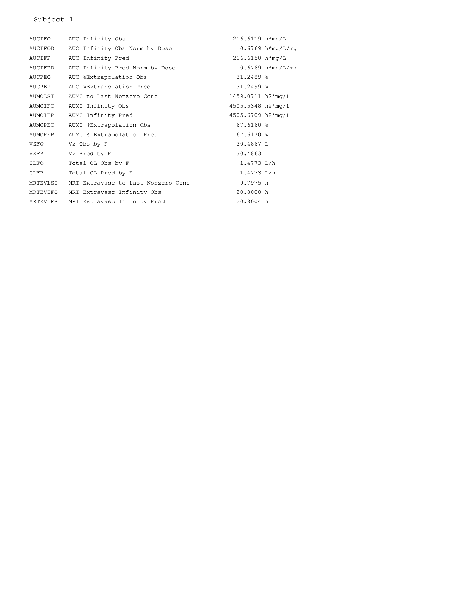

--- 
title: "신약개발을 위한 실전 약동학 (I - 이론과 자료해석)"
author: "가톨릭대학교 계량약리학연구소(PIPET) 펴냄 (대표저자 임동석)"
date: "Ver. `r gsub('-', '', Sys.Date())`"
documentclass: krantz
classoption: krantz2, a4paper, twoside
linestretch: 1.30 # https://github.com/jgm/pandoc/issues/5179
mainfont: NanumMyeongjo
knit: "bookdown::render_book"
site: bookdown::bookdown_site
description: "신약개발에 종사하는 연구자라면 반드시 알아야 하는 약동학 이론을 습득하고 실습을 통해 실전 지식을 갖출 수 있도록 짜여져 있습니다."
url: 'http\://pipet.or.kr/books/pharmapk'
github-repo: pipetcpt/pharmapk
cover-image: images/cover.jpg
bibliography: ["references/references.bib", "references/packages.bib", "references/pharmapk.bib"]
biblio-style: apalike
fontsize: 11pt
link-citations: yes
colorlinks: yes
header-includes:
  - \usepackage{kotex} 
  - \usepackage{chemarr}
#https://stackoverflow.com/questions/45028623/is-there-a-way-to-add-chapter-bibliographies-using-bookdown
#biblio-style: authoryear
#biblatexoptions: [refsegment=chapter]
#monofont: "Source Code Pro"
#monofont: "Latin Modern Mono"
#monofontoptions:
#  - Scale=MatchLowercase
#  - ScaleAgain=0.8 # https://tex.stackexchange.com/questions/453405/how-can-i-scale-mono-font-to-90-of-matchlowercase
#https://www.overleaf.com/gallery/tagged/book/page/5
#https://pandoc.org/MANUAL.html#variables-for-latex
#documentclass: extarticle
#documentclass: scrbook
#documentclass: svmono
#hyperrefoptions:
#- linktoc=all
#mainfont: NanumGothic # https://sujinlee.me/pandoc-thesis/
#lot: yes
#lof: yes
---

#  - Scale=MatchLowercase

Placeholder


<!--chapter:end:index.Rmd-->


# 약동학 기초 이론 {#principle}

Placeholder


## ADME와 약동학
## 약물 분포 모델과 분포용적
## 청소율의 개념과 적용
## 다회투여 PK와 최종반감기
## 정맥주입과 경구투여 PK의 비교
## 비선형PK
## 맺음말-->
## 서론
### 용어의 소개
### 약동학을 공부하는 목적
## ADME와 약동학
### 흡수(absorption)
### 분포(distribution)
### 대사(metabolism)와 배설(execretion)
### 일차약동학(first-order kinetics)과 반감기(half-life:t~1/2~)
## 분포용적
### 약물의 분포
### 분포용적의 개념과 계산방법
### V~d~와 약의 물리화학적 특성의 관계
### V~d~와 혈장단백결합률의 관계
### V~d~가 약동학에 미치는 영향
## 청소율의 개념과 적용
### 청소율의 이해
### 청소율과 k, t~1/2~의 관계
### PK 파라미터들은 약마다, 사람마다 다르다
### CL과 V~d~의 관계에 관한 고찰
#### CL과 V~d~의 독립성
#### 개인별 CL과 V~d~의 상관성
## 다회투여(multiple dose)의 약동학
## 정맥주입(continuous infusion)의 약동학
## 최종반감기의 개념과 주의점
## 경구투여의 약동학
## 비선형 약동학
### 비선형약동학과 선형약동학의 차이
### 비선형약동학과 용량의 관련성
## 맺음말

<!--chapter:end:01.Rmd-->


# 비구획분석

Placeholder


## 서론
## 비구획분석의 기본 개념과 관심사
## 비구획분석의 파라미터의 산출
## 비구획분석에서 추정하는 파라미터
## 비구획분석의 개념 확장 -- 항정상태에 대한 추정
## 비구획분석 결과의 요약
## 맺음말

<!--chapter:end:02.Rmd-->

---
output:
  pdf_document: default
  html_document: default
---

# 비구획 분석의 자료해석 {#nca-analysis}

\Large\hfill
한성필
\normalsize

---

약동학(PK) 데이터에 대한 자료해석 시 가장 간단하고도 객관적이며 널리 쓰이는 방법은 비구획분석 (Non-compartmental analysis, NCA)이고 이는 약물의 임상 개발에 매우 중요하다.
NCA 결과는 약물 개발 중 수행 된 많은 임상 약리학 연구(예 : 음식 효과, 약물 상호 작용 및 생물학적 동등성 연구)에 대해 중요한 평가변수가 된다.
약물 개발 과정에서 수집된 PK 데이터를 분석하는데 사용될 PK 모델을 평가하거나 결정하는데에도 도움이 된다.
따라서 NCA는 정확하게 수행되어야 하며 이에 대한 해석을 통해 약물에 대한 지식과 통찰력을 축적해 나갈 수 있다.
[@noe2020parameter]

## Data Handling

## Sampling Times

## Assay Quantitation Limits

## 상용 소프트웨어를 이용한 비구획 분석 개론

*식약처, FDA (Food and Drug Administration)를 비롯한 대부분의 규제기관에서는 NCA하는 소프트웨어를 규정하고 있지 않아*, 상용 소프트웨어를 사용하지 않고 약동학적 지표를 구하는 것을 허용하고 있다.

## 비구획분석에 활용할 수 있는 R package 소개

무료로 누구나 사용할 수 있는 R 패키지를 사용하여 비구획분석을 통한 약동학적 주요 지표를 구할 수 있다.

- NonCompart [@R-NonCompart]
- ncar [@R-ncar]
- pkr [@R-pkr]

## 설치

우선 R을 설치합니다. 
R은 아래 링크^[https://cran.r-project.org/]에서 다운로드 받을 수 있습니다. 

R을 실행한 후, 콘솔 창에서 비구획분석을 위한 패키지를 설치하는 방법은 다음과 같습니다. 
홑따옴표 등의 인용 부호에 주의하세요.

```{r eval = FALSE}
install.packages('NonCompart')
install.packages('ncar')
install.packages('pkr')
```

설치는 한번만 하면 되지만, 비구획분석을 위해서는 매 세션마다 패키지를 *불러오기*해야 합니다.

```{r}
library(NonCompart)
library(ncar)
#library(pkr) # NonCompart::tblNCA() can be overwritten.
```

아래 두 패키지는 비구획분석과는 관계없지만 자료 처리 혹은 그림 등을 그리는데 도움을 줍니다. 

```{r}
# install.packages(c('tidyverse', 'knitr')) 
# 설치 안되어 있으면 맨앞의 #을 지우고 설치.
library(tidyverse) # For presentation only, dplyr, tidyr, ggplot2
library(knitr) # For reports
```

도움이 필요할때는 맨 앞에 물음표를 붙여서 콘솔창에 입력하거나 `help()` 함수를 사용합니다.

```{r, eval = FALSE}
?NonCompart
help(tblNCA)
```


## 비구획분석을 위한 데이터셋의 작성

자료의 첫 10개 (Table \@ref(tab:head)) 혹은 마지막 10개 관찰값만 보고 싶으면 다음을 입력합니다. 
대상자 번호가 첫 열에 나와있고 시간 순서대로 혈장에서 측정한 테오필린의 농도가 나와있습니다. 

```r
head(Theoph, n=10)
tail(Theoph, n=10)
```

```{r head, echo = FALSE}
kable(head(Theoph, n=10), caption = 'Theoph 자료의 첫 10개 관찰값',
      row.names = FALSE, booktabs = TRUE)
```

그림을 그려서 대략적인 자료의 모습을 파악합니다. (Figure \@ref(fig:ggtheoph))

```{r ggtheoph, fig.cap = 'Concentration-time curves of oral administration of Theoph (N = 12)', fig.width = 6, fig.height = 3.5}
ggplot(Theoph, aes(Time, conc, group = Subject, color = Subject)) +
  geom_point(size = 4) + 
  geom_line(size = 1) +
  theme_bw() +
  labs(title = 'Oral Administration of Theoph (320 mg)',
       x = 'Time (hour)', y = 'Concentration (ng/mL)')
```

## 자료 불러오기 {#loading}

`read.csv()` 함수를 사용해서 자료를 불러 옵니다.
엑셀 파일을 사용하는 경우 `readxl` 패키지를 설치한 후에 `read_excel()` 함수를 사용해서 불러올 수 있습니다. 
다만 이 경우 `tibble` 형태로 자료가 변형되므로 `as.data.frame()`을 사용해서 데이타프레임으로 변형해주어야 합니다.

## R을 이용한 비구획분석 실제 1

### tblNCA(): 전체 대상자 비구획 분석

가장 많이 쓰는 함수이다.
NonCompart 패키지의 핵심적인 기능입니다.
아래의 코드를 R의 콘솔창에 넣어보세요. 
테오필린 경구 투여시의 비구획 분석입니다. 

```{r}
Theoph_tblNCA <- tblNCA(Theoph)
```

결과는 `data.frame` 형태인데 너무 길기 때문에 핵심적인 일부 파라메터 (C~max~, T~max~, AUC~last~)만 표시할 수도 있습니다.

```{r}
Theoph_tblNCA_selected <- Theoph_tblNCA %>% 
  select(Subject, CMAX, TMAX, AUCLST) %>% 
  print()
```

인도메타신 정맥 투여시의 비구획 분석입니다. 
함수인자 `adm`을 infusion으로 바꾼 것을 볼 수 있고 `dur`가 추가된 것을 볼 수 있습니다.

```{r}
Indometh_tblNCA <- tblNCA(Indometh, key="Subject", 
                          colTime="time", colConc="conc", dose=25, 
                          adm="Infusion", dur=0.5, 
                          concUnit="mg/L", R2ADJ = 0.8)
```

역시 핵심적인 일부 파라메터 (C~max~, T~max~, AUC~last~)만 표시할 수도 있습니다.

```{r}
Indometh_tblNCA_selected <- Indometh_tblNCA %>% 
  select(Subject, CMAX, TMAX, AUCLST) %>% 
  print()
```

### sNCA()

한명의 대상자에 대해 비구획 분석을 시행합니다.

```{r}
# For one subject
x = Theoph[Theoph$Subject=="1","Time"]
y = Theoph[Theoph$Subject=="1","conc"]

sNCA(x, y, dose=320, doseUnit="mg", concUnit="mg/L", timeUnit="h")
```

이때의 그림은 다음과 같습니다.  (Figure \@ref(fig:ggtheophindi))

```{r ggtheophindi, fig.cap = 'Individual concentration-time curves of oral administration of Theoph (Subject 1)', fig.width = 6, fig.height = 3.5}
ggplot(Theoph %>% dplyr::filter(Subject == 1), 
       aes(Time, conc, group = Subject, color = Subject)) +
  geom_point(size = 4) + geom_line(size = 1) +
  theme_minimal() +
  labs(title = 'Oral Administration of Theoph (320 mg) (Subject 1)',
       x = 'Time (hour)', y = 'Concentration (ng/mL)')
```

### 기술통계 (Descriptive statistics)

R에서는 필요에 따라서 자신만의 함수를 만들 수도 있습니다. 
아래를 실행하면 `desc_tblNCA()` 함수를 사용하여 기술통계량을 쉽게 구할 수 있습니다. (Table \@ref(tab:theodesc) and \@ref(tab:indodesc))

```{r}
desc_tblNCA <- function(tblNCA){
  psych::describe(tblNCA) %>%
    select(n, mean, sd, median, min, max)
}
```

```{r eval = FALSE}
desc_tblNCA(Theoph_tblNCA_selected)
desc_tblNCA(Indometh_tblNCA_selected)
```

```{r theodesc, echo = FALSE}
desc_tblNCA(Theoph_tblNCA_selected) %>% 
  kable(booktabs = TRUE, 
        caption = 'Descriptive statistics of selected PK parameters of Theoph oral administration')
```

```{r indodesc, echo = FALSE}
desc_tblNCA(Indometh_tblNCA_selected) %>% 
  kable(booktabs = TRUE, 
        caption = 'Descriptive statistics of selected PK parameters of Indometh IV infusion')
```

## R을 이용한 비구획분석 실제 2 


웹브라우저를 통해 간단히 비구획분석을 할 수 있는 앱을 개발하였습니다.

- Han, S. (2017) pkrshiny: Noncompartmental Analysis using pkr R package Shiny application. URL: https://asan.shinyapps.io/pkrshiny

그 외 약동학과 관련된 몇가지 shiny 앱도 참고하세요.

- Han, S. (2017) Pharmacokinetic Simulation of one-compartment Models. URL: https://asan.shinyapps.io/pk1c/ 
- Han, S. (2017) caff: Monte Carlo Simulation of Caffeine Shiny application. URL: https://asan.shinyapps.io/caff
- Han, S. (2016) vtdm: Vancomycin TDM Shiny application. URL: https://asan.shinyapps.io/vtdm


## 비구획분석 보고서

ncar은 보고서를 만드는 패키지입니다. 현재 설정된 working directory에 결과 파일이 생성됩니다.

### txtNCA()

txtNCA()를 통해서 다음 결과를 얻을 수 있습니다.

```{r eval=FALSE}
txtNCA(Theoph[Theoph$Subject=="1","Time"],
       Theoph[Theoph$Subject=="1","conc"], 
       dose=320, doseUnit="mg", concUnit="mg/L", timeUnit="h")
```

파일로 저장하려면 다음을 입력합니다.

```{r}
writeLines(txtNCA(Theoph[Theoph$Subject=="1","Time"],
                  Theoph[Theoph$Subject=="1","conc"], 
                  dose=320, doseUnit="mg", concUnit="mg/L",
                  timeUnit="h"), 
           'Output-ncar/txtNCA-Theoph.txt')
```

### pdfNCA()

pdfNCA()로 pdf로 결과를 볼 수 있습니다. (Figure \@ref(fig:pdfnca-output))

```{r pdfNCA}
ncar::pdfNCA(fileName="Output-ncar/pdfNCA-Theoph.pdf", Theoph, key="Subject", 
             colTime="Time",  colConc="conc", dose=320, doseUnit="mg", 
             timeUnit="h", concUnit="mg/L")
```

```{r include = FALSE}
system("magick -density 150 Output-ncar/pdfNCA-Theoph.pdf Output-ncar/pdfNCA-Theoph-%02d.png")
system("magick montage Output-ncar/pdfNCA-Theoph-01.png Output-ncar/pdfNCA-Theoph-02.png Output-ncar/montage.png")
```

```{r pdfnca-output, fig.cap = 'pdfNCA() output', fig.width = 6, echo = FALSE}
#knitr::include_graphics('Output-ncar/pdfNCA-Theoph-01.png')
knitr::include_graphics(c('Output-ncar/pdfNCA-Theoph-01.png', 'Output-ncar/pdfNCA-Theoph-02.png'))
#
```

### rtfNCA()

마이크로소프트 워드에서 편집가능한 rtf파일을 만듭니다.

```{r eval = FALSE}
ncar::rtfNCA(fileName="rtfNCA-Theoph.rtf", Theoph, key="Subject", 
             colTime="Time", colConc="conc", dose=320, doseUnit="mg", 
             timeUnit="h", concUnit="mg/L")
```

### pkr::plotPK()

비구획분석에 대한 다양한 시각화는 여러 유용한 정보를 제공해 줍니다.
이를 가능하게 해 주는 `pkr` 패키지[@R-pkr]에 대해서  자세히 알아보겠습니다.

```{r eval = TRUE}
library(tidyverse)
library(pkr)
pkr::plotPK(Theoph, "Subject", "Time", "conc", 
            unitTime = "hr", unitConc = "mg/L", dose = 320)
```

### pkr 사용법 {#pkr-manual}

`pkr` 함수의 가장 핵심적인 기능은 `plotPK()` 함수에 있고 이 함수의 인자는 다음과 같습니다.

```{r}
args(plotPK)
```

`Theoph` 자료의 그림을 그리는 명령어를 실행해 보겠습니다.

```{r message = FALSE}
plotPK(Theoph, "Subject", "Time", "conc", unitTime="hr", unitConc="mg/L", dose=320)
```

조금 기다린 후 `Output` 폴더를 확인해 보면 세개의 그림 파일이 생성된 것을 알 수 있습니다.

- `r dir('./Output/', pattern = '\\.tiff$', full.names = TRUE) %>% grep(pattern = ' ', value = TRUE) %>% paste(collapse = '\n- ')` 

```{r include = FALSE}
files <- dir('Output', pattern = '\\.png$', full.names = TRUE)
files
```

```{r, echo = FALSE, fig.cap = '평균 약동학 파라메터와 그룹 농도-시간 그림 (선형)', out.width='95%'}
knitr::include_graphics('Output/PK_Profile_Linear_Scale_for_Theoph.png')
```

```{r, echo = FALSE, fig.cap = '평균 약동학 파라메터와 그룹 농도-시간 그림 (로그)', out.width='95%'}
knitr::include_graphics('Output/PK_Profile_Log_10_Scale_for_Theoph.png')
```

```{r, echo = FALSE, fig.cap = '평균 약동학 파라메터와 그룹 평균 농도-시간 그림 (로그)', out.width='95%'}
knitr::include_graphics('Output/PK_Profile_with_CI_for_Theoph.png')
```

또한 개개인 별로 여러개의 그림이 담긴 두개의 PDF 파일이 생성되었습니다.

- `r dir('./Output/', pattern = '\\.pdf$', full.names = TRUE) %>% grep(pattern = ' ', value = TRUE) %>% paste(collapse = '\n- ')` 

```{r, echo = FALSE, fig.cap = '약동학 파라메터와 함께 표시되는 농도-시간 그림 (선형)', out.width='95%'}
knitr::include_graphics('Output/Individual_PK_Linear_Scale_for_Theoph.png')
```

```{r, echo = FALSE, fig.cap = '약동학 파라메터와 함께 표시되는 농도-시간 그림 (로그)', out.width='95%'}
knitr::include_graphics('Output/Individual_PK_Log_10_Scale_for_Theoph.png')
```

## 파라메터의 의미 {#parameters}

비구획분석 시 여러 파라메터가 나오며 약어로 표현하는 경우가 많습니다. 또한 소프트웨어마다 약어가 상이하기 때문에 자주 그 의미를 찾아볼 필요가 있습니다. 콘솔창에 다음을 입력합니다.

```{r eval = FALSE}
?ncar::txtNCA()
ncar::RptCfg
```

ncar::RptCfg의 일부를 첨부합니다. (Table \@ref(tab:rptcfg)) `PPTESTCD`는 NonCompart 패키지에서 출력하는 파라메터 이름이며, CDISC SDTM PPTESTCD (Parameter Short Name)^[다음과 같이 CDISC note에 표시되어 있습니다. 'Short name of the pharmacokinetic parameter. It can be used as a column name when converting a dataset from a vertical to a horizontal format. The value in PPTESTCD cannot be longer than 8 characters, nor can it start with a number (e.g., "1TEST"). PPTESTCD cannot contain characters other than letters, numbers, or underscores. Examples: "AUCALL", "TMAX", "CMAX".' https://wiki.cdisc.org/pages/viewpage.action?pageId=42309513]와 같은 값입니다. `WNL` 열은 Certara Phoenix WinNonLin에서 구한 파라메터 이름입니다.

```{r rptcfg, echo = FALSE}
param_table <- ncar::RptCfg %>% 
  select(PPTESTCD, SYNONYM, WNL) %>%
  mutate(`Description (WNL)` = sprintf('%s (%s)', SYNONYM, WNL)) %>%
  select(1, 4)

kable(param_table, 
      caption = 'Description of NonCompart parameters',booktabs=TRUE, longtable = TRUE)
```


<!--chapter:end:03.Rmd-->


# 구획분석(compartmental analysis)의 이론 {#ca-principle}

Placeholder


## 구획모델이 필요한 이유
## 구획모델 파라미터들의 의미와 주의점
## 맺음말-->
## 구획분석의 개념
## 구획모델이 필요한 이유
### 최종반감기와 관련한 이슈
### 정확한 C~max~, T~max~ 값의 추정
### PK/PD와 연관된 각종 의사결정
## 구획모델로 얻은 PK 파라미터와 NCA로 얻은 PK 파라미터들의 차이점\*
### 분포용적 파라미터들의 차이
### β와 k~e~(k~10~)의 차이
## 맺음말

<!--chapter:end:04.Rmd-->

# 구획분석의 자료해석 {#ca-analysis}

\Large\hfill
한성필
\normalsize

---

## 상용 소프트웨어를 이용한 구획 분석 개론
## 구획분석에 활용할 수 있는 R package 소개
## 구획분석을 위한 데이터셋의 작성
## 1구획모델을 이용한 정맥주사 후 약동학 자료 분석 1
## 1구획모델을 이용한 정맥주사 후 약동학 자료 분석 2
## 1구획모델을 이용한 경구투여 후 약동학 자료 분석 1
## 1구획모델을 이용한 경구투여 후 약동학 자료 분석 2
## 2구획모델을 이용한 약동학 자료 분석
## 맺음말

<!--chapter:end:05.Rmd-->

