--- 
title: |
  <center> 신약개발을 위한 실전 약동학 </center>\index{약동학}
  <center> (I-기본원리과 자료해석)  </center>
#"신약개발을 위한 실전 약동학\newline(I-이론과 자료해석)"\index{약동학}
author: "가톨릭대학교 계량약리학연구소(PIPET) 펴냄 (대표저자 임동석) - v0.9.2 (2021-08-29)"
#date: "Ver. `r gsub('-', '', Sys.Date())`"
date: "`r Sys.Date()`"
documentclass: krantz
classoption: krantz2, a4paper, twoside
linestretch: 1.30 # https://github.com/jgm/pandoc/issues/5179
mainfont: NanumMyeongjo
knit: "bookdown::render_book"
site: bookdown::bookdown_site
description: "신약개발에 종사하는 연구자라면 반드시 알아야 하는 약동학 이론을 습득하고 실습을 통해 실전 지식을 갖출 수 있도록 짜여져 있습니다."
url: 'http\://pipet.or.kr/books/pharmapk'
github-repo: pipetcpt/pharmapk
cover-image: images/cover.jpg
bibliography: ["bib/references.bib", "bib/packages.bib", "bib/pharmapk.bib"]
biblio-style: apalike
fontsize: 11pt
link-citations: yes
colorlinks: yes
#lot: no
#lof: no
header-includes:
  - \usepackage{kotex} 
  - \usepackage{chemarr}
#https://stackoverflow.com/questions/45028623/is-there-a-way-to-add-chapter-bibliographies-using-bookdown
#biblio-style: authoryear
#biblatexoptions: [refsegment=chapter]
#monofont: "Source Code Pro"
#monofont: "Latin Modern Mono"
#monofontoptions:
#  - Scale=MatchLowercase
#  - ScaleAgain=0.8 # https://tex.stackexchange.com/questions/453405/how-can-i-scale-mono-font-to-90-of-matchlowercase
#https://www.overleaf.com/gallery/tagged/book/page/5
#https://pandoc.org/MANUAL.html#variables-for-latex
#documentclass: extarticle
#documentclass: scrbook
#documentclass: svmono
#hyperrefoptions:
#- linktoc=all
#mainfont: NanumGothic # https://sujinlee.me/pandoc-thesis/
---

```{r setup, include=FALSE}
local({
  r = getOption('repos')
  if (!length(r) || identical(unname(r['CRAN']), '@CRAN@'))
    r['CRAN'] = 'https://cran.rstudio.com' 
  options(repos = r)
})

if (!require("pacman")) install.packages("pacman")
my_packages <- c('kableExtra', 'readxl', 'readr', 'knitr', 'tidyverse')
pacman::p_load(char = my_packages)
#knitr::write_bib(my_packages, 'references/packages.bib')

options(
  htmltools.dir.version = FALSE, 
  formatR.indent = 2,
  width = 55, digits = 4, 
  warnPartialMatchAttr = FALSE, 
  warnPartialMatchDollar = FALSE
)


opts_chunk$set(echo=FALSE, 
               fig.align = "center",
               message = FALSE, 
               warning = FALSE,
               #fig.width = 7,
               out.width="100%", 
               dpi = NA,
               error = TRUE)
options(knitr.kable.NA = '')
Sys.setenv(RSTUDIO_PDFLATEX = "latexmk")
```

# 머리말 {-}

`r if (knitr::is_html_output()) ' [](https://pipetcpt.github.io/pharmapk/pharmapk.pdf)'`

\normalsize

이 책은 제약·바이오 업계의 신약 연구자들이 약동학(pharmacokinetics)을 이해하는 것을 돕기 위해 만들어졌습니다.\index{약동학}

약동학은 신약의 발견부터 시판허가 이후의 관리에\index{약동학}
이르기까지 모든 단계에서 쓰이는 가장 기본적이고 필수적인 지식이며
도구입니다. 오늘날 다양한 생명과학 분야의 전문인력들이 우리나라에서
신약의 발견과 초기개발과정, 임상개발 과정에서 핵심적인 역할들을 수행하고\index{임상개발}
있습니다. 그러나 학위과정 중에 약동학이나 약력학을 공부할 기회가 없었던\index{약동학}\index{약력학}
분들이 많아서 업무 수행 중 의사결정이나 소통에 있어서 늘 크고 작은\index{의사결정}
어려움을 겪고 있습니다. 이런 현실은 본격적인 신약개발의 역사가 일천한
우리나라에서 거쳐갈 수밖에 없는 과정이지만, 소수의 전문가들이 제약회사에
가서 강의 몇시간 하는 식으로는 해결되지 않습니다.

물론 '임상약동학' 또는 '약동학' 이라는 제목의 좋은 책들은 이미 국내에도\index{약동학}
여러 권 나와 있습니다. 그러나 약동학 데이터를 직접 들여다보고 분석하는\index{약동학}
학문(임상약리학, 약제학 등)을 대학원에서 전공하지 않은 이상, 그 두꺼운
교재들의 복잡한 수식을 다 읽어야 할 절박함도 없을 것이고, 설혹 읽어본다
한들 쉽게 이해할 수도 없습니다. 또한 많은 책들이 약동학 수식들을 충실히\index{약동학}
다루고는 있지만 신약을 실제로 개발하는 과정에서 제약사 연구원들이
부딪히는 의문들을 해결하는데 주안점을 두고 저술된 것이 아니므로 현장의
답답함을 풀어주는 데에는 한계가 있어왔습니다.

이런 현실을 조금이라도 타개하기 위해서는 국내 제약, 바이오 기업에서
신약개발 업무를 수행하고 있는 다양한 전공의 연구자들이 시공간의 제약없이
공부할 수 있는 온라인 강의 동영상, 그리고 그와 함께 읽을 수 있는 교재를
만드는 작업이 절실하였습니다. 그래서 저자들은 지난 20여년간 대학과
기업의 연구원들을 대상으로 약동학을 가르치며 겪은 학습자들의 질문과\index{약동학}
반응들을 토대로 꼭 필요한 내용들을 이해하기 쉽게 설명하고자 영상 제작과
함께, 이 교재를 만들게 되었습니다. ^[https://lms.pipet.or.kr]

저자들은 "약동학"이라는 방법론 자체를 전공했다기 보다는 그것을 기본적인\index{약동학}
도구로 사용하는 학문인 임상약리학을 공부해 온 사람들입니다. 이 책에 담긴
지식들 중 저자들이 새롭게 만들어낸 것은 거의 없으므로 이 책은 오랜 세월
동안 세상의 많은 학자들이 만들어 온 지식들을 모아서 시중에 유통시킨 것에
지나지 않습니다. 다만 신약개발을 위해 임상약리학을 적용하는 과정에서,
함께 일해왔던 기업들에서 만들어진 물질들의 약효, 독성, 약동학에 관한\index{약동학}
비임상, 임상 연구자료들을 들여다보면서 수없이 토의하고 질문했던 내용들을
책 속에 충실히 반영하고자 하였습니다. 그 내용을 독자들이 좀 더
효율적으로 학습할 수 있도록 오래된 지식들을 새로운 방식으로 자르고 묶고
다듬어 내놓고자 노력했습니다. 약동학 책에는 수식들이 꽤 등장하기 때문에,\index{약동학}
이 책의 내용 역시 어렵게 느껴질 수 있으므로 온라인상에 공개되어 있는
강의 동영상을 책과 함께 공부하시기를 권합니다. 
이 책은 제약/바이오 기업의 연구자를 대상으로 쓰여진 것이지만, 관련된 전공을 공하는 대학원생들에게도 도움이 될 것입니다.
그러므로 학생들의 책값 부담을 덜어주기 위해, 전통적인 방식의 출판사들 대신 print on demand 방식의 출판을 하였고 저자들은 인세를 받지 않기로 하였습니다.
이를 위해 원고 집필 뿐 아니라 책의 조판에까지 많은 시간과 수고를 쏟아야 했던 한성필 교수님께 고마움을 전합니다. 

이 책과 강의동영상이
우리나라에서 신약의 비임상, 임상개발 과정에 참여하고 있는 각 분야\index{임상개발}
전문가들의 역량을 더욱 잘 발휘할 수 있게 돕는 디딤돌이 된다면 저자들
모두의 기쁨이겠습니다.

<!--
```{r include = !is_html_output()}
include_graphics("images/preface.pdf")
```
-->

\hfill 2021년 봄, 성의교정 연구실에서

\hfill 대표저자 임동석 拜

\normalsize

\mainmatter


<!--chapter:end:index.Rmd-->

# 약동학 기초 이론 {#principle}

\Large\hfill
임동석
\normalsize

## 서론

### 용어의 소개

\index{약동학}\index{약동학}
\index{말초조직}

약동학(藥動學, pharmacokinetics, PK)이란 용어는 그리스어로 약을 의미하는 pharmacon과 움직임이라는 kineticos를 합하여 만든 것이다. 약동학은 약이 몸 안으로 흡수되고, 분포되었다가 대사, 배설을 통해 몸 밖으로 나갈 때까지 혈액과 각 조직에서 발견되는 약의 농도가 시간에 따라 쉼없이 변화하는(즉, 움직이는) 과정을 설명하는 방법이다. 용어만 들으면 마치 약물 분자들이 스스로 몸 속에서 움직여서 그 농도가 변하는 것으로 오해할 수도 있다. 그러나 실제로는 생체 장기와 조직들이 몸 밖에서 들어온 `약'이라 불리는 이물질을 다루면서 일어나는 작용들, 즉 장관에서의 흡수, 심장박동으로 일어나는 혈류에 의한 말초조직으로의 분포, 간이나 콩팥을 통한 몸 밖으로 제거 등이 혈액과 각 조직들에서의 약물의 농도가 올라갔다가 다시 내려가는 현상을 일으키는 원인인 것이다.\index{약동학}

\index{약력학}\index{약력학}

반면 약이 수용체에 결합한 후 일어나는 세포나 몸에서 일어나는 변화(약효)의 크기와 양상을 약물농도와의 관계로 설명하는 학문은 약력학(pharmacodynamics, PD: pharmacon에 힘을 의미하는 그리스어 dynamicos를 붙임)라 부른다. \index{약력학}
이 두 방법론은 사람에서의 약효를 예측하고 적절한 용량용법(dosage regimen)을 찾기 위한 필수적인 도구로 쓰이고 있다. \index{용량용법(dosage regimen)}
약동학과 약력학을 구분하기 위해 흔히 쓰이는 정확하고 간결한 설명으로는 "몸이 약에게 하는 작용을 다루는 것이 약동학, 약이 몸에게 하는 작용을 다루는 것이 약력학" 이란 말이 있다. \index{약동학}\index{약력학}
그러나 이들 분야를 처음 접하는 사람이 들으면 무슨 뜻인지 이해하기 어려운 표현이다. 
과거 약력학에 대한 연구나 이해가 적던 시절, pharmacokinetics를 약물동력학 이라고 번역하기도 했으나, 이 용어는 약력학과의 구분이 어려우므로 피하는 것이 좋다. \index{약력학}
일본에서는 약물동태학이라고도 번역하고 있으나 약동학과 같은 의미이다.\index{약동학}

```{r pkpd-diagram, fig.cap = "(ref:pkpd-diagram)"}

```

(ref:pkpd-diagram) 약동학과 약력학의 구분

\index{약동학}\index{약력학}

### 약동학을 공부하는 목적

\index{약동학}
\index{신약개발}
\index{생체표지자}
\index{의사결정}\index{의사결정}


신약 한가지를 발굴(discovery)에서부터 시판허가에 이르기까지의 과정에서
단계별로 수없이 많은 의사결정들을 하게 되는데, 이들 하나하나에서\index{의사결정}
약동학이 관련되지 않는 것이 드물다. 왜 약동학이 그토록 많이 적용되는가에\index{약동학}
대한 답이 그림 \@ref(fig:pkpd-concept)에 나와 있다. 약이 단순한 화합물이 아니라 약인 이유는
환자에게 주었을 때 효과가 있기 때문이다. 약 개발 과정에서의 의사결정을\index{의사결정}
단순하게 말한다면 약효를 적절히 나타내기 위한 용량을 찾아가는 과정이라
할 수 있다. 매 개발의 단계마다 약효나 그와 관련된 생체표지자 등의 변화를
측정하여 적절한 효과를 나타내는 용량을 선택하여 다음 단계의 연구를
수행하면 된다. 그러나 실제 사람에서 약효라고 부를 수 있는 것을 한 번의
투여 간격 사이에 여러 번 측정하는 것은 혈압이나 혈당과 같은 예외적인
생체표지자들을 제외하면 거의 불가능하다. 그러면 어떻게 적절한 용량과 그
투여간격을 정하는가? 이에 대한 답은 그림 \@ref(fig:pkpd-concept)에 나타나 있다. 그림의 아래
패널과 같이 우리가 알고 싶은 것은 어떤 용량용법에서 약효가 어떤 범위\index{용량용법(dosage regimen)}
내에서 유지되는지에 관한 것이다. 그 범위를 적절하게 유지시켜주는
용량용법을 선택해야 하는데, 사람에서 약효를 쉽게 측정할 수 없기 때문에\index{용량용법(dosage regimen)}
대신 쓰는 방법은 그림 \@ref(fig:pkpd-concept)의 윗부분과 같이 약동학과 약력학의 관련성을\index{약동학}\index{약력학}
이용하는 것이다. 그림의 위 우측 패널을 보면 in vitro 연구나
동물실험자료에서 얻은 약물농도와 생체표지자나 약효의 관계(약력학)가\index{약력학}
나타나 있으므로, 얼마의 농도를 얻으면 얼마나 효과가 나타날지를 추정할 수
있다. 또 위의 왼쪽 패널에는 사람에서의 혈장 약물농도의 시간에 따른 변화
추이(약동학)가 나타나 있는데, 이는 임상시험에서 채혈을 통해 비교적 쉽게\index{약동학}
확보할 수 있고, 비임상개발 단계에서는 각종 기법으로 예측할 수도 있다.\index{임상개발}
즉 윗부분의 두 패널의 정보를 결합하면, 사람에서 약을 먹은 후 몇시간 뒤에 약효가 어느 정도나 될지를 아래의 패널과 같이 예상할 수 있고,
결국 적절한 효과를 확보하기 위한 용량용법을 찾을 수 있다는 것이다. 다시\index{용량용법(dosage regimen)}
말하면, 실제 효과를 사람에서 관찰하기 어려우니 대신 가지고 있는
약물농도-약효의 관련성 정보(약력학)에다, 사람에서 비교적 쉽게 측정 또는\index{약력학}
예측할 수 있는 약동학 정보를 결합하여 용량용법을 예측하는 것이며, 개발이\index{약동학}\index{용량용법(dosage regimen)}
진행되면서 약동학, 약력학 정보가 추가됨에 따라 그 관련성에 관한 모델은 업데이트되지만,\index{약동학}\index{약력학}
약동-약력학을 결합하여 예측한다는 방법론 자체는 변치 않는다.\index{약력학}

그러므로 우리가 생리학과 약리학적 지식에 더하여 각종 수식을 써 가면서
만든 약동학 이론으로 사람에서의 혈장 약물 농도의 변화를 설명하고\index{약동학}
예측하고자 하는 것은 사실, 용량과 약효의 연관성을 설명하고 예측하기
위함이다. 즉, 어떤 약의 약동학을 잘 안다 해도 그것만으로는 쓸모가 없고,\index{약동학}
그 약의 혈장농도와 약효의 연관성에 관한 정보(약력학)가 확보되어 있을\index{약력학}
경우에만 그 두 가지를 결합하여 개발과 인허가의 의사결정에 적극 활용할 수\index{의사결정}
있게 된다는 것이다.

```{r pkpd-concept, fig.cap = "(ref:pkpd-concept)", out.width="100%"}
knitr::include_graphics("media-01/image2.jpeg")
```

(ref:pkpd-concept) 약동학과 약력학을 이용한 적절한 용량용법의 추정 원리 [@derendorf1999modeling]\index{약동학}\index{약력학}\index{용량용법(dosage regimen)}

## ADME와 약동학\index{약동학}

\index{흡수속도상수}\index{생체이용률}\index{분포용적}\index{청소율}\index{분포용적}\index{청소율}\index{흡수속도상수}

약동학을 아주 좁은 의미로 표현한다면 혈액 또는 혈장의 약물농도가 시간에\index{약동학}
따라 변화하는 양상을 설명하는 모델을 찾는 것이다. 가장 일반적인 약동학\index{약동학}
모델은 경구투여 후 선형적으로 체내에 흡수된 후 혈관 밖의 조직들로 분포됨과 동시에 선형적으로 몸 밖으로 제거되는 것이다. 그 과정들을 나타내는 약동학\index{약동학}
파라미터들은 흡수에는 일차 흡수속도상수(k~a~)와 생체이용률(F), 분포에는\index{흡수속도상수}
분포용적(V~d~), 대사나 배설을 통한 제거에는 청소율(CL)이다. 즉\index{분포용적}\index{청소율}
혈장약물농도는 몸 밖에서 투여한 약의 용량과 채혈시간 및 약동학\index{약동학}
파라미터들인 k~a~, F, V~d~, CL 에 의해 결정되는 종속변수인 것이다: C(t) =
f(Dose, time, k~a~, F, V~d~, CL) 용량과 채혈시간은 외부에서 인위적으로 정할
수 있는 것이므로 약동학 파라미터라고 하지는 않는다. 이 절에서 각 PK\index{약동학}
파라미터들의 의미와 흡수분포대사 배설의 관련성을 간략히 살펴보기로 한다.

### 흡수(absorption)

흡수와 관련된 약동학 파라미터들은 k~a~와 F이다. 약을 물과 함께 삼키면 위장\index{약동학}
속에 들어와서 소장으로 내려가면서 흡수의 과정을 거친다. 흡수가 일어나는
첫 과정은 알약 또는 캡슐 형태로 들어온 약이 소화액 속에서 부스러지고
용해된 후, 그 속에 녹아있는 약물 분자들이 장 상피세포들을 통과하는
것이다. 소화관 속에서 일어나는 이 붕해, 용해의 과정이 얼마나 빨리
일어나는가를 표현하는 것이 일차흡수속도상수인 k~a~이다. 빨리 녹고 빨리 장\index{흡수속도상수}
상피세포를 투과하여 핏속으로 들어가는 약일수록 k~a~가 크다. 약의
소화액에서의 용해도(solubility)와 장 상피세포를 투과하는
속도(permeability)는 반비례하는 경향이 있다. 예컨대 지용성이 좋은
물질일수록 물에 잘 안 녹으므로 알약 형태로 투여할 경우 소화액에 제대로
용해되기 힘들 것이다. 반면에 수용성이 좋은(극성이 강한)물질은 소화액에
잘 녹지만, 막상 인지질로 구성된 장상피 세포막을 통과하는 것은 극성으로
인해 매우 느릴 수 밖에 없다. 그러므로 수용성과 지용성의 어느 극단에
치우치지 않고 적당한 범위의 물성을 가진 물질이라야 먹는 약으로 개발할
가치가 있다. Lipinsky의 Rule of 5는 이런 물성을 요약해 놓은 것이다.
경구흡수가 안되는 물질들은 공통적으로 아래와 같은 물성을 가지는 경향이
있다는 것이다.

-   more than five hydrogen bond donors (the sum of OHs and NHs)
-   molecular weight greater than 500
-   the logP is over 5
-   more than 10 hydrogen bond acceptors (the sum of Ns and Os)

실제 약물이 흡수되는 속도가 위장관 내에 남아있는 약물의 양에 비례하는,
1차식(first-order kinetics)을 따르는 경우는 드물고 소장을 따라 내려가면서 각
구역마다 소화액과 장 상피세포, 혈액 등에서의 약물의 농도, 이온화 정도
등의 차이에 의해 매우 복잡한 양상을 보이지만, 이를 일일이 반영하지 않고
최고혈중농도 예측 등에 어느정도 오류가 있음에도 불구하고 단순한
일차흡수모델을 가장 흔히 쓰고 있다.

약이 소장에서 장 상피세포를 통과하고 간문맥을 통해 간으로 들어갈
때까지는 아직 전신으로 흡수가 되었다고 할 수 없고, 간을 통과하여 심장을
통해 전신을 도는 순환혈액 속으로 들어갔을 때 비로소 흡수가 되었다고
한다. 이렇게 전신순환혈로 들어오기까지 세 가지의 관문(위장관 속,
장 상피세포, 간)을 거쳐야 하며 하나씩 통과할 때마다 일부분씩 약이
제거된다. 이 세 관문을 통과하면서 약이 전신순환혈로 흡수되기 전에 제거되는
현상을 초회통과효과(first pass effect)라 한다. 그러므로 전신으로\index{초회통과효과}
흡수되는 약의 분율(생체이용률, bioavailability: F)은 아래 식 \@ref(eq:1eq1)과 같이 나타낸다.

\begin{equation}
F = F_{a} \times F_{g} \times F_{h}
(\#eq:1eq1)
\end{equation}

F는 분율(fraction)을 의미하며 F~a~는 소화관 내에서 장 상피의 세포막을
투과하여 세포 내로 들어오는(F~a~의 a는 absorbed를 의미함) 약의 분율로서
소화액이나 장내세균 등에 의해 약물이 흡수되기 전에 분해되어 사라지거나
소화액에 용해되는 정도, 장 상피세포를 얼마나 빠르게 투과하는지 등에 의해
결정된다. F~g~는 장 상피세포 내에서 약이 대사되는 분율을
의미하며 장 상피에 많은 CYP3A4에 의한 대사가 대표적인 원인이다. 이렇게
두 번의 관문을 통과한 약은 마지막으로 간에서 다양한 효소계에 의해
대사되거나 담즙으로 배설된 후 살아남은 분율 (F~h~)만이 전신순환혈에
도달하게 된다. 이 개념은 그림 \@ref(fig:fa-fg-fh)에 나타나 있다.

<!--
{width="3.2528094925634297in"
height="2.155675853018373in"}
-->

```{r fa-fg-fh, fig.cap = "(ref:fa-fg-fh)", out.width="100%"}

```

(ref:fa-fg-fh) F(=F~a~ × F~g~ × F~h~, 생체이용률)를 구성하는 세가지 요소. 100 mg을 먹었을 때 소화관 내강과 장 상피세포, 간을 순차적으로 통과하여 전신순환혈에 도달하는 분율을 계산하는 예

### 분포(distribution)

흡수과정을 거쳐 전신순환혈에 도달한 약은 혈류를 타고 전신으로 분포하게
되는데, 이는 혈관 밖의 조직으로 약물이 확산되어 나감을 의미한다.
분자량이 작은 약일수록, 지용성이 높은 약일수록 각 조직의 세포막을
통과하기 쉬우므로 빠르게 확산되고 많은 양의 약물이 조직에 퍼지게 될
것이다. 간이나 콩팥과 같이 혈류량이 풍부한 장기로는 전신순환혈로 들어온
약이 혈류를 따라 혈관 속에 퍼지는 것과 거의 비슷한 속도로 분포가
일어나지만 그 이외의 장기들로는 시간차를 두고 분포하게 된다. 이 분포의
정도를 나타내는 파라미터가 V~d~(분포용적, volume of distribution)이다.\index{분포용적}

### 대사(metabolism)와 배설(execretion)

약이란 체외에서 들어온 이물질이므로 흡수 시 초회통과를 거치면서
소장상피세포와 간에서 대사될 뿐 아니라, 흡수가 끝난 후에도 혈류를 따라
간에서 다른 물질로 대사된 후 담즙이나 소변으로 배설되거나, 대사 없이
곧바로 배설되기도 한다. 약물의 대사과정이나 효소에 대한 지식들은 다른
책에서 얻을 수 있으므로 여기서는 다루지 않는다. 몸에서 제거되는 속도에
관여하는 파라미터가 CL(청소율, clearance)이다.\index{청소율}

### 일차약동학(first-order kinetics)과 반감기(half-life, t~1/2~)

\index{반감기}\index{약동학}\index{반감기}

20세기 초에 혈장약물농도를 측정하는 기술들이 나오면서 정맥주입 후 측정한
약물농도는 아래 그림 \@ref(fig:first-order-elim)와 같이 시간에 따라 초기에는 급격히 감소하다가
나중에는 완만하게 떨어지는 오목한 곡선모양을 보이는 것을 알게 되었다.
로그 농도 단위로 그리면 농도곡선은 직선으로 변하므로 ln C = ln C(0) -kt와 같은 수식으로 표기할 수 있다. 
여기서 C(0)란 시간 0에서의 농도이고 x축에 표기된 시간 t에 따라 기울기 -k를 가지는 직선이다. (시간의 함수로서 농도 C는 C(t)로 표기할 수 있다.) 
로그 단위를 없애기 위해 이 식의 양 변에 지수를 취하면 C = C(0) exp(-kt) 와 같이 변형되고, 다시 미분방정식의 형태로 변형하면 dC/dt = -kC 과 같은 식이 된다. 
이 간단한 형태의 미분방정식이 의미하는 것은 매 순간마다 농도의 시간에 따른 변화 정도(dC/dt)가 농도의 1승(C=C^1^)에 비례(-kC)한다는 것이다. 
시간이 갈수록 그 변화의 방향이 감소하는 쪽이므로 비례상수 k에 -가 붙는다.
이와 같이 어떤 값의 변화율이 그 값 자체(의 1승)에 비례하는 현상을 1차식(first-order kinetics)을 따른다고 한다. 
우리가 아는 거의 모든 약들이 치료용량 범위에서 1차식에 따라 제거되는 것으로 알려져 있다.
경구투여 약들의 경우 소화관에서 전신순환혈로 흡수되는 속도 역시 정확하지는 않으나 편의상 1차식에 따라 흡수된다고 흔히 가정한다.

<!--
{width="4.2998151793525805in" height="3.061224846894138in"}
-->

```{r first-order-elim, fig.cap = "(ref:first-order-elim)", out.width="100%"}

```

(ref:first-order-elim) 1차식에 따라 제거되는 혈장약물농도의 시간에 따른 변화

1차식에 따라 제거되는 약은 특징적으로 `반감기'(half-life, t~1/2~)를 가진다. \index{반감기}\index{반감기}
반감기는 혈장약물농도가 절반으로 줄어드는 시간이며 1차식을 따라 제거되는 약물의 경우 약물마다 제각기 일정한 반감기(t~1/2~)를 가진다. \index{반감기}\index{반감기}
보통 네 번의 반감기가 지나면 몸 안에 있는 약물이 대부분(90% 이상)이 제거되었다고 추정하고, 일정한 간격으로 연속적으로 투약할 때에도 네 번(또는 다섯 번)의 반감기가 지나면 혈장약물농도가 더 이상 높이 올라가지 않고 일정한 범위 내에서만 오르내리는 항정상태(steady state)에 도달했다고 추정한다. \index{항정상태}\index{항정상태}\index{반감기}\index{반감기}\index{항정상태}
반감기는 약물의 약동학적 특징을 나타내는, 쉽게 이해할 수 있는 값이지만, 앞서 언급된 두 가지 주된 파라미터인 V~d~와 CL의 비에 의해 결정되는 결과값이며, 그 자체가 독립적인 약동학 파라미터는 아니다.\index{반감기}\index{약동학}\index{반감기}

## 분포용적\index{분포용적}

### 약물의 분포

약물농도를 측정하던 초기에는 앞의 그림 \@ref(fig:first-order-elim)와 같이 로그 약물농도가 하나의 기울기를 가지는 직선으로 나타난다고 생각했으나, 주사기를 이용하여 정맥 내로 한꺼번에 약물을 주입하는(i.v. bolus injection) 경우 대부분 그림 \@ref(fig:two-slope)와 같이 주사 직후에는 급경사의 직선이, 일정 시간 경과 후 상대적으로 완만한 경사의 직선이 교차하는 형태로 나타난다는 것이 알려지게 되었다.

<!--
{width="2.8761406386701664in" height="2.4106200787401573in"}
-->

```{r two-slope, fig.cap="(ref:two-slope)", out.width="80%"}
knitr::include_graphics("media-01/image5.jpeg")
```

(ref:two-slope) 두개의 경사를 보이는 혈장약물농도 변화(i.v. bolus 주입 후 흔히 보이는 현상)

왜 이와 같은 현상이 나타나는지 설명하는 모델은 그림 \@ref(fig:distribution-two-slope)과 같은데, 사람의 몸을 물이 차 있는 하나의 비커 또는 두개의 비커가 연결된 형태로 단순화하여 가정한 것이다. 
파스퇴르 피펫으로 우측 비커에 잉크를 한 방울 떨어뜨렸을 때 비커의 물 속의 잉크 농도를 시간에 따라 찍어준 것이 오른쪽의 그래프들이다. 
비커 두 개가 양쪽으로 물이 통할 수 있게 연결된 상태에서 우측 비커 물 속의 잉크 농도는 맨 위의 그래프 a)와 같을 것이다. 
잉크가 왼쪽 비커의 물에 골고루 확산될 때까지 급격히 떨어지고 그 이후에는 평형을 이루어서 변함이 없는 현상이다. 
만약 왼쪽 비커가 없고 우측 비커 하나만 있는 상태에서 비커의 바닥에 잉크를 1차식으로 제거하는 장치가 있다고 가정하면 물 속의 잉크의 로그 농도는 가운데 그래프 b)와 같이 하나의 직선으로 나타날 것이다. 
이 두 그래프를 참조하면, 두 개의 비커가 연결되어 있고 그 중 우측 비커에 잉크 제거 장치가 작동하는 상황에서 잉크농도는 그래프 c)와 같이 나타날 것이다. 
잉크를 약이라고 가정하면, 우리 몸에서 보이는 혈장약물농도가 두 개의 기울기를 가진 직선으로 나타나는 원인은 이와 같이 설명되는 것이다. 
즉 혈관 속이나 약물이 혈류와 거의 동시에 빠르게 퍼져서 평형이 일어나는 장기들이 오른쪽 비커에 해당하고 그 외 평형이 빨리 일어나지 않는 장기들(혈류가 낮거나, 특정 약물이 혈액-뇌 장벽 등을 통과하는데 시간이 걸리는 등)은 왼쪽 비커에 해당된다.

```{r distribution-two-slope, fig.cap="(ref:distribution-two-slope)", out.width="80%"}

```

(ref:distribution-two-slope) 약물의 분포로 인해 두개의 기울기가 관찰되는 기전을 설명하는 모델

실제 사람의 몸에서 약이 분포하는 과정을 그림 \@ref(fig:iv-distribution)에 나타냈다. 앞 그림의
오른쪽 비커에 해당되는 것이 혈관 속(혈장), 간이나 콩팥과 같이 혈류가
많이 가고 쉽게 약물이 분포하는 장기 등이고 이를 중심구획(central\index{중심구획}\index{중심구획}
compartment)라 한다. 이외에 약물이 더 늦게 분포하는 나머지 신체 부분을
말초구획(peripheral compartment)라 한다. 정맥주사 직후 혈장약물농도가\index{말초구획}\index{말초구획}
급격히 떨어지는 구간을 분포기(distribution phase)라 부른다. 그리고 두
분획 사이에 어느정도 평형이 이루어진 이후 완만한 경사로 농도가 떨어지는
그 다음 구간을 제거기(elimination phase)라 부르는데 주로 약이 몸에서
제거되는 현상에 의해 혈장약물농도가 떨어진다고 보기 때문이다. 물론
분포기에도 약이 몸에서 제거되는 기전은 작동하고 있지만, 혈장(중심구획의\index{중심구획}\index{중심구획}
일부)에서 약물 농도가 떨어지는 데 더 많이 기여하는 것은 몸에서 제거되는
기전보다 말초구획으로 이동(확산)하는 기전의 영향이 두드러진다고 보기\index{말초구획}\index{말초구획}
때문이다.

```{r iv-distribution, fig.cap="(ref:iv-distribution)", out.width="100%"}

```

(ref:iv-distribution) 사람에서 정맥주사 후 시간에 따른 약물의 분포

### 분포용적(V~d~)의 개념과 계산방법\index{분포용적}

앞서 우리는 약물이 혈관 밖의 말초조직들로 분포하는 것을 살펴보았다.
그런데, 그 분포의 정도는 약물의 물리화학적 성질에 따라 달라지며
혈장약물농도의 변화에 큰 영향을 미친다. 그림 \@ref(fig:vd-concept)의 개념도와 같이
주사기에 검은 바둑알 모양으로 표시된 약물 12개를 담아서 bolus로 주입할
때, 약의 물성에 따라 혈장과 조직으로 분포되는 정도가 달라진다. 조직까지
분포되는데 시간이 걸리지만 개념 이해를 위해 순식간에 일어난다고
가정하자. a), b), c)의 세 경우 혈장 약물 농도는 그림에서 육면체 모양의
혈장 부피를 3L라 가정하면 a)는 1/3 개/L이고 c)는 1개/L로서 세 배의
차이가 난다. 그러나 세 경우 모두 몸 안에 존재하는 약물의 양은 12개로
동일하다. 오히려 약의 작용부위가 혈관 밖의 어떤 조직이라면 혈장농도가
가장 낮은 b)에서 조직 농도는 가장 높다는 것에 주의해야 한다. 그러므로
약물이 몸 속에서 혈장과 그 이외의 부위로 분포하는 비율을 아는 것은
중요하며, 그것을 정량적으로 나타내기 위해 V~d~라는 개념을 쓰고 있다.
\index{분포용적}

```{r vd-concept, fig.cap = "(ref:vd-concept)", out.width="100%"}

```

(ref:vd-concept) 분포용적의 개념\index{분포용적}

외부에서 측정가능 한 것은 혈장 약물 농도밖에 없는데, 12개의 약을
정맥으로 투여한 직후에 분포도 완전히 일어났다는 가정을 하면, 몸 밖에서
안으로 들어간 약의 양 = 주사한 직후 몸 안에 있는 약의 양 = 12개 =
혈장약물농도 × ( ) 이다. 괄호 안에 들어가야 할 것은 무엇인가? 예컨데
a)의 경우라면 혈장약물농도는 2/3 개/L 이므로 18 L를 곱해야 12개가 나올
것이다. 18이란 혈장의 부피(3 L)에 6배를 곱해준 값이다. b)의 경우는 혈장
부피의 12배(36 L), c)의 경우는 4배(12 L)를 곱해주면 몸 안에 존재하는
약물의 양 12개를 얻을 수 있다. 즉 위의 괄호 안에 들어가는 부피를
혈장농도에 곱해주면 몸 안에 존재하는 약의 총량을 계산할 수 있으며, a)와
같이 혈장보다 조직에 상대적으로 많은 양의 약이 분포하는 경우 괄호 속에
들어가야 할 값은 커지고, c)와 같이 반대의 경우 작아짐을 알 수 있다. 이
때 ( ) 속에 넣어주어야 할 값이 V~d~가 되는 것이다. 다시 말하면 몸 안에
존재하는 약물의 총량을 혈장농도와 관련하여 표현하고자 할 때 혈장농도에
곱해주어야 하는 부피 값이 V~d~이며, 그 크기는 약이 혈장보다 조직에 더
많이 녹아 들어가 있을수록 커진다. 실제 시판되고 있는 약들 중 그림 \@ref(fig:vd-concept)에서 예시한 것처럼 V~d~가 혈장부피의 3배-12배(9 L \~ 36 L) 정도에
그치는 약은 드물며, 조직 표면에 결합하거나 세포막을 투과할 수 있는
많은 약들이 이보다 더 큰 V~d~를 나타낸다.

### V~d~와 약의 물리화학적 특성의 관계

혈관 밖의 조직으로 약이 분포하는 경향이 클수록 V~d~가 커지므로 분자량이
작은 경우 혈관 외부로의 이동은 물론 세포막 통과도 쉬우므로 V~d~가 클
것이다.

반대로 분자량이 150 kD에 달하는 단클론항체 등은 주사한 직후에 V~d~를\index{단클론항체}
측정한다면 혈장용적과 같은 값으로 나올 수 있다. (항체의약품은
소분자의약품과는 달리 혈관 내피세포를 투과하는 별도의 기전이 존재하나
혈관 밖으로의 분포가 이루어지는 것이 소분자 의약품에 비해 매우 느리다.)

분자량이 작은 약들의 경우 V~d~가 커지는 경향은 있지만 약물 분자의 극성도
영향을 미친다. 그림 \@ref(fig:mannitol)의 mannitol과 같이 -OH 기로 인한 극성이 큰 물질은 \index{만니톨, mannitol}
세포막 안으로 들어가지 못하므로 그 V~d~는 세포외액의 부피(체중 60 kg인\index{체중}
성인에서 14 L)와 유사함이 알려져 있다.

<!--
{width="1.5962456255468067in" height="0.6099475065616798in"}
그림9 분자량은 작지만 극성으로 인해 V~d~가 작은 mannitol의 분자구조.
-->

```{r mannitol, fig.cap="(ref:mannitol)", out.width="50%"}
knitr::include_graphics("media-01/image9.png")
```

(ref:mannitol) 분자량은 작지만 극성으로 인해 V~d~가 작은 mannitol의 분자구조.

물에 잘 녹지만 분자량이 작고 극성이 높지 않아서 세포막을 잘 투과하는
에탄올의 경우, V~d~는 인체의 총 수분함량(체중 60 kg인 성인에서 42 L) 과 유사하다. \index{체중}
반면, 지용성이 높은 물질들의 경우 세포막을 쉽게 투과함은 물론, 세포 내의 수분에 한정되지 않고 지질 속으로 그 용해도만큼 녹아 들어갈 수 있으므로 매우 큰 V~d~를 나타낼 수 있다(예, propofol: 500 L).
지용성 뿐 아니라 특정 조직에 분포하는 성질 또한 V~d~에 영향을 주는데, 골격근 조직 표면에 결합함으로써 혈장보다 조직에 100배 가량 높은 농도로 분포하는 digoxin의 V~d~는 500 L 내외임이 알려져 있다. 
그러므로 이와 같이 큰 V~d~ 값은 사람 몸에서 얻을 수 있는 생리적인 부피와는 무관하고 단지 약물이 혈관 밖에 상대적으로 더 많이 분포한다는 것을 의미한다.

약이 효과를 나타내는 타겟 세포나 조직에 얼마나 분포하는지는 단순히 약동학 뿐 아니라 유효용량이나 유효혈장농도를 결정함에 있어서도 매우 중요한 정보이다. \index{유효용량}
\index{약동학}
실제 환자에서 약물의 V~d~는 혈장의 용적, 조직의 용적이 큰 사람일수록 커지므로(즉 체중이 클수록 커지므로) 보통 L/kg의 단위로 표기하게 된다.
\index{체중}

### V~d~와 혈장단백결합률의 관계\index{혈장단백결합}

약물의 혈장단백결합률 역시 물리화학적 특성 중의 하나이지만, 혈장단백결합률과 약물의 분포의 관계에 관해서 많은 이들이\index{혈장단백결합}
오해하고 있는 부분이 있어서 이 장에서는 별도의 섹션으로 다루었다. 약물의
혈장단백 결합은 van der Waals 힘이나 수소결합 등에 의한 소수성 부위들의
상호작용이나 정전기적 상호작용에 의한 미약한 결합이다. 여기서
혈장단백질이란 주로 알부민이나 α~1~-acid glycoprotein이다. 혈장에서는
단백결합약물과 비결합약물의 분율이 약물마다 고유한 값을 가지는데, 예컨데
0에서 1사이의 f~u~ (unbound fraction, 비결합분율) 값으로써 나타낸다. 즉
f~u~가 1이면 전혀 혈장단백질에 약물이 결합하지 않는 것이고 0.1이면 90%의
약물이 혈장단백질에 결합되어 있고 10%만이 비결합형으로 존재하는 것이다.
이들 혈장단백질은 분자량이 커서 혈관 밖으로 쉽게 빠져나오지 못하므로
혈장단백질에 결합한 약물들도 따라서 혈관 밖으로 빠져나오지 못하므로,
혈장단백 결합률이 높은 경우 V~d~가 작을 것이라고 추정할 수 있으나 실제
관찰되는 현상은 그렇지 않다.

혈장단백질에 결합하지 않은 약(unbound drug, free drug)은 분포의 평형이
이루어졌을 때 혈장과 조직에서의 농도가 동일하다고 간주한다.(이는
지나치게 단순화시킨 주장이며 이것이 성립하기 위해서는 여러가지 조건이
붙지만 약동학을 처음 배우는 수준에서는 그냥 받아들이자.) 혈장단백질에\index{약동학}
결합하지 않은 약물이 조직 내로 이동하면 그 조직내에 존재하는 단백질 등에
혈장단백 결합과 마찬가지의 기전으로 결합하게 되고 조직마다 약물에 따라 고유한 조직결합율을 나타내게 된다. \index{조직결합}
조직결합율이 높거나, 조직 내에 약물의 용해도가 높은 경우에는 혈장에 있던 비결합 약물들이 대거\index{조직결합}
조직 내로 확산되어 이동하게 된다. 그러면 혈장에서는 약물마다의 고유한 특성이라 할
수 있는 본래의 f~u~ 값을 유지하기 위해 단백결합약물들이 대거 떨어져
나와서 조직으로 이동한 비결합약물의 빈 자리를 채울 것이다. (그림 \@ref(fig:plasma-protein))

<!--
{width="4.320895669291339in"
height="2.9512860892388453in"}

그림10 혈장단백결합과 조직결합, 약물의 분포의 관계\index{혈장단백결합}\index{조직결합}
-->

```{r plasma-protein, fig.cap="(ref:plasma-protein)", out.width="100%"}

```

(ref:plasma-protein) 혈장단백결합과 조직결합, 약물의 분포의 관계 (모세혈관과 세포외액, 혈장의 구분은 생략되어 있음)\index{혈장단백결합}\index{조직결합}

결론적으로 아무리 혈장단백결합율(=1- f~u~)이 높아도 조직결합율이 높거나\index{혈장단백결합}\index{조직결합}
조직에 대한 용해도가 높은 경우(지용성이 높은 약 등)에는 혈관 밖의
조직들로 약물이 퍼져 나가는 것을 막을 수가 없어서 혈장단백결합율만\index{혈장단백결합}
가지고 V~d~가 크거나 작을 것이라고 미리 단정하는 것은 무리이다. 그림 \@ref(fig:chart)은
알려진 670가지 소분자 의약품의 약동학 파라미터들을 정리한 표[@obach2008trend]를\index{약동학}
바탕으로 그려본 f~u~와 V~d~의 관계로서 어떤 경향성을 찾을 수 없다는 것을
알 수 있다. 다만 동일한 약에서, 질병 등으로 인해 혈장단백질
결합율이 감소하는 경우(간기능 이상 등으로 혈장단백질 자체가 감소하거나
요독증으로 인해 혈장단백질과 약물의 결합부위를 두고 약물과 경쟁하는 혈중\index{요독증}
노폐물 등의 증가)에는 V~d~가 건강인에 비해 증가함이 알려져 있다.\index{건강인}

```{r chart, fig.cap="(ref:chart)", out.width="100%"}

```

(ref:chart) 알려진 670가지 소분자 의약품의 약동학 파라미터[@obach2008trend]로 비교한 V~d~(V~dss~)와 f~u~의 관계\index{약동학}

### V~d~가 약동학에 미치는 영향\index{약동학}

V~d~가 클수록 같은 양을 투여해도 약물의 최고 혈장농도 (C~max~)는 낮을 것이다. 
또 V~d~는 \@ref(clearance-concept)절에서 설명할 CL와 함께 약의 반감기를 결정하는 두가지\index{반감기} 파라미터 중 하나이다. \index{반감기}
같은 CL를 가진 약물들이라 해도 V~d~가 다르면, V~d~가 더 큰 약일수록 반감기도 늘어난다. \index{반감기}
약물의 흡수를 나타내는 것은\index{반감기} k~a~와 F지만, 일단 소화관내의 약이 모두 전신순환혈로 들어온 이후에 약의 혈장농도를 결정하는 것은 V~d~와 CL 뿐이다.\index{반감기}

## 청소율(CL)의 개념과 적용 {#clearance-concept}

### 청소율의 이해\index{청소율}

몸이 약을 제거하는 능력을 시간당 제거하는 약물의 양(mg/h 와 같은 단위)으로 나타내는 대신, 시간당 그 약이 녹아 있던 혈장이나 혈액을 얼마나 청소해 주었는지(혈액이나 혈장의 부피)로 나타내는 것(L/h 등의 단위)이 청소율(CL)이다. \index{청소율}
즉 용매(혈장)에 녹아 있는 용질(약)을 제거하는 몸의 능력을 용질보다는 용매를 중심으로 표현하는 것이다. 
왜 번거롭게 이런 식으로 표현하는가? 
그것은 시간당 제거되는 약의 양이라는 단위로 표현하면 약의 혈장 농도가 높을 때는 제거 능력이 상대적으로 크다가 농도가 떨어지면 줄어든 값이 되어 일정한 값으로 표현하는 것이 불가능한 반면, 시간당 청소되는 혈액이나 혈장의 부피는 같은 사람에서 약물별로 그 약물의 혈장농도와 무관하게 고정불변의 값을 나타내기 때문이다. 
이러한 고정불변의 CL가 있기 때문에 약물이 1차식에 의해 제거되고 일정한 반감기를 나타내지만, 처음 배우는 사람은 이 개념을 이해하는 것이 어렵다. \index{반감기}\index{청소율}\index{반감기}
이해를 돕기 위해 약을 제거하는 장기(간이나 콩팥)를 진공청소기로, 혈장을 공기로, 약물을 먼지로 비유하여 설명하고자 한다. 
이 비유적 사례를 통해 왜 CL를 장기의 약물제거 능력을 나타내는 파라미터로 쓰는지 이해할 수 있을 것이다. [@yim2017tutorial]

---

**사례**

당신은 공기 중에 먼지가 100 ng/L의 농도로 존재하는 방에 있다. 이 방의 공기를 새로 구입한 진공청소기를 이용해서 청소하고자 한다. 
스위치를 켜고 노즐을 허공을 향하게 하여 30분간 진공청소기를 돌리고 나서 청소기를 분해하여 필터(집진주머니)에 걸린 먼지의 양을 저울로 측정해 보니 200 ng 이였다. 
그러면

```{block2, note-text1, type='rmdtip', echo=TRUE}
1\. 문: 이 청소기가 청소한 공기의 부피는 얼마인가?

답: 30분에 200 ng의 먼지를 제거했으므로 2 L의 공기를 청소한 것이다.
```

```{block2, note-text2, type='rmdtip', echo=TRUE}
2\. 문: 시간당 청소한 공기의 부피는?

답: 30분동안 2 L의 공기를 청소했으므로 4 L/h의 공기를 청소했다(청소기의 성능을 CL로 나타냈다.).
```

```{block2, note-text3, type='rmdtip', echo=TRUE}
3\. 문: 시간당 제거한 먼지의 양은?

답: elimination rate = CL × conc = 4 L/h × 100 ng/L = 400 ng
```

```{block2, note-text4, type='rmdtip', echo=TRUE}
4\. 문: 세시간동안 청소기를 돌린다면 제거한 먼지의 양은?

답: Amount eliminated = CL × conc × Δt(duration) = 4 L/h × 100 ng/L × 3 h = 1200 ng
```

```{block2, note-text5, type='rmdtip', echo=TRUE}
5\. 문: 이 청소기를 공기 중에 먼지가 50 ng/L의 농도로 존재하는 옆방에 가져가서 작동시킨다면 시간당 제거한 먼지의 양은?

답: CL × conc = 4 L/h × 50 ng/L = 200 ng 청소기의 고유한 성능인 CL는
그대로이지만, 먼지의 농도가 절반인 방에서 시간당 제거한 먼지의 양은
첫 번째 방의 절반밖에 안된다. 만약 공기 중에 먼지가 하나도 없다면
시간당 제거한 먼지의 양은 0 일 것이다! 따라서 시간당 제거한 먼지의
양으로 청소기의 성능을 표현하는 것은 옳지 않고, CL로 표현해야 한다.
```

```{block2, note-text6, type='rmdtip', echo=TRUE}
6\. 문: 위의 사례에 제시된 질문 1)에서 5)를 풀 때의 가정은 방이 아주 넓어서 청소기로 먼지를 몇시간 빨아들였다고 해서 방안 공기 중의 먼지 농도는 전혀 변치 않는다는 것이었다. 그러나 실제 사람의 몸에서 간이나 콩팥이 약을 제거하면 혈장약물농도는 지속적으로 떨어지는 것을 관찰할 수 있다. 이런 상황에서 CL를 어떻게 구하겠는가?

답: 아주 짧은 시간(Δt)동안에는 약물농도(시간의 함수로 C(t)로 표기)의
변화가 무시할 만큼 작으므로 Amount eliminated = CL × C(t) × Δt 이다.
0에서 ∞ 시간의 간격동안 제거된 약물의 양은 몸 안에 들어온 약물의 양과
같고, 이는 정맥주사(F=1.0)로 투여한 용량과 같다. 이는 또한 0에서 ∞
시간을 극히 작은 간격 Δt들로 쪼개서 그 간격마다 제거된 약물의 양을
모두 합해준 것과 같다. 따라서 아래와 같은 식이 성립한다.

$$
Dose = \lim_{\Delta t \rightarrow 0}{\sum_{}^{}{CL \cdot C\left( t \right) \cdot \Delta t = CL\int_{0}^{\infty}{C\left( t \right)dt}}}
$$

결국 외부에서 정맥주사로 투여한 용량을 알고, 시간에 따라 변화하는 혈장약물농도 곡선하 면적(AUC: area under the concentration-time curve =$\int_{0}^{\infty}{C\left( t \right){dt}}$)을 구하여 CL를 계산하는 것이 흔히 쓰는 방법이다. 
AUC는 적분계산을 하지 않더라도, 채혈시간과 측정된 혈장약물농도 값으로 그린 곡선의 면적을 사다리꼴의 공식 등으로 계산하여 근사적으로 구할 수 있는데 그 방법은 NCA(non-compartmental analysis, 비구획분석)장에서 다룬다.
```

### 청소율과 k, t~1/2~의 관계\index{청소율}

앞서 약의 분포를 나타내는 파라미터가 V~d~이고 제거능력을 나타내는 파라미터는 CL임을 배웠다. 
그러면 그림 \@ref(fig:first-order-elim)에 나타난 것과 같은 직선의 경사에 해당하는 약물의 제거속도상수(k 또는 k~e~로 표기: e는 elimination을 의미함)는 k = CL/V~d~의 관계를 따른다. 
그 이유는 아래와 같이 설명할 수 있다. 
제거속도상수 k는 뭔가가 사라지는 속도(rate)를 표기하기 위해 쓰는 비례상수라는 의미인데 혈장약물농도가 떨어지는 속도(dC/dt)의 경우 dC/dt = --k·C로 정의되고, 체내에 남아있는 약물의 총량(A: amount)이 줄어드는 속도(dA/dt)를 나타내고자 할 때는 dA/dt = -k·A와 같이 표기할 수 있을 것이다. 그런데 앞부분에서 나온 분포용적의 개념으로 추론하면 어느 순간 체내에 존재하는 약물의 양 A = C·V~d~이므로 -k·A = -k·C·V~d~ 이고 또 CL의 정의로 나온 제거 속도는 CL·C이므로, -k·C·V~d~ = CL·C가 된다. \index{분포용적}
그러므로 결국 k = CL/V~d~이다. (감소를 의미하는 - 부호 생략) k의 단위는 시간의 역수(1/h)가 된다.

혈장약물농도의 반감기는 일차약동학의 또다른 수식인 C(t) = C(0) × exp(-kt)에서, 시간의 함수인 C(t)가 처음 농도 C(0)의 1/2로 줄어드는데 걸리는 시간으로 구할 수 있다. \index{반감기}\index{약동학}\index{반감기}
즉 C(t) = 1/2C(0) = C(0) · exp(-kt)에서 양 변에 자연로그를 취하고 풀어주면 ln(½) + ln(C(0)) = ln(C(0)) -- kt이고 t (=t~1/2~) = - ln(½)/k = ln(2)/k ≒ 0.693/k이다. 
즉 t~1/2~는 k에 반비례하고 k = CL/V~d~이므로 CL에 반비례하고 V~d~에는 비례한다. 
예컨데, CL는 몸에서 약을 제거하는 능력을 나타내는 값인데, 똑같은 CL를 가진 서로 다른 두 약의 V~d~가 두 배 차이 난다면 V~d~가 큰 약의 반감기가 다른 약의 두 배가 될 것이다. \index{반감기}\index{반감기}
직관적으로 이해하기 위해서 분포모델을 생각해 본다면, 시간당 약이 녹아있는 용매인 혈장을 간에서 청소하는 능력(CL)은 A와 B라는 두 약에서 똑같지만, 혈관 외 조직에 약이 녹아있는 정도(농도, 양)가 A에 비해 B가 두 배 크다고 하자.
즉, B의 V~d~가 A보다 2배 크다면, 혈장이 청소되어 약물농도가 낮아지려 할 때, B는 A에 비해 조직에서 혈장으로 약이 그만큼 더 많이 이동하여 혈장에서 사라진 약물 분자들의 빈 자리를 채울 것이다. 
따라서 V~d~가 크면 클수록 혈장약물농도를 빨리 떨어뜨리는 것이 힘들다(반감기가 길다)는 것을 알 수 있다.\index{분포용적}\index{반감기}\index{반감기}

### PK 파라미터들은 약마다, 사람마다 다르다

지금까지 열거된 PK 파라미터들인 k~a~, F, CL, V~d~는 모두 각 약물마다 제각기 다른 값들을 가지고 있다. 
이들 파라미터 값들이 약물분자들의 물리화학적 특징에 따라 일정한 경향성을 나타내기 때문에 그러하다. 
물론 이것을 사람들에서 약동학 시험을 통하여 환산한 파라미터 값들의 평균이
약마다 제각기 다르다는 뜻이다. 
또, 같은 약이라 해도 사람 각자에서의 PK 파라미터 값들은 제각기 다른 값을 나타낸다. 
예컨데 소변으로 배설되는 약은 신기능이 떨어지는 노인에서는 CL이 젊은이보다 낮게 나올 것이고, 지방조직으로 잘 분포되는 지용성 높은 약은 비만한 사람에서 체중당 V~d~가 마른 사람보다 높게 나올 것이다. 
\index{노인}\index{신기능}
결국 동일한 성분의 약에 대해서도
사람마다 체중, BMI, 장기 기능, 질병상태 등이 조금씩 다르기 때문에 이런 개인간의 차이가 발생하는 것이다. 
각자에서 측정된 PK 파라미터들은 그 사람의 신체상태, 건강상태가 급격히 변하지 않는 한 PK 시험을 반복하여 구해봐도 거의 같은 값을 나타낼 것이다. 
즉 개개인의 PK 파라미터는 약의 물리화학적 특성과 개인의 신체적 특성(체중, BMI, 장기 기능, 질병상태 등)이 상호작용하여 정해지는 것이라 할 수 있다.
\index{체중}

### CL와 V~d~의 관계에 관한 고찰

#### CL와 V~d~의 독립성

우리는 앞에서 CL와 V~d~의 관계가 k =CL/V~d~라는 수식으로 나타낼 수
있음을 보았다. 이 식은 제거속도상수 k가 CL와 V~d~에 의해 결정된다는 것을
의미하는 것이다. 이 식을 변형하면 CL=kV~d~ 또는 V~d~=CL/k로도 표기할 수
있으나 그렇다고 해서 V~d~값이 커지면 CL이 비례해서 커진다거나(CL=kV~d~),
CL값이 커지면 V~d~가 비례해서 커진다는(V~d~=CL/k) 식으로 해석하는 것은
잘못된 해석이다. 다시 강조하지만 CL와 V~d~는 k에 의해 바뀌는 값이
아니라, k는 종속변수로서 독립변수들인 CL와 V~d~에 의해 변하는 값이라는 것이다.
그러면 CL와 V~d~는 어떤 관계인가? CL는 주로 몸이 약을 대사시키거나
배설시키는 능력에 의해 정해지고 V~d~는 주로 약의 물리화학적 특성에
의해서 정해지는 파라미터이므로 본질적으로는 연관성이 없다. 예컨데
지용성이 높거나 분자량이 작아서 V~d~가 큰 약이라고 해서 간에서 대사가 더
빨리 되거나 소변으로 많이 배설된다는 보장은 없다. 높은 지용성, 작은
분자량을 가진 약은 간 세포막을 쉽게 통과하여 세포 속으로 잘 들어가지만,
세포 속에 많이, 빨리 들어가는 것과 CYP 효소들에 의해 빨리 대사되는
것과는 무관하다는 것이다(대사속도에는 CYP효소에 의해 분해되는 정도를 좌우하는 약물 분자의
화학 구조들이 지용성이나 분자량보다 훨씬 중요하다). 또 지용성이 높으면
세뇨관을 통한 재흡수율이 높아져 콩팥에 의한 CL는 오히려 떨어질 것이다.
그러므로 670개 성분에서 보고된 CL와 V~d~의 산점도(scatterplot)을\index{산점도}
그려보면 아무런 경향성도 찾을 수 없다. (그림 \@ref(fig:cl-vd))

```{r cl-vd, fig.cap="(ref:cl-vd)", out.width="100%"}

```

(ref:cl-vd) 670가지 약물에서 보고된 CL와 V~d~로써 그려 본 산점도 [@obach2008trend]\index{산점도}

#### 개인별 CL와 V~d~의 상관성

다만, 약의 물리화학적 특성에 무관하게, 한가지 성분의 약을 골라서 사람들에게 투여하여 얻은 각자의 CL와 V~d~를 비교해 본다면, V~d~가 작은 사람이라면 그 사람의 CL도 작은 경향이 있고, V~d~가 큰 사람에서는 그 사람의 CL도 큰 경향이 있다. 
모든 약의 V~d~는 체중이 클수록 커지는 경향이 있다. \index{체중}
CL의 경우는 콩팥과 간에 의한 대사속도를 반영하는데 콩팥의 약물제거 속도를 결정하는 사구체여과율(GFR)은 이미 체중과 비례관계가 있음이 잘 알려져 있다. \index{체중}
간에서 대사되는 경우라 해도 간 대사 효소의 총량이 간 세포의 숫자와 비례할 것이므로 간의 무게와 비례하고, 간의 무게는 체중(체표면적)이 클수록 커지는 경향이 있으므로 체중이 크면 간에 의한 CL도 커지는 경향이 보이기도 한다. \index{체중}
물론 체중보다 각자의 간 대사 효소의 유전적 대사능이 CL에 미치는 영향이 더 클 경우는 상관관계가 미약할 수도 있다. \index{체중}
어떤 약이건 환자 각자에서 얻어진 CL와 V~d~는 양의 상관관계가 있다. 
이런 체중과 CL의 상관성을 무시하고 집단약동학(population PK) 모델을 만들면 시뮬레이션을 수행할 때 현실과 동떨어진 가상데이터(예컨데 어떤 약에 대한 V~d~가 아주 크면서 CL는 아주 작은 가상환자)를 만들어낼 위험이 있다.\index{약동학}\index{체중}\index{시뮬레이션}

## 다회투여(multiple dose)의 약동학\index{약동학}

첫 번 투약하고 24 시간이 지난 후 약이 몸 안에서 완전히 제거되지 않았는데도 다음 번 투약을 하고, 이것을 일정한 시간 간격으로 반복하면, 혈장약물농도가 한없이 올라갈 것 같지만, 1차식에 의해 제거되는 약의 농도는 그렇지 않고 일정한 범위 안에서 머물게 되어 있다. 
대부분의 약들의 용량용법은 일정 간격(24 시간 등)으로 여러 번 투여하여 약물농도가 일정 범위 안에서 올라가고 내려감을 반복할 때 약효가 가장 잘 나타나도록 설계되어 있다.\index{용량용법(dosage regimen)}

일정 간격으로 계속 투약하고 시간이 충분히 경과하면 농도가 이렇게 일정한 범위(항정상태, steady state) 안에 머물게 되는 것은 1차식에 의한 제거라는 특징 때문이다(1차식에 의해 제거되지 않는 약, 예컨데 Michelis-Menten kinetics 를 따르는 약은 이렇지 않은데, 비선형약동학을 따른다고 하며, 이후에 설명한다.)\index{항정상태}\index{항정상태}\index{약동학}\index{Michelis-Menten kinetics}\index{비선형약동학}\index{항정상태}

<!--
{width="3.936699475065617in"
height="2.9452055993000874in"}

그림13
-->

```{r iv-6, fig.cap="(ref:iv-6)", out.width="100%"}
knitr::include_graphics("media-01/image11.png")
```

(ref:iv-6) 정맥주사(i.v. bolus) 6회 투약 후 체내 약물의 양

그림 \@ref(fig:iv-6)의 예와 같이 일정시간(τ) 간격으로 정맥주사(i.v bolus)로 6번 투약을 한 직후의 몸 안에 들어있는 약물의 양은 이전에 여러 번 투여된 약들이 몸에 남아있는 양을 모두 합친 것(중첩된 것)과 같을 것이다. 
방금 혈관에 주입된 양(Dose) + τ 시간 전에 들어와서 남아있는 양(Dose × e^-kτ^) + 2τ 시간 전에 들어와서 남아있는 양(Dose × e^-k2τ^) + 3τ 시간 전에 들어와서 남아있는 양(Dose × e^-k3τ^) + 4τ 시간 전에 들어와서 남아있는 양(Dose × e^-k4τ^) + 5τ 시간 전에 들어와서(첫 번째 투여) 남아있는 양(Dose × e^-k5τ^)이 그 값이다. 
혈장농도 역시 약물의 양과 같은 양상을 보일 것이다(몸안에 존재하는 약의 총량을 V~d~로 나누기만 한 값이므로).
그림에서와 같이 최고농도(C~max~)가 커지는 정도는 투여를 거듭할수록 약해지면서 언젠가는 더 이상 올라가지 않는 양상을 보이게 될 것이다. 
만약 n번 투약을 했다면 식 \@ref(eq:cmax)로 표기될 수 있고 이는 초항이 Dose/V~d~이고 공비가 e^-kτ^인 등비수열의 n항까지의 합을 구하는 것과 같은 원리이다.
공식에 의해 n번째 용량에서의 C~max~ = Dose/V~d~ × (1- e^-knτ^)/(1- e^-kτ^)로 나타난다.

\begin{equation}
\begin{split}
  C_{max} &= \frac{Dose}{V_{d}} \times \left( 1 + e^{- k\tau} + e^{- k2\tau} + e^{- k\tau 3} + \ldots + e^{- k\left( n - 1 \right)\tau} \right)  \\
  &= \frac{Dose}{V_{d}} \times \frac{1 - e^{- kn\tau}}{1 - e^{- k\tau}}
\end{split}
(\#eq:cmax)
\end{equation}

<!--
$C_{max} = \frac{{Dose}}{V_{d}} \times \left( 1 + e^{- k\tau} + e^{- k2\tau} + e^{- k\tau 3} + \ldots + e^{- k\left( n - 1 \right)\tau} \right) = \frac{{Dose}}{V_{d}} \times \frac{1 - e^{- kn\tau}}{1 - e^{- k\tau}}$
식 1.1
-->

여러 번 투여할수록(n이 커질수록) e^-knτ^는 작아져서, 이론적으로 무한한 시간이 지나서, 무한번(n = ∞) 투여한 상황이 되면 e^-knτ^ = 0이 되고 그 때의 농도는 비로소 더 이상 증가하지 않는 항정상태의 농도가 될 것이다(식 \@ref(eq:cmaxss)).\index{항정상태}\index{항정상태}\index{항정상태}

\begin{equation}
{C_{max\_ ss} = \lim_{n \rightarrow \infty}}{\frac{{Dose}}{V_{d}} \times \frac{1 - e^{- kn\tau}}{1 - e^{- k\tau}} = \frac{{Dose}}{V_{d}} \times \frac{1}{1 - e^{- k\tau}}}
(\#eq:cmaxss)
\end{equation}

<!--
${C_{max\_ ss} = \lim_{n \rightarrow \infty}}{\frac{{Dose}}{V_{d}} \times \frac{1 - e^{- kn\tau}}{1 - e^{- k\tau}} = \frac{{Dose}}{V_{d}} \times \frac{1}{1 - e^{- k\tau}}}$
식 1.2
-->

그러나 현실에서는 무한대라는 시간을 적용하는 것이 불가능하고 대신 앞서 나온 C~max~ = Dose/V~d~ × (1- e^-knτ^)/( 1- e^-kτ^) 수식의 분자 부분의 e^-knτ^가 0에 대략 비슷할 정도로 충분히 작아지는 시간을 추산하여 쓴다.
e^-knτ^ 식에서 지수부분(-knτ)은 제거속도 상수 k와 경과시간 nτ의 곱으로 이루어져 있다. 
상수 k는 0.693/t~1/2~이고 경과시간 nτ가 만약 t~1/2~의 4배 또는 5배라면, 지수 -knτ는 -2.8 \~ -3.5로서 e^-knτ^는 0.03\~0.06 정도의 작은 값이 되어 항정상태에 유사하다고 간주한다. \index{항정상태}\index{항정상태}\index{항정상태}
즉, 다회투여 시 4\~5회의 반감기가 경과하면 항정상태에 도달하였다고 간주한다. \index{항정상태}\index{항정상태}\index{반감기}\index{반감기}\index{항정상태}
이 때 흔히, 투여간격 τ를 줄여 자주 투여하면 항정상태에 일찍 도달할 수 있을 것이라는 착각을 할 수 있다. \index{항정상태}\index{항정상태}\index{항정상태}
그러나 앞서 소개된 바와 같이 경과시간 nτ가 t~1/2~의 4\~5배에 도달해야만 항정상태가 되므로 τ를 줄이면 그만큼 n을 늘려줘야만 nτ = t~1/2~ × 4\~5를 달성할 수 있다. 따라서 투여간격과 무관하게 항정상태에 도달하려면 t~1/2~의 4\~5배만큼 시간이 경과해야만 한다. \index{항정상태}\index{항정상태}\index{항정상태}
다만 항정상태 도달시간을 줄이지는 못하지만 τ가 줄어든 만큼 식 \@ref(eq:cmaxss)의 분모 1-e^-kτ^ 값이 작아지므로 얻어지는 C~max_ss~는 커지게 된다. \index{항정상태}\index{항정상태}\index{항정상태}
마찬가지로 투여간격 τ를 늘여도 항정상태 도달시간은 변치 않으며, 1-e^-kτ^ 값이 커지므로 얻어지는 C~max_ss~가 작아지게 된다. \index{항정상태}\index{항정상태}\index{항정상태}
또 t~1/2~가 τ에 비해 훨씬 짧을 경우 축적 자체가 일어나지 않게 되므로 항정상태라는 개념도 의미가 없게 되는데 수식으로 표현하면 t~1/2~ × 4\~5 \< τ 와 같은 상황이 되어 두번째 용량을 투여하기 이전에 이미 항정상태에 도달해 버렸다고도 생각할 수 있다.\index{항정상태}\index{항정상태}\index{항정상태}

## 정맥주입(continuous infusion)의 약동학\index{약동학}

혈관을 통해 투여하되 한꺼번에 주사(bolus)하지 않고 지속적으로 주입하는
경우, 혈장약물농도는 부드러운 곡선 모양으로 상승하게된다. 이는, 그림 \@ref(fig:iv-6)과 같은 다회투여의 약동학을, 용량을 작게 나누어서 매우 짧은\index{약동학}
시간간격으로 bolus 주사하는 상황과 유사하다. 그러므로 C~max~와 C~min~의
구분없이 부드러운 곡선으로 나온다는 것 외에는 농도가 올라가는 양상이나
항정상태에 도달하는 시간, 주입을 중단하면 1차식을 따라 감소하는 양상\index{항정상태}\index{항정상태}\index{항정상태}
등이 모두 동일하다.

## 최종반감기의 개념과 주의점\index{반감기}\index{반감기}\index{최종반감기}

앞에서는 간결한 설명을 위해 정맥주사 후 말초구획으로 약이 확산되어\index{말초구획}\index{말초구획}
급격히 농도가 떨어지는 분포기(그림 \@ref(fig:two-slope))를 가정하지 않았다. 그러나 실제
정맥주사 후 혈장약물농도는 조밀하게 채혈하여 농도를 측정할 경우, 대부분
그림 \@ref(fig:two-slope)에 예시된 것처럼 두 개의 기울기가 중첩된 모양을 나타낸다.
분포기의 로그혈장농도 기울기는 훨씬 급격하지만, 대개 짧은 시간 동안만
관찰되므로 이후 이어지는 제거기의 완만한 기울기로써 혈장약물농도의
t~1/2~를 측정하게 된다. 분포기의 기울기로도 t~1/2~를 측정할 수 있지만,
구분을 위해 제거기에 얻은 t~1/2~를 제거반감기, 또는 최종반감기라고\index{반감기}\index{반감기}\index{최종반감기}
부르며 일반적으로 반감기라는 용어는 최종반감기를 의미한다. 이\index{반감기}\index{반감기}\index{최종반감기}
최종반감기의 4배가 경과해야 몸에서 약이 대부분 제거된다는 것이 앞에서\index{반감기}\index{반감기}\index{최종반감기}
언급된 약동학의 기본적 상식이며 대부분의 경우 옳다.\index{약동학}


```{r three-slope, fig.cap="(ref:three-slope)", out.width="100%"}

```

(ref:three-slope) 3개의 반감기가 관찰되는 경우. 최종반감기는 매우 길지만 몸에 들어온 대부분의 약은 최종 반감기를 보이는 γ-phase 이전에 이미 제거되었으므로 최종반감기의 4배가 지나야 몸에 있는 약물이 대부분 제거된다는 단순한 예상이 어긋나는 사례이다.\index{반감기}\index{반감기}\index{최종반감기}

그러나 그림 \@ref(fig:three-slope)와 같이 혈장농도 곡선에서 여러 개의 반감기를 찾아낼 수 있는 경우, 가장 긴 최종반감기는 별 의미없는 경우가 많다. \index{반감기}\index{최종반감기}
예컨데 정맥주사로 투여하는 항암제에서 일주일 이상의 기간동안 PK 채혈을 할 경우 흔히 이런 현상이 관찰된다. 
농도가 매우 낮게 떨어진 후 일주일 이상의 최종반감기를 나타내며 길게 꼬리를 끄는 양상을 보이는 경우 약물이 몸에서 제거되는데 4주 이상(최종반감기의 4회 이상)이 걸린다고 판단하면 틀린다. \index{반감기}\index{최종반감기}
몸에 들어온 약은 가장 완만한 기울기를 나타내는 마지막 시기(γ-phase)보다 이전(β-phase)에 이미 대부분 제거되었기 때문이다. 
약동학 연구 결과를 분석하는 기본적인 방법인 비구획분석(non-compartmental analysis, NCA)의 결과표에는 이런 자세한 맥락을 담을 수 없고, 그림 \@ref(fig:three-slope)와 같은 상황이라면 γ-phase의 반감기가 최종반감기로 기록되는데 그 표에 적힌 반감기 값만 읽으면 이렇게 오판하게 되는 경우가 드물지 않다. \index{약동학}\index{반감기}\index{최종반감기}
따라서 약동학연구의 결과를 제대로 해석하기 위해서는, 특정한 파라미터 값만 보고 판단하지 말고 그 약물의 약동학적 프로파일을 종합적으로 파악할 수 있어야 한다.\index{약동학}

<!--
{width="3.8719214785651794in"
height="2.309394138232721in"}

그림14 3개의 반감기가 관찰되는 경우. 최종반감기는 매우 길지만 몸에 들어온 대부분의 약은 최종 반감기를 보이는 γ-phase 이전에 이미 제거되었으므로 최종반감기의 4배가 지나야 몸에 있는 약물이 대부분 제거된다는 단순한 예상이 어긋나는 사례이다.\index{반감기}\index{반감기}\index{최종반감기}
-->

## 경구투여의 약동학\index{약동학}

지금까지 쉬운 이해를 위해 정맥 bolus injection 상황을 예시하여 설명하였지만, 우리가 아는 약의 99% 이상은 먹는 약이다. 
먹는 약이 전신순환혈로 흡수되는데 관련된 약동학 파라미터는 이 장의 처음에 나온대로 k~a~와 F이다. \index{약동학}
F가 1이라고 가정하고 1차식에 의해 경구흡수되고 제거되는 약동학을 표현하면 아래 식 \@ref(eq:oral)과 같다.\index{약동학}

\begin{equation}
\frac{{dA}}{{dt}} = \left( - \frac{{dA}_{a}}{{dt}} \right) - kA = k_{a}A_{a} - kA = k_{a}A_{a} - kCV_{d}
(\#eq:oral)
\end{equation}

<!-- 
$\frac{{dA}}{{dt}} = \left( - \frac{{dA}_{a}}{{dt}} \right) - kA = k_{a}A_{a} - kA = k_{a}A_{a} - kCV_{d}$ 식 1.3
-->

위 식에서 A는 몸 안에 존재하는 약의 양이고 A~a~는 소화관 내강(흡수부위)에 남아있는 약의 양으로서 몸에 아직 흡수된 것이 아니므로 몸 안에 있는 약이 아니다. 
약을 먹은 직후의 A~a~는 물론 Dose와 같으나 시간이 갈수록 줄어들게 된다. 
$- \frac{{dA}_{a}}{{dt}}$는 소화관에 남아있는 약이 줄어드는 속도로서 1차식을 따라 소화관 속에서 몸 안으로 흡수되어 사라짐을 의미한다. 
몸 안으로 약이 들어오는 속도는 $k_{a}A_{a}$로서 $\frac{{dA}_{a}}{{dt}}$와 같은 값이다.
소화관에서 없어지는 속도를 나타날때는 감소하므로 -- 부호가 붙어있고 흡수되어 몸 안으로 들어오는 속도를 나타낼때는 +값이다. 몸 안에 있는
약물의 양이 변하는 속도는 몸 안으로 들어오는 속도($k_{a}A_{a}$)와 몸
밖으로 빠져나가는 속도(${kA}$)의 차에 의해 결정됨을 알 수 있다. 즉
약을 먹고 시간이 얼마 안 지났을 때는 A~a~의 값이 커서 $k_{a}A_{a} > kA$
이므로 $\frac{{dA}}{{dt}} > 0$ 이고, 혈장약물농도 곡선은
증가하게 된다. 그러다 흡수되는 속도와 제거되는 속도가 같아지는 순간이
오면 $\frac{{dA}}{{dt}} = 0$ 이고 C~max~에 도달하고 그 시점
이후에는 역전되어 $\frac{{dA}}{{dt}} < 0$이 되어 혈장약물농도
곡선은 감소하게 된다. 그러나 C~max~에 도달한 이후 농도가 떨어지기
시작했다고 해서 약의 흡수가 끝난 것은 아니다. $k_{a}A_{a}$의 수식으로
표현되는 흡수는 여전히 일어나고 있지만 A~a~의 값이 작아서 $k_{a}A_{a}$가
${kA}$ 보다 작을 뿐이다. 흡수가 종료되었다고 할 수 있으려면 충분한
시간이 흘러 A~a~가 무시할 수 있을 정도로 작아졌을(0에 가깝게 된) 때이다.

흡수가 비교적 빠르게 일어나는 약이라면 흡수속도상수(k~a~)가\index{흡수속도상수}
제거속도상수(k)보다 클 것이고 C~max~에 빠르게 도달하고 C~max~값도 클
것이다. k~a~가 작아질수록 초기에 농도가 올라가는 경사가 완만해져서
C~max~에 늦게 도달하고 C~max~값도 작아질 것이다. 특히, 약효를 오래 지속시키기
위해 k~a~를 아주 작게 만드는 기술을 적용하는 제형(서방형)의 약들은
C~max~에도 늦게 도달할 뿐 아니라 이후로도 오랫동안 흡수가 지속되어 마치
약의 t~1/2~가 늘어난 것처럼 혈장농도가 천천히 떨어지게 만든다. 그러나
앞서 정의한 t~1/2~는 0.693/k = 0.693 V~d~/CL로서 V~d~와 CL의 변함이 없이
k~a~가 바뀌었다고 해서 t~1/2~가 바뀌어서는 안된다. 경구흡수가 빨리
일어나는 대부분의 약에서는 C~max~에 도달한 후 얼마 지나지 않아 A~a~가
빠르게 고갈되므로 그 이후의 약물농도가 떨어지는 기울기는
$\frac{{dA}}{{dt}} = - kA$ 와 같이 k에 의해서만 결정된다.
서방형의 경우 A~a~가 C~max~에 도달한 후 상당히 긴 시간 동안 무시할 수 없는 큰 값을 유지하므로 $\frac{{dA}}{{dt}} = k_{a}A_{a} - kA$ 로서 몸 안에 존재하는
약의 양 A 또는 그 농도인 C가 떨어지는 기울기는 훨씬 완만하게 표현된다.
즉 몸이 약을 제거하는 속도는 변치 않지만 오랫동안 소화관에서 몸 속으로
흡수가 계속 되므로 농도가 떨어지는 기울기가 작아지게 되어 반감기가\index{반감기}\index{반감기}
길어진 것처럼 보이는 것이다. 이러한 반감기를 0.693/k로 정의되는 반감기와\index{반감기}\index{반감기}
구분하기 위해 겉보기 반감기(apparent half-life)라고 칭한다. 그림 \@ref(fig:flip-flop)의\index{반감기}\index{반감기}
맨 오른쪽 곡선이 서방형의 예로 겉보기 반감기가 길어져 있음을 알 수 있다.\index{반감기}\index{반감기}

<!--
{width="3.8027777777777776in"
height="2.5160378390201226in"}

그림15 흡수속도상수(k~a~) 와 혈장약물농도 곡선의 관계 (k 소문자로, 맨 우측 곡선 더 길게)\index{흡수속도상수}
-->

```{r flip-flop, fig.cap="(ref:flip-flop)", out.width="100%"}

```

(ref:flip-flop) 흡수속도상수(k~a~) 와 혈장약물농도 곡선의 관계 \index{흡수속도상수}

## 비선형 약동학\index{약동학}

### 비선형약동학과 선형약동학의 차이\index{약동학}\index{비선형약동학}

이 장에서 지금까지 다룬 약동학은 CL이 일정하고 반감기가 일정한 선형(linear)약동학에 관한 내용이었다. \index{반감기}\index{약동학}\index{반감기}
시판 중인 의약품의 거의 전부가 선형약동학을 따르지만 예외적인 경우가 있는데 phenytoin, salicylate, ethanol 등이 사람 몸에서 비선형(non-linear)약동학을 보이는 물질들이다.\index{약동학}

비선형약동학을 이해하기 위해서는 우선 그림  식 \@ref(eq:nonlin)에 나타난 바와 같이 혈장 약물농도와 대사속도(제거속도)의 관계, CL와의 관계를 살펴보아야 한다. \index{약동학}\index{비선형약동학}
식 \@ref(eq:nonlin)의 V~max~와 K~m~은 약을 대사시키는 장기(간)의 세포 내의 약물대사효소들(다양한 CYP이나 UGT 등)의 특성을 나타내는 값이다. 
이에 상응하는 농도는 간 세포 속의 약물농도이지만, 설명의 편의상 혈장약물농도와 동일하다고 가정하였다. 
선형약동학을 나타내는 약물은 CL가 혈장약물농도와 상관없이 일정하고, 따라서 약물제거속도는 혈장약물농도가 커질수록 정비례하여 커지게 된다($\frac{{dA}}{{dt}} = kA = CL \cdot C(t)$). \index{약동학}
이로 인해 일정한 반감기가 존재한다. \index{반감기}\index{반감기}
그런데 비선형 약동학의 경우 약물의 제거 속도가 Michelis-Menten(M-M) 수식과 같은 양상을 보여 혈장농도가 높아질수록 약물제거속도가 커지기는 하지만 그 커지는 정도가 점점 둔화되어 포화되는 양상을 보인다. \index{약동학}

<!--
$\frac{{dA}}{{dt}} = \frac{V_{\max} \cdot C}{K_{m} + C}$ 
식 1.4-->

\begin{equation}
\frac{{dA}}{{dt}} = \frac{V_{\max} \cdot C}{K_{m} + C}
(\#eq:nonlin)
\end{equation}

간에서 대사되는 약물의 경우 사람에서 얻을 수 있는 약물 농도의 범위가 K~m~ 값보다 무시할만큼 작은 경우에는 선형약동학을 보인다. \index{약동학}
즉 식 \@ref(eq:nonlin)의 분모에서 K~m~ \>\> C인 경우 $\frac{{dA}}{{dt}} = \frac{V_{\max} \cdot C}{K_{m} + C} \approx \frac{V_{\max}}{K_{m}}C$ 와 같이 제거속도($\frac{{dA}}{{dt}}$)는$\frac{V_{\max}}{K_{m}}$에 비례하는데, 결국 CL는 $\frac{V_{\max}}{K_{m}}$과 같은 값으로 나타나게 된다. 
대부분의 약들의 K~m~ 값은 C 보다 훨씬 커서 선형약동학으로 보이는 것이다. \index{약동학}
그런데 농도가 K~m~에 비해 무시할 수 없게 커지면 약물제거속도는 원래의 수식 \@ref(eq:nonlin)와 같이 나타나게 되고, 급기야 C가 K~m~보다 월등히 커지면(K~m~ \<\< C), 식은 $\frac{{dA}}{{dt}} = \frac{V_{\max} \cdot C}{K_{m} + C} \approx \frac{V_{\max} \cdot C}{C} = V_{\max}$ 와 같이 변형된다. 
이 때 수식에서 C가 사라지므로, 0차식(zero-order kinetics)의 양상을 나타낸다고도 표현한다. 
이 식은 사람의 몸이 일정 시간 동안에 제거할 수 있는 약의 최대량은 V~max~를 넘어설 수 없음을 나타낸다. 식 \@ref(eq:nonlin)에서의 농도 C는 사실 세포 내에서의 unbound concentration이라야 하지만 편의상 혈장 약물농도 C의 의미로 사용하였다.

<!--
{width="6.268055555555556in"
height="3.0506944444444444in"}

그림14 비선형약동학을 따르는 약의 혈장농도와 대사속도, CL의 관계 (Vm 을 V~max~로 등등)\index{약동학}\index{비선형약동학}
-->

```{r nonlin-pk, fig.cap="(ref:nonlin-pk)", out.width="100%"}
knitr::include_graphics("media-01/image14.png")
```

(ref:nonlin-pk) 비선형약동학을 따르는 약의 혈장농도와 대사속도, CL의 관계\index{약동학}\index{비선형약동학}

CL = V~max~/(K~m~+C)이므로 농도가 높아질수록 떨어지고, 반감기 역시 농도가\index{반감기}\index{반감기}
높아질수록 길어지게 된다. 따라서 매일 투여하는 phenytoin 과 같은 약의
경우, 일일투여용량을 2배로 늘리면 항정상태 혈장농도는 2배보다 훨씬 높게\index{항정상태}\index{항정상태}
올라가는 경우가 흔히 발생함이(그림 \@ref(fig:phenytoin)) 오래전부터 알려져 있다 [@richens1975serum]. 
안전역이 좁은 약들의 경우 비선형약동학을 따르는 경우 용량조절을 위해 혈장농도를 측정하면서 개인별 약동학 파라미터를 추정하는 등 주의를 기울여야 한다. \index{약동학}\index{비선형약동학}
보통의 선형약동학을 따르는 약물의 경우는 투여량의 증감에 농도도 정비례한다.\index{약동학}

```{r phenytoin, fig.cap="(ref:phenytoin)", out.width="100%"}

```

(ref:phenytoin) phenytoin의 혈장농도와 투여량과의 관계. 사람에 따라 기울기는 다르지만, 비선형약동학으로 인해 용량을 늘리는 것보다 농도의 상승이 더욱 가파른 양상을 보인다. [@richens1975serum]\index{약동학}\index{비선형약동학}

<!--
{width="5.733829833770779in"
height="3.600311679790026in"}

그림15 phenytoin의 혈장농도와 투여량과의 관계. 사람에 따라 기울기는 다르지만, 비선형약동학으로 인해 용량을 늘리는 것보다 농도의 상승이 더욱 가파른 양상을 보인다. (Ref: *Lancet* 1975;2: 247-248)\index{약동학}\index{비선형약동학}

{width="3.5330413385826773in" height="5.846183289588802in"}

그림16 비선형약동학을 따르는 약물의 혈장약물농도가 시간에 따라 떨어지는 양상\index{약동학}\index{비선형약동학}
-->

<!--
```{r nonlin-slope, fig.cap="(ref:nonlin-slope)", out.width="100%"}
knitr::include_graphics("media-01/image16.png")
```

(ref:nonlin-slope) 비선형약동학을 따르는 약물의 혈장약물농도가 시간에 따라 떨어지는 양상\index{약동학}\index{비선형약동학}
-->

혈장약물농도가 시간에 따라 감소하는 경향을 그려보면 로그농도는 볼록한 곡선, 농도는 직선으로 떨어지는 양상을 보이다가 농도가 K~m~ 값보다 훨씬 낮은 수준으로 떨어지면 선형약동학과 같이 로그농도가 직선, 농도가 오목한 곡선모양으로 떨어지게 된다.\index{약동학}

### 비선형약동학과 용량의 관련성\index{약동학}\index{비선형약동학}

앞서 언급된 바와 같이 선형약동학을 보이는 어떤 약이라 해도, 극단적으로 높은 용량을 투여하면 대사능이 포화상태에 근접하면서 비선형약동학을 나타낼 수 있다. \index{약동학}\index{비선형약동학}
유사한 상황은 매우 높은 용량까지도 투여하는 비임상 독성시험의 독성약동학(toxicokinetics)자료들에서도 나타날 수 있다.\index{약동학}\index{독성약동학}

신약후보물질들의 스크리닝 시 유효농도 부근에서 비선형 약동학을 보이는 물질이라면 가능한 구조변경 등을 통해 선형적인 약동학을 보이는 물질로 대체하는 것이 이후 비선형에 따르는 개발의 숱한 이슈들을 벗어나는 방법이다.\index{약동학}

## 맺음말

일정한 CL와 t~1/2~를 나타내는 약물에서의 약동학인 선형약동학은 의약품의 체내 거동을 이해하기 위한 가장 중요하고 기본적인 도구이다. \index{약동학}
V~d~와 CL에 의해 k와 반감기가 결정되고, 흡수는 k~a~와 F에 의해 결정된다. \index{반감기}\index{반감기}
이 네 가지 파라미터와 투여량(Dose), 투여 후 경과 시간(t)의 함수로 표현되는 것이 혈장약물농도이다. 
동물이나 사람에서 약동학 시험을 거쳐 얻어진 혈장약물농도와 시간, 용량의 값들로부터 AUC와 t~1/2~를 계산하고 이로부터 V~d~와 CL를 구하는 것이 흔히 쓰이는 NCA 방법이다. \index{약동학}
NCA 방법은 비교적 단순하고, 쉽게 약동학적 프로파일을 알 수 있게 해준다는 장점이 있으나 약동학 자료로부터 얻을 수 있는 보다 많은 정보들을 놓치게 되므로 이를 보완하기 위해 구획분석법(compartmental analysis)이 함께 쓰이고 있다.\index{약동학}

비선형 약동학이지만 M-M과도 다른 양상을 보이는 예로는 단클론항체의 약동학이 있다. \index{약동학}\index{단클론항체}
단클론항체는 타겟이 되는 항원이 혈액 내에 존재하는지, 세포표면에 존재하는지, 결합 후 항원세포내로 이동하는지 등에 따라 훨씬 다양하고 복잡한 양상을 나타낸다. \index{단클론항체}
이는 이후 출간될 책에서 다루고자 한다.

1장의 내용은 이 책의 뒷부분에 이어지는 내용들을 이해하는데 필수적인 내용이므로 약동학을 처음 접하는 독자들은 동영상 교재와 함께 반복적으로 학습하는 것이 좋다.


<!--chapter:end:01.Rmd-->

# 비구획분석의 이론

\Large\hfill
한승훈
\normalsize

## 서론

비구획분석(Non-Compartmental Analysis)은 약동학 자료를 요약하고, 활용 가능한 정보로 만들어내는 가장 기초적인 방법이다. \index{약동학}
매우 직관적인 방법이며 분석 과정에서 최소한의 가정만을 허용하기 때문에, 누가 분석을 수행했는가와 관계 없이 결과의 변동성이 적으며 이에 따라 규제적 측면에서 가장 선호되는 방법이기도 하다. 
그러나, 자료 분석 시 다른 가정을 하지 않는다는 것은 그러한 결과(시간에 따른 농도 변화)가 어떠한 생리학적인 이유로 발생하게 되었는가에 대한 고려가 부족하다는 뜻이기도 하다. \index{약동학}
따라서, 비구획분석만으로는 해당 의약품의 약동학에 대한 충분한 지식을 얻을 수 없다는 한계 역시 존재한다. \index{약동학}
비구획분석의 방법론을 이해하고 그로부터 산출 또는 추정되는 약동학 파라미터의 의미를 정확히 파악하여, 비구획분석 결과의 올바르게 해석하고 활용할 수 있어야 하겠다.\index{약동학}

## 비구획분석의 기본 개념과 관심사

```{r pkprofile, fig.cap = "(ref:pkprofile)", out.width="80%"}
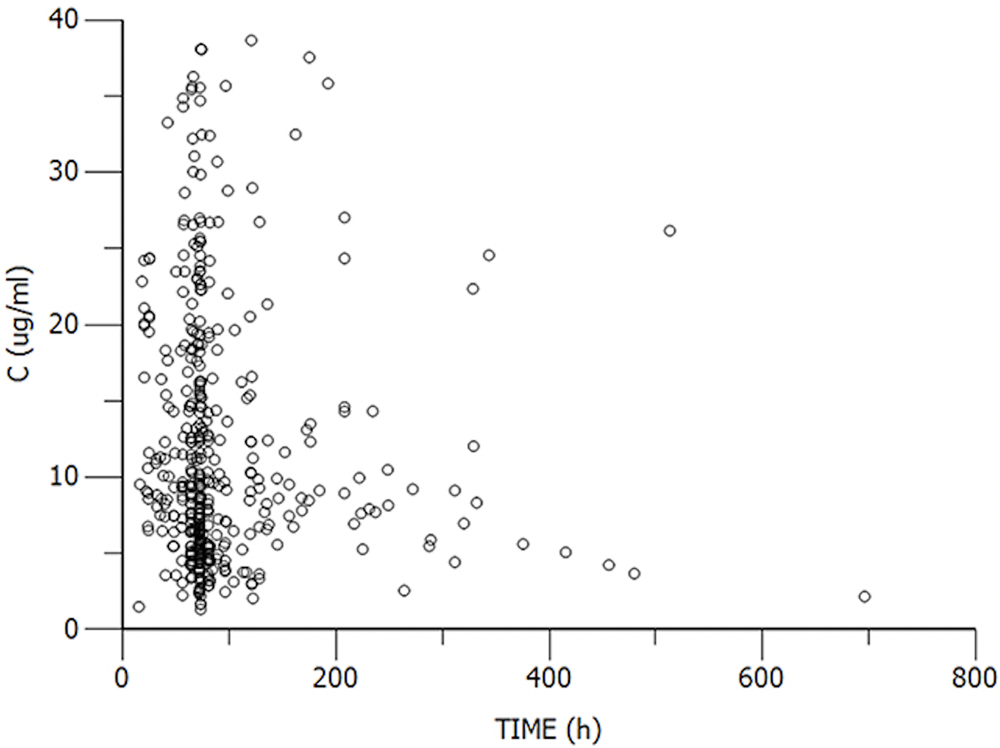
```

(ref:pkprofile) 약동학 연구에서 얻을 수 있는 시간 농도 산점도 \index{약동학}

일반적으로 약동학 연구(단회 투여 연구의 경우)를 수행하면 그림 \@ref(fig:pkprofile)과 같이 약물 투여 후 시간에 따른 농도 변화 자료를 얻을 수 있다. \index{약동학}
이는 단순히 x축을 시간으로 하고 y축을 약물농도로 한 산점도(scatterplot)로써, 각 개인의 값만을 모아서 보는 것도 어렵고, 변화의 양상을 표현하기도 어렵다. \index{산점도}
따라서, 분석자가 보고자 하는 정보에 따라 별도의 특수한 그림을 그려 확인하는 경우도 많다.

이러한 자료를 한 분석자가 본인의 특수한 목적을 위해 확인하는 것이라면 이처럼 다양한 그림을 그릴 수 있겠지만, 다른 사람과 문서 등을 이용해서 소통하고자 한다면 어떻게 해야 할까? 
(약동학 연구에 참여한 대상자 수가 N명이라면, 각 사람의 결과를 보기 위해서는 시간-농도 플롯을 N개나 그려야 한다!) \index{약동학}
또한, 이러한 농도 분석 결과를 어떻게 정보화하여야 이를 보다 가치 있게(제형 간 비교, 약동학에 영향을 미치는 환자 요인 분석 등) 활용할 수 있을까? \index{약동학}
이를 위해 기초적으로 요구되는 작업은 수치화이다.

가장 단순한 수치화 방법은 관찰한 농도값을 의약품을 투여한 후 경과 시각에 따라 기술통계학(descriptive statistics)적으로 요약하는 것이다. 
생리학적인 가정이 없는 상황에서 의약품 투여 후 경과 시간은 농도 변화를 기술할 수 있는 유일한 독립변인이므로, 이러한 방법은 꽤나 타당한 것이다. 
그림 \@ref(fig:pk-table)은 이러한 방식으로 나타낸 시간대 별 약물농도표이다.

```{r pk-table, fig.cap = "(ref:pk-table)", out.width="130%"}
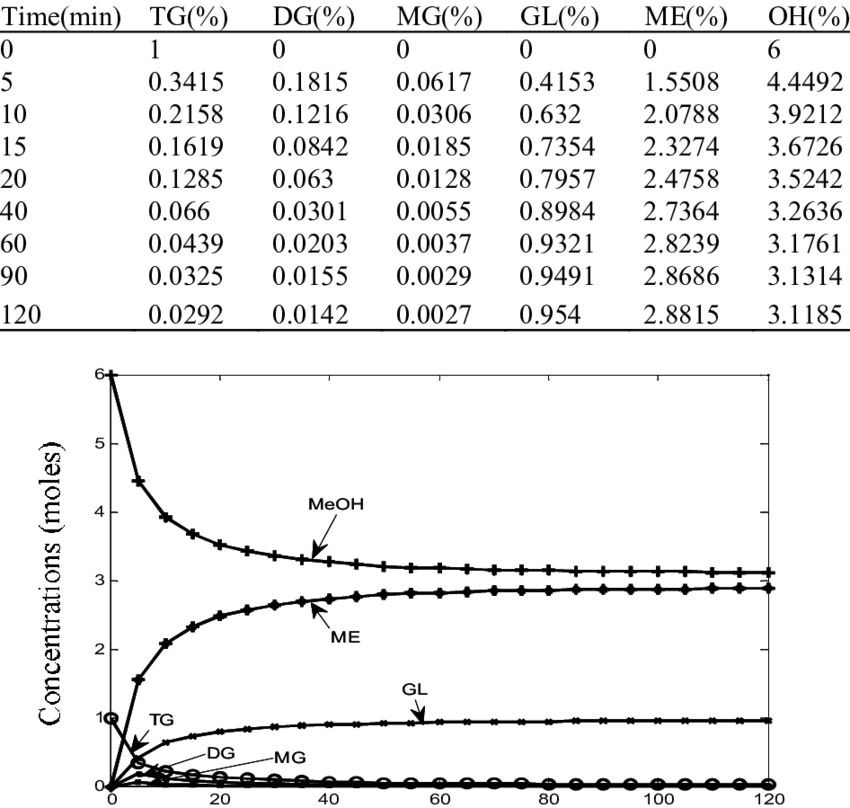
```

(ref:pk-table) 의약품 투여 후 시간대 별 약물농도표와 그래프

이처럼 단순한 수치화 작업만으로도 우리는 집단의 평균 수준에서 시간의 흐름에 따라 약물의 농도가 어떻게 변한다고 할 수 있는지에 대한 보다 나은 의사소통 수단을 확보할 수 있다. 
평균 값 이외에 표준편차 등을 함께 나타낸다면 연구 대상 집단 내에서 약물농도의 변이 정도에 대한 추가적인 정보도 확보할 수 있을 것이다. 
그러나, 우리가 약동학 연구를 하는 중요한 목적 중 하나는 생체에서의 약동학적 특성(인체가 약을 어떻게 흡수, 분포, 제거하는가)을 알고자 하는 것다. 
체내에서 발생하는 시간에 따른 약물농도의 변화는 사실 약물 처리와 관련된 생리학적 작용(=약동학적 작용)의 결과이기 때문이다. 
따라서, 이러한 방식의 수치화를 통해서는 우리가 원하는 정보를 얻을 수 없을 가능성이 크다. \index{약동학}
결과를 단순하게 기술통계학적으로 요약하는 것보다는 어떠한 방법으로든 약동학적 특성 자체를 요약해서 보여주는 것이 더욱 큰 의미를 가진다고 하겠다. \index{약동학}
이에 가장 간단한 통계학적 방법을 접목하여 약동학적인 의미를 찾아내고자 한 방법이 바로 비구획분석이다.\index{약동학}

비구획분석의 명칭은 매우 흥미롭다. 
앞서 언급한 방법과 같이 이 방법은 가급적 분석결과에 영향을 미칠 수 있는 여러 가지 가정들을 제외하고자 한다. 
이 방법은 오래 전부터 활용되었던 방법이며, 어떤 면에서는 컴퓨터의 도움 없이 약동학에 관한 다양한 가정들을 분석에 반영할 수 없었기 때문에 그러한 특성을 가지게 되었을 가능성이 크다. 
약동학 분석에서 가장 큰 가정은 인간 등 생체의 생리학적 특성에 대한 것이다. \index{약동학}
약동학이라는 학문 자체가 약(藥)의 이동(動)에 대한 것이며, 이렇게 약을 이동시키는 것은 생물이다. \index{약동학}
생물이 약을 흡수, 분포, 대사, 배설하기 때문에 약이 생체를 거쳐 이동(보관되어 있던 장소에서 배설한 장소로)하는데, 이 경로 상에 생체가 놓여 있기 때문에 약물의 노출이 만들어진다. 
그렇기 때문에 이러한 약동학을 정확하게 해석하기 위해서는 생체의 구조 및 기능에 대한 가정이 핵심적이다. \index{약동학}
생체는 약이 잠시 머물다가 떠나는 장소의 역할을 하는데, 이는 워낙 복잡하기 때문에 이를 그저 하나의 큰 물통(구획, compartment)으로 단순화해서는 다양한 약동학적 자료들이 보여주는 결과를 적절히 해석하는 데에 한계가 있다. \index{약동학}
보다 복잡한 구조로 가정하려면 이를 구현하기 위해 사람이 일일이 수학적으로 해석할 수 없는 복잡한 미분방정식과 같은 도구가 필요한 데 이 가정이 늘 맞다는 확신도 없는 상황에서 이를 도입하기도 쉽지 않은 노릇이었을 것이다. 
그렇기에 아예 생체의 구조나 기능에 대한 가정은 제외하고 약물 농도 변화에 대한 아주 기본적인 지식만을 가지고 약동학적 분석을 수행하고자 하는 일반화된 방식이 필요했으며, 생체를 구획으로 보는 가정을 제외한 방법이라는 뜻에서 비구획분석이라는 이름을 사용하고 있다. \index{약동학}
당연히 이와 반대되는 개념은 생체의 구조와 기능을 구획과 구획 간의 약물이동으로 가정하여 보다 구체적인 약동학적 지식을 얻고자 하는 구획분석(compartmental analysis) 방법이다.
이 때 생체의 구조와 기능에 대한 가정을 수학적으로 표현한 것을 모델이라 하므로 다른 말로는 약동학적 모델링(pharmacokinetic modeling)이라고도 한다.\index{약동학}\index{모델링}

그렇다면 이러한 가정 없이 우리는 대체 무엇을 얻을 수 있다는 말인가? 
이 질문에 대한 답은 앞서 약동학적 분석의 목적이 `생체, 특히 각 개체의 약동학적 특성을 알고자 하는 것'이라고 한 바에서 찾을 수 있다. \index{약동학}
약의 궁극적인 목적은 생체에서의 효능 발현이며, 아쉽게도 모든 약은 필연적으로 부작용 또는 독성작용을 가진다. 
효능과 독성이라고 하면 조금 극단적으로 받아들여지는 경우가 많아, 우리가 약을 쓸 때 의도한 생체 반응은 효능, 의도하지 않은 생체 반응은 부작용 또는 독성이라고 표현한다는 점을 명확히 하고자 한다.
그리고 의도한 것이듯 의도하지 않은 것이든 이러한 생체 반응의 정도는 각 개인 내에서 생성된 약물의 노출 정도와 일정한 상관성을 가지리라는 것은 누구나 쉽게 생각해 볼 수 있다.

(ref:fig2-3) 약물에 대한 노출과 생체 반응의 필연적 관련성 

```{r fig2-3, fig.cap = "(ref:fig2-3)", out.width="100%"}
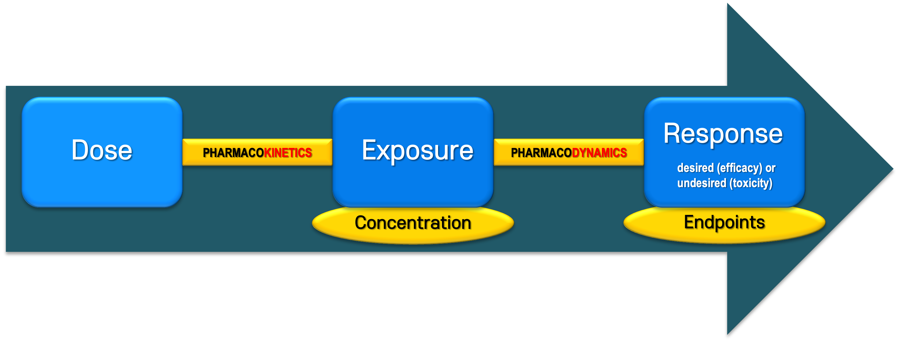
```

특히 인체약동학 분야에서, 지금처럼 사람에서의 약물농도 측정에 관한 방법론이 일반화되지 않았던 과거에는 이러한 인체 반응을 투여된 용량과의 관계로 해석할 수밖에 없었지만, 이제는 같은 용량을 투여하였을 때에도 사람에 따라 다르게 형성되는 노출의 크기와 관련 짓는 것이 더욱 과학적이다. 
그리고 `약물에 대한 노출'의 지표가 바로 약물 농도이다. 
약물 농도는 시간에 따라 변하는 값으로 모든 값들을 일일이 사용하자면 이를 인체 반응의 정도와 연결시키기가 어렵다. 
따라서, 비구획분석에서 인체 반응의 크기와 관련 지을 수 있는, 반응의 원인으로서 약물 노출의 지표값을 구하고자 하는 것이 1차적인 관심사가 된다.

약물에 대한 생체반응의 원인이 되는 지표로써 가장 대표적인 것은 약물 투여 후 발생한 최대혈장농도(the maximum plasma concentration, C~max~)와 곡선하면적(Area under the time-plasma concentration curve, AUC)이다. 
그리고, 약물 효과의 시작(onset) 등과 관련하여 최대혈장농도도달시간(Time to attainment of the maximum plasma concentration, T~max~) 등을 확인하기도 한다. 
이는 투여 시각과 C~max~가 관찰된 시각 사이의 시간 차이를 의미한다. 
이러한 지표들을 총칭하여 `파라미터'라 하며, 파라미터들은 단회 또는 반복 투여의 상황에서 적절하게 응용하여 사용한다. 
비구획분석에서 파라미터들을 어떻게 얻는가의 방법론을 아는 것은 이 방법으로 구한 지표값의 의미와 한계를 아는 데에 매우 중요하므로 지금부터는 단회 투여 상황을 기준으로 하여 각 파라미터의 획득 방법에 대해 이야기하고자 한다.

다시 한 번 강조하고자 하는 것은, 비구획분석에서는 가정을 최소화한다는 것이다. 
따라서, C~max~는 각 개체에서 관찰된 혈장농도 중 최대치를 그대로 쓴다. 
그러기에 이 값은 언제나 실제로 발생한 최대 농도보다 같거나 작을 수밖에 없으며, 우연히 특정한 채혈 시점에 실제 최대 농도가 발생할 확률은 매우 작으므로, 이 값은 언제나 음의 편차를 갖는(negatively biased) 특성이 있다. 
이러한 편차를 최소화하기 위해서는 예상되는 T~max~ 부근에서 채혈 간격을 좁혀 촘촘한 농도값을 얻으면 되지만, 인체 약동학연구에서는 과도하게 많은 채혈 시 환자가 부당한 위험을 감수해야만 한다는 문제가 있어 적절한 균형이 필요하다. 
또한, C~max~와 관련하여 시간-농도 그래프를 부드럽게 꺾이는 그래프로 그리는 경우 실제 관측값보다 그래프가 위로 올라가는 상황이 생길 수 있어 오해의 원인이 된다. 
따라서, 비구획분석이 시간-농도 그래프를 그린다면, 단순히 점과 점을 잇는 형태가 더 나을 수 있다.

더 어려운 것은 AUC인데, 이는 곡선하면적이라 설명한 바 있다. 
그러나, 일반적인 약동학 연구에서는 각 시점 별 농도값을 측정할 뿐이므로 연속된 점의 형태로 결과를 얻을 수 있을 뿐 실제로 곡선 형태를 관찰할 수는 없다. \index{약동학}
이에 AUC를 산출하기 위한 특별한 방법이 도입되는데 이를 사다리꼴 공식(trapezoidal rule)이라 한다. 
이에 대해서는 다음 문단에서 구체적으로 설명하기로 하고, 여기서는 우선 `면적'이라는 특성에 대해 먼저 생각해 보자. 
모든 면적은 특정한 길이의 곱으로 산출되므로, 길이를 어떻게 정의하는가에 따라 면적은 달라질 수밖에 없다. 
우리의 관심사는 x축이 시간, y축이 농도인 사분면(x와 y값이 모두 양의 값을 가진다.)에서 곡선하면적을 구하는 것인데, 농도 값은 우리가 임의로 조정할 수 있는 것이 아니라 관찰하는 것이다. 
반면, x값에 해당하는 수치는 분석자가 임의로 지정할 수 있기 때문에, 곡선하면적을 구할 때에는 어느 시간까지를 구할 것인가를 먼저 지정해야 한다. 
다시 말해, 같은 시간까지를 기준으로 하여 구한 곡선하면적이 아니라면, 이를 서로 비교하거나 요약하는 등의 행위는 무의미한 것이다. 
이러한 고민은, 투여한 약물이 만들어낸 곡선하면적 전체(총 AUC)를 구하는 것이 가장 정보의 품질이 높은 결과이겠으나, 현실에서는 그렇게 할 수 없다는 데에서 기인한다. 
따라서, 많은 경우에는 최종 측정 시점까지의 곡선하면적을 산출하여, 이를 AUC~last~라는 파라미터로 활용한다. 
필연적으로 이는 총 AUC의 부분 AUC(partial AUC)이며, 충분한 시간(보통 반감기의 4-5배) 동안 측정이 이루어지지 않았거나, 각 대상자 별로 최종 측정 시점이 다른 경우 총 AUC와의 관련성이 떨어져 그 가치가 낮아지는 문제가 있다. \index{반감기}
이러한 문제를 보완하기 위해 대부분의 비구획분석에서 AUC~last~와 함께 산출하는 값이 AUC~inf~이다. 
이에 대해서는 AUC~last~의 산출 방법에 이어 설명하도록 하겠다.\index{반감기}\index{반감기}

## 비구획분석의 파라미터의 산출

지금부터는 각 파라미터 값을 어떻게 얻는 지에 대해 구체적으로 설명하고자 한다. 
우선, C~max~와 T~max~는 앞서 설명했듯이 실측값을 그대로 쓰기 때문에 별도의 산출 과정이 필요하지 않다. AUC와 관련된 파라미터들은 사다리꼴 공식을 기반으로 산출한다. 가장 많이 활용되는 사다리꼴 공식은 선형사다리꼴공식(linear trapezoidal rule)로, 그림 \@ref(fig:image4)에 보는 바와 같이 인접한 두 개의 측정값을 직선으로 연결하고 각 관찰값으로부터 x축에 수선을 그어 얻어지는 사다리꼴의 면적을 합산하는 방식이다.

```{r image4, fig.cap = "AUC를 구하기 위한 선형사다리꼴 공식"}
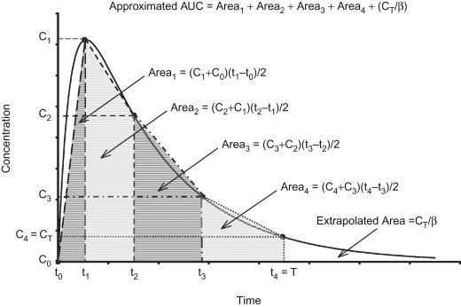
```

따라서, AUC~last~를 산출하고자 한다면, 최종 관찰 시점까지 이 작업을 수행하면 된다. 다만, 실제 농도의 변화는 1차 속도론을 따르기 때문에 각 측정치 간의 농도 변화가 실제로 직선으로 일어나지 않는다는 문제가 있다. 그러기에 이 방법을 사용하면, 농도 증가 구간에서는 실제 곡선하면적보다 작은 값이 산출되고, 농도 감소 구간에서는 실제보다 큰 값이 산출된다는 문제가 발생한다. 
이를 해결하기 위한 가장 좋은 방법은 관찰 간격을 좁게 하여 곡선과 직선 간의 편차가 작아지게 하는 것이다. (그림 \@ref(fig:image5))


```{r image5, fig.cap = "간헐적 관측으로 인한 사다리꼴 공식의 한게. 음영 처리된 영역 곡선하면적 산출 시, 농도가 상승하는 구간에서는 과소평가되고 농도가 하강하는 구간에서 과대평가됨을 알 수 있다. 관찰 간격을 줄임으로서 음영 처리된 영역을 줄일 수 있다."}
#include_graphics("media-02/image5.png")
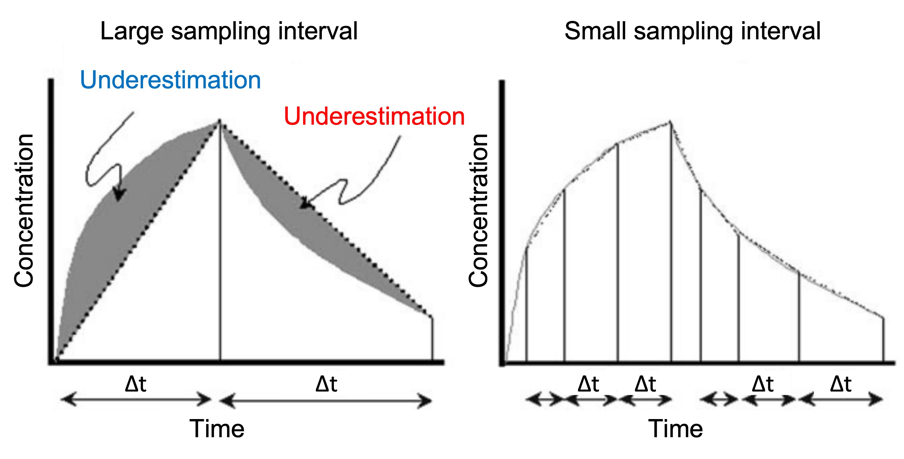
```

<!--  -->

그러나, 실제 임상 약동학 연구에서 채혈 횟수는 제한될 수밖에 없으며, 동일한 간격으로 5 반감기 이상의 기간 동안 약동학 채혈을 수행하는 것은 불가능에 가깝다. 따라서, 농도의 변화가 큰 구간(비교적 투약 시점에 가까운 구간)에서는 가급적 관찰 간격을 좁게 하고, 농도의 변화가 작은 구간(비교적 투약 시점에서 먼 구간)에서는 관찰 간격을 넓혀서 이 문제를 해결한다. 농도의 변화가 작을수록 곡선과 직선 간의 오차가 적어지기 때문이다.\index{반감기}\index{약동학}\index{반감기}

환자 대상 연구 등 불가피하게 충분한 횟수의 약동학 채혈이 어려운 경우에는 농도 감소 구간에서 선형사다리꼴공식을 쓰면 실제 곡선하면적과 산출값 간의 차이가 너무 커진다. 이러한 경우에는 산술적으로 그러한 오차를 보완할 수 있는데, 이러한 목적으로 사용하는 것이 로그-선형사다리꼴공식(log-linear trapezoidal rule)이다. 이 방법은 각 관찰값을 직선이 아닌 로그함수의 형태로 이어 그 밑면적을 구한다. (그림 \@ref(fig:image6))\index{약동학}


```{r image6, fig.cap = "선형사다리꼴공식(왼쪽)과 로그-선형사다리꼴공식(오른쪽)의 차이. 선형사다리꼴공식을 사용할 때 실제 곡선하면적과 산출값 간의 오차(음영 부분)를 로그-선형사다리꼴공식을 사용하여 줄일 수 있음."}
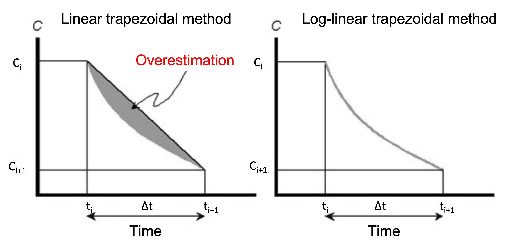
```

<!--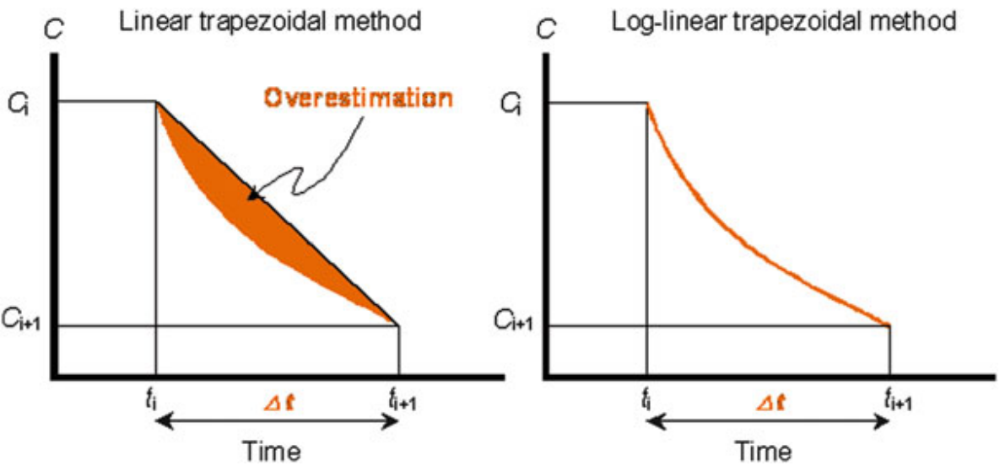-->

이는 오차를 줄인다는 측면에서 강점은 있지만, 관찰값 간의 농도 변화가 실제로 그렇게 일어났다는 근거 없이 형태적 근사에 기반하기 때문에 생물학적동등성 입증 등 약동학 파라미터가 제품 허가 등의 유일한 근거가 되는 규제적 사안에는 인정되지 않는다. 하지만, 학술적인 목적 등 이외의 상황에서는 널리 활용되고 있다. 또한, 이러한 방법을 사용할 때라도 농도 증가 구간에 대해서는 선형사다리꼴공식을 적용하는 것이 일반적이다. (그림 \@ref(fig:image7))\index{약동학}

```{r image7, fig.cap = "농도 증가/감소 구간에서 선형사다리꼴공식/로그-선형사다리꼴을 각각 사용하는 예"}
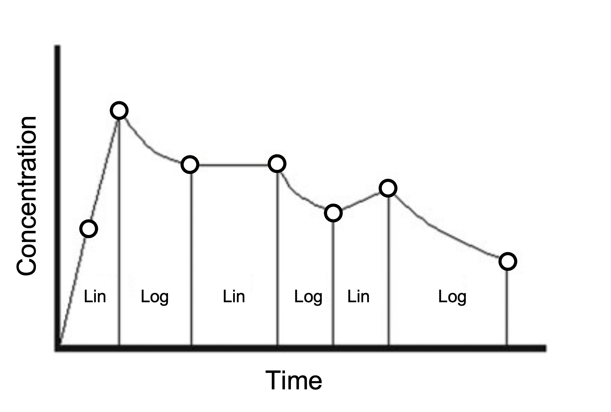
```

<!--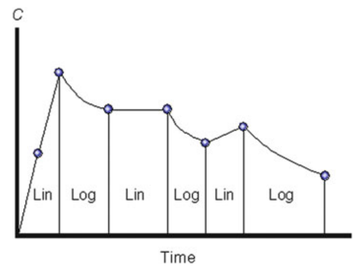-->

AUC~inf~ 역시 산출해야 하는 파라미터이다. AUC~inf~는 앞서 구한 AUC~last~에 최종 측정 시각 이후의 면적을 더하는 방식으로 산출하는데, 최종 측정 시각 이후에는 실측한 관찰값이 없으므로, 이 면적을 구할 때에는 당연히 가정이 포함될 수밖에 없다. 첫 번째 가정은, `약물의 제거가 1차 속도론적으로 일어났다(선형약동학을 따른다)'는 것이다. 이와 같은 상황에서는 다음의 관계식을 적용할 수 있다.\index{약동학}

특정 시점에서 체내에 잔존하는 약물의 양 = 청소율 × 해당 시점 이후의 곡선하면적\index{청소율}

그리고 이 식의 양변을 분포용적으로 나누어 주면,\index{분포용적}

특정 시점에서 관찰된 약물농도 = 제거속도상수 × 해당 시점 이후의 곡선하면적  
∴ 해당 시점 이후의 곡선하면적 = 특정 시점에서 관찰된 약물농도 / 제거속도상수

의 식을 얻을 수 있으며, 이 식의 시점을 최종 관찰 시점으로 하면 궁극적으로 다음의 식 \@ref(eq:eq1)을 얻을 수 있다.

\begin{equation}
최종\ 측정\ 시점\ 이후의\ AUC \left(AUC_{t_{last}}^{\infty} \right) = \ \frac{최종\ 관찰된\ 약물농도\ {(C}_{last})\ }{최종제거속도상수(\lambda_{z})}
(\#eq:eq1)
\end{equation}

C~last~ 값은 알고 있으므로 알아내야 하는 값은 λ~z~이며, 여기서 두 번째 가정이 필요하다. 약물 흡수와 분포에 의한 혈장-조직 간 평형 등은 투약으로부터 가까운 시점에 완료되므로 가장 늦은 시점의 관찰값들이 약물의 제거를 대변한다는 것이다. 이에 시기적으로 가장 늦은 관찰값들을 로그변환하면 그러한 값들은 직선적인 관계를 가져야 하고(첫 번째 가정에 의해), 이 직선의 기울기가 바로 λ~z~가 된다. 그리고 이 기울기는 아래 그림 \@ref(fig:image8)과 같이 3개 이상의 로그변환한 농도 관찰값들에 대한 선형회귀(linear regression)로 얻을 수 있다.

```{r image8, fig.cap = "(ref:terminal)", out.width = "70%"}
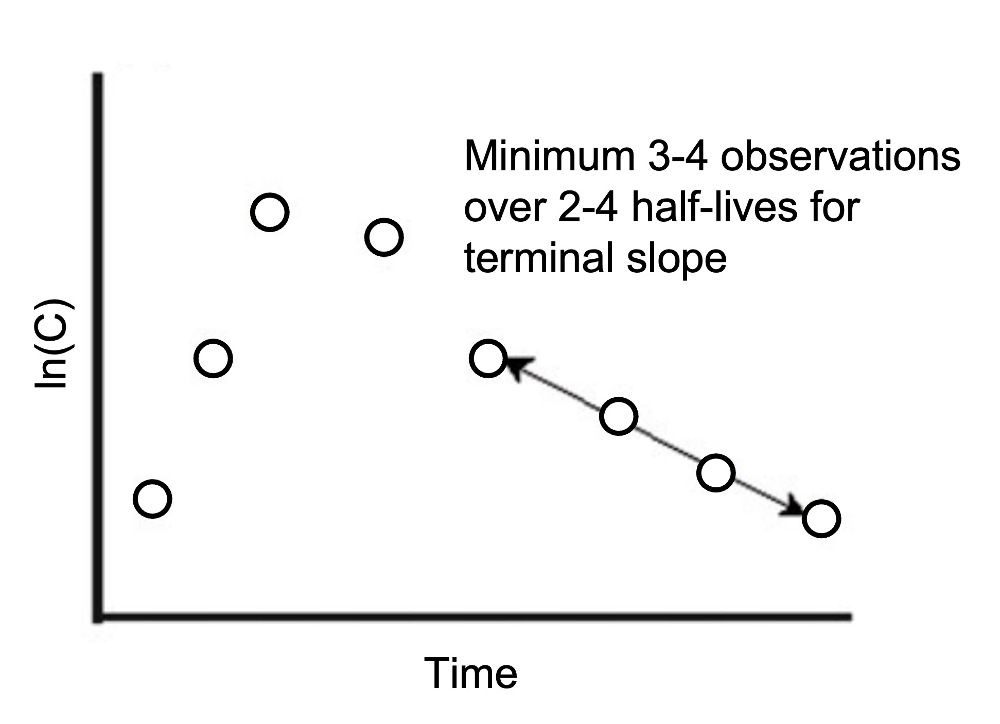
```

(ref:terminal) λ~z~를 구하기 위한 선형회귀

<!-- 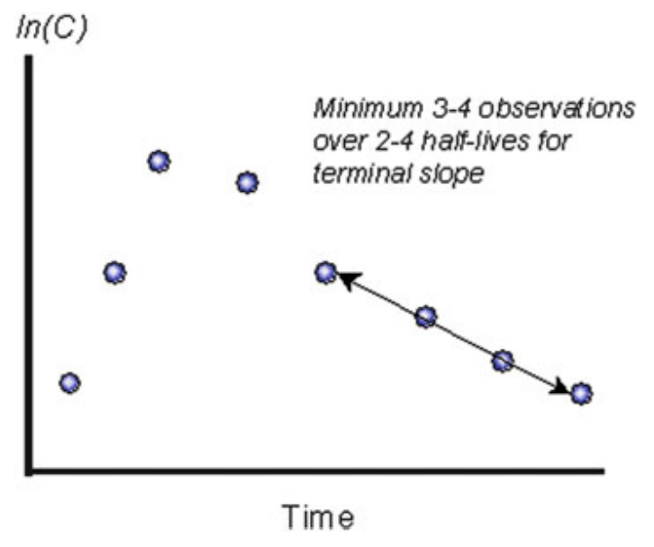 -->

이러한 방법으로 ${AUC}_{t_{{last}}}^{\infty}$를 구하면, 이를 AUC~last~에 더해 AUC~inf~ 값을 얻을 수 있다. 그러나 이 값은 어디까지나 회귀라는 방법에 의존하기 때문에 최소 3개 이상의 관찰값이 실제 최종적 제거를 반영하는 구간에서 확보되었을 때 그 정확성을 담보할 수 있다. 만일 그러지 않은 경우라면, 분포의 영향이 남아 있는 구간의 관찰값들이 회귀에 포함되어, 산출되는 $\lambda_{z}$ 값이 부정확하게 커지는 결과를 초래할 것이다. 이와 더불어, 규제적인 사유 등으로 비교적 정확한 AUC~inf~를 얻고자 하는 경우에는, 그 구성요소 중 불확실성이 큰 ${AUC}_{t_{{last}}}^{\infty}$의 비율이 충분히 낮은가(예를 들어, AUC~inf~ 값의 20% 미만)도 생각해 보아야 할 것이다. 이는 분석 방법으로는 해결할 수 없는 문제이며, 사전에 충분한 시점까지 관찰값이 확보되어야 하는 것이므로 AUC~inf~를 주된 파라미터로 평가하는 경우에는 특히 유의하여야 한다.

잊지 말아야 할 것은 이 산출 과정에 있어 몇 가지 변형이 가능하다는 것이다. 
첫 번째로 $\lambda_{z}$를 구함에 있어, 선형회귀를 어떻게 적용할 것인가가 달라질 수 있다. 
많은 경우에는 최종 관찰값으로부터 시작해 3개 이상(3개, 4개, 5개...)의 관찰값에 대한 회귀 결과 중 가장 결정계수(r^2^, R-Squared) 값이 큰 경우를 선택해 그 기울기를 구한다. 
따라서, 각 개체 별로 선형회귀에 포함된 관찰값의 개수가 다를 수 있다. 
그러나 분석자가 모든 개체에 대해 반드시 최종 3개의 관찰값만을 이용하도록 지정할 수도 있다. 
당연히 어떤 조건으로 분석을 수행하는가에 따라, 결과값이 달라진다. 
두 번째는 정량분석 방법이나 연구 상황 등에 따라 C~last~ 값이 인접한 다른 측정값들에서 얻는 직선적 경향을 벗어나는 결과를 얻을 때도 있다(C~last~ 값이 이전 시점 농도에 비해 높은 경우 등). 
이 경우에는 그러한 값이 오히려 타당하지 않은 ${AUC}_{t_{{last}}}^{\infty}$ 값을 만들어 낼 수 있기 때문에 $C_{{last}}$를 대신해 ${\widehat{C}}_{{last}}$ (회귀직선으로부터 최종 측정 시점에서 예상되는 농도값)을 사용하기도 한다. (그림 \@ref(fig:image9))

```{r image9, fig.cap = "(ref:chat)"}
include_graphics("media-02/chat.jpg")
```

(ref:chat) C~last~(C*) 값이 인접한 다른 측정값들에서 얻는 직선적 경향을 벗어나는 결과를 얻을 때.  C~last~를 대신해 ${\widehat{C}}_{{last}}$ (회귀직선으로부터 최종 측정 시점에서 예상되는 농도값)을 사용하기도 한다. 과대예측(overestimation)된 음영부분을 최소화할 수 있다.

이상의 산출 과정으로부터 우리는 비구획분석을 수행하거나 결과를 해석할 때에 반드시 다음의 사항을 고려해야 한다는 것을 알 수 있다.

-   모든 개체에서 최종 관찰 시점을 포함한 전반적인 약동학 채혈 시점이 같은가?\index{약동학}
-   충분히 긴 시간까지 관찰이 이루어지고, 최소 3개 이상의 관찰값이 선형 제거를 반영하는가?
-   정량한계미만 데이터 등으로 인해 개체 별로 인정 가능한 최종 관찰 시점이 달라지는가?
-   어떤 방식과 가정을 통해 λ~z~에 대한 회귀와 ${AUC}_{t_{{last}}}^{\infty}$의 산출을 수행하였는가?

일반적으로 비구획분석 결과는 전임상에서 종간 비교나 생물학적동등성시험 시 한 개체 내에서 교차시험의 결과를 비교하는 용도로 많이 활용되는데, 위의 사항에 대한 고려를 간과하고 결과값만을 비교하여 잘못된 결론을 도출하는 경우가 빈번하다. 따라서, 숙련된 약동학 전문가라면 이러한 사항들을 충분히 사전에 파악하여 결과 해석에 반영하여야 할 것이다.\index{약동학}

## 비구획분석에서 추정하는 파라미터

앞서 비구획분석은 인체 반응의 크기와 관련 지을 수 있는, 반응의 원인으로서 약물 노출에 대한 지표값을 구하고자 하는 것이 1차적인 관심사라 언급한 바 있다. 
이에 따라, 지금까지는 이러한 지표로써 사용할 수 있는 C~max~, AUC~last~, AUC~inf~ 등의 파라미터를 산출하고 요약하는 방법에 대해 살펴 보았다. 
그런데 이러한 파라미터를 얻었다고 해서 약동학 연구의 결과 분석이 끝났다고 할 수 있을까? 
만일, 하나의 연구에서 약동학적 측정값과 약력학적 측정값이 모두 확보된다면, 이 파라미터들은 각 개체의 반응 정도를 나타내는 데에 있어 용량 값의 한계를 보완할 수 있는 훌륭한 가교로 작용할 수 있다. 
그러나, 신약 개발 등 다양한 상황에서 약동학 연구에서 얻은 정보 또는 지식은 다른 여러 연구 결과와 통합적으로 해석되는 경우가 많다. 
앞서 산출한 파라미터들은 특정 연구에서 발생한 관찰의 결과를 정보로써 요약(경험적)한 것에 불과하기 때문에 이를 다른 연구 결과와 엮어 해석할 수 있는 지식(연역적)이라고 보기에는 어려움이 있다.\index{약동학}\index{약력학}

약동학적 지식이라 함은 각 개체에서 그러한 약동학적 결과를 초래한 생리학적 원인이 무엇인가를 알고 그 작용을 정량적으로 표현하는 것을 의미한다. 대상 집단에서 약물의 흡수, 분포, 제거가 어떻게 일어나는가를 아는 것은 궁극적으로 용량용법 등을 결정하는 데에 매우 중요하다. 그러기에 비구획분석에서도 단순히 관찰 결과의 요약을 넘어 그러한 생리학적 요인에 대한 추정치를 확보하고자 한다. 다만, 이는 실측된 결과를 바탕으로 우리가 정확히 알 수 없는 복잡한 인체 작용을 추정하는 것이기에 추가적인 가정을 필요로 하며, 이 가정은 오래된 약동학적 원리에 기반한다. 지금부터는 반복투여 상황에서 항정상태 도달 특성 등과 관련하여, 일반적으로 더 중요하게 생각되는 분포, 제거와 관련된 약동학적 지식들을 얻기 위해 비구획분석에서 어떻게 접근하는 지에 대해 설명한다.\index{항정상태}\index{항정상태}\index{약동학}\index{항정상태}\index{용량용법(dosage regimen)}

관심의 대상이 되는 첫 번째 지식은 청소율(CL)의 값이다.\index{청소율}
청소율은 생체가 가진 고유의 약물 제거능력을 대변하는 값이다.\index{청소율}
비구획분석에서는 다음의 과정을 통해 이를 추정하고자 한다. 
우선, 한 개체의 체내에서 시간에 따른 약물량의 변화는 다음 식 \@ref(eq:eq2)과 같다.

\begin{equation}
\frac{dA}{dt} = -CL \cdot C
(\#eq:eq2)
\end{equation}

약물의 투여 및 제거는 혈장을 기준으로 이루어진다는 것을 상기하는 것이 좋다. 
분포 등 다양한 과정이 이루어질 수 있지만, 일단 투여된 약물은 혈장에 도달해야 체내에 흡수되었다고 생각하며, 제거 역시 혈장으로부터 간이나 신장을 통해 이루어진다. 
그러기에 식 \@ref(eq:eq2)을 약물 투여 시점으로부터 무한대 시간까지 적분하면, 식 \@ref(eq:eq3)의 관계를 얻을 수 있다.

\begin{equation}
Total\ amount\ administered\ to\ plasma = CL\  \cdot total\ AUC
(\#eq:eq3)
\end{equation}

그리고 비구획분석에서는 total AUC에 대한 지표로써 AUC~inf~를 확보할 수 있다. 
그런데 문제는 좌변의 `Total amount administered to plasma'이다. 
만일, 약물을 혈관 내(ex\> 정맥내주사 등)로 투여했다면, 투여한 모든 양이 혈장에 도달한다고 가정할 수 있다. 
따라서, 이 때는 청소율을 식 \@ref(eq:eq4)와 같이 추정할 수 있다.\index{청소율}

\begin{equation}
CL = \frac{{Dose}}{{AUC}_{\inf}}
(\#eq:eq4)
\end{equation}

그러나 경구 투여 등 혈관 외의 위치에 약물을 투여했다면, 투여한 양 중 혈장에 도달한 양의 비율이 얼마인지 알 수 없다. 
물론, 혈관 내 및 혈관 외 투여 결과가 모두 있다면 청소율이 같다는 가정 하에 두 경우에 구한 AUC~inf~ 값의 비 등으로 이 값을 산출할 수 있다. 
그러나 혈관 외로 투여하는 제형을 가진 약물을 대상으로 하는 약동학 연구에서는 꼭 필요한 경우가 아니라면, 활성성분을 혈관 내 투여하는 대조군을 설정하지 않는다. 
이 경우에는 투여한 양 중 혈장에 도달한 양의 비율을 나타내는 생체이용률(Bioavailability, F)라는 파라미터를 도입하여 식 \@ref(eq:eq5)와 같이 문제를 해결한다.\index{약동학}\index{청소율}

\begin{equation}
\begin{split}
Total\ amount\ administered\ to\ plasma &= F \cdot Dose = CL\  \cdot total\ AUC\ \\
\frac{{CL}}{F} &= \frac{{Dose}}{{AUC}_{\inf}}
\end{split}
(\#eq:eq5)
\end{equation}

즉, 혈관 외 투여 시 투여 용량을 AUC~inf~ 값으로 나누어 산출하는 값은 청소율을 생체이용률로 나눈 값에 대한 추정값이며, 반드시 CL/F라 표기해야 한다. 그리고 생체이용률은 언제나 1보다 작기 때문에 이 값은 언제나 청소율 자체보다 큰 값을 가진다. 가장 빈번하게 이용되는 혈관 외 투여 경로는 경구로서, 이 경우 CL/F 값을 별도로 경구청소율(oral clearance)이라 한다.\index{청소율}

두 번째 관심 대상은 분포용적(V~d~)의 크기이다. 
이는 그 이름 자체만으로도 비구획분석에서도 마치 생체 전체를 하나의 구획으로 가정하는 것과 같은 오해를 유발한다. 
사실 이는 독립변인(질량으로써의 약물 용량)과 종속변인(약물 농도) 간의 관계를 정의하기 위한 scaling factor에 가까운 값이다. 
특정 용량을 투여했을 때, 투여 후 관찰된 농도값이 있다면 둘은 분명 어느 정도의 비례관계를 가질 것인데 이 둘을 어떤 파라미터로 연결해야 할까? 이 고민에 대한 대안이 바로 분포용적인 것이다. 그리고 일반적 관계에서 질량은 (농도×부피)이므로, scaling factor가 마치 가상의 부피와 같은 역할을 하는 것으로 이해하는 것이 좋다. 이는 체내에서 약물의 분포특성과 어느 정도 관련을 가지지만, 실제 분포 특성에 대해서는 매우 대략적인 정보만을 제공한다. 그나마 의미를 부여해 보자면, `생체 전체를 혈장으로 가정했을 때 그 부피' 정도로 해석해 볼 수는 있겠으나, 그 역시 정확한 해석은 아니다.\index{분포용적}

실제 비구획분석에서는 이 값을 추정할 때, 식 \@ref(eq:nca-estimation)의 관계를 이용한다.

\begin{equation}
\begin{split}
\frac{{dA}}{{dt}} &= - k \cdot A = - CL \cdot C \\
- k \cdot V_{d} \cdot C &= - CL \cdot C \\
V_{d} &= \frac{CL}{k}
\end{split}
(\#eq:nca-estimation)
\end{equation}

청소율은 앞서 추정하는 방식을 제시하였으며, 비구획분석에서 k(elimination rate constant)에 가장 가까운 지표는 λ~z~이다. 따라서, 이 방식에 의하면 이 두 값을 구한 후에 분포용적 값을 추정할 수 있다. 분포용적은 투여된 용량을 어떠한 농도값과 관련지을 것인가에 따라 다양한 방법으로 추정할 수 있는데, 여기에서는 최종제거 구간의 농도들과 연결을 지어 λ~z~로부터 이 값을 추정한 것이다. 이렇게 구한 분포용적은 λ~z~로부터 추정했다 하여 V~z~로 표현한다. 한 가지 추가적으로 언급할 것은 우변의 CL와 관련한 것이다. 앞서 대부분의 약동학 연구에서는 CL/F를 구한다 하였으므로, 이를 통해 추정한 분포용적의 값은 엄밀히 V~z~/F가 되며, 그렇게 표기하는 것이 옳다. 또한, 청소율과 마찬가지로 경구분포용적(oral volume of distribution)이라는 용어를 사용한다.\index{분포용적}\index{약동학}\index{청소율}

마지막으로 언급할 것은 반감기(half-life)이다. 
특정 약물이 선형약동학 특성을 보일 때, 의약품의 혈장농도가 어느 기준 시점의 값으로부터 반이 되는데 걸리는 시간을 의미한다. 
체내 제거에 필요한 시간이나 항정상태 도달 시간 등을 결정하는 요인으로서, 약동학 전문가뿐만 아니라 대부분의 전임상/임상 전문가들이 그 의미에 대해 이해하고 있는 파라미터이다. 
따라서, 관련된 의사 소통에 매우 자주 사용하며 상호 간의 이해의 수준이 높다. 
그리고 반감기와 관련된 사항을 수학적으로 나타내면 그림 \@ref(fig:half-life-formula)과 같다.
\index{항정상태}\index{항정상태}\index{반감기}\index{약동학}\index{반감기}\index{항정상태}

```{r half-life-formula, fig.cap="(ref:half-life-formula)"}
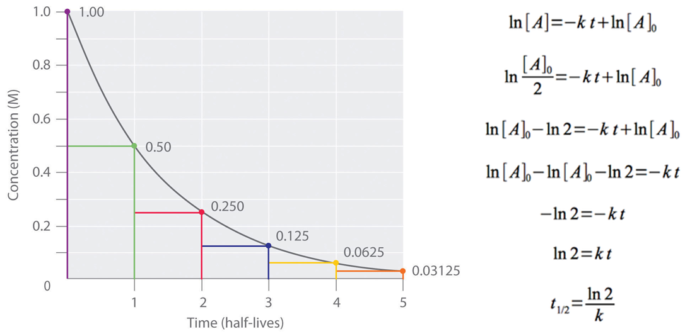
```

(ref:half-life-formula) 반감기와 관련된 수식

반복하지만, 비구획분석에서 k에 가장 가까운 지표는 λ~z~이다. 따라서, 비구획분석에서는 다음의 식 \@ref(eq:halflife)을 통해 반감기 값을 제시한다.\index{반감기}\index{반감기}

\begin{equation}
t_{1/2} = \frac{ln 2}{\lambda_{z}}
(\#eq:halflife)
\end{equation}

이상은 비구획분석에서 산출한 파라미터를 통해 추가적인 의미를 찾고자 하는 시도에 대한 설명이었으며, 이를 보다 분명히 하고자 산출이라는 용어보다는 미지의 값에 대한 `추정'이라는 용어를 사용하였다(통계학적인 추정과는 다른 의미이다). 
그러나, 이상의 과정으로부터 알 수 있듯이 이러한 값들은 계산에 사용되는 파라미터의 값에 크게 의존한다. 
정확히는 약동학적 원리를 이용해 그러한 파라미터들의 형태를 변경한 것에 불과하다. 
따라서, 계산에 사용되는 파라미터의 신뢰성이 보장되지 않는 상황에서 이러한 추정값들을 참값(true value)라고 착각해서는 안 되며, 분석 방법이나 추정 공식이 달라지면 그 값 역시 달라진다는 점을 인지하여야 한다.

\index{반감기}\index{반감기}\index{분포용적}\index{청소율}
실제 생리학적으로는 각 개인의 청소율과 분포용적에 해당하는 기능이 고유의 참값으로 존재하며, 그러한 기능들 간의 상호작용을 통해 반감기 등이 정해지는 것이다. 
즉, 비구획분석에서 추정하는 것이 원인이 되는 생리학적 작용이며, 형성된 농도 및 그에 따른 산출 파라미터 값이 결과이다. 
우리는 결과를 통해 원인을 들여다 보고자 하는 것이다.

## 비구획분석의 개념 확장 -- 항정상태에 대한 추정

\index{항정상태}\index{항정상태}\index{항정상태} \index{약동학}

앞서 비구획분석에서 산출 또는 추정하는 파라미터들은 다양한 한계를 가짐을 설명하였다. 
이 절에서는 또다른 차원에 대한 설명을 추가하고자 한다.
비구획분석은 기본적으로 1회의 약물 투여 후 충분한 시간 동안 관찰한 약물 농도를 기반으로 분석을 수행한다. 
그렇기에 단회 투여 약동학 연구에서 대상 인구집단에서의 기초적 약동학 특성을 확인하고자 할 때 많이 사용된다.
그런데, 대부분의 약물은 반복투여 기반의 용량용법을 설정하는 경우가 많으므로, 이러한 단회투여 연구 결과를 기반으로 항정상태 등에 대한 예측 정보를 얻고자 한다.\index{용량용법(dosage regimen)}

\index{항정상태}
이제 항정상태의 정의를 생각해 보자. 
항정상태는 단위시간 동안에 체내로 들어온 약물량과 제거된 약물량이 같아져서, 일정한 범위 내에서 약물의 농도가 유지되는 상태를 의미한다. 
일반적으로 단위시간은 투여 간격을 의미하는데, 동일한 약물 사용 시 이 간격이 작아질수록 제거될 수 있는 약물량이 적어지므로 투여 간격 중 발생할 수 있는 변동(최대농도와 최소농도 간의 차이, fluctuation)의 크기가 작아지며, 투여 간격이 거의 0에 가까워지는 지속정맥주입 시에는 변동 없이 일정한 농도를 유지하게 된다. 우리가 관심이 있는 것은, 특정한 용량용법 유지 시, 항정상태에서의 평균농도(C~ss,avg~)가 어느 수준일 것인가이다. \index{용량용법(dosage regimen)}
희망하는 투여간격과 목표 *C~ss,avg~*를 정하고 이를 만족시킬 수 있는 용량을 찾는 것이 가장 기본적인 요구이다. 
단회 투여 시 비구획분석과 마찬가지로, 이 역시 용량과 농도 간의 관계이므로 일종의 scaling factor가 필요할 것이다.

그런데, 그림 \@ref(fig:image11)와 같은 약동학적 특성을 가지는 약물 A를 가정해 보자.\index{약동학}

```{r image11, fig.cap="(ref:image11)"}
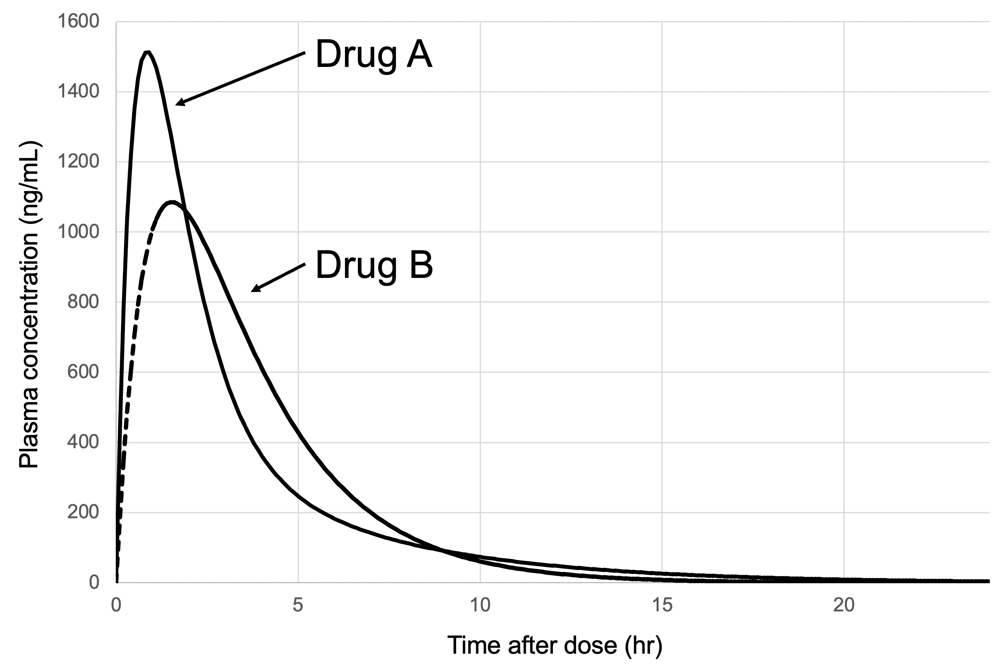
```

(ref:image11) 2구획 약동학 모델. C~p(t)~: 시간 t에서 혈장 약물 농도.\index{약동학}

<!-- {width="5.222718722659668in" height="3.0757666229221345in"} -->

그리고 동일 용량으로 투여된 다른 약물 B가 A와 같은 AUC~inf~값을 갖지만, 투여 직후부터 최종측정시점까지 λ~z~의 기울기만으로 제거되었다고 가정하자. 
이 경우, 두 약물에서 추정되는 V~z~의 값은 같다.
과연 두 약물의 항정상태는 같게 형성될 것인가? \index{항정상태}
약동학을 어느 정도 공부한 사람이라면 이 질문에 대한 답이 "아니오"라는 것은 쉽게 
추론할 수 있다.\index{약동학}
즉, 같은 V~z~가 같은 C~ss,avg~를 보장하지 않는다. 
그래서, 비구획분석에서는 항정상태분포용적(volume of distribution at steady state, V~ss~)를 별도로 구하여 이 문제를 해결하고자 한다.\index{항정상태}

\index{분포용적}

V~ss~를 구하기 위해서는 우선 곡선의 형태 차이를 확인하여야 한다.
그리고 이러한 형태의 차이를 정량화하기 위해 모멘트(moment)라는 개념을
도입한다. 이는 물리학적 개념인데, 여기에서는 특정 시점의 농도값과 그것이
유지된 시간의 곱으로 정의한다. 이렇게 되면, 투여 직후에는 약물 A에서
B보다 그 값이 크고, 시간이 지남에 따라 B보다 A가 그 값이 커지는 등
시간에 따른 곡선 형태의 변화를 반영할 수 있게 된다. 이에 덧붙여,
이론적으로 모멘트 값을 투여 시각으로부터 무한대까지 적분(area under the
moment curve, AUMC)하고, 이 값을 total AUC로 나누면 시간에 해당하는
값이 하나 남게 되는데, 이는 각 농도가 평균적으로 유지된 시간이라는
개념이 된다. 실제 비구획분석에서는 이를 다음의 식 \@ref(eq:mrteq)으로 구한다.

\begin{equation}
\begin{split}
  AUMC(t_i-t_{i+1}) &= \frac{t_i \cdot C(t_i) + t_{i+1} \cdot C(t_{i+1})}{2} \cdot (t_{i+1}-t_i)) \\
  AUMC_{\inf} &= AUMC_{last} + \frac{C(t_{last}) \cdot t_{last}}{\lambda_z} + \frac{t_{last}}{\lambda_z^2} \\
  MRT &= \frac{AUMC_{\inf}}{AUC_{\inf}}
\end{split}
(\#eq:mrteq)
\end{equation}

위는 인접한 채혈 시각 간의 AUMC를 구하는 방법이며, AUMC~last~, AUMC~inf~는 대응하는 AUC의 기간과 같은 의미이다. 
각 농도가 평균적으로 유지된 시간이라는 개념을 평균잔류시간(Mean residence time, MRT)이라 하는데, 조금 더 생각해 보면 적분 개념에서 각각의 농도는 약물 분자 하나하나의 합으로 이루어질 것이며, 그것이 평균적으로 유지된 시간이라는 것은 개별 분자 하나하나가 체내에 머무른 시간과 같다는 것을 알 수 있다.
따라서, 이 둘은 같은 의미로 사용된다. 
다만, 위는 정맥주사 이후 제거만이 존재할 때의 MRT를 산출하는 방법이며, 정맥내주입(식 \@ref(eq:mrt1)) 또는 경구투여(식 \@ref(eq:mrt2)) 등 다른 투여 방법을 이용할 때에는 다소 변형이 필요하다(약물농도의 변화에 영향을 주는 것이 제거만이 아니기 때문임).

\begin{equation}
MRT = \frac{AUMC_{0}^{\infty}}{AUC_{0}^{\infty}} - \frac{T_{inf}}{2}
(\#eq:mrt1)
\end{equation}

\begin{equation}
MRT = \frac{AUMC_{0}^{\infty}}{AUC_{0}^{\infty}} - \frac{1}{k_a}
(\#eq:mrt2)
\end{equation}

<!--
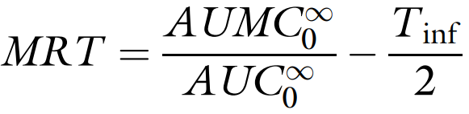
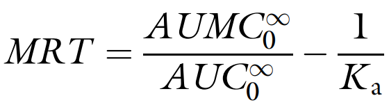
-->

MRT를 구했다면, 이를 이용하여 V~ss~를 구할 수 있다. 다시 항정상태의 특성을 상기해 보면투여 간격 중 투여량과 제거량은 같아야 하며, 이는 식 \@ref(eq:mrtvss)의 유도 과정을 거친다.\index{항정상태}
\index{항정상태}\index{항정상태}

\small

\begin{equation}
\begin{split}
  Administered\ amount\ during\ a\ dosing\ interval &= Dose = C_{ss,avg} \cdot V_{{ss}} \\
  Eliminated\ amount\ during\ a\ dosing\ interval &= Dose = CL \cdot total\ AUC \\
  \ \  &= CL \cdot AUC_{\tau} \\
  C_{ss,avg} \cdot V_{{ss}} &= CL \cdot AUC_{\tau} \\
  V_{{ss}} &= CL \cdot MRT
\end{split}
(\#eq:mrtvss)
\end{equation}

\normalsize

AUC~τ~는 1회의 투여 간격 동안의 시간-농도곡선하면적을 의미하는데, 이 시기의 평균 농도는 C~ss,avg~이므로 AUC~τ~를 C~ss,avg~로 나눠주면 AUC와 AUMC와의 관계와 마찬가지로 MRT가 되기 때문이다. 
위 식 \@ref(eq:mrtvss)을 다시 정리해 보자면, 식 \@ref(eq:vss)을 통해서도 V~ss~를 구할 수 있다.

\begin{equation}
\begin{split}
  V_{ss} = \frac{Dose \cdot AUMC_{inf}}{{{(AUC}_{inf})}^2}
\end{split}
(\#eq:vss)
\end{equation}

따라서, 이 역시 산출된 파라미터의 정확성에 좌우된다는 한계를 가진다.

## 비구획분석 결과의 요약

비구획분석은 기본적으로 각 개인에서 관찰된 농도값으로부터 파라미터를 확보하고, 그러한 파라미터를 집단 수준에서 요약 정리하여 결과를 제시한다. 
이 때, 기술통계학(descriptive statistics)적 분석 방법이 사용되는데 C~max~, AUC~last~, AUC~inf~ 및 그로부터 추정되는 파라미터들은 연속변수이므로 평균 ± 표준편차(mean ± standard deviation)를 제시한다. 
엄밀히 말하자면, 이러한 파라미터가 로그정규분포(log-normal distribution)를 따르는 것으로 알려져 있어, 각 개인에서 산출된 값을 로그변환한 후 그 평균과 표준편차를 구하고 이를 다시 지수변환하여 제시하는 것이 정확하겠다. 
T~max~는 정해진 측정 시각들 중 최대 관찰값을 보인 시각이므로 연속변수가 아니다. 
단순히 시간에 대한 변수로 생각해서 이를 연속변수로 취급해서는 안 된다. 
오히려 이는 명목시각(nominal time)에 가까운 개념이며, 단지 수치적인 형태를 띄고 있을 뿐이다. 
그러기에 요약 시에는 다른 파라미터와 달리 중앙값(median)을 사용하고, 범위(range)를 제시한다.

## 맺음말

이상으로 비구획분석의 이론적 부분에 대해 알아보았다. 
비구획분석은 약동학 자료를 분석하는 가장 기본적이고 간단한 방법이라는 장점이 있지만, 앞서 언급한 바와 같이 다양한 한계를 지니는 방법이다. \index{약동학}
따라서, 이 방법을 사용하거나 해당 방법으로 분석된 자료를 해석할 때에 이 장에 설명된 각 파라미터의 특성과 산출/추정 방식 등이 무엇인지를 충분히 숙지하여야 불필요한 오류의 발생을 최소화할 수 있을 것이다.


<!--chapter:end:02.Rmd-->

---
output:
  pdf_document: default
  html_document: default
---

# 비구획분석의 자료해석 {#nca-analysis}

\Large\hfill
한성필^[약동학 데이터를 분석하여 PK 파라미터를 찾는 업무를 하지 않는 독자들은 이 장을 읽지 않고 넘어가도 좋습니다.] 
\normalsize

```{r include=FALSE}
library(knitr)
library(tidyverse)
opts_chunk$set(echo=TRUE)
```

## 서론 


약동학(PK) 데이터에 대한 자료해석 시 가장 간단하고도 객관적이며 널리 쓰이는 방법은 비구획분석(non-compartmental analysis, NCA)이고 이는 약물의 임상개발에 매우 중요하다.\index{약동학}\index{임상개발}
NCA 결과는 약물개발 중 수행 된 많은 임상약리학 연구(예 : 음식 효과, 약물상호작용 및 생물학적 동등성 연구 등)에 대해 중요한 평가기준이 되는 변수를 제공하게 된다.\index{생물학적 동등성}
약물개발 과정에서 개발된 구획 PK 모델을 평가하거나 결정하는데에도 도움을 준다.
이러한 중요성 때문에 약동학을 공부하고 이를 신약개발에 활용하고자 하는 사람들은 NCA가 제공하게 되는 파라미터의 의미와 그 방법론적 한계에 대해 높은 수준의 이해가 필요하다. \index{약동학}
따라서 NCA는 능숙하고 정확하게 수행되어야 하며 이에 대한 해석을 통해 약물에 대한 지식과 통찰력을 올바르게 축적해 나갈 수 있다. [@noe2020parameter]

이 장에서는 PK 자료에 대해 NCA를 수행하는 방법에 대해 자세히 기술하여 능숙하고 정확한 분석을 돕고자 한다. R 소프트웨어를 사용한 프로그래밍이 필요한 부분이 있어 NCA를 수행하기 위해 꼭 알아야 하는 이론은 기술하였으나, 자세한 사항은 별도의 교재를 통해 학습해야 할 것이다. [@ggplot22016]

## NCA를 위한 자료의 처리 {#data-prep}

### 채혈 시간

예정된 채혈시간을 사용할 경우 농도 자료를 빠르게 분석할 수 있다는 장점이 있으나, 최종 NCA 파라미터의 산출에는 실제 샘플링 시간을 사용해야 한다. 간혹 예정된 채혈시간과 실제 채혈시간의 차이가 극히 적은 경우, 이를 생략하기도 하지만 규제기관에 제출되는 자료에는 이러한 방식의 분석을 하면 안된다. 

실제 채혈시간으로 구성된 자료를 만들기 위해 약동학자는 R 소프트웨어를 주로 사용하게 된다. 방대한 채혈 데이터를 마이크로소프트 엑셀 등을 사용해 다루는 경우 오류의 개입이 될 확률이 커지기 때문이다.  이러한 작업을 도와주는 R 패키지 중 자료를 몇가지 간단한 함수로 빠르게 추출하고 재생성하는 작업에 특화된 dplyr [@R-dplyr], 자료의 형태를 변형하는 tidyr [@R-tidyr], 시간 자료를 쉽게 처리할 수 있는 [@R-lubridate] 등이 있다. \index{약동학}

계획된 채혈 시간은 기술통계량을 구하여 표를 만들거나 농도-시간 곡선 등의 그림을 그리는데 사용될 수 있으므로 실제 채혈시간과 병기하여 하나의 최종 자료에 포함되어 있어야 한다. 

### 정량한계를 벗어나거나 누락된 자료의 처리

농도 분석 결과가 정량한계를 벗어나는 경우 실험실에서 "<LLOQ" 또는 ">ULOQ"라는 보고를 하게 되며 각각 정량하한과 정량상한을 벗어나 신뢰성 있는 농도를 제공하지 못한다는 의미이다. 기본적으로 "\>ULOQ" 자료는 희석을 통해 재분석을 해야 하며 "\<LLOQ" 자료는 재분석을 통해 얻어지기 힘든 경우가 많으므로 그대로 보고하게 된다. 다만 실험실에서 농도분석을 세팅할 때 LLOQ를 과도하게 높은 농도로 설정하는 경우 많은 "\<LLOQ" 값이 보고되는 상황이 발생할 수 있으므로 임상시험 또는 비임상연구에서 예측되는 LLOQ 값을 어느정도 반영할 수 있어야 하는 것이 바람직하다. 구체적으로 약물의 최종 반감기($t_{1/2\beta}$)를 계산하는데 필요한 소실기의 농도 관찰값보다 LLOQ는 1/3 이하라야 하고, 과거에는 이러한 민감도로 농도 측정이 불가능한 상황이 많았으나 현대 분석 기술에서는 많이 개선 되었다.\index{반감기}\index{반감기}

정량한계 미만의 값은 문자로 보고되는 경우가 많으므로 R에서 `as.numeric()` 함수를 사용하면 숫자처럼 보이는 문자(`"10.1"`)는 숫자(`10.1`)로 변환되고, 문자(`"<LLOQ"`)는 `NA`값으로 경고와 함께 변환된다. 이후 T~max~ 값 이전의 NA값은 0으로 변환하고, 이후의 값은 dplyr의 `filter()` 함수를 사용하여 자료에서 제거(`filter(!is.na(DV))`와 같은 명령어를 사용)하는 것이 NCA용 자료를 구성하는 일반적인 방법이다. 

다양한 이유로 누락된 자료가 생길 수 있고, 누락된 자료는 NA로 간주하여 윗 문장과 같이 필터링 아웃 처리하여 제거되게 되나, 이러한 누락 자료가 NCA 파라미터에 어떤 영향을 미치는지 파악할 필요가 있다. 이를테면 C~max~(최고혈중농도)를 제공하는 채혈이 누락된 경우 AUC를 비롯한 이와 연관된 모든 파라미터에 큰 영향을 미치게 되나, 배설 단계 후반의  낮은 농도 값이 누락된 경우 미미한 영향을 미치게 된다. 

### 자료의 제외

분석 오류 또는 시료 취급 중 오류 등으로 자료를 제외해야 하는 경우가 적지않은 빈도로 생길 수 있다. 약물의 배설 과정 중 예측되는 농도 범위를 크게 벗어나거나, 서로 다른 두 대상자(또는 동물 개체) 간의 농도가 뒤바뀌는 등의 상황이 있을 수 있다. 자료가 제외되는 예외적인 상황에서는 임상연구보고서의 약동학 분석 장에서 자료가 제외되는 이유에 대해 근거와 함께 상세히 기록해야 한다. 특히 생물학적 동등성 시험에서 이러한 이슈는 민감할 수 있어, NCA 수행자는 어떤 자료를 무슨 근거로 제외했는지, 그 때 사용한 코드를 처리 방법의 상세한 기술과 함께 보관하고 있어야 한다. \index{생물학적 동등성}\index{약동학}

## 상용 소프트웨어를 이용한 NCA

상용 소프트웨어 중 가장 많이 사용되는 것이 Certara 사의 Phoenix WinNonLin이다. 오랜 시간 많은 연구자들이 사용하여 익숙한 GUI 인터페이스를 제공하고 있고, 혈액, 소변 자료의 NCA 등을 제공하고 간단한 설계의 생물학적 동등성 판정 등 통계 분석도 지원하여 비교적 진입장벽이 낮은 자료 분석 도구라 할 수 있다. \index{생물학적 동등성}

그러나 소규모 제약사나 학교에서 사용하기에 비싼 사용료를 지불해야 한다. 
제약사와 규제기관 등에 더 높은 비용을 요구하고 있는 상황이라, NCA를 빈번하게 사용하지 않는 산업계 종사자들에게 
분석 초보자의 경우 유료 강의를 통한 학습을 필요로 하거나, CDISC(Clinical Data Interchange Standards Consortium)^[임상시험에 관련된 국제표준을 개발하는 표준화 기구로, 2010년부터 미국 FDA와 유럽 EMA는 전자문서(eCTD)로 허가를 신청할 경우 CDISC에서 제정한 표준을 이용한 임상시험 데이터 제출만 허용하고 있다.] 표준 용어로 파라미터를 제공하지 않아 그 의미를 따로 파악해야 하는 어려움이 있다. 비교적 경험이 쌓인 연구자에게는 분석 워크플로우를 프로그래밍 코드를 통해 자동화하는게 불가능한 것이 단점으로 여겨질 수 있다. 윈도우 환경에서만 실행 가능하다는 것도 특정 운영체제를 선호하는 사람에게 제한점이 될 수 있다. 

식약처, 미국 FDA(Food and Drug Administration), 유럽 EMA(European Medicines Agency)를 비롯한 대부분의 규제기관에서는 NCA에 쓰는 특정 소프트웨어를 규정하고 있지 않아, 상용 소프트웨어를 사용하지 않고 약동학적 지표를 구하는 것을 허용하고 있다.\index{약동학}

## NCA에 활용할 수 있는 R package 소개

무료로 누구나 사용할 수 있는 R 패키지를 사용하여 NCA를 통한 약동학적 주요 지표를 구할 수 있다. 비용을 떠나 NCA를 R로 수행하는 가장 중요한 이유는 오류를 줄일 수 있고, 한번 설정한 것을 반복해서 적용하는 것이 쉽기 때문이다. 더 나아가 계량약리학 분석 전후 과정 중에 NCA를 같은 작업환경에서 빠르게 수행할 수 있다는 장점도 있다.\index{약동학}\index{계량약리학}

이 책에서 주로 다루게 될 NonCompart [@R-NonCompart],  ncar [@R-ncar], pkr [@R-pkr] 은 NCA를 R을 통해 쉽고 빠르게 행할 수 있는 R 패키지이다.

NonCompart의 패키지 이름은 `r packageDescription("NonCompart")$Title`, 
ncar의 패키지 이름은 `r packageDescription("ncar")$Title`,
pkr의 패키지 이름은 `r packageDescription("pkr")$Title` 이다.

이들의 기저에 있는 계산 방식은 모두 동일하고 앞서 설명한 상용소프트웨어와 완전히 일치하는 결과를 낼 수 있다. NonCompart의 `DESCRIPTION` 파일을 보면 다음과 같이 설명하고 있다. CDISC SDTM 용어를 사용하기 때문에 표준을 준수한다는 장점도 있다.

> `r packageDescription('NonCompart')$Description`

이를 사용하기 위해 아래의 순서로 R과 Rstudio를 설치해야 한다.

### R 4.x.x의 설치 (윈도우 환경^[윈도의 외의 환경에 대한 것은 별도의 공간 https://github.com/pipetcpt/pharmapk/discussions 에 정리되어 있다.])

1. https://cran.r-project.org 사이트에 접속하여, `Download R for Windows` 링크를 선택한다.
2. `Subdirectories` 유형에서 `base - install R for the first time`을 선택한다.
3. `Download R for Windows` 링크를 선택하여 R-4.x.x-win.exe 설치파일을 다운로드한다.
4. 설치파일을 실행한 후, `이 앱이 디바이스를 변경할 수 있도록 허용하시겠어요?`라는 사용자 계정 컨트롤 창이 나타나면 `예` 버튼을 클릭한다.
5. 설치 언어는 `한국어`로 선택하고 `확인` 버튼을 클릭한다.
6. R 4.x.x 설치 정보 내용을 확인하고, `다음` 버튼을 클릭한다.
7. R 4.x.x 프로그램의 설치 경로를 지정하여 `다음` 버튼을 클릭한다.
8. R.4.x.x 구성요소 설치는 32bit files를 제외하고 나머지 구성요소들만 체크한 후 다음 버튼을 클릭한다.
9. 스타트 옵션을 조정하는 화면이 나타나면, `No`를 선택하고 `다음` 버튼을 클릭한다.

### Rstudio 설치 (윈도우 환경)
1. <https://rstudio.com/products/rstudio/download/> 사이트에 접속하여 `Rstudio Desktop free download` 버튼을 클릭한다.
2. [2. Download Rstudio Desktop]의 `DOWNLOAD RSTUDIO FOR WINDOWS(64bit)` 파란색 버튼을 클릭하고, `Studio-1.x.x.exe` 파일을 다운받는다.
3. RStudio-1.x.x.exe 파일을 실행하면 `이 앱이 디바이스를 변경할 수 있도록 허용하시겠어요?`라는 사용자 계정 컨트롤 창이 나타나면 `예` 버튼을 클릭한다.
4. Rstudio 설치 시작 창이 나타나면 `다음` 버튼을 클릭한다.
5. Rstudio를 설치할 경로를 지정하고 `다음` 버튼을 클릭한다.
6. Rstudio 바로가기 아이콘이 생성될 시작메뉴 폴더 안에 `Rstudio`를 입력하고 `설치` 버튼을 클릭한다.
7. Rstudio 설치가 완료되면 `마침`버튼을 클릭한다.

Rstudio를 실행한 후, 콘솔 창에서 NCA를 위한 패키지를 설치하는 방법은 다음과 같다. 홑따옴표 등의 인용 부호에 주의해야 한다.

```{r, eval = FALSE}
install.packages('NonCompart')
install.packages('ncar')
install.packages('pkr')
```

설치는 한번만 하면 되지만, NCA를 위해서는 매 세션마다 패키지를 `library()` 함수를 사용하여 불러와야 한다.

```{r eval = FALSE}
library(NonCompart)
library(ncar)
library(pkr)
```

R을 사용하다가 도움이 필요할때는 맨 앞에 물음표를 붙여서 콘솔창에 입력하거나 `help()` 함수를 사용할 수 있다.

```{r, eval = FALSE}
?NonCompart
help(tblNCA)
```

## NCA를 위한 데이터셋의 작성

자료의 첫 10개 (표 \@ref(tab:head)) 또는 마지막 10개 관찰값만 보고 싶으면 다음을 입력한다.
대상자 번호가 첫 열에 나와있고 시간 순서대로 혈장에서 측정한 테오필린의 농도가 나와있다. 
이러한 모습과 흡사하게 자료를 만들어야 하며 이는 앞선 \@ref(data-prep)절의 내용을 참고할 수 있다. 

```r
head(Theoph, n=10)
tail(Theoph, n=10)
```

```{r head, echo = FALSE}
kable(head(Theoph, n=10), caption = 'Theoph 자료의 첫 10개 관찰값',
      row.names = FALSE, booktabs = TRUE)
```

`ggplot2` 패키지[@R-ggplot2]로 그림을 그려서 대략적인 자료의 모습을 파악할 수 있다. (그림 \@ref(fig:ggtheoph)) ggplot2에 대한 설명은 본서의 범위를 벗어나므로 별도의 교재를 통해 학습할 수 있다. [@ggplot22016]

```{r ggtheoph, fig.cap = 'Theoph의 경구 투여 후 농도-시간 곡선 (N = 12)', fig.width = 6, fig.height = 3.5}
ggplot(Theoph, aes(Time, conc, color = Subject)) +
  geom_point(size=2, alpha=0.5) + 
  geom_line(size=1, alpha=0.5) +
  theme_bw() +
  labs(title = 'Oral Administration of Theoph (320 mg)',
       x = 'Time (hour)', y = 'Concentration (ng/mL)')
```

## 자료 불러오기 {#loading}

가장 단순한 형태의 자료는 CSV파일로 쉼표로 구분된 문서로 메모장 등 텍스트 편집기로 파일을 열었을 때에도 자료를 확인 가능한 형태이다. 
이러한 파일은 `read.csv()` 또는 `readr`패키지[@R-readr]의 `read_csv()` 함수를 사용해서 자료를 불러 온다.
엑셀 파일을 사용하는 경우 `readxl` 패키지[@R-readxl]를 설치한 후에 `read_excel()` 함수를 사용해서 불러올 수 있다. 

다만 `read_csv(), read_excel()`을 사용하는 경우 `tibble` 형태로 자료가 변형되고 이러한 형태의 자료는 `tblNCA()` 사용시 오류를 일으키기 때문에 사전에 `as.data.frame()`을 사용해서 데이타프레임으로 변형해주어야 한다. ^[https://groups.google.com/a/pagk.or.kr/g/list/c/VGy3lhWig7o]

## NonCompart R 패키지를 이용한 NCA 

### tblNCA(): 전체 대상자 NCA {#tblNCA}

```{r include=FALSE}
library(NonCompart)
```

가장 많이 쓰는 함수이다.
NonCompart 패키지의 핵심적인 기능이다.
코드 \@ref(exm:tblnca-code)를 R의 콘솔창에 넣어 테오필린 경구 투여시의 NCA를 빠르게 수행할 수 있다. 

```{example, tblnca-code, echo=TRUE}
NonCompart 패키지의 tblNCA() 함수를 사용한 비구획분석 R 코드
```
<!--\vspace{-5ex} -->
\vspace{-2ex}
```{r}
Theoph_tblNCA <- tblNCA(Theoph, "Subject", "Time", "conc", 
                        dose=320, concUnit="mg/L")
```

코드 \@ref(exm:tblnca-code)에서 `dose=320`으로 되었다는 것은 아미노필린 400mg 투여시 테오필린 320mg이 경구로 투여되었음을 의미한다.

결과는 문자(character)로 구성된 matrix로 구성된 결과물과 단위 정보가 담긴 attribute를 포함하고 있다.
본문에 결과를 싣기에 지면이 부족하여 [별첨 A](#Theoph_tblNCA)에 수록하였고, 여기에서는 dplyr의 `select()` 함수를 사용하여 핵심적인 일부 파라미터 (C~max~, T~max~, AUC~last~, $t_{1/2\beta}$)만 표시하였다.

```{r}
Theoph_tblNCA_selected <- Theoph_tblNCA %>% 
  dplyr::select(Subject, CMAX, TMAX, AUCLST, LAMZHL)
Theoph_tblNCA_selected
```

위의 예에서 가장 간단한 형태의 NCA를 실행하였지만, 보다 정밀한 분석은 tblNCA() 함수의 인자(argument)를 살펴봄으로서 알 수 있다. `?tblNCA()` 또는 `args(tblNCA)` 명령어를 통해 아래 결과를 얻을 수 있다.

```r
tblNCA(concData, key = "Subject", colTime = "Time", colConc = "conc", 
       dose = 0, adm = "Extravascular", dur = 0, doseUnit = "mg", 
       timeUnit = "h", concUnit = "ug/L", down = "Linear", R2ADJ = 0.9, 
       MW = 0, iAUC="")
```
R에서는 함수이름(tblNCA) 뒤의 괄호 안에 쉼표로 구별되는 인자를 통해 구체적인 자료의 성격을 입력해야 한다. 
`concData`는 데이터셋 이름을 넣어주고, `key`는 subject ID의 컬럼명 또는 treatment code의 컬럼명 (교차시험 등에서)을 벡터 형태(`c('subject', 'period', 'treatment')`)로 지정할 수 있다. 여기서 key로 들어간 컬럼은 모두 결과 표의 초반에 그대로 출력되게 된다.
`colTime`은 time의 컬럼명, `colConc`는 농도(concentration)의 컬럼명 등을 함수 인자로 갖는다. 그 외 인자들에 대해서 살펴보자면 다음과 같다. 

1. `down`
    - AUC와 AUMC를 구하는 trapezoidal method 설정이며, 기본값은 `Linear`이다.
    - `Linear`와 `Log` 중 선택 가능하며 각각 linear trapezoidal method와 linear-up and log-down method를 의미한다.
1. `dose`
    - 투여량에 대한 설정이다. 단위에 주의해야 한다.  벡터값을 줌으로서 각 대상자별 용량을 다르게 할 수 있다.
1. `adm`
    - 투여경로에 대한 설정, 기본값은 "Extravascular"으로 경구 투여 등을 의미한다.
    - Bolus, Infusion, Extravascular 중에서 선택 가능하다.
1. `dur`
    - 주입하는 기간(infusion duration)을 설정한다. 기본값은 0이다.
1. `R2ADJ`
    - `R2ADJ` 값이 설정값 이하인 경우, `DetSlope()` 함수에 의해 최종 기울기(terminal slope)를 상용소프트웨어와 유사하게 수동으로 고를 수 있게 된다.


인도메타신 정맥 투여시의 NCA이다. 함수인자 `adm`을 infusion으로 바꾼 것을 볼 수 있고 `dur`가 추가된 것을 볼 수 있다.

```{r}
Indometh_tblNCA <- tblNCA(Indometh, key="Subject", 
                          colTime="time", colConc="conc", dose=25, 
                          adm="Infusion", dur=0.5, 
                          concUnit="mg/L", R2ADJ = 0.8)
```

역시 핵심적인 일부 파라미터 (C~max~, T~max~, AUC~last~, $t_{1/2\beta}$)만 표시할 수 있다.

```{r}
Indometh_tblNCA_selected <- Indometh_tblNCA %>% 
  select(Subject, CMAX, TMAX, AUCLST, LAMZHL) %>% 
  print()
```

### sNCA()

많이 쓰이지 않는 기능이지만, 한명의 대상자(또는 개체)에 대해 NCA를 시행한다. 

```{r}
# For one subject
x <- Theoph[Theoph$Subject=="1","Time"]
y <- Theoph[Theoph$Subject=="1","conc"]

sNCA(x, y, dose=320, doseUnit="mg", concUnit="mg/L", timeUnit="h")
```

이때의 그림은 다음과 같다.  (그림 \@ref(fig:ggtheophindi))

```{r ggtheophindi, fig.cap = '테오필린의 경구 투여 후 개별 대상자의 농도-시간 곡선 (Subject 1)', fig.width = 6, fig.height = 3.5}
ggplot(Theoph %>% dplyr::filter(Subject == 1), 
       aes(Time, conc, group = Subject, color = Subject)) +
  geom_point(size = 4) + geom_line(size = 1) +
  theme_minimal() +
  labs(title = 'Oral Administration of Theoph (320 mg) (Subject 1)',
       x = 'Time (hour)', y = 'Concentration (ng/mL)')
```

## NCA 보고서

NCA 후 완전한 형태의 자료의 전달을 위해 분석 환경을 상세히 기술한 보고서는 필수적이다. 
상용소프트웨어에서 이러한 보고서 작성 기능이 잘 갖추어져 있는데, 무료 NCA 소프트웨어에는 드물게 지원하는 기능이다.
ncar은 상용소프트웨어의 보고서의 모든 정보를 포함하는 보고서를 만드는 R 패키지이다. 현재 설정된 작업 디렉토리(working directory) 또는 지정된 위치에 결과 파일이 생성된다.

```{r include = FALSE}
library(ncar)
```

### txtNCA()

txtNCA()를 통해서 다음 결과를 얻을 수 있다. 

```{r eval=FALSE}
txtNCA(Theoph[Theoph$Subject=="1","Time"],
       Theoph[Theoph$Subject=="1","conc"], 
       dose=320, doseUnit="mg", concUnit="mg/L", timeUnit="h")
```

파일로 저장하려면 다음을 입력한다. 

```{r}
writeLines(txtNCA(Theoph[Theoph$Subject=="1","Time"],
                  Theoph[Theoph$Subject=="1","conc"], 
                  dose=320, doseUnit="mg", concUnit="mg/L",
                  timeUnit="h"), 
           'Output-ncar/txtNCA-Theoph.txt')
```

\small
```{bash, code = readLines('Output-ncar/txtNCA-Theoph.txt'), eval = FALSE}
```
\normalsize

### pdfNCA()

pdfNCA()로 pdf로 결과를 볼 수 있다. (그림 \@ref(fig:pdfncaoutput)) 이렇게 생성된 파일은 임상시험보고서(CSR)의 별첨으로 첨부하게 된다.

```{r pdfNCA, eval=FALSE}
ncar::pdfNCA(fileName="Output-ncar/pdfNCA-Theoph.pdf", Theoph, key="Subject", 
             colTime="Time",  colConc="conc", dose=320, doseUnit="mg", 
             timeUnit="h", concUnit="mg/L")
```

```{r include = FALSE}
system("magick -density 150 Output-ncar/pdfNCA-Theoph.pdf Output-ncar/pdfNCA-Theoph-%02d.png")
system("magick montage Output-ncar/pdfNCA-Theoph-01.png Output-ncar/pdfNCA-Theoph-02.png Output-ncar/montage.png")
```

```{r pdfncaoutput, fig.cap = 'pdfNCA() 출력 결과', echo = FALSE}
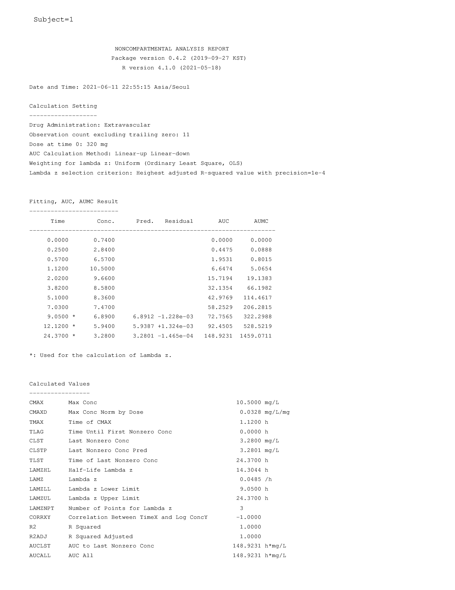
```

### rtfNCA()

마이크로소프트 워드에서 편집가능한 rtf파일을 만들 수 있다. 이렇게 생성된 파일은 위 PDF파일과 마찬가지로 임상시험보고서(CSR)의 별첨으로 첨부하게 된다.

```{r eval = FALSE}
ncar::rtfNCA(fileName="rtfNCA-Theoph.rtf", Theoph, key="Subject", 
             colTime="Time", colConc="conc", dose=320, doseUnit="mg", 
             timeUnit="h", concUnit="mg/L")
```

## NCA의 시각화 plotPK()

NCA에 대한 다양한 시각화는 여러 유용한 정보를 제공해 줄 수 있으나, R로 분석을 시작하는 사람은 다소 어려움을 겪을 수 있다.
이를 비교적 쉽게 가능하게 해 주는 `pkr` 패키지[@R-pkr]가 있다.
`Theoph` 자료의 시각화를 아래의 명령어를 통해 수행할 수 있다. 

```{r eval = TRUE}
library(pkr)
pkr::plotPK(Theoph, "Subject", "Time", "conc", 
            unitTime = "hr", unitConc = "mg/L", dose = 320)
```

조금 기다린 후 `Output` 폴더를 확인해 보면 세개의 그림 파일과 두개의 PDF 파일이 생성된 것을 볼 수 있다. (그림 \@ref(fig:pkr1), \@ref(fig:pkr2), \@ref(fig:pkr3))
평균 약동학 파라미터와 그룹 농도-시간 그림 및 개별 대상자의 약동학 파라미터와 개별 농도-시간 그림이 생성된다.\index{약동학}

```{r pkr1, echo = FALSE, fig.cap = '평균 약동학 파라미터와 그룹 농도-시간 그림 (선형)', out.width='95%'}
knitr::include_graphics('Output/PK Profile Linear Scale for Theoph.png')
```

```{r pkr2, echo = FALSE, fig.cap = '평균 약동학 파라미터와 그룹 농도-시간 그림 (로그)', out.width='95%'}
knitr::include_graphics('Output/PK Profile Log 10 Scale for Theoph.png')
```

```{r pkr3, echo = FALSE, fig.cap = '평균 약동학 파라미터와 그룹 평균 농도-시간 그림 (로그)', out.width='95%'}
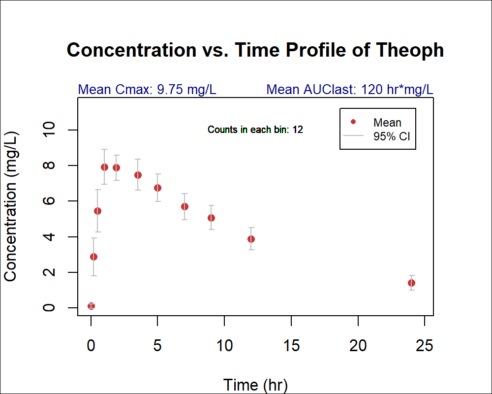
```

## 파라미터의 의미 {#parameters}

NCA 시 여러 파라미터가 나오며 약어로 표현하는 경우가 많다. 또한 소프트웨어마다 약어가 상이하기 때문에 자주 그 의미를 찾아볼 필요가 있다. 콘솔창에 다음을 입력하여 의미를 파악할 수 있다.

```{r eval = FALSE}
?ncar::txtNCA()
ncar::RptCfg
```

ncar::RptCfg의 일부를 첨부한다. (표 \@ref(tab:rptcfg)) `PPTESTCD`는 NonCompart 패키지에서 출력하는 파라미터 이름이며, CDISC SDTM PPTESTCD (Parameter Short Name)^[다음과 같이 CDISC note에 표시되어 있다. 'Short name of the pharmacokinetic parameter. PPTESTCD cannot contain characters other than letters, numbers, or underscores. Examples: "AUCALL", "TMAX", "CMAX".']와 같은 값이다. `WNL` 열은 Certara Phoenix WinNonLin에서 구한 파라미터 이름이다.

```{r rptcfg, echo = FALSE}
param_table <- ncar::RptCfg %>% 
  select(PPTESTCD, SYNONYM, WNL) %>%
  mutate(`Description (WNL)` = sprintf('%s (%s)', SYNONYM, WNL)) %>%
  select(1, 4)

kable(param_table, 
      caption = 'NonCompart에서 결과로 제시하는 파라미터와 그에 대한 설명 및 Certara Phoenix WinNonLin에서 보고되는 파라미터',booktabs=TRUE, longtable = TRUE)
```

각 파라미터의 의미를 아래에 풀이하였다.

**Cmax (CMAX)**

최대 농도. C~max~는 피크 (최대) 농도이다. 이 농도에서 시간은 T~max~라고 지칭한다. 채혈 일정(샘플링 시간 간격)에 따라 실제 체내에서의 최대 농도와 차이가 클수도 크지 않을 수 있으며, 가급적 차이를 줄일 수 있도록 C~max~ 부근에서의 채혈은 촘촘히 이뤄져야 한다.

**Cmax_D (CMAXD)**

투여 용량으로 보정된  C~max~이다. 이는 C~max~를 복용량으로 나눈 값이다. 복용량은 총량이어야 하며, 체중당 투여량의 경우 대상자에게 주어진 투여량으로 환산하게 입력해야 한다. (즉, mg / kg이 아닌 mg).\index{체중}

**Tmax (TMAX)**

T~max~는 제거속도가 흡수속도와 같은 시점이며 이때의 농도는 최대(C~max~)로 관찰된다. 만일 주어진 데이터에 여러 피크 농도가있는 경우 첫 번째 시점이 선택된다.

**Tlag (TLAG)**

0이 아닌 첫 번째 농도까지의 시간이다. 지연 시간은 약물 투여와 흡수 시작 사이의 시간 지연을 나타낸다. 빠른 약물 작용이 필요할 때, Tlag는 그 목적을 위한 후보 약물의 선정에 대해 정보를 줄 수 있다. 혈관 외 투여의 경우 첫 번째 관찰 가능한 농도 측정 이전 마지막 관찰시점을 말한다.\index{지연 시간}

**Clast (CLST)**

농도 측정이 가능한 마지막 시점을 의미한다. AUC~inf~의 외삽을 위해 사용되는 중요한 정보이다.

**Tlast (TLST)**

마지막 농도 측정이 된 시간을 의미한다. (Clast에서의 시간).

**Rsq (R2)**

Rsq는 NCA에 사용 된 선형 회귀에서 상관 계수 (r)의 제곱이다. 즉, 로그 변환 된 관측 농도 대 시간 데이터가 적합 회귀선에 얼마나 가까운지를 알려주는 통계적 적합도 측정값이다. 그러나 R-제곱은 치우침을 결정할 수 없으므로 잔차(residual) 그림도 확인해야할 필요가 있다. 

**Rsq_adjusted (R2ADJ)**

최적 모델을 검색하는 동안 데이터 포인트가 추가되면 적합도를 개선하지 않고 Rsq가 증가 할 수 있다. 조정 R-제곱은 예측 변수의 수(여기서는 데이터 포인트)에 대해 변형된 R- 제곱으로 모집단 R-제곱의 편향되지 않은 추정치로 사용할 수 있다. 일반적으로 Rsq 보다 작다. 가장 적은 수의 데이터 포인트로 조정 R-제곱을 최대화하는 기울기 및 절편이 탐색되고, 가장 적합한 모델로 선택된다. 공식은 아래와 같다.

$$R_{adj}^{2} = 1 - (1 - R^{2})\frac{n - 1}{n - 2}$$

**Corr_XY (CORRXY)**

람다 z 추정에 사용된 포인트에 대한 시간(X)과 로그 농도(Y) 간의 상관 관계이며, 일반적으로 음수값이다. 상관 관계가 높을수록 불규칙한 농도가 줄어들고 더 잘 맞는다고 생각할 수 있다. 

**b0 (b0)**

로그 농도 대 시간의 회귀선의 절편이다. CLSTP 계산에 사용되지만 정맥주사(i.v. bolus)의 경우 외삽된 C0 (시간 0에서의 농도)에는 사용되지 않는다.

**Lambda_z (LAMZ)**

양의 값으로서 시간에 대한 자연로그 농도 회귀선의 마지막 기울기를 의미한다. 0 값의 로그 변환은 음의 무한대를 생성하고 회귀를 불가능하게하므로 회귀 전에 모든 0 값을 일시적으로 제거해야 한다. 최종 기울기(마지막 관찰 시점부터 최소 3 개 지점까지)가 자동으로 결정되는 경우 최적 기울기는 최대 R2ADJ에서 허용 한계 (기본값은 1e-4) 내에서 가장 긴 기울기로 결정된다. 

**No_points_Lambda_z (LAMZNPT)**

LAMZ 계산에 사용되는 관찰 농도의 개수이다.

**Lambda_z_lower (LAMZLL)**

Lambda z의 계산에 포함되는 값의 시간 하한이다. LAMZ (터미널 기울기) 계산에 사용 된 가장 빠른 시점이다.

**Lambda_z_upper (LAMZUL)**

Lambda z 계산에 포함되는 값의 시간 상한이다. LAMZ (터미널 기울기) 계산에 사용 된 마지막 시점이다.

**HL_Lambda_z (LAMZHL)**

최종 반감기. Lambda Z (LAMZ)는 로그 농도-시간 곡선의 최종 부분에 대한 1 차 속도 상수이며, 최종 반감기는 ln (2) / LAMZ로 계산된다.\index{반감기}\index{반감기}

**Clast_pred (CLSTP)**

선형 회귀는 약동학 분석에서 제거율 상수를 계산하는 데 사용되며 적합도에 대한 기울기, 절편 및 R-제곱을 추정한다. 계산은 가중치가 없는 선형 회귀에 의해 수행되며, CLSTP는 회귀에 의해 Tlast에서 예측 된 농도이다. CLSTP은 AUCIFP, AUCPEP, AUMCIFP, AUMCPEP, MRTIVIFP, MRTEVIFP, VZP, VZFP, CLP, CLFP 및 VSSP (P로 끝나는 파라미터) 계산에 사용되며, 이 값을 얻는 공식은 다음과 같다.\index{약동학}

$$ C_ {last, pred} = exp(\beta_{0}-\lambda\cdot T_{last}) $$

**C0 (C0)**

초기 농도. 시간 0에서의 농도, 초기 농도. 처음 두 농도가 양수이고 첫 번째 농도가 두 번째 농도보다 크면 다음과 같이 C0를 계산할 수 있다. 그렇지 않으면 C0는 첫 번째 양수 농도가 된다. 

$$ C_ {0} = exp (log (c_ {1})-t_ {1} \frac {log (c_ {2})-log (c_ {1})} {t_ {2}-t_ {1} }) $$

**AUClast (AUCLST)**

투약 후 마지막 양수의 농도까지의 시간-농도 곡선 아래 영역을 의미한다. NCA에서 가장 널리 사용되는 계산 방법은 선형 사다리꼴 규칙 (linear-up, linear-down) 또는 로그 선형 사다리꼴 규칙(linear-up, log-down). 선형 사다리꼴 방법의 경우 아래의 공식을 사용한다.

$$AUC_{last} = \sum_{i = 2}^{}\frac{(t_{i} - t_{i - 1}) \times (c_{i} - c_{i - 1})}{2}$$

간헐적으로 나오는 0 농도는 AUCLST 및 AUCALL 모두에 포함되지만 AUCLST에서는 후행하는 0 값이 제거되는 반면, AUCALL에서는 제거되지 않는다는 큰 차이가 있다.

**AUCall (AUCALL)**

마지막 농도가 측정 가능한지 여부에 관계없이 투여 시점부터 마지막 관찰 시점까지의 곡선하 면적을 의미한다. 따라서 AUCALL은 모든 0 값 관찰을 계산에 사용한다. 

**AUCinf_obs (AUCIFO)**

마지막으로 관찰된 농도를 기준으로 투여 시간으로부터 무한대로 외삽된 AUC이며 공식은 아래와 같다.

$$AUC_{inf,obs} = AUC_{last} + \frac{C_{last}}{\lambda_{z}}$$

**AUC_%Extrap_obs (AUCPEO)**

Tlast에서 무한대로 외삽된 AUC의 백분율이다. AUCIFO에서 외삽된 부분이 과도하게 크다면 약물의 배설 과정에 대한 정보가 일부 누락되었다고 생각할 수 있다.

$$AUC_{\% Extrap,obs} = (1 - \frac{AUC_{last}}{AUC_{inf,obs}}) \times 100$$

**AUCinf_D_obs (AUCIFOD)**

무한대로 외삽된 관찰된 AUC을 투여 용량으로 나눈 값이다.

$$AUC_{dose,inf,obs} = \frac{AUC_{inf,obs}}{Dose}$$

**AUCinf_pred (AUCIFP)**

예측된 마지막 농도를 기반으로 투여 시간에서 무한대로 외삽된 AUC.
$$AUC_{inf,pred} = AUC_{last} + \frac{C_{last,pred}}{\lambda_{z}}$$


## 기술통계 (Descriptive statistics)

\index{기술통계}

R에서는 필요에 따라서 자신만의 함수를 만들 수도 있다. 
코드 \@ref(exm:desctblnca)를 실행하면 `desc_tblNCA()` 함수를 사용하여 기술통계량을 쉽게 구할 수 있다. (표 \@ref(tab:theodesc) and \@ref(tab:indodesc))
psych 패키지의 `describe()` 함수를 사용하였으므로 이에 대한 설치를 해야 한다. (`install.packages('psych')`) [@R-psych]

```{example, desctblnca, echo=TRUE}
핵심 기술통계량(자료개수, 평균, 표준편차, 중앙값, 최소값, 최대값)을 수월하게 구하기 위한 사용자 생성 함수의 예
```
<!--\vspace{-5ex} -->
\vspace{-2ex}
```{r}
desc_tblNCA <- function(tblNCA){
  psych::describe(tblNCA) %>%
    select(n, mean, sd, median, min, max)
}
```

```{r eval = FALSE}
desc_tblNCA(Theoph_tblNCA_selected)
desc_tblNCA(Indometh_tblNCA_selected)
```

```{r theodesc, echo = FALSE}
desc_tblNCA(Theoph_tblNCA_selected) %>% 
  kable(booktabs = TRUE, 
        caption = '테오필린 경구 투여 후 약동학 파라미터의 기술 통계')
```

```{r indodesc, echo = FALSE}
desc_tblNCA(Indometh_tblNCA_selected) %>% 
  kable(booktabs = TRUE, 
        caption = '인도메타신 정맥 주입 후 약동학 파라미터의 기술 통계')
```

## NCA 후 생물학적 동등성 판별 {#bioequivalence}

### 이론

생물학적동등성시험(bioequivalence test)는 기존 의약품의 특허가 만료된 후, 해당 의약품을 동일하게 개발하여 판매하고자 할 때 수행하는 임상시험이다.
기존 오리지널 의약품(Reference)과 새로 개발한 의약품 즉 시험약(Test)을 교차연구(crossover study)의 형태로 투여한 뒤, 얻어진 혈장약물농도로부터 구한 C~max~와 AUC를 비교하여 평가하게 된다. 

2x2 cross-over design이 가장 기본적인 디자인(통상 RT / TR)으로 사용된다. 대상자를 무작위로 두 군으로 나누어 각 군별로 동일 성분의 대조약과 시험약을 각각 투여(제1기 투약)하고 대상자별로 투약 전후 정해진 시간마다 약동학 채혈을 실시한다. 이전에 투여한 약이 모두 배설될 정도로 충분한 기간 경과(보통 반감기의 5배 이상) 후 각 군별로 대조약과 시험약을 바꾸어 각각 투여하고(제2기 투약) 동일하게 약동학 채혈을 실시한다. \index{반감기}\index{약동학}\index{반감기}

시뮬레이션된 농도들로부터 얻어진 C~max~와 AUC를 사용해 자료가 구성되고, NCA에 사용될 자료의 형태는 아래의 표와 같다. SEQ(sequence, 순서군) 혹은 GRP(group), TRT(treatment, 치료), SUBJ(subject, 대상자 구분자), PRD(period, 기)의 자료가 열 형태로 제시되어야 하며 이는 NonCompart에서 key로 사용되기 때문에(`key=c('SUBJ', 'GRP', 'PRD', 'TRT')`) 유사한 형태로 자료를 만들어야 한다. \index{시뮬레이션}

SUBJ | GRP | PRD | TRT | nTIME | TIME | CONC
--- | --- | --- | --- | --- | --- | ---
1 | RT | 1 | R | 0 | 0 | 0
1 | RT | 1 | R | 0.25 | 0.26 | 511.3
1 | RT | 1 | R | 0.5 | 0.46 | 678.79
1 | RT | 1 | R | ... | ... | ...
1 | RT | 2 | T | 0 | 0 | 0
1 | RT | 2 | T | 0.25 | 0.25 | 487.62
1 | RT | 2 | T | 0.5 | 0.48 | 769.6
... | ... | ... | ... | ... | ... | ...
5 | TR | 1 | T | 0 | 0 | 0
5 | TR | 1 | T | 0.25 | 0.23 | 382.79
5 | TR | 1 | T | 0.5 | 0.45 | 477.03
5 | TR | 1 | T | ... | ... | ...
5 | TR | 2 | R | 0 | 0 | 0
5 | TR | 2 | R | 0.25 | 0.28 | 596.98
5 | TR | 2 | R | 0.5 | 0.47 | 832.76
5 | TR | 2 | R | ... | ... | ...
... | ... | ... | ... | ... | ... | ...

비교평가항목은 검체가 혈액인 경우, 1회 투약 시 AUC~t~, C~max~, 반복투약 시 AUC~τ~, C~ss,max~를 주로 사용한다. 다만, 니트로글리세린 설하정과 같이 빠른 약효를 나타내는 제제 등은 Tmax를 비교평가항목으로 추가하기도 한다. 약동학 파라미터는 로그정규분포(log-normal distribution)을 따르고, 대조약과 시험약의 산출된 곡선하 면적(AUC)과 최대 농도 C~max~의 geometric mean ratio가 0.8 ~ 1.25 이내일 때, 약동학적으로 동등하다고 평가하게 된다.\index{약동학}
생물학적 동등성을 위한 수학 식은 다음과 같다. \@ref(eq:bioequiv)\index{생물학적 동등성}

\begin{equation}
\begin{split}
  0.8 < & 90\%\ CI\ of\ \frac{GM(AUC_{last, test})}{GM(AUC_{last, ref})} < 1.25 \\
  0.8 < & 90\%\ CI\ of\ \frac{GM(AUC_{last, test})}{GM(AUC_{last, ref})} < 1.25 
\end{split}
(\#eq:bioequiv)
\end{equation}

$$
Y_{ijk} = \mu + S_{ik} + P_{j} + F_{j,k} + C_{(j-1,k)} + \varepsilon_{ijk}
$$

이때에 μ: 전체 평균, S~ik~: k 번째 sequence에서 i 번째 subject의 효과(랜덤), P~j~: j번째 period 의 효과(고정), F~j,k~; k 번째 sequence에서 j 번째 period의 제제의 효과(고정), C~(j-1,k)~: k 번째 sequence에서(j-1) 번째 period의 잔류효과(고정), ε~ijk~ : 오차항으로 정의한다. 
이 모델에서 사용하는 가정은 1) S~ik~ ∼ N(0,σ~s~^2^), 2) ε~ijk~ ∼ N(0,σ~ε~^2^), 3) S~ik~ 와 ε~ijk~가 독립이라는 세 가지이다. 이때 (μ~T~ - μ~R~)에 대한 (1-2α) × 100% 신뢰구간이 ln(0.8), ln(1.25) 안에 들어가면 두 제제가 생물학적으로 동등하다 결론을 내릴 수 있다. 

생물학적 동등성을 평가하는데 통계학은 핵심적인 역할을 수행하고 있고, 통계적 분석을 위해서는 컴퓨터 소프트웨어가 필요하다. SAS는 통계 패키지중에서는 가장 방대하고 다양한 분석을 제공하고 전 세계적으로 생물학적동등성의 판단을 위해 표준으로 사용되고 있다. 아래의 SAS 코드로 ANOVA 표와 신뢰구간을 구할 수 있다.\index{생물학적 동등성}

```sas
PROC GLM DATA=BE OUTSTAT=STATRES; /* GLM use only complete subjects. */
CLASS SEQ PRD TRT SUBJ;
MODEL LNAUCL = SEQ SUBJ(SEQ) PRD TRT;
RANDOM SUBJ(SEQ)/TEST;
LSMEANS TRT /PDIFF=CONTROL('R') CL ALPHA=0.1 COV OUT=LSOUT;

PROC MIXED DATA=BE; /* MIXED uses all data. */
CLASS SEQ TRT SUBJ PRD;
MODEL LNAUCL = SEQ PRD TRT;
RANDOM SUBJ(SEQ);
ESTIMATE 'T VS R' TRT -1 1 /CL ALPHA=0.1;
ODS OUTPUT ESTIMATES=ESTIM COVPARMS=COVPAR;
```

그러나 SAS를 사용하는데 몇가지 어려움이 있다. SAS 설치하고 입력자료를 불러오는 작업이 다소 어렵고, 과정이 복잡하며 큰 유지 비용이 든다. 특히 약동학 분석 초보자나 통계학 비전공자가 사용하기 어려웠다. \index{약동학}

### BE R 패키지를 사용한 생물학적 동등성 판정\index{생물학적 동등성}

2x2의 생물학적 동등성을 판정하기 위한 가장 간단하고 손쉬운 방법은 Chow와 Liu의 책의 내용[@chow2009design]을 충실히 반영한 BE 패키지[@R-BE]를 사용하는 것이다. 위에서 NCA 관련 패키지를 설치하였듯 BE 패키지를 아래 명령어를 사용하여 설치 및 불러오기 할 수 있다.  \index{생물학적 동등성}

```r
install.packages("BE")
library(BE)
```

```{r, message = FALSE, include = FALSE}
library(BE)
```

BE 패키지 중 핵심이 되는 함수는 `be2x2()` 이다. 현재로서는 2x2 디자인의 간단한 임상시험 디자인만을 지원하고 있으며 (그림 \@ref(fig:twobytwo)) 이외의 디자인은 sasLM 패키지[@R-sasLM]를 사용하여 분석해야 한다. 

```{r twobytwo, fig.cap = '전형적인 2x2 설계', echo=FALSE}

```

BE 패키지에 내장되어 있는 자료인 `NCAResult4BE`를 사용하여 예제를 구성하였다. (표 \@ref(tab:beconcdata)) 33명의 대상자에 대해 2x2 교차설계 임상시험의 약동학 파라미터 AUC~last~, C~max~, T~max~ 자료가 정리되어 있다. 33명의 대상자의 개인별 농도-시간 그래프는 그림 \@ref(fig:conc-time-curve)에 나타내었다.\index{약동학}

```{r beconcdata, echo = FALSE}
knitr::kable(head(BE::NCAResult4BE), caption = '생물학적 동등성 평가를 위한 예제 데이터셋 (BE 패키지에 내장된 NCAResult4BE의 첫 6개 관찰값)', booktabs = TRUE)
```

```{r conc-time-curve, fig.cap="생물학적 동등성 평가를 위한 예제 데이터셋의 농도-시간 곡선 (N=33)", echo=FALSE}
knitr::include_graphics("media-03/figure-conc-time-curve.png")
```

아래 코드에서 `be2x2()` 함수의 인자인 NCAResult4BE가 처리 되어 생물학적동등성 판단을 위한 ANOVA 표, 변이 (variability), Least square mean (LSM), geometric mean ratio (GMR)의 90% 신뢰구간, 샘플 수의 계산이 수행된다. (그림 \@ref(fig:output-format)) 본 자료로 계산한 AUC~last~는 생물학적 동등성 기준을 만족하고 있음을 알 수 있다.\index{생물학적 동등성}\index{약동학}

```{r eval = FALSE}
be2x2(NCAResult4BE, c("AUClast", "Cmax", "Tmax"))
```

```{r output-format, fig.cap = "(ref:output-format)", echo=FALSE}
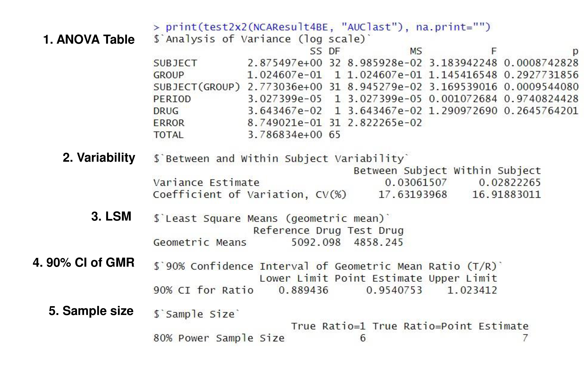
```

(ref:output-format) BE R 패키지에 의해 수행된 생물학적 동등성 통계분석 결과.\index{생물학적 동등성}

위 과정으로 얻어진 계산값은 가장 정확하게 생물학적 동등성을 평가하고 있어 표준으로 사용되는 SAS 소프트웨어 결과값과 완전히 동일하였다. \index{생물학적 동등성}

**AUC~inf~**

Analysis | Lower Limit | Point Estimate | Upper Limit
--- | --- | --- | --- 
R BE 패키지 | 0.88944 | 0.95408 | 1.02341
SAS: PROC GLM | 0.88944 | 0.95408 | 1.02341
SAS: PROC MIXED | 0.88944 | 0.95408 | 1.02341

**C~max~**

Analysis | Lower Limit | Point Estimate | Upper Limit
--- | --- | --- | --- 
R BE 패키지 | 0.90136 | 0.97984 | 1.06515
SAS: PROC GLM | 0.90136 | 0.97984 | 1.06515
SAS: PROC MIXED | 0.90136 | 0.97984 | 1.06515

## 웹브라우저를 통한 NCA 및 생물학적동등성 판정

웹브라우저를 통해 간단히 NCA를 할 수 있는 앱이 웹 기반으로 개발되어 R을 설치할 필요없이 사용할 수 있다. (그림 \@ref(fig:pkrshiny)) <https://www.pipetapps.com/project/pkrshiny/> `shiny-be`는 NCA 및 생물학적동등성 분석을 웹브라우저에서 할 수 있는 응용 소프트웨어로  <https://www.pipetapps.com/project/shiny-be/>에서 서비스 하고 있다. (그림 \@ref(fig:shiny-be))

```{r pkrshiny, fig.cap = "(ref:pkrshiny)", echo=FALSE}
knitr::include_graphics("media-03/pkrshiny.png")
```

(ref:pkrshiny) NCA용 앱, `pkrshiny` 접속 화면


```{r shiny-be, fig.cap = "(ref:shiny-be)", echo=FALSE}

```

(ref:shiny-be) NCA 및 BE용 앱, `shiny-be` 접속 화면

## 맺음말

이상으로 비구획분석 자료해석을 위한 R 패키지에 대해 알아보았다. 
정확한 비구획분석은 모든 약동학 자료해석의 기본이 되며, R을 통한 자료의 처리와 분석은 오류를 줄이고, 시간과 비용을 을 단축하는 등 큰 잇점이 있다. \index{약동학}
처음에는 R을 사용하는 방법이 다소 생소할 수 있으나 약동학을 공부하는 사람이라면 반드시 접하게 되는 소프트웨어 이고, 약동학 관련 R 패키지에 대해 지속적인 연구와 개발이 이뤄지고 있으므로 연구자들은 이에 대해 꾸준한 공부를 지속해야 할 것이다.\index{약동학}


<!--chapter:end:03.Rmd-->

# 구획분석의 이론 {#ca-principle}

\Large\hfill
임동석
\normalsize

```{r include=FALSE}
library(knitr)
library(tidyverse)
opts_chunk$set(echo=FALSE)
```

## 구획분석의 개념

앞에서 소개된 NCA는 간단하게 약동학적 프로파일을 파악할 수 있는 방법이지만, 약동학적 파라미터들을 이용한 다양한 예측(시뮬레이션)에는 비구획분석만으로는 많은 한계가 있다. 그래서 쓰이게 된 것이 구획분석이다.\index{약동학}\index{시뮬레이션}

NCA에서는 AUC로부터 다른 모든 파라미터들을 산출하지만, 그림 \@ref(fig:two-comp-ex)과 같이 약물이 정맥주입된 후 중심구획에서 말초구획으로 확산되면서 두 개의 기울기를 나타내는 양상을 NCA에서 얻어진 파라미터들만으로 재현하는 것은 불가능하다. \index{중심구획}\index{말초구획}\index{중심구획}\index{말초구획}
그러나 이는 그림 \@ref(fig:two-comp-ex)의 오른쪽과 같이 두 개의 분포구획(V~c~와 V~p~)를 가지는 모델을 상정하고 약물이 중심구획과 말초구획을 k~12~, k~21~의 1차속도상수에 따라 확산되는 것으로 가정하면 잘 설명할 수 있다.\index{중심구획}\index{말초구획}\index{분포구획}\index{중심구획}\index{말초구획}
NCA에 비해 찾아야 할 파라미터들이 많고 거기에 따르는 가정들도 복잡하기 때문에 구획분석을 실제로 수행한다는 것은 각종 입력값들(용량, 투여경로, 채혈시간, 혈장약물농도)을 넣어 준 후 컴퓨터 프로그램으로 하여금 그 입력값들에 가장 잘 부합하는 최적의 파라미터 값들(V~c~, V~p~, CL, Q 등)을 찾아내도록 하는 과정을 의미한다.

```{r two-comp-ex, fig.cap = "(ref:two-comp-ex)", out.width="100%"}
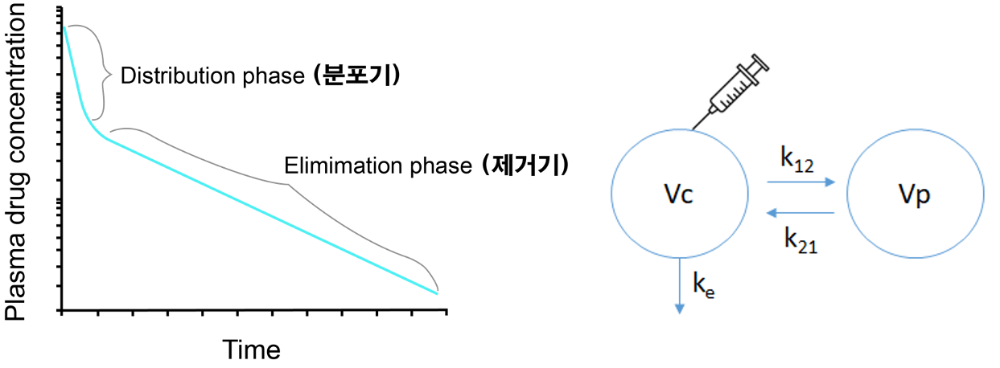
```

(ref:two-comp-ex) 2구획모델의 예 

구획 간의 확산속도상수인 k~12~, k~21~은 제거속도상수인 k(k~e~)와 마찬가지로 시간의 역수(h^-1^) 단위를 가지며 두 구획 사이에 약물이 이동하는 속도는 두 구획의 약물농도가 같아지는 순간(분포의 평형이 이루어졌을 때)에 동일하다. \index{확산속도상수}
이를 수식으로 나타내면 식 \@ref(eq:eq4-1)과 같다.

\begin{equation}
A_{c} \cdot k_{12} = A_{p} \cdot k_{21}
(\#eq:eq4-1)
\end{equation}

아래첨자 c와 p는 각기 중심구획과 말초구획을 의미하며 A는 각 구획에 존재하는 약물의 양(amount)를 의미한다. 이를 변형하면 \@ref(eq:eq4-2)와 같다.\index{중심구획}\index{말초구획}\index{중심구획}\index{말초구획}

<!--$C_{{plasma}} \cdot V_{c} \cdot k_{12} = C_{{peripheral}} \cdot V_{p} \cdot k_{21}$
식 \@ref(eq:eq4-2)-->

\begin{equation}
C_{{plasma}} \cdot V_{c} \cdot k_{12} = C_{{peripheral}} \cdot V_{p} \cdot k_{21}
(\#eq:eq4-2)
\end{equation}

혈장은 중심구획이므로 중심구획의 농도는 혈장농도로 대신하였다. 농도와\index{중심구획}\index{중심구획}
분포용적을 곱한 것은 식 \@ref(eq:eq4-1)의 A와 같은데, 평형이 이루어졌을 때\index{분포용적}
중심구획과 말초구획의 농도는 같다고 가정하므로, 결국 식 \@ref(eq:eq4-2)에서\index{중심구획}\index{말초구획}\index{중심구획}\index{말초구획}
V~c~·k~12~ = V~p~·k~21~의 관계가 성립된다. 이들은 부피/시간의 단위를
가지므로 intercompartmental CL라고도 부르며 Q라는 약어로
표기하기도 한다. 그러므로 식 \@ref(eq:eq4-2)는 식 \@ref(eq:eq4-3)과 같이 표기하기도 한다.

<!--$C_{{plasma}} \cdot Q = C_{{peripheral}} \cdot Q$ 식 \@ref(eq:eq4-3)-->

\begin{equation}
C_{{plasma}} \cdot Q = C_{{peripheral}} \cdot Q
(\#eq:eq4-3)
\end{equation}

세 식 \@ref(eq:eq4-1) \~ \@ref(eq:eq4-3) 모두 분포의 평형상태에서만 등식이 성립하는 것이며, 분포가 일어나는 초기에는 식의 왼쪽 값이 더 커서 중심에서 말초구획으로의 약물분포가 일어나고, 평형에 도달한 이후에는 반대로 말초구획에 있던 약이 약물의 제거가 일어나는 중심구획 쪽으로 이동하게 된다.

혈장약물농도(중심구획의 약물농도)의 시간에 따른 변화는 중심구획의 농도를 C~1~, 말초구획의 농도를 C~2~라 표기하면 식 \@ref(eq:eq4-4)와 같이 표현된다.

\begin{equation}
V_{c}\frac{{dC}_{1}}{{dt}} = {- V}_{c} \cdot C_{1} \cdot k_{12} + V_{p} \cdot C_{2} \cdot k_{21}{- V}_{c} \cdot C_{1} \cdot k_{e} 
= - C_{1} \cdot Q + C_{2} \cdot Q - C_{1} \cdot {CL}
(\#eq:eq4-4)
\end{equation}

식 \@ref(eq:eq4-4)는 가장 단순한 상태인 정맥주사(bolus)에 대한 것으로 시간 0에
순식간에 중심구획으로 약이 들어오는 상황은 생략되어 있고 들어오자 마자\index{중심구획}\index{중심구획}
중심구획에 고루 퍼진다고 가정한 것이다. 만약 중심구획으로 일정시간동안\index{중심구획}\index{중심구획}
정맥주입(infusion)한다면 수식은 정맥주입이 진행되는 동안에는 시간당
일정한 양이 들어오는 속도 R(rate의 약어)이 추가되고(식 \@ref(eq:eq4-5)), 주입이 끝난 후에는 R=0가
되어 다시 식 \@ref(eq:eq4-4)와 동일하게 표기된다.

\begin{equation}
V_{c}\frac{{dC}_{1}}{{dt}} = {R - V}_{c} \cdot C_{1} \cdot k_{12} + V_{p} \cdot C_{2} \cdot k_{21}{- V}_{c} \cdot C_{1} \cdot k_{e}
(\#eq:eq4-5)
\end{equation}

경구투여를 하는 경우라면 그림 \@ref(fig:fig4-2)와 같은 모델을 흔히 쓰는데 약을 삼켜서 위장관 내로 들어가는 것은 정맥주사(bolus)와 같이 일어나고, 위장관 내강에서 중심구획으로 흡수되는 속도는 위장관 내강에 남아있는 약물의 양에 흡수속도상수인 k~a~를 곱한 값으로 정의되는 1차흡수를 따른다고 가정하는 방식이 흔히 쓰인다. 이외에 F의 추정이나 흡수의 지체시간(lag time), 1차식 이외의 다른 흡수모델 등을 적용하기 위해 이 모델을 변형할 수 있다.\index{중심구획}\index{흡수속도상수}\index{중심구획}\index{1차흡수}

<!--
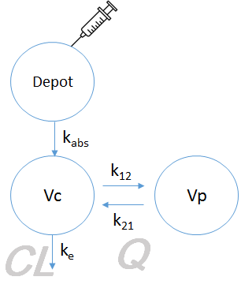{width="1.9026957567804024in"
height="2.269555993000875in"}

그림2 경구투여 약물의 2구획모델
-->

```{r fig4-2, fig.cap = "(ref:fig4-2)", out.width="50%"}

```

(ref:fig4-2) 경구투여 약물의 2구획모델

그림 \@ref(fig:fig4-2)에는 구획을 나타내는 동그라미가 3개 있지만, 구획모델에 숫자를
붙일 때는 분포와 관련된 구획들의 숫자만을 의미하므로 이 역시 2구획모델이다. 이
외에도 만약 로그 혈장농도 곡선에서 3개의 기울기가 관찰된다면 중심구획에\index{중심구획}\index{중심구획}
두 개의 말초구획들이 제각기 다른 Q값들로 연결되어 있는 3구획모델로\index{말초구획}\index{말초구획}
설명이 가능하다.

1차식을 따라 제거되는 현상은 중심구획에서 일어난다고 가정하는 것이\index{중심구획}\index{중심구획}
기본이다. 소분자의약품들의 경우 주로 제거되는 장기인 간과 콩팥은
혈류량이 높아서 중심구획에 속해 있다고 가정하는데 무리가 없다. 또한\index{중심구획}\index{중심구획}
말초구획에서의 약물농도를 자주 측정하는 것이 기술적으로 어렵기 때문에\index{말초구획}\index{말초구획}
대부분의 약동학 자료분석은 혈장약물농도만 측정하여 수행하는데, 만약\index{약동학}
말초구획에서 약물의 제거가 일어난다면, 말초구획의 농도를 측정하지 않는\index{말초구획}\index{말초구획}
한 정확한 k~e~의 추정이 불가능하다. 예컨데, 단클론항체의 경우 중심구획\index{중심구획}\index{단클론항체}\index{중심구획}
뿐 아니라 말초구획에서도 무시할 수 없는 양이 제거되는데, 이를\index{말초구획}\index{말초구획}
혈장약물농도 자료만 가지고 중심구획에서만 제거되는 그림 \@ref(fig:two-comp-ex)과 같은\index{중심구획}\index{중심구획}
모델로 설명하려 하면, 말초구획의 부피가 과도하게 큰 값으로 추정되거나\index{말초구획}\index{말초구획}
k~21~이 k~12~에 비해 과도하게 큰 값으로 추정되는 등 왜곡된 파라미터들이
산출되기도 한다. 이 때 중심구획과 말초구획에서 모두 약이 제거되는 좀 더\index{중심구획}\index{말초구획}\index{중심구획}\index{말초구획}
사실에 부합하는 모델(예컨데 중심구획에서는 k~e1,~ 말초구획에서는\index{중심구획}\index{말초구획}\index{중심구획}\index{말초구획}
k~e2~라는 제거속도상수를 가진 모델)을 생각해 볼 수 있지만, 이 역시 혈장약물(단클론항체)농도 값만으로 신뢰할만한 파라미터를 찾는 것은\index{단클론항체} 힘들다. 
그로므로 단클론 항체의 약동학을 적절히 모델링하기 위해서는\index{약동학}\index{모델링} 단순히 혈장약물농도 이외에 그항체의 타겟이 되는 물질의 생성, 제거속도, 타겟이 어디에 존재하는지 등의 다양한 정보를 사전에 파악하여 모델에 반영해야만 하며, 경험적인 구획모델의 수준을 넘어서는 작업이 된다. 
본 장에서 제시된 몇 가지 약물분포와 제거 모델은 가장 기본적인 예이며, 개별 약물군의 약동학적 특성에 따라 다양한 모델들이 쓰이고 있다.\index{약동학}

## 구획모델이 필요한 이유

비교적 단순한 NCA만으로 PK 파라미터들을 다 구할 수 있는데 왜 굳이 어려운 구획모델을 써야 하는가? 라는 의문을 품을 수 있다. 
이에 대해 다음과 같은 답들을 제시할 수 있다.

### 최종반감기와 관련한 이슈\index{반감기}\index{반감기}\index{최종반감기}

1장에서 이미 나온 것처럼 최종반감기가 반드시 의미있는 것은 아니다.\index{반감기}\index{반감기}\index{최종반감기}

그림 \@ref(fig:fig4-3)과 같이 붉은 선은 최종반감기가 훨씬 긴 약임에도 불구하고 항정상태에 도달하는 시간은 검은 선에 비해 훨씬\index{항정상태}\index{항정상태}\index{반감기}\index{반감기}\index{항정상태}\index{최종반감기}
빠름을 알 수 있다. 이유는 최종반감기를 보여주는 완만한 경사가 나타나기\index{반감기}\index{반감기}\index{최종반감기}
전에 이미 몸 안의 약이 대부분 제거되었기 때문인데, 단순한 NCA로 얻어지는
PK파라미터들만으로 이를 알아내기는 어렵다.

<!--
{width="3.2580643044619424in"
height="1.9333245844269467in"}

그림3 최종반감기가 더 긴 약이 항정상태에 더 빨리 도달하는 사례\index{항정상태}\index{항정상태}\index{반감기}\index{반감기}\index{항정상태}\index{최종반감기}
-->

```{r fig4-3, fig.cap = "(ref:fig4-3)"}
knitr::include_graphics('media-04/image3.jpg')
```

(ref:fig4-3) 최종반감기가 더 긴 약이 항정상태에 더 빨리 도달하는 사례\index{항정상태}\index{항정상태}\index{반감기}\index{반감기}\index{항정상태}\index{최종반감기}

다음은, V~d~와 CL가 동일한 두 약의 최종반감기가 다른 사례이다. 두 약의\index{반감기}\index{반감기}\index{최종반감기}
V~d~나 CL가 동일하다면 k~e~ = CL/V~d~ 역시 동일할 것이고 t~1/2~를 단순히
0.693/k~e~와 같이 정의한다면 그 역시 동일해야 하겠지만, 그림 \@ref(fig:fig4-4)에서는
V~ss~와 CL이 동일함에도 불구하고 최종반감기가 현저히 다른 두 약의 사례가\index{반감기}\index{반감기}\index{최종반감기}
나타나 있다. 약물의 분포는 두개 이상의 구획으로 퍼지면서 일어나고 그
구획들 간에 평형이 이루어지는데 걸리는 시간에 따라 최종 반감기가 다르게\index{반감기}\index{반감기}
보인다는 사실이 NCA에서는 전혀 반영되어 있지 않다는 것이 이러한 현상들의
원인이다. 또 생각해 볼 것은 동일한 V~ss~를 가짐에도 두 약의 C~max~가 두
배 이상 차이가 난다는 점이다. 그 원인은 중심구획으로 흡수된 약이\index{중심구획}\index{중심구획}
말초구획으로 신속히 퍼지는 경우(붉은 선)보다, 천천히 퍼지는 경우(검은\index{말초구획}\index{말초구획}
선)가 중심구획에서의 C~max~가 훨씬 높기 때문이다. NCA는 약이\index{중심구획}\index{중심구획}
말초구획으로 퍼지는 속도나 구획들 간의 평형에 도달하는 시간 등에 대한 고려가 없는\index{말초구획}\index{말초구획}
분석법이므로 이 C~max~의 차이를 설명하지 못한다.

```{r fig4-4, fig.cap = "(ref:fig4-4)"}
knitr::include_graphics('media-04/image4.jpg')
```

(ref:fig4-4) 동일한 Vss와 CL를 가져도 최종반감기와 C~max~가 차이나는 사례\index{최종반감기}

### 정확한 C~max~, T~max~ 값의 추정

NCA에서는 그림 \@ref(fig:fig4-5)에서 볼 수 있듯이 약동학적 채혈로 얻어진 농도(파란색 점)들 중에서 가장 높은 관찰값을 골라서 C~max~라 하고 그 채혈시간을 T~max~라 한다. 
그러나 이것은 채혈 후 관찰된 값들 중에서 가장 큰 값일 뿐이고 실제 환자의 혈장 속에서 가장 높은 농도를 나타내는 시간과 농도값은 그림 \@ref(fig:fig4-5)의 경우 네모로 둘러싼 두 점 사이의 어떤 시간과 농도일 것으로 추론할 수 있다. 
가장 정확한 방법은 관찰된 농도와 채혈시간을 부드럽게 연결한 곡선을 구해서 가장 높은 값을 나타내는 위치를 고르는 것이다. 
비단 C~max~뿐 아니라 채혈시점 이외의 어떤 시점에서의 농도라도 이 방법으로 예측할 수 있다. 
컴퓨터 프로그램을 이용하여 사람의 혈장약물농도가 어떤 식으로 변하는지 설명하는 몇 가지 PK 모델들을 테스트하고 이들 중 관찰된 농도에 가장 가까운 곡선을 나타내 주는 모델을 선택하여 그 모델의 파라미터 값들을 얻는 것이 이 그림의 부드러운 곡선을 구하는 방법이다.

```{r fig4-5, fig.cap = "(ref:fig4-5)"}
knitr::include_graphics('media-04/image5.jpg')
```

(ref:fig4-5) 정확한 C~max~, T~max~를 얻기 위해 NCA가 아닌 구획모델 분석이 필요한 사례

### PK/PD와 연관된 각종 의사결정\index{의사결정}

신약의 임상개발을 진행하면서 약효의 유무와 유효용량을 따지는 단계 뿐\index{임상개발}\index{유효용량}
아니라 이후 인종, 연령, 질병, 장기기능 등에 따라 PK가 어떻게 변하는지,
그에 따른 용량을 어떻게 설정할 것인지 등을 결정하기 위해서는 PK
파라미터들(k~a~, Vc, Vp, CL, Q들)과 약효가 이러한 환자의 특성에 따라 어떤
양상으로 변하는지를 알아야 한다. NCA로는 이런 질문들에 답을 얻기 힘들고
각종 환자의 특성의 영향을 반영한 PK, PD 모델로부터 다양한
시나리오들에 대해 수행한 시뮬레이션을 통해서만 예측이 가능하다. 이러한\index{시뮬레이션}
작업들의 출발점이 구획모델 분석이라 할 것이다.

## 구획모델로 얻은 PK 파라미터와 NCA로 얻은 PK 파라미터들의 차이점 {#diff-pk-param}

\@ref(diff-pk-param)절은 약동학을 처음 공부하는 독자는 이해하기 어려우므로 읽지않고\index{약동학}
넘어가도 좋다.

NCA로부터 PK파라미터를 구하는 시초는 혈장약물농도로부터 AUC를 구하고, 마지막 농도 2\~3개를 연결하여 최종소실기의 경사(slope)인 β를 구하는 것이다. 이로부터 CL(CL=Dose/AUC)와 V~z~(V~z~ = Dose/(AUC·β) = CL/β)를 산출한다. 최종반감기 t~1/2~ = 0.693/β로 구한다. 구획분석에서 얻는\index{반감기} 파라미터들과의 차이는 표 \@ref(tab:pk-param-comparison)에 요약되어 있다.\index{반감기}\index{최종반감기}

구획모델에서 CL의 정의는 NCA와 달라서 같은 데이터를 두 방법으로 분석할 경우 CL 값이 약간의 차이를 보이게 된다. 어느 값이 옳고 틀린 것이 아니며 구하는 수식 자체가 다르게 정의되었기 때문이다. 
수식들의 정의가 조금씩 다르다 해도 몸이 약물을 제거하는 속도를 반영하는 수식들이므로 그 값들의 차이는 크지 않다.


<!--
Table: (\#tab:pk-param-comparison) NCA와 구획모델 분석으로 얻어지는 PK 파라미터 비교

파라미터의 속성 | NCA 로 구한 파라미터 | 구획분석으로 구한 파라미터 | 비고
-- | -- | -- | --
제거능력 | CL=AUC/Dose | CL=k~e~   × V~c~ | CL를 구하는 수식 자체가 다름
분포 | V~ss~ = CL   V~z~ = Dose/(AUC·β) = CL/β | V~c~, V~p~, <br /> V~ss~ = V~c~ + V~p~ | NCA에서는 V~c~, V~p~ 따로 구하지 못하고 구획모델에서는 V~z~ 안 나옴
최종소실기 | β: 최종 농도 2~3개 연결하여 측정 | k~e~ | NCA에서는 k~e~ 못 구하고 구획모델에서는 β 못 구함
구획간 분포 속도 | 개념 자체가 없음 | k~12~,   k~21~, Q = k~12~   × Vc = k~12~ × Vp | &nbsp;
-->

\tiny

```{r pk-param-comparison} 
tribble(~"파라미터의 속성", ~"NCA 로 구한 파라미터", ~"구획분석으로 구한 파라미터", ~"비고",
"제거능력", "CL=AUC/Dose", "CL=k~e~·V~c~", "CL 수식 다름",
"분포", "V~ss~=CL·MRT\nV~z~=Dose/(AUC·β)=CL/β", "V~c~, V~p~,\nV~ss~=V~c~+V~p~", "NCA에서는 V~c~, V~p~ 따로 구하지 못하고 구획모델에서는 V~z~ 안 나옴, \nV~ss~ 수식 다름",
"최종소실기", "β: 최종 농도 2~3개 연결하여 측정", "k~e~", "NCA에서는 k~e~ 못 구하고 구획모델에서는 β 못 구함",
"구획간 분포 속도", "개념 자체가 없음", "k~12~, k~21~, \n Q = k~12~·V~c~ = k~21~·V~p~", " ") %>%
  mutate_all(linebreak) %>%
  kable(caption = "NCA와 구획모델 분석으로 얻어지는 PK 파라미터 비교", booktabs=TRUE, escape=FALSE) %>%
  column_spec(1, width = "2.0cm") %>%
  column_spec(2, width = "4.0cm") %>%
  column_spec(3, width = "4.0cm") %>%
  column_spec(4, width = "3.0cm")
```

\normalsize

### 분포용적 파라미터들의 차이

\index{분포용적}

분포용적의 경우 NCA에서는 최종소실기의 기울기인 β를 써서 구한 V~z~를\index{분포용적}
얻을 수 있는데 (NCA에 관한 2장에서 설명) 말초구획으로 분포가 완료되고 난\index{말초구획}\index{말초구획}
후, 중심구획에서 약물의 제거가 지속되므로 말초구획의 농도가 중심구획보다\index{중심구획}\index{말초구획}\index{중심구획}\index{말초구획}
높아서 혈장약물농도(중심구획의 농도)로 몸 안에 있는 약물의 총량을 나누어\index{중심구획}\index{중심구획}
준 값(이것은 분포용적의 정의와 같다)을 시간에 따라 비교해보면 이 때\index{분포용적}
최고치에 이르러서 더 이상 증가하지 않는다. 이것을 V~z~라 하는데
NCA에서는 AUC/(Dose·β)로 구할 수 있다. NCA는 가장 단순한 약동학\index{약동학}
분석방법이며 분포용적이 시간이 경과함에 따라 커진다는 개념을 반영한 모델\index{분포용적}
같은 것은 쓰지 않지만, 최종 기울기인 β를 써서 분포용적 중 제일 늦게\index{분포용적}
얻어지는, 최대치에 도달한 값이라 할 수 있는 V~z~를 구할 수 있는 것이다. V~z~는 다른
용어로 V~β~ 또는 V~d~ area라고도 부른다.

구획모델에서는 이미 V~c~와 V~p~가 따로 존재한다고 가정하고 구하여 그
둘을 합한 값을 V~ss~라고 정의하였기 때문에 비록 나중에는 말초구획의\index{말초구획}\index{말초구획}
농도가 중심구획보다 높아지는 상황이 일어난다 해도 V~z~라는 값을 따로\index{중심구획}\index{중심구획}
계산하여 내놓지는 않는다.

V~ss~는 NCA에서는 V~ss~ = F·Dose/AUC·MRT 로 구하지만 구획모델에서는
V~ss~ = V~c~+V~p~로 정의된다. 두 값은 정의가 다르므로 어느 값을 쓰는 게
더 바람직한지 등으로 비교하는 것은 무의미하다.

### β와 k~e~(k~10~)의 차이

NCA 분석에서 마지막 2\~3개의 농도를 직선으로 연결하여 구하는 최종
기울기를 β라 한다. 이는 흔히 정맥주사 후 두 개의 기울기를 관찰할 수
있어서 처음 것은 α, 두번째 것을 β라 하기 때문이다. 그림 \@ref(fig:fig4-6)은 두 개의
지수함수(biexponential)로 혈장약물농도의 변화를 모델링하는 방법인데,\index{모델링}
구획모델보다 조금 간단한 모델링 방법이지만 지금은 잘 쓰이지 않는다.\index{모델링}
NCA가 지수함수 모델을 이용하는 것은 아니지만, 마지막 농도들로써 β를
구하는 원리는 동일하다.

식 \@ref(eq:eq4-7)을 보면 β는 k~e~(k~10~)와 관련되어 있지만 다른 구획모델
파라미터들(각 파라미터들의 의미는 그림 \@ref(fig:two-comp-ex) 참조)의 영향도 있어서 동일하지
않음을 알 수 있다. 수식만 가지고는 쉽게 파악하기 힘들지만 β는
k~e~(k~10~)보다 언제나 작은 값이다. 이는 그림 \@ref(fig:two-comp-ex)의 구획모델을 보고
생각해 보면 알 수 있다. 중심구획에서 혈장 약물농도가 감소하는\index{중심구획}\index{중심구획}
속도상수를 구획모델에서 정의된 CL로 표시하면 k~e~ = CL/V~c~이다. 그러나
실제 중심구획에서 약이 제거되면서 농도가 떨어지면, 이전에 같은 농도로\index{중심구획}\index{중심구획}
말초구획에 분포되어 있던 약이 중심과 말초 간의 농도경사를 없애서 평형을\index{말초구획}\index{말초구획}
회복하기 위해 중심구획으로 흘러나오게 된다. 이로 인해 실제 시간에 따라\index{중심구획}\index{중심구획}
측정되는 로그농도를 연결한 직선의 기울기(β)는 k~e~보다는 완만할(β \<
k~e~) 수 밖에 없다. 만약 말초구획이 존재하지 않고 중심구획 하나만 있는\index{중심구획}\index{말초구획}\index{중심구획}\index{말초구획}
약이라면(mannitol과 같이 세포외액에만 분포하는 약물이나 heparin과 같이 
혈관 내에만 분포하는 약물 등) 정맥투여 직후의 분포기가 따로 존재하지
않으며, 말초에서 중심으로 약이 되돌아오는 현상도 존재하지 않으므로 최종
기울기인 기울기 β도 k~e~와 같은 값을 나타낼 것이다. 이런 특수한 약물
몇가지 외에는 모두 말초구획으로 분포하는 양상을 나타내므로 언제나 β \<
k~e~가 관찰된다.
\index{만니톨, mannitol}

```{r fig4-6, fig.cap = "(ref:fig4-6)"}
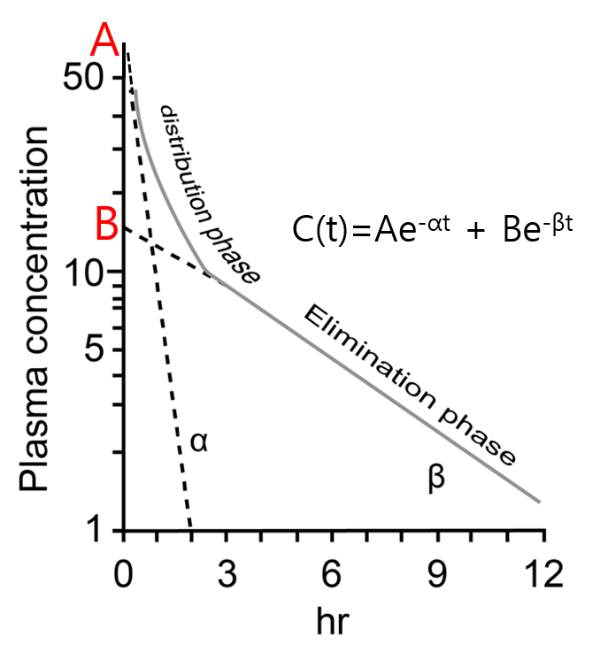
```

(ref:fig4-6) Biexponential model로 분석한 약동학 파라미터들\index{약동학}

\begin{equation}
\alpha = \frac{1}{2}\left\lbrack \left( k_{12} + k_{10} + k_{21} \right) + \sqrt{\left( k_{12} + k_{10} + k_{21} \right)^{2} - 4{k_{10}k}_{21}} \right\rbrack
(\#eq:eq4-6)
\end{equation}

\begin{equation}
\beta = \frac{1}{2}\left\lbrack \left( k_{12} + k_{10} + k_{21} \right) - \sqrt{\left( k_{12} + k_{10} + k_{21} \right)^{2} - 4{k_{10}k}_{21}} \right\rbrack
(\#eq:eq4-7)
\end{equation}

CL의 정의가 NCA와 구획모델 간에 다른데, 표 4.1의 수식을 참조하면 다음과
같이 해석할 수 있다. NCA의 경우 CL= Dose/AUC 로서 몸 안에서 약을
제거하는 능력을 혈장약물농도와 관련하여 표현한 것이다. 구획모델의 경우
k~e~ = CL/V~c~로서, 약을 제거하는 능력(CL)이 V~c~에 비해 얼마의
분율(fraction)으로 나타나는지를 나타내고 있다. 즉 구획모델의 CL은 몸
전체보다는 중심구획을 위주로 표현한 것이다. NCA에서 β = CL/V~z~의\index{중심구획}\index{중심구획}
관계로부터 β는 중심구획 뿐 아니라 전신으로 약이 다 퍼져있는 상태에서의\index{중심구획}\index{중심구획}
분포용적(V~z~)이 반영되어 있고 V~c~ ≪ V~z~이므로, 비록 분수식의 분자에\index{분포용적}
있는 CL도 두 방법간에 다르게 구해지지만, β \< k~e~의 단서를 찾을 수 있다.

## 맺음말

비교적 간단한 NCA 방법이 있음에도 불구하고 구획모델을 사용하여
약동학자료를 분석하는 이유는 이 장에서 열거한 바와 같이 NCA 결과에서 누락되는 약동학적 정보를 놓치지 않기 위해서이다. 
약물의 분포기가 상대적으로 길어서 대부분의 약물이 분포기동안 제거된다면, 제거기에 얻어지는 최종반감기는 큰 의미가 없다. \index{최종반감기}
NCA는 분포기와 제거기 중 어느 시기가 더 약물제거에 많이 기여하는지, 최종반감기의 기여도는 얼마나 되는지에 대해\index{최종반감기}
어떤 정보도 제공하지 않는다. 
\index{반감기}\index{반감기}
이에 비해 구획모델은 분포의 속도에 관련된 파라미터(k~12~, k~21~ 또는 Q), 얼마나 많은 양이 말초구획으로\index{말초구획}\index{말초구획}
분포하는지에 관련된 파라미터(V~p~) 등을 중심구획의 부피(V~c~)와 분리하여\index{중심구획}\index{중심구획}
구해주므로 신약의 전임상, 임상개발의 과정들에서 발생하는 많은 질문들에\index{임상개발}
대한 답을 시뮬레이션할 수 있는 근거를 얻게 해 준다. 다만 모델의\index{시뮬레이션}
복잡성으로 인해 NCA와는 달리 반드시 전문적인 소프트웨어를 이용해야 한다.
또한 NCA와 구획모델의 두 방법으로 얻어지는 결과인 PK 파라미터들은 명칭과
사용하는 수식이 조금씩 다르므로 결과를 해석할 때 혼동하지
않도록 주의해야 한다.

<!--chapter:end:04.Rmd-->

# 구획분석의 자료해석 {#ca-analysis}

\Large\hfill
한성필^[약동학 데이터를 분석하여 PK 파라미터를 찾는 업무를 하지 않는 독자들은 이 장을 읽지 않고 넘어가도 좋습니다.] 
\normalsize

```{r include=FALSE}
library(knitr)
library(tidyverse)
opts_chunk$set(echo=TRUE)
```

## 서론

약동학 구획분석을 한문장으로 표현하자면 시간 농도(time-concentration data) 자료에 대한 약동학 파라미터 추정값(pharmacokinetic parameter estimates)을 구하는 과정이다. \index{약동학}
다시 말하자면, 인체의 여러 장기(organ) 또는 계(system)를 몇개의 구획으로 단순화하고 우리의 관심이 되는 특성을 파라미터화하여 각 구획들 간의 연관성을 파악하는 것이다. 
약동학 파라미터의 추정을 위해서 비선형 회귀분석(nonlinear regression analysis)이 사용 되어 왔고 현재 이 방식은 약동학 분석에서 가장 필수적인 방법론으로 자리 잡은 상태이다. \index{약동학}
추정에는 약동학 수식이 필요한데, 비선형 회귀분석 시 모델식(model formulation)으로 사용되며, 이 수식 안에 우리가 추정하고자 하는 약동학 파라미터가 모두 포함되어 있다. \index{약동학}

구획간의 약물 이동은 1차식 또는 선형 약동학(linear pharmacokinetics)을 따른다고 가정하게 된다. \index{약동학}
선형 약동학이란 간단히 말해서 용량이 두배가 되면 농도도 두 배가 되는 것을 말하며, D(용량) → C(농도)로 나타낼 경우 2D → 2C 의 관계가 성립하는 것을 말한다.\index{약동학}
1구획 모델에서는 구획들 간의 약물 분포가 균일하다는 가정 하에 인체를 단일구획으로 기술한다. 
1구획 모델에서는 약물이 작용부위로 신속히 이동한다고 가정하며 혈장을 자료 분석의 기준 구획으로 사용한다. 
1구획 모델의 로그 혈장농도값은 시간에 대해 하나의 기울기로 감소하는 양상을 나타낸다.
2구획 모델에서는 구획들 간의 약물 분포가 균일하지 않다고 보며 인체를 중심 구획 (central compartment) 과 말초구획 (peripheral compartment)로 나누어 기술한다. \index{말초구획}
중심구획은 관류(perfusion)가 빠른 기관(예: 간, 콩팥)을 나타내는데 이는 약물의 분포와 관계하고 α-phase로 나타낸다. \index{중심구획}
반면 말초구획은 관류가 느린 기관(예: 근육, 지방)을 나타내며 이는 약물의 소실과 관계하고 β-phase로 나타낸다. \index{말초구획}
2구획 모델의 혈장농도 로그값은 시간에 대해 기울기가 두 개인 이직선적으로 감소하는 양상을 나타내는데, 처음의 빠른 기울기는 분포기를 나타내고, 나중의 느린 기울기는 소실기를 나타내게 된다.

```{r fig5-1, fig.cap = "3구획 약동학 모델에서 시간에 따른 농도 변화의 양상에 대한 모식도", echo=FALSE, out.width = "75%"}
knitr::include_graphics("media-05/fig5-1.png")
```

정맥주사 후 3구획 모델을 비유를 들어 설명하자면, 구획을 나타내는 원통이 그림 \@ref(fig:fig5-1)과 같이 세 개가 있다고 가정을 할 수 있다. 
약물을 정맥주사(i.v.bolus)하면 직후에 혈중 농도가 최대에 도달하였다가 시간이 지남에 따라 감소하게 되는데, 구획간의 분포 및 제거에 의해 약물의 농도가 감소를 하게 된다. 
여기서 V1은 중심구획, V2는 rapid peripheral compartment이고, V3은 slow peripheral compartment이다. \index{중심구획}
V1, V2, V3 원통의 부피는 약물이 분포하는 용적이고, 높이는 농도에 해당한다. 
수평의 연결 파이프에 의해 약물이 분포 및 제거된다. 
정맥주사 후 초기에는 약물이 주로 V1에서 V2로 이동하면서 혈중농도가 급격하게 감소하고(rapid distribution phase), 그 이후에는 V1에서 V3로 약물이 이동하면서 동시에 V2에서는 거꾸로 V1으로 이동하며 전체적으로는 혈중농도가 감소(slow distribution phase)하게 된다.
그 후에는 V2, V3에서의 약물은 V1으로 이동해 나오면서 동시에 V1에서는 elimination이 일어나 농도가 아주 서서히 감소하게 된다. (terminal phase)

이렇게 약물의 이동에 대한 정량적인 표현을 위해서는 약동학 수식에 대해 익숙해 져야 할 필요가 있고, 수식을 잘 아는 것 만큼이나 자료를 해석하고 추정값을 실제로 구하는 작업을 충분히 경험할 필요가 있다. \index{약동학}

## 상용 소프트웨어를 이용한 구획분석 개론

```{r fig5-2, fig.cap = "다양한 상용 소프트웨어의 사용 예. A. GUI 기반 Phoenix NLME, B. GUI 기반 Lixoft Monolix, C. NONMEM의 제어구문", echo = FALSE}
knitr::include_graphics('media-05/fig5-2.png')
```

약동학 자료의 분석은 복잡하고 시간이 많이 걸리는 일이다. 모든 생물학 자료가 그러하듯 높은 변동성과 많은 노이즈가 PK 자료에 포함되어 있다. [@gabrielsson]\index{약동학}
따라서 비선형 회귀분석(Nonlinear regression analysis)이 필요한 구획분석을 위해서는 컴퓨터 소프트웨어의 사용이 필수적이다. 
이 때 Certara Phoenix NLME^[https://www.certara.com/software/phoenix-nlme/], Monolix^[https://lixoft.com/products/monolix/]와 같은 여러가지 소프트웨어들이 사용되고 있지만, 가장 널리쓰이는 도구는 ICON사의 NONMEM^[https://www.iconplc.com/innovation/nonmem/]이라고 하는 소프트웨어이다. (그림 \@ref(fig:fig5-2))
이것은 FORTRAN 코드로 프로그램 되어 있으며 2021년 현재 버전 7.5.0까지 지속적으로 업데이트 되고 있는 소프트웨어로, 구획분석 및 계량약리학 분야에서 가장 표준적인 도구로 쓰이고 있다. \index{계량약리학}
이에 대한 각종 자료를 이곳에서 다루기는 지면의 제약과 이론의 어려움 때문에 별도의 참고서적을 활용하는 것이 바람직할 것이다. [@nonmem;@gabrielsson;@basic]

상용 소프트웨어를 통한 구획분석 방법은 GUI 기반이고 많은 사용자가 확보되어 있다는 장점이 있으나,  상당한 비용을 매년 지불하여야 하며, 접근이 다소 쉽지 않다는 단점을 가지고 있다. 

## 구획분석에 활용할 수 있는 R package 소개

이를 극복하기 위해 통계 및 수학적 계산에 적합한 R 언어 기반의 오픈소스 소프트웨어가 활발히 개발되고 있다. 
즉, 비구획분석을 위한 R 패키지를 [3장](#nca-analysis)에서 소개한 것과 마찬가지로 구획분석용 R 패키지에 대한 다양한 시도가 일어나고 있는 것이다.
본 서에서는 무료 R 패키지 "wnl"를 사용한 자료해석과 예제에 대해 다루고자 한다. [@R-wnl]

NONMEM에서는 비선형 회귀분석을 위해서 최대 가능도 추정법(maximum likelihood estimation)을 사용한다. \index{가능도}
최대 가능도 추정법에서 얻어진 sample 데이터에서 Y가 현재 측정된 값, E(Y)는 모델에 의해 각각의 관측 지점에서의 예상되는 값, 그리고 V(Y)를 그 모델의 분산으로 표현한다. \index{가능도}
이 때 모델에 주어진 관측값에 대한 가능도(likelihood)는 다음과 같이 표현될 수 있다.\index{가능도}

\begin{equation}
L = \frac{1}{\sqrt{2\pi V(Y)}} \cdot e^{-\frac{1}{2V(Y)}\cdot(Y-E(Y))^2}
(\#eq:eq5-1)
\end{equation}

이때 이 일련의 관찰 값에 대한 가능도는 개개인 관찰값의 확률을 통해 나오게 된다. \index{가능도}
따라서 n개의 관찰값이 있으면 그 종합된 가능도는 n개의 개개인별 확률이 되고 subject에 대한 가능도는 다음과 같이 계산된다.\index{가능도}

\begin{equation}
L_i = \prod_{j=1}^{n_i}\frac{1}{\sqrt{2\pi V(Y_{ij})}} \cdot e^{-\frac{1}{2V(Y_{ij})}\cdot(Y_{ij}-E(Y_{ij}))^2}
(\#eq:eq5-2)
\end{equation}

이것은 -2 로그 가능도(-2 log likelihood)로 전환 될 수 있으며, 식 \@ref(eq:eq5-3)다음과 같이 표현된다.\index{가능도}

\begin{equation}
-2log(L_i) = n_i \cdot log(2\pi) + \sum_{j=1}^{n}(log(V(Y_{ij}))+ \frac{(Y_{ij} - E(Y_{ij}))^2}{V(Y_{ij})})
(\#eq:eq5-3)
\end{equation}

결국 NONMEM은 이 -2 로그 가능도의 값을 최소화(즉, 가능도의 값을 최대화) 해 주는 PK 파라미터 값들의 조합을 찾아준다. 
이 때, 오른쪽 수식에서 앞에있는 n~i~log(2π)는 상수이기 때문에 없애고, 실제 i번째 환자에서의 목적함수(objective function)는 다음과 같이 나타난다.\index{가능도}

\begin{equation}
OBJ_i = n_i \cdot logV(Y_i) + \sum_{j=1}^{n} \frac{(Y_{ij} - E(Y_{ij}))^2}{V(Y_{ij})}
(\#eq:eq5-4)
\end{equation}

실제 여기에서 derivation 을 정규 분포에만 적용한 것이 최대 가능도 측정법(maximum likelihood estimation method)^[최대 가능도 측정법(maximum likelihood estimation method)은 점 추정치를 찾는데까지는 오래 걸리나, 표준 오차(standard error of estimates)를 구하는게 유리하다. 최근에는 최소 제곱법(least square method) 보다 널리 쓰이고 있다.]이라면, 정규 분포라는 가정 없이도 적용한 것이 NONMEM 소프트 웨어 이며 이 방식을 `확장된 최소 제곱법'(extended least square method)이라고 한다. \index{가능도}

이 책의 예제에서는 NONMEM^®^ 의 확장된 최소 제곱법을 적용한 wnl 패키지의 `nlr()` 함수를 사용하였다.

각 모델에 맞는 적합한 모델에 따라 다음과 같은 script 형태로 입력해 주게 되며, 그에 대한 표준 오차(standard error of estimates), 공분산 행렬(covariance matrix of estimates), run test results on residuals, AIC, AICc, SBC를 내부 계산을 통하여 도출하게 된다.

이때 run test란 residual들이 random하게 분포하는지를 보기 위해서 각각의
residual에서 최대 양수와 음수가 연속구간의 길이가 얼마나 되는지를 보는
방법이다. 이 때 계산된 p-value를 통해서 실제로 residual이 random하게
분포하는지, 편향되게 분포하는지를 고려해 볼 수 있다.

AIC, AICc, SBC는 Akaike information criterion, Akaike information
criterion corrected, Schwarz criterion을 의미하며 각각의 통계적 모델에서
구조가 적합한지를 확인할수 있도록 도와주는 지표이다.


## 1구획모델을 이용한 경구투여 후 약동학 자료 분석\index{약동학}

아래의 코드로 wnl 라이브러리를 불러오고 hands-on1.csv^[https://github.com/pipetcpt/pharmapk/blob/master/data.zip] 파일을 읽어올 수 있다. 

```{r}
library(wnl)
dPK02 = read.csv("data/hands-on1.csv", skip=1)
colnames(dPK02) = c("TIME", "DV")
plot(dPK02[,"TIME"], dPK02[,"DV"], xlim=c(0, 400), ylim=c(0, 2.5), 
     xlab="Time (min)", ylab="Concentration (ug/L)", pch=16)
```

먼저 NCA를 수행한다. T~max~는 40분, C~max~는 2.00 ug/L인 것을 알 수 있다.

```{r}
NonCompart::sNCA(dPK02[,"TIME"], dPK02[,"DV"], 
                 dose=100, doseUnit="ug", timeUnit="min")
```

아래에서 경구 복용 후 일차역학^[일차역학(first-order kinetics)에 의한 소실이란 체내에 남이 있는 특정시점의 약물량의 일정 분율만큼 약물이 단위시간당 소실되는 것을 말한다.]에 의해 소실되는 약물의 약동학 모델을 사용한다. \index{약동학}
이 경우에는 wnl 패키지 내부에 기본적 equation이 정의되어 있으므로 추가적인 equation을 입력하지 않고 각각의 파라미터의 값에 해당하는 THETA에 대해서만 입력하였다. 
필요한 THETA는 k(제거 속도 상수), k~a~(흡수 속도 상수), V(부피), t~lag~(흡수가 지연되는 시간)이다. 

### Compartmental analysis without Tlag

아래는 경구 투여 1구획, 지연 시간이 없는 모델이다. \index{지연 시간}
모델의 R 스크립트에서 THETA[1], THETA[2], THETA[3]는 각각 파라미터 중 k(제거 속도 상수), k~a~(흡수 속도 상수), V(부피)를 의미한다. 

```{r}
DOSE = 100

fPK02a = function(THETA) # Prediction function
{
  Ka = THETA[1]
  V  = THETA[2]
  K  = THETA[3]
  Cp = DOSE/V*Ka/(Ka - K)*(exp(-K*TIME) - exp(-Ka*TIME))
  return(Cp)
}
```

위 코드에서 `DOSE`는 Cp의 단위와 일치해야 하며, `fPK2a()`는 함수(function)로서, THETA를 입력 인자로 받고 Cp를 출력값으로 갖도록 작성된다. 
각각의 nonlinear regression을 위해서 THETA에 대한 초기값(initial estimate)을 아래와 같이 넣어준다. (`nlr()` 함수의 `IE()` 인자에 적용)

```{r}
TIME = dPK02[,"TIME"]
r1 = nlr(fPK02a, dPK02, pNames=c("ka", "V", "k"), IE=c(0.1, 30, 0.05))

r1$Est
```

### Compartmental analysis with Tlag 

경구 투여 1구획분석, 지연 시간이 있는 모델이다. k~a~, V, k에 T~lag~가 추가되어 농도를 나타낼 수 있다.\index{지연 시간}

```{r}
fPK02b = function(THETA) # Prediction function
{
  Ka   = THETA[1]
  V    = THETA[2]
  K    = THETA[3]
  tlag = THETA[4]

  Cp  = DOSE/V*Ka/(Ka - K)*(exp(-K*(TIME - tlag)) - exp(-Ka*(TIME - tlag))) 
  return(Cp)
}
```

```{r}
TIME = dPK02[,"TIME"]
r2 = nlr(fPK02b, dPK02, pNames=c("ka", "V", "k", "tlag"), 
         IE=c(0.1, 30, 0.05, 20))

r2$Est
```

### 모델링 결과

위 두개의 모델을 비교할 때 지연 시간이 있는 모델의 적합이 더 좋은 것을 알 수 있다. (그림 \@ref(fig:onecomp-lag)) C~max~ 부분을 주의깊게 살펴야 한다. \index{지연 시간}

```{r onecomp-lag, fig.cap = "(ref:onecomp-lag)", fig.width = 6, fig.height = 3.5}
plot(dPK02[,"TIME"], dPK02[,"DV"], xlim=c(0, 400), ylim=c(0, 2.5), 
     xlab="Time (min)", ylab="Concentration (ug/L)", pch=16)
TIME = 0:400
lines(TIME, fPK02a(r1$Est["PE", 1:3]), lty=2)
lines(TIME, fPK02b(r2$Est["PE", 1:4]))
```

(ref:onecomp-lag) wnl 패키지를 통해 얻어진 경구 투여 1구획분석 PK 파라미터로 400분까지 시뮬레이션한 결과. 모델에서 지연 시간(lag time)의 유무에 따라 C~max~ 부분의 차이가 두드러지는 것을 알 수 있음 (실선: 지연 시간이 있는 모델, 점선: 지연 시간이 없는 모델, 점: 관찰값)

## 1구획모델을 이용한 정맥주사 후 약동학 자료 분석\index{약동학}

wnl 라이브러리를 불러오고 자료를 읽어온다. 
이전 예제에서는 1명의 경구투약 후 농도 자료였고, 이번 예제는 4명의 i.v.투약 후 농도 자료이다. (그림 \@ref(fig:ggonecomp-iv))
`hands-on2.csv`^[https://github.com/pipetcpt/pharmapk/blob/master/data.zip]를 읽어 들인 후 그림을 통해 자료의 탐색을 수행한다.

```{r ggonecomp-iv, fig.cap = "1구획모델을 이용한 정맥주사 후 농도-시간 곡선 (N=4)"}
library(wnl)
dPK01 <-  read.csv("data/hands-on2.csv", skip=1)
colnames(dPK01) <- c("TIME", "DV", "ID")

library(ggplot2)
ggplot(dPK01, aes(TIME, DV, group = ID, color = as.factor(ID))) +
  geom_line() + geom_point() + scale_y_log10() +
  labs(color = "Subject No.")
```

- 4명의 대상자 모두 대략적으로 시간에 따른 농도 감소가 단항 지수함수적(monoexponential)인 것을 관찰할 수 있다.	
- 대상자 1과 2를 비교하면 2번 대상자가	AUC가 더 작으며, 따라서 청소율이 더 클 것이라\index{청소율}
예상할 수 있으며, Y	 절편이 거의 같은 것으로 보아 분포용적이 유사할 것으로 보인다.	
- 대상자 3과	4의 경우 곡선이 교차하는 형태로 눈으로는 어느 쪽이 AUC가 클지 알기 어렵고, Y절편에
해당하는 농도가 높은 쪽이 분포용적이 더 작을 것이라 예상할 수 있다.

이러한 탐색을 수치적인 해석으로 확장하기 위해 4명 자료의 NCA 분석을 수행한다. [3장](#nca-analysis)에서 다루었던 `tblNCA()` 함수를 사용해 계산할 수 있다.

```{r}
NonCompart::tblNCA(dPK01, key="ID", colTime="TIME", 
                   colConc="DV", dose=10, adm="Bolus")
```

### Compartmental analysis

V, K만 있으면 단항 지수함수적 농도 감소를 보이는 i.v.dosing의 농도를 나타낼 수 있으므로 아래와 같이 간단한 함수를 만들 수 있다.

```{r}
IDs = unique(dPK01[,"ID"])
nID = length(IDs)
DOSE = 10000 # ug

fPK01 = function(THETA) # Prediction function
{
  V  = THETA[1]
  K  = THETA[2]
  Cp = DOSE/V*exp(-K*TIME)  
  return(Cp)
}
```

Subject가 여러 명일 경우 각 대상자의 값을 구하기 위해서 `for`  함수를 사용하게 되는데, 다소 복잡해보이지만 `nlr` 함수를 여러번 사용하며 각 대상자의 약동학 파라미터 추정을 수행하는 것이 핵심이다.\index{약동학}

```{r}
Result = vector()
for (i in 1:nID) {
  cID = IDs[i]
  Data = dPK01[dPK01$ID == cID,]
  TIME = dPK01[dPK01$ID == cID,"TIME"]
  Res = nlr(fPK01, Data, pNames=c("V", "k"), IE=c(20, 0.2),
            SecNames=c("CL", "AUC", "AUMC" , "Thalf", "MRT"), 
            SecForms=c(~V*k, ~DOSE/V/k, ~DOSE/V/k/k, ~log(2)/k, ~1/k))
  Result = rbind(Result, cbind(ID=cID, Res$Est))
} ; Result
```

### 모델링 결과

정맥주사 후 약동학 자료에 대해 1구획모델로 구획분석을 수행하였고, 이때 구해진 PK 파라미터를 사용하여 150분까지 시뮬레이션 한 결과를 그림으로 나타내었다 (그림 \@ref(fig:onecomp-iv)). \index{약동학}\index{시뮬레이션}

```{r onecomp-iv, fig.cap = "wnl 패키지를 통해 얻어진 정맥 투여 1구획모델 PK 파라미터로 150분까지 시뮬레이션한 결과. (실선: 예측값 곡선, 도형: 관찰값)", fig.width = 6, fig.height = 3.5}
plot(0, 1, type="n", xlim=c(0, 160), ylim=c(10, 1000), 
     log="y", xlab="Time (min)", ylab="Concentration (ug/L)")
for (i in 1:nID) {
  cID = IDs[i]
  TIME = dPK01[dPK01$ID == cID,"TIME"]
  points(TIME, dPK01[dPK01$ID == cID,"DV"], pch=14+i)
  cTHETA = Result[Result[,"ID"]==cID & rownames(Result)=="PE", c("V", "k")]
  lines(TIME, fPK01(cTHETA))   
}
```

## 2구획모델 경구 흡수 이용한 약동학 자료 분석\index{약동학}

wnl 라이브러리를 불러오고 자료를 읽어온다. 
`hands-on3.csv`^[https://github.com/pipetcpt/pharmapk/blob/master/data.zip]를 읽어 들인 후 모델링을 수행한다.\index{모델링}

```{r}
library(wnl)
dPK14 <- read.csv("data/hands-on3.csv", skip=1)
colnames(dPK14) = c("TIME", "DV") ; dPK14
```

### Compartmental analysis without Tlag

아래의 코드는 경구 투여 2구획, 지연 시간이 없는 모델이다. \index{지연 시간}
2차 지수로 감소하는 약물에서의 약동학 모델이며, 이때의 농도 값(Cp)을 구하기 위한 공식을 사용하였으며, Ka, Vc, k21, alpha, beta 로 농도를 나타낼 수 있다.\index{약동학}

```{r}
Dpo = 23158

## without lag
fPK14a = function(THETA)
{
  Vc  = THETA[1]
  Ka  = THETA[2]
  k21 = THETA[3]
  a   = THETA[4] # alpha
  b   = THETA[5] # beta
  
  T1 = e$DATA[,"TIME"]
  Co = Ka*Dpo/Vc*((k21-a)/(Ka-a)/(b-a)*exp(-a*T1) + 
                    (k21-b)/(Ka-b)/(a-b)*exp(-b*T1) + 
                    (k21-Ka)/(a-Ka)/(b-Ka)*exp(-Ka*T1)) 
  
  return(Co)
}

r1 <- nlr(fPK14a, dPK14, 
          pNames=c("Vc/F", "Ka", "k21", "alpha", "beta"), 
          IE=c(350, 11, 1, 0.1, 0.01))

r1$Est
```

### Compartmental analysis with Tlag 

경구 투여 2구획, 지연 시간이 있는 모델이다. Ka, V, k21, alpha, beta 에 Tlag가 추가되어 농도를 나타낼 수 있다.\index{지연 시간}

```{r}
## with lag
fPK14b = function(THETA)
{
  Vc  = THETA[1]
  Ka  = THETA[2]
  k21 = THETA[3]
  a   = THETA[4] # alpha
  b   = THETA[5] # beta
  TL  = THETA[6] # Tlag
  
  T1 = e$DATA[,"TIME"]
  Co = Ka*Dpo/Vc*((k21-a)/(Ka-a)/(b-a)*exp(-a*(T1-TL)) + 
                    (k21-b)/(Ka-b)/(a-b)*exp(-b*(T1-TL)) + 
                    (k21-Ka)/(a-Ka)/(b-Ka)*exp(-Ka*(T1-TL))) 
  Co[Co < 0] = 0 # remove negative concentrations before tlag
  
  return(Co)
}

r2 <- nlr(fPK14b, dPK14, 
          pNames=c("Vc/F", "Ka", "k21", "alpha", "beta", "Tlag"), 
          IE=c(150, 11, 0.12, 0.1, 0.01, 0.05))
r2$Est
```

### 모델링 결과

1구획모델에서와 같이 지연 시간이 있는 모델의 적합이 더 좋은 것을 알 수 있다. 특히 C~max~ 부분에서의 적합 차이를 주의해서 살펴 볼 필요가 있다.\index{지연 시간}

```{r twocomp-lag, fig.cap = "wnl 패키지를 통해 얻어진 경구 투여 2구획모델 PK 파라미터로 25시간 시뮬레이션한 결과. 모델에서 지연 시간(lag time)의 유무에 따라 C~max~ 부분의 차이가 두드러지는 것을 알 수 있다. (실선: 지연 시간이 있는 모델, 점선: 지연 시간이 없는 모델, 점: 관찰값)", fig.width = 6, fig.height = 3.5}
plot(dPK14[,"TIME"], dPK14[,"DV"], xlim=c(0, 25), ylim=c(0, 250), 
     xlab="Time (min)", ylab="Concentration (ug/L)", pch=16)
TIME = dPK14[,"TIME"]
lines(TIME, fPK14a(r1$Est["PE", 1:5]), lty=2)
lines(TIME, fPK14b(r2$Est["PE", 1:6]))
```

## Theoph 약동학 자료의 구획분석 {#theoph-wnl}

R에 내장된 Theoph 약동학 자료의 구획분석을 아래의 코드를 사용하여 수행한다. Minimization이 된 후 1구획 약동학 모델에서 언급된 파라미터 이외에 다른 파라미터에 대해서도 값을 구하기 위해서 다음과 같이 CL(제거 속도), T~1/2~(반감기), MRT(평균 체류 시간)를 추가한 후, 입력한 파라미터값들을 구하기 위한 수식을 뒤쪽 부분 `SecForms' 인자에 입력하게 된다. 이런 방법을 통하여 우리가 원하는 파라미터들의 점추정치와(point estimate), 그리고 표준 오차(standard error of estimates)를 모두 구할 수 있다.\index{약동학}\index{반감기}

본문에 결과를 싣기에 지면이 부족하여 [별첨 B](#Theoph_nlr)에 수록하였다.

```{r eval=FALSE}
library(wnl)
tData = Theoph
colnames(tData) = c("ID", "BWT", "DOSE", "TIME", "DV")

fPK = function(THETA)     # Prediction function
{
  DOSE = 320000           # in microgram
  TIME = e$DATA[,"TIME"]  # use data in e$DATA

  K    = THETA[1]
  Ka   = THETA[2]
  V    = THETA[3]

  Cp   = DOSE/V*Ka/(Ka - K)*(exp(-K*TIME) - exp(-Ka*TIME))
  return(Cp)
}

IDs = unique(tData[,"ID"])
nID = length(IDs)
for (i in 1:nID) {
  Data = tData[tData$ID == IDs[i],]
  Theoph_nlr = nlr(fPK, Data, 
                   pNames=c("k", "ka", "V"), IE=c(0.1, 3, 500), 
                   SecNames=c("CL", "Thalf", "MRT"), 
                   SecForms=c(~V*k, ~log(2)/k, ~1/k))
  print(paste("## ID =", i, "##"))
  print(Theoph_nlr)
}
```

## 맺음말

이상으로 구획모델링(compartment modeling)에 대한 간략한 이론과 실제 자료해석을 R 코드를 사용해서 알아보았다. \index{모델링}
이는 단순하지만 여러 현상을 묘사할 수 있는 유용한 도구 중 하나이다. 
즉, 간단한 수식으로 구성된 모델을 통해 현상을 분석하고 여러 변수를 연관시킨 후, 시뮬레이션을 통해 여러 상황들을 예측할 수 있다. \index{시뮬레이션}
여기에서는 가장 단순한 형태의 모델을 사용하여 공개 소프트웨어를 사용한 구획분석을 수행하였으나, 실제 자료 분석에는 보다 전문적인 소프트웨어를 사용하게 된다. 
그러나 본 교재에서 다룬 기초적인 내용이 전문적인 구획분석 도구를 이해하고 사용하는데 필요한 핵심 내용을 포함하고 있으므로 여전히 유용할 것이다.
가톨릭대학교 계량약리학연구소(PIPET)^[http://pipet.or.kr]에서는 관련한 다양한 교육을 제공하고 있으므로, 관심있는 독자는 홈페이지에 접속하여 정보를 얻을 수 있다.\index{계량약리학}


<!--chapter:end:05.Rmd-->

\cleardoublepage 

# (APPENDIX) 별첨 {-}

# Theoph의 tblNCA의 전체 실행 결과 {#Theoph_tblNCA} 

[3장 비구획분석의 자료해석](#nca-analysis)의 \@ref(tblNCA)절에서 언급된 `NonCompart::tblNCA()` 실행결과를 별첨으로 수록하였다. 

\tiny

```{r}
Theoph_tblNCA
```

\normalsize

# Theoph의 nlr의 전체 실행 결과 {#Theoph_nlr} 

[5장 구획분석의 자료해석](#ca-analysis)의 \@ref(theoph-wnl)절에서 언급된 `wnl::nlr()` 실행결과를 별첨으로 수록하였다. 

\tiny

```{r}
library(wnl)
tData = Theoph
colnames(tData) = c("ID", "BWT", "DOSE", "TIME", "DV")

fPK = function(THETA)     # Prediction function
{
  DOSE = 320000           # in microgram
  TIME = e$DATA[,"TIME"]  # use data in e$DATA

  K    = THETA[1]
  Ka   = THETA[2]
  V    = THETA[3]

  Cp   = DOSE/V*Ka/(Ka - K)*(exp(-K*TIME) - exp(-Ka*TIME))
  return(Cp)
}

IDs = unique(tData[,"ID"])
nID = length(IDs)
for (i in 1:nID) {
  Data = tData[tData$ID == IDs[i],]
  Theoph_nlr = nlr(fPK, Data, 
                   pNames=c("k", "ka", "V"), IE=c(0.1, 3, 500), 
                   SecNames=c("CL", "Thalf", "MRT"), 
                   SecForms=c(~V*k, ~log(2)/k, ~1/k))
  print(paste("## ID =", i, "##"))
  print(Theoph_nlr)
}
```

\normalsize


<!--chapter:end:90.Rmd-->

\backmatter

# 참고문헌 {-}


```{r include=FALSE}
#knitr::write_bib(c(.packages(), 'lubridate', 'sasLM', 'psych'), 
#                 'bib/packages.bib')
```

<!--chapter:end:99.Rmd-->

